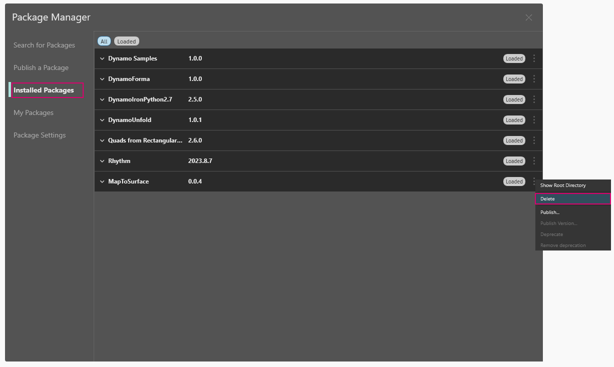
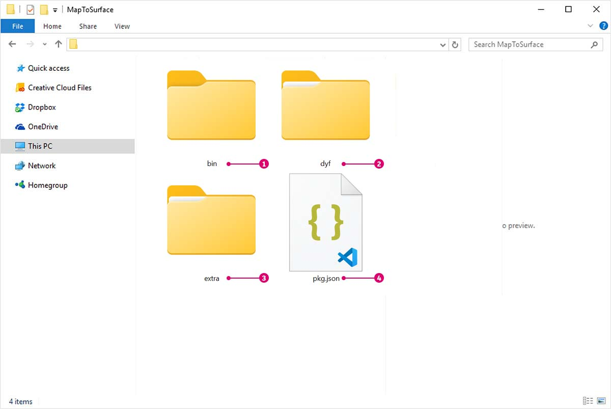

# Публикация пакетов

В предыдущих разделах мы подробно рассмотрели процесс настройки пакета _MapToSurface_ с использованием пользовательских узлов и файлов примеров. Но как опубликовать пакет, разработка которого была выполнена на локальном компьютере? В этом примере мы рассмотрим процесс публикации пакета из набора файлов в локальной папке.

\ (1).jpg>)

Существует множество способов публикации пакетов. Мы рекомендуем придерживаться следующего процесса: **сначала опубликуйте пакет на локальном компьютере, там же выполните его разработку и, наконец, опубликуйте пакет в интернете**. В рамках примера мы будем работать с папкой, содержащей все файлы пакета.

### Удаление пакета

Если пакет MapToSurface уже был установлен в рамках предыдущего урока, его необходимо удалить, прежде чем приступать к публикации в рамках этого урока, чтобы избежать дублирования пакетов.

Сначала выберите «Пакеты» > «Package Manager» > «Установленные пакеты», рядом с MapToSurface щелкните значок с вертикальными точками и нажмите «Удалить».

<figure><figcaption></figcaption></figure>

Перезапустите Dynamo. В окне _Управление пакетами_ убедитесь, что пакет _MapToSurface_ отсутствует. Теперь все готово к началу работы.

### Публикация пакета на локальном компьютере

 Пользовательские узлы и пакеты из Dynamo Sandbox можно публиковать в версии 2.17 и более поздних, если они не имеют зависимостей основного API. В более ранних версиях пользовательские узлы и пакеты можно публиковать только в Dynamo for Revit и Dynamo for Civil 3D. 

> Скачайте файл примера, щелкнув указанную ниже ссылку.
>
> Полный список файлов примеров можно найти в приложении.



Это первая версия данного пакета. Все файлы примеров и пользовательские узлы размещены в одной папке. Поскольку папка готова к использованию, можно сразу приступать к выгрузке в Dynamo Package Manager.

> 1. Эта папка содержит пять пользовательских узлов (DYF).
> 2. В ней также есть пять файлов примеров (DYN) и один импортированный файл векторов (SVG). Эти файлы будут задействованы в рамках вводных упражнений по обучению работе с пользовательскими узлами.

В Dynamo выберите _Пакеты > Package Manager > Опубликовать новый пакет_.

На вкладке _Публикация пакета_ заполните соответствующие поля в левой части окна.

<figure><figcaption></figcaption></figure>

Теперь добавим файлы пакета. Можно добавлять файлы по одному или целыми папками, выбрав «Добавить папку» (1). Чтобы добавить файлы, отличные от файлов DYF, в окне браузера выберите тип файлов **Все файлы (**_._**)**. Обратите внимание, что будут добавлены все файлы — и файлы пользовательских узлов (DYF), и файлы примеров (DYN). При публикации пакета программа Dynamo автоматически классифицирует их по категориям.

<figure><figcaption></figcaption></figure>

После выбора папки MapToSurface в Package Manager отобразится ее содержимое. Если вы отправляете собственный пакет со сложной структурой папок и не хотите, чтобы программа Dynamo вносила изменения в структуру папок, можно включить параметр «Сохранить структуру папок». Этот параметр предназначен для опытных пользователей. Если пакет не настроен особым образом, лучше не устанавливать этот флажок и позволить Dynamo упорядочить файлы требуемым образом. Нажмите «Далее», чтобы продолжить.

<figure><figcaption></figcaption></figure>

Здесь можно просмотреть, как Dynamo организует файлы пакетов перед публикацией. Нажмите кнопку «Готово» для продолжения.

<figure><figcaption></figcaption></figure>

Нажмите кнопку «Опубликовать локально» (1) для публикации пакета. Обратите внимание, что нужно нажать именно _Опубликовать локально_, а **не** _Публикация в Интернете_, чтобы избежать появления повторяющихся пакетов в Package Manager.

После публикации пользовательские узлы должны быть доступны в группе DynamoPrimer или в библиотеке Dynamo.

\ (1).jpg>)

Теперь перейдем в корневую папку и посмотрим, как только что созданный пакет был отформатирован в Dynamo. Для этого выберите вкладку «Установленные пакеты», рядом с MapToSurface щелкните значок с вертикальными точками и выберите «Показать корневую папку».

<figure><figcaption></figcaption></figure>

Обратите внимание, что поскольку пакет был опубликован локально, корневая папка находится в локальной папке пакета. Dynamo ссылается на эту папку для чтения пользовательских узлов. Поэтому при локальной публикации пакета важно указывать постоянную папку (а не рабочий стол, например). Структура папок пакета Dynamo выглядит следующим образом.

> 1. В папке _bin_ хранятся файлы DLL, созданные с помощью библиотек C# или Zero-Touch. В этот пакет такие файлы не входят, поэтому данная папка пуста.
> 2. В папке _dyf_ хранятся пользовательские узлы. Открыв ее, можно просмотреть все пользовательские узлы (файлы DYF), входящие в пакет.
> 3. В папке extra хранятся все дополнительные файлы. Сюда входят файлы Dynamo (DYN), а также дополнительные файлы других форматов (SVG, XLS, JPEG, SAT и т. д.).
> 4. Файл PKG — это стандартный текстовый файл, определяющий параметры пакета. Он создается в Dynamo автоматически, но если требуется подробная настройка, то параметры можно отредактировать.

### Публикация пакета в интернете

 Примечание. Данная процедура предназначена только для публикации пакетов, разработанных пользователями. 

<figure><figcaption></figcaption></figure>

1. Когда все будет готово для публикации, в окне «Пакеты» > «Package Manager» > «Установленные пакеты» нажмите кнопку справа от пакета, который требуется опубликовать, и выберите «Опубликовать».
2. Если требуется обновить ранее опубликованный пакет, выберите «Публикация версии», и приложение Dynamo обновит пакет в интернете с учетом новых файлов в корневой папке этого пакета. Проще простого.

### Публикация версии...

Если файлы в корневой папке опубликованного пакета были изменены, можно также опубликовать новую версию этого пакета, выбрав вариант _Публикация версии..._ на вкладке _Мои пакеты_. Эта функция позволяет с легкостью вносить в содержимое необходимые обновления и обмениваться данными с сообществом пользователей. Пользоваться функцией _Публикация версии_ могут только разработчики соответствующего пакета.

### Передача права владения пакетом

В настоящее время передать право владения пакетом через Package Manager невозможно. Можно попросить разработчиков Dynamo добавить дополнительного владельца. Обратите внимание, что мы не можем удалить существующих владельцев, а только добавить дополнительных разработчиков пакета. Чтобы добавить учетную запись в качестве владельца существующего пакета, обратитесь с соответствующим запросом по адресу [dynamoteam@dynamobim.org](mailto:dynamoteam@dynamobim.org). Необходимо указать название пакета и имя учетной записи, которую требуется добавить.
