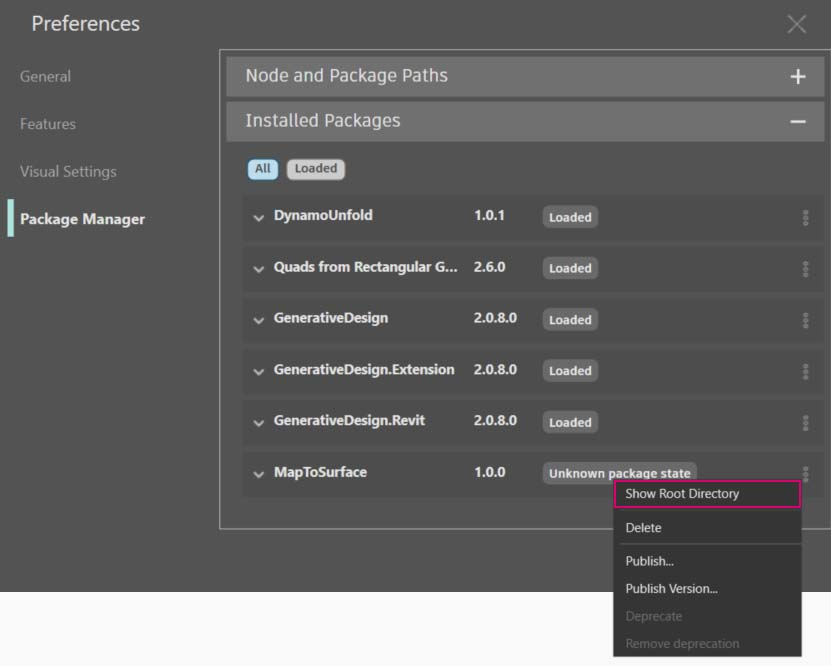

# Публикация пакетов

В предыдущих разделах мы подробно рассмотрели процесс настройки пакета _MapToSurface_ с использованием пользовательских узлов и файлов примеров. Но как опубликовать пакет, разработка которого была выполнена на локальном компьютере? В этом примере мы рассмотрим процесс публикации пакета из набора файлов в локальной папке.

 (1).jpg>)

Существует множество способов публикации пакетов. Мы рекомендуем придерживаться следующего процесса: **сначала опубликуйте пакет на локальном компьютере, там же выполните его разработку и, наконец, опубликуйте пакет в интернете**. В рамках примера мы будем работать с папкой, содержащей все файлы пакета.

### Удаление пакета

Если пакет MapToSurface уже был установлен в рамках предыдущего урока, его необходимо удалить, прежде чем приступать к публикации в рамках этого урока, чтобы избежать дублирования пакетов.

Сначала выберите Dynamo > «Настройки» > Package Manager, рядом с MapToSurface щелкните значок с вертикальными точками и нажмите «Удалить».

Перезапустите Dynamo. В окне _Управление пакетами_ убедитесь, что пакет _MapToSurface_ отсутствует. Теперь все готово к началу работы.

### Публикация пакета на локальном компьютере


 Публикация пакетов Dynamo доступна только в Dynamo для Revit и Dynamo for Civil 3D. В Dynamo Sandbox функция публикации отсутствует. 


> Скачайте файл примера, щелкнув указанную ниже ссылку.
>
> Полный список файлов примеров можно найти в приложении.



Это первая версия данного пакета. Все файлы примеров и пользовательские узлы размещены в одной папке. Поскольку папка готова к использованию, можно сразу приступать к выгрузке в Dynamo Package Manager.

> 1. Эта папка содержит пять пользовательских узлов (DYF).
> 2. В ней также есть пять файлов примеров (DYN) и один импортированный файл векторов (SVG). Эти файлы будут задействованы в рамках вводных упражнений по обучению работе с пользовательскими узлами.

В Dynamo выберите _«Пакеты» > «Опубликовать новый пакет...»_.

В левой части окна _Публикация пакета Dynamo_ отобразятся предварительно заданные сведения о пакете.

> 1. В правой части экрана отображаются файлы, добавленные из структуры папок с помощью кнопки _Добавить файл_. Чтобы добавить файлы, которые не являются файлами DYF, необходимо изменить тип файла, заданный в окне обозревателя, на **Все файлы (**_**.**_**)**. Обратите внимание, что добавлены все файлы — и файлы пользовательских узлов (DYF), и файлы примеров (DYN). При публикации пакета программа Dynamo автоматически разобьет их по категориям.
> 2. В поле «Группа» указывается, в какой группе можно будет найти пользовательские узлы в интерфейсе Dynamo.
> 3. Нажмите кнопку «Опубликовать локально» для публикации пакета. Обратите внимание, что нужно нажать именно _Опубликовать локально_, а **не** _Публикация в Интернете_, чтобы избежать появления повторяющихся пакетов в Package Manager.

После публикации пользовательские узлы должны быть доступны в группе DynamoPrimer или в библиотеке Dynamo.

 (1).jpg>)

Теперь перейдем в корневую папку и посмотрим, как только что созданный пакет был отформатирован в Dynamo. Для этого выберите Dynamo > «Настройки» > Package Manager, рядом с MapToSurface щелкните значок с вертикальными точками и выберите «Показать корневую папку».

Обратите внимание, что поскольку пакет был опубликован локально, корневая папка находится в локальной папке пакета. Dynamo ссылается на эту папку для чтения пользовательских узлов. Поэтому при локальной публикации пакета важно указывать постоянную папку (а не рабочий стол, например). Структура папок пакета Dynamo выглядит следующим образом.

> 1. В папке _bin_ хранятся файлы DLL, созданные с помощью библиотек C# или Zero-Touch. В этот пакет такие файлы не входят, поэтому данная папка пуста.
> 2. В папке _dyf_ хранятся пользовательские узлы. Открыв ее, можно просмотреть все пользовательские узлы (файлы DYF), входящие в пакет.
> 3. В папке extra хранятся все дополнительные файлы. Сюда входят файлы Dynamo (DYN), а также дополнительные файлы других форматов (SVG, XLS, JPEG, SAT и т. д.).
> 4. Файл PKG — это стандартный текстовый файл, определяющий параметры пакета. Он создается в Dynamo автоматически, но если требуется подробная настройка, то параметры можно отредактировать.

### Публикация пакета в интернете


 Примечание. Данная процедура предназначена только для публикации пакетов, разработанных пользователями. 


> 1. Когда пакет будет готов к публикации, откройте окно «Настройки» > Package Manager, нажмите кнопку справа от MapToSurface и выберите _Публикация..._.
> 2. Если требуется обновить ранее опубликованный пакет, выберите «Публикация версии», и приложение Dynamo обновит пакет в интернете с учетом новых файлов в корневой папке этого пакета. Проще простого.

### Публикация версии...

Если файлы в корневой папке опубликованного пакета были изменены, можно опубликовать новую версию этого пакета, выбрав вариант _Публикация версии..._ в окне _Управление пакетами_. Эта функция позволяет с легкостью вносить в содержимое необходимые обновления и обмениваться данными с сообществом пользователей. Пользоваться функцией _Публикация версии_ могут только разработчики соответствующего пакета.
