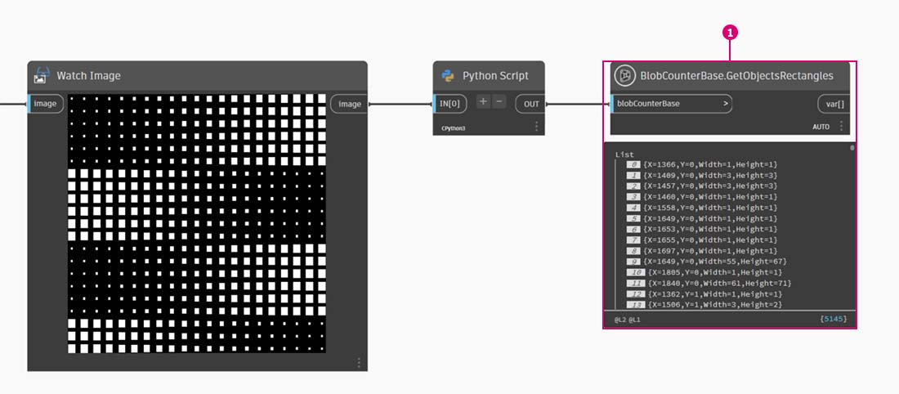

# Importación de Zero-Touch

### ¿Qué es Zero-Touch?

La importación Zero-Touch hace referencia a un método sencillo para importar bibliotecas C# con solo apuntar y hacer clic. Dynamo leerá los métodos públicos de un archivo _.dll_ y los convertirá en nodos de Dynamo. Puede utilizar Zero-Touch para desarrollar paquetes y nodos personalizados y para importar bibliotecas externas en el entorno de Dynamo.


> 1. Archivos .dll
> 2. Nodos de Dynamo

Con Zero-Touch, puede importar una biblioteca que no se haya desarrollado necesariamente para Dynamo y crear un conjunto de nodos nuevos. La función Zero-Touch muestra la mentalidad multiplataforma del proyecto Dynamo.

En esta sección se muestra cómo utilizar Zero-Touch para importar una biblioteca de terceros. Para obtener información sobre el desarrollo de su propia biblioteca Zero-Touch, consulte la [página wiki de Dynamo](https://github.com/DynamoDS/Dynamo/wiki/Zero-Touch-Plugin-Development).

### Paquetes de Zero-Touch

Los paquetes de Zero-Touch son un buen complemento para los nodos personalizados definidos por el usuario. En la tabla siguiente se muestran algunos paquetes que utilizan bibliotecas C#. Para obtener información más detallada sobre los paquetes, visite la sección [Paquetes](../../a\_appendix/a-3\_packages.md) del Apéndice.

| **Logotipo/imagen**                                                                   | **Nombre**                                                                    |
| -------------------------------------------------------------------------------- | --------------------------------------------------------------------------- |
| .jpg>)                            | [Kit de herramientas de malla](https://github.com/DynamoDS/Dynamo/wiki/Dynamo-Mesh-Toolkit) |
|  (1).jpg>) | [Dynamo Unfold](http://dynamobim.com/dynamounfold/)                         |
|                                                  | [Rhynamo](http://www.case-inc.com/blog/what-is-rhynamo)                     |
|                                                   | [Optimo](https://github.com/BPOpt/Optimo)                                   |

## Caso real: importación de AForge

En este caso real, mostraremos cómo importar la biblioteca externa _.dll_ [AForge](http://www.aforgenet.com). AForge es una biblioteca sólida que ofrece una gama de funciones que van desde el procesamiento de imágenes hasta la inteligencia artificial. Haremos referencia a la clase de imágenes en AForge para realizar algunos ejercicios de procesamiento de imágenes a continuación.

Descarguemos primero AForge. En la [página de descarga de AForge](http://www.aforgenet.com/framework/downloads.html), seleccione _[Download Installer]_ (Descargar instalador) y realice la instalación una vez que haya finalizado la descarga.

En Dynamo, cree un archivo nuevo y seleccione _Archivo > Importar biblioteca_.


A continuación, localice el archivo dll.


> 1. En la ventana emergente, vaya a la carpeta de la versión contenida en la ubicación de instalación de AForge. Probablemente se encuentre en una carpeta similar a esta: _C:\\Program Files (x86)\\AForge.NET\\Framework\\Release_.
> 2. **AForge.Imaging.dll**: solo vamos a utilizar este archivo de la biblioteca AForge para este caso real. Seleccione este archivo _.dll_ y pulse _"Abrir"_.

Al regresar a Dynamo, debería mostrarse el grupo de nodos **AForge** añadidos a la biblioteca. Ahora tenemos acceso a la biblioteca de imágenes AForge desde nuestro programa visual.


### Ejercicio 1: detección de borde

> Descargue el archivo de ejemplo. Para ello, haga clic en el vínculo siguiente.
>
> En el Apéndice, se incluye una lista completa de los archivos de ejemplo.



Ahora que se ha importado la biblioteca, empezaremos con un sencillo ejercicio (_01-EdgeDetection.dyn_). Vamos a llevar a cabo un procesamiento de imagen básico en una imagen de muestra para comprobar cómo se filtra la imagen AForge. Utilizaremos el nodo _"Watch Image"_ para visualizar los resultados y aplicar filtros en Dynamo similares a los de Photoshop

Añada un nodo **File Path** al lienzo y seleccione "soapbubbles.jpg" en la carpeta del ejercicio que hemos descargado (crédito de la fotografía: [flickr](https://www.flickr.com/photos/wwworks/667298782)).


El nodo File Path simplemente proporciona una cadena de la ruta a la imagen que hemos seleccionado. A continuación, se debe convertir en un archivo de imagen que se pueda utilizar en Dynamo.


> 1. Utilice **File From Path** para convertir el elemento de ruta de archivo en una imagen en el entorno de Dynamo.
> 2. Conecte el nodo **File Path** al nodo **File.FromPath**.
> 3. Para convertir este archivo en una imagen, utilizaremos el nodo **Image.ReadFromFile**.
> 4. Por último, veamos el resultado. Suelte un nodo **Watch Image** en el lienzo y conéctelo a **Image.ReadFromFile**. Aún no hemos utilizado AForge, pero hemos importado correctamente una imagen en Dynamo.

En AForge.Imaging.AForge.Imaging.Filters (en el menú de navegación), verá que hay una amplia gama de filtros disponibles. Vamos a utilizar uno de estos filtros para reducir la saturación de una imagen mediante los valores de umbral.


> 1. Coloque tres controles deslizantes en el lienzo, cambie los rangos a entre 0 a 1 y los valores de paso a 0,01.
> 2. Añada el nodo **Grayscale.Grayscale** al lienzo. Este es un filtro de AForge que aplica un filtro de escala de grises a una imagen. Conecte los tres controles deslizantes del paso 1 a cr, cg y cb. Cambie los controles deslizantes superior e inferior para que tengan un valor de 1 y el control deslizante central para que tenga un valor de 0.
> 3. Para aplicar el filtro Grayscale, necesitamos una acción que llevar a cabo en nuestra imagen. Para ello, utilizaremos **BaseFilter.Apply**. Conecte la imagen a la entrada de imagen y **Grayscale.Grayscale** a la entrada de baseFilter.
> 4. Al conectar un nodo **Watch Image**, se obtiene una imagen con reducción de saturación.

Podemos controlar cómo se reduce la saturación de esta imagen mediante los valores de umbral de rojo, verde y azul. Estos se definen mediante los datos introducidos en el nodo **Grayscale.Grayscale**. Observe que la imagen se ve bastante atenuada; esto se debe a que el valor de verde se ha establecido en 0 en el control deslizante.


> 1. Cambie los controles deslizantes superior e inferior para que tengan un valor de 0 y el control deslizante central para que tenga un valor de 1. De este modo, obtenemos una imagen con reducción de saturación más legible.

Vamos a utilizar la imagen con reducción de saturación y aplicar otro filtro encima. La imagen con reducción de saturación tiene cierto contraste, por lo que vamos a probar una detección de borde.


> 1. Añada un nodo **SobelEdgeDetector.SobelEdgeDetector** al lienzo.
> 2. Conecte esta opción a **BaseUsingCopyPartialFilter.Apply** y conecte la imagen con reducción de saturación a la entrada de imagen de este nodo.
> 3. El detector de borde Sobel ha resaltado los bordes en una nueva imagen.

Al ampliar, el detector de bordes ha representado los contornos de las burbujas con píxeles. La biblioteca AForge dispone de herramientas para tomar resultados como este y crear geometría de Dynamo. Lo exploraremos en el siguiente ejercicio.


### Ejercicio 2: creación de rectángulos

Ahora que hemos presentado un procesamiento de imagen básico, vamos a usar una imagen para aplicar la geometría de Dynamo. En un nivel elemental, en este ejercicio pretendemos realizar un _"trazado directo"_ de una imagen mediante AForge y Dynamo. Vamos a realizar una tarea sencilla como es extraer rectángulos de una imagen de referencia, pero hay herramientas disponibles en AForge para operaciones más complejas. Trabajaremos con _02-RectangleCreation.dyn_, uno de los archivos del ejercicio que hemos descargado.


> 1. Con el nodo File Path, desplácese hasta grid.jpg en la carpeta del ejercicio.
> 2. Conecte la serie de nodos restantes anterior para que se muestre una rejilla paramétrica de rumbo.

En este paso, vamos a hacer referencia a los cuadrados blancos de la imagen y convertirlos a la geometría real de Dynamo. AForge tiene muchas herramientas eficaces de visión por ordenador y aquí vamos a usar una de las más importantes para la biblioteca llamada [BlobCounter](http://www.aforgenet.com/framework/docs/html/d7d5c028-7a23-e27d-ffd0-5df57cbd31a6.htm).


> 1. Añada un BlobCounter al lienzo; a continuación, necesitamos un método para procesar la imagen (similar a la herramienta **BaseFilter.Apply** del ejercicio anterior).

Desafortunadamente, el nodo "Process Image" no aparece de inmediato en la biblioteca de Dynamo. Esto se debe a que la función puede no ser visible en el código fuente AForge. Necesitaremos encontrar una solución para esta situación.


> 1. Añada un nodo de Python al lienzo y agregue el código siguiente al nodo de Python. Este código importa la biblioteca AForge y, a continuación, procesa la imagen importada.

```
import sys
import clr
clr.AddReference('AForge.Imaging')
from AForge.Imaging import *

bc= BlobCounter()
bc.ProcessImage(IN[0])
OUT=bc
```

Al conectar la salida de imagen a la entrada del nodo de Python, se obtiene un resultado AForge.Imaging.BlobCounter del nodo de Python.


Los siguientes pasos contienen ciertos procedimientos que permiten familiarizarse con la [API de creación de imágenes AForge](http://www.aforgenet.com/framework/docs/html/d087503e-77da-dc47-0e33-788275035a90.htm). No es necesario aprender todo esto para trabajar con Dynamo. Esta es más bien una demostración de cómo trabajar con bibliotecas externas dentro de la flexibilidad del entorno de Dynamo.



> 1. Conecte la salida de la secuencia de comandos de Python a BlobCounterBase.GetObjectRectangles. Este elemento lee objetos de una imagen basándose en un valor de umbral y extrae rectángulos cuantificados del espacio de píxeles.


> 1. Añada otro nodo de Python al lienzo, conéctelo a GetObjectRectangles e introduzca el código siguiente. De este modo, se creará una lista organizada de objetos de Dynamo.

```
OUT = []
for rec in IN[0]:
	subOUT=[]
	subOUT.append(rec.X)
	subOUT.append(rec.Y)
	subOUT.append(rec.Width)
	subOUT.append(rec.Height)
	OUT.append(subOUT)
```


> 1. Transponga la salida del nodo de Python desde el paso anterior. Se crean cuatro listas, cada una de las cuales representa los valores X, Y, anchura y altura para cada rectángulo.
> 2. Mediante el nodo Code Block, se organizan los datos en una estructura que acompaña al nodo Rectangle.ByCornerPoints (el código siguiente).

```
recData;
x0=List.GetItemAtIndex(recData,0);
y0=List.GetItemAtIndex(recData,1);
width=List.GetItemAtIndex(recData,2);
height=List.GetItemAtIndex(recData,3);
x1=x0+width;y1=y0+height;
p0=Autodesk.Point.ByCoordinates(x0,y0);
p1=Autodesk.Point.ByCoordinates(x0,y1);
p2=Autodesk.Point.ByCoordinates(x1,y1);
p3=Autodesk.Point.ByCoordinates(x1,y0);
```

Disponemos de una matriz de rectángulos que representan los cuadrados blancos de la imagen. A través de la programación, hemos realizado una acción a grandes rasgos similar a un trazado directo en Illustrator.

Sin embargo, aún necesitamos realizar una limpieza. Al ampliar, podemos ver que hay un puñado de pequeños rectángulos no deseados.


A continuación, vamos a escribir códigos para eliminar los rectángulos no deseados.


> 1. Inserte un nodo de Python entre el nodo GetObjectRectangles y otro nodo de Python. El código del nodo es el siguiente y elimina todos los rectángulos que están por debajo de un tamaño determinado.

```
rectangles=IN[0]
OUT=[]
for rec in rectangles:
 if rec.Width>8 and rec.Height>8:
  OUT.append(rec)
```

Con los rectángulos superfluos eliminados, solo por probar, vamos a crear una superficie a partir de estos rectángulos y extruirlos una distancia basada en sus áreas.


Por último, cambie el valor de both_sides a falso (false) y se obtendrá una extrusión en una dirección. Bañe este objeto en resina y obtendrá una mesa muy peculiar.


Estos son ejemplos básicos, pero los conceptos descritos aquí son transferibles a aplicaciones apasionantes en el mundo real. La visión por ordenador se puede utilizar para multitud de procesos. Por nombrar algunos: lectores de código de barras, coincidencia de perspectivas, [mapeado de proyección](https://www.youtube.com/watch?v=XSR0Xady02o) y [realidad aumentada](http://aforgenet.com/aforge/articles/gratf\_ar/). Para consultar temas más avanzados de AForge relacionados con este ejercicio, consulte [este artículo](http://aforgenet.com/articles/shape\_checker/).
