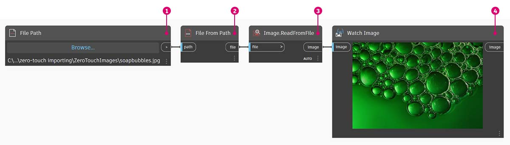
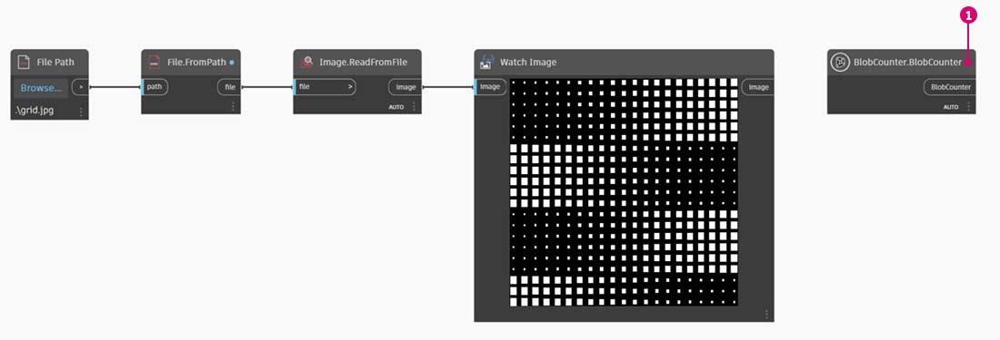

# Zero-Touch 匯入

### 什麼是 Zero-Touch？

「Zero-Touch 匯入」是指匯入 C# 資源庫所使用的一個簡易點選方法。Dynamo 將讀取 _.dll_ 檔案的公開方法，並將其轉換為 Dynamo 節點。您可以使用 Zero-Touch 開發自己的自訂節點與套件，並將外部資源庫匯入 Dynamo 環境。


> 1. .dll 檔
> 2. Dynamo 節點

使用 Zero-Touch，您可以實際匯入不一定是為 Dynamo 開發的資源庫，並建立一組新節點。目前的 Zero-Touch 功能展示出 Dynamo 專案的跨平台能力。

本節將示範如何使用 Zero-Touch 匯入協力廠商的資源庫。如需有關開發自己 Zero-Touch 資源庫的資訊，請參考 [Dynamo Wiki 頁面](https://github.com/DynamoDS/Dynamo/wiki/Zero-Touch-Plugin-Development)。

### Zero-Touch 套件

Zero-touch 套件是使用者定義之自訂節點的良好補充。下表列出使用 C# 資源庫的一些套件。如需有關套件的更多詳細資訊，請造訪附錄中的[「套件」一節](../../a\_appendix/a-3\_packages.md)。

| **標誌/影像**                                                                   | **名稱**                                                                    |
| -------------------------------------------------------------------------------- | --------------------------------------------------------------------------- |
| \.jpg>)                            | [Mesh Toolkit](https://github.com/DynamoDS/Dynamo/wiki/Dynamo-Mesh-Toolkit) |
| \ (1).jpg>) | [Dynamo Unfold](http://dynamobim.com/dynamounfold/)                         |
|                                                  | [Rhynamo](http://www.case-inc.com/blog/what-is-rhynamo)                     |
|                                                   | [Optimo](https://github.com/BPOpt/Optimo)                                   |

## 案例研究 - 匯入 AForge

在本案例研究中，我們將展示如何匯入 [AForge](http://www.aforgenet.com) 外部 _.dll_ 資源庫。AForge 是功能強大的資源庫，提供從影像處理到人工智慧的一系列功能。我們將參考 AForge 的影像類別執行以下的一些影像處理練習。

我們從下載 AForge 開始。在 [AForge 下載頁面](http://www.aforgenet.com/framework/downloads.html)上，選取 _[Download Installer (下載安裝程式)]_，並在下載完成後進行安裝。

在 Dynamo 中，建立新檔案，然後選取 _「檔案」>「匯入資源庫...」_ 


接下來，找到 dll 檔。


> 1. 在快顯視窗中，導覽至 AForge 安裝的「Release」資料夾。該資料夾可能位於類似如下的資料夾中：_C:\\Program Files (x86)\\AForge.NET\\Framework\\Release_。
> 2. **AForge.Imaging.dll：** 在此案例研究中，我們只希望使用 AForge 資源庫中的這個檔案。選取此 _.dll_，然後按一下 _「開啟」_。

回到 Dynamo，您應該會看到資源庫中已加入 **AForge** 節點群組。現在，可以從我們的視覺程式存取 AForge 影像資源庫！


### 練習 1：邊緣偵測

> 在下方的連結按一下，下載範例檔案。
>
> 附錄中提供完整的範例檔案清單。



現在已匯入資源庫，我們將從這第一個簡易練習 (_01-EdgeDetection.dyn_) 開始。我們將對範例影像執行某些基本影像處理，以展示 AForge 影像如何進行篩選。我們將使用 _Watch Image_ 節點展示結果，並在 Dynamo 中套用與 Photoshop 中類似的篩選。

若要匯入影像，請在圖元區加入 **File Path** 節點，並從練習資料夾 (相片來源：[flickr](https://www.flickr.com/photos/wwworks/667298782)) 中選取「soapbubbles.jpg」。


File Path 節點僅提供我們所選影像的路徑字串。接下來，我們需要在 Dynamo 中將其轉換為可用的影像檔。



> 1. 使用 **File From Path**，在 Dynamo 環境中將檔案路徑項目轉換為影像。
> 2. 將 **File Path** 節點連接至 **File.FromPath** 節點。
> 3. 為了將此檔案轉換為影像，我們將使用 **Image.ReadFromFile** 節點。
> 4. 最後，我們來查看結果！將 **Watch Image** 節點放在圖元區上，並連接至 **Image.ReadFromFile**。我們尚未使用 AForge，但已成功將影像匯入 Dynamo。

在 AForge.Imaging.AForge.Filters (「導覽」功能表中) 下，您會發現有許多可用的篩選。我們現在將使用這些篩選的其中之一，以根據閾值對影像執行去飽和度。


> 1. 將三個滑棒放至圖元區，然後將其範圍變更為 0 到 1，將其步長值變更為 0.01。
> 2. 在圖元區加入 **Grayscale.Grayscale** 節點。這是 AForge 篩選，會將灰階篩選套用至影像。從步驟 1 將這三個滑棒連接至 cr、cg 和 cb。將頂部與底部滑棒的值變更為 1，將中間滑棒的值變更為 0。
> 3. 若要套用灰階篩選，我們需要對影像採取某項動作。為此，我們使用 **BaseFilter.Apply**。將影像連接至影像輸入，並將 **Grayscale.Grayscale** 連接至 baseFilter 輸入。
> 4. 插入 **Watch Image** 節點，我們得到一個去飽和度的影像。

我們可以控制如何根據紅、綠、藍的閾值對此影像執行去飽和度。這些閾值由 **Grayscale.Grayscale** 節點的輸入定義。請注意，影像看起來非常暗，這是因為我們的滑棒中將綠色的值設定為 0。


> 1. 將頂部與底部滑棒的值變更為 0，將中間滑棒的值變更為 1。這樣即可取得更清晰的去飽和度影像。

接下來我們使用去飽和度影像，並對其套用其他篩選。去飽和度影像具有一定的對比度，因此我們要測試某些邊緣偵測。


> 1. 在圖元區加入 **SobelEdgeDetector.SobelEdgeDetector** 節點。
> 2. 將此節點連接至 **BaseUsingCopyPartialFilter.Apply**，並將去飽和度影像連接至此節點的影像輸入。
> 3. Sobel 邊偵測器已在新影像中亮顯邊。

拉近後，邊偵測器已顯示標示圈的外框 (以像素為單位)。AForge 資源庫的工具可利用與此類似的結果並建立 Dynamo 幾何圖形。我們將在下一個練習中探索該功能。


### 練習 2：建立矩形

現在我們已介紹了一些基本影像處理，接下來使用影像來驅動 Dynamo 幾何圖形！在本練習中，基本上我們的目的是使用 AForge 與 Dynamo 執行影像的 _「即時追蹤」_。我們將使用簡易的作業從參考影像中擷取矩形，不過 AForge 中提供了執行更複雜作業的工具。我們將使用下載練習檔案中的 _02-RectangleCreation.dyn_。


> 1. 使用 File Path 節點，導覽至練習資料夾中的 grid.jpg。
> 2. 連接上述其餘的一系列節點，以顯示路線參數式格線。

在下一步，我們將參考影像中的白色正方形，並將其轉換為實際的 Dynamo 幾何圖形。AForge 具有許多功能強大的電腦視覺工具，這裡我們要使用其中一種很重要的資源庫工具，名為 [BlobCounter](http://www.aforgenet.com/framework/docs/html/d7d5c028-7a23-e27d-ffd0-5df57cbd31a6.htm)。



> 1. 在圖元區加入 BlobCounter，接著我們需要採取某種方式來處理影像 (類似於上一個練習的 **BaseFilter.Apply** 工具)。

很遺憾，「處理影像」節點不會立刻顯示在 Dynamo 資源庫中。這是因為函數可能沒有顯示在 AForge 原始程式碼中。若要修正此問題，我們需要尋找因應措施。


> 1. 在圖元區加入 Python 節點，然後在 Python 節點中加入下列程式碼。此程式碼將匯入 AForge 資源庫，然後處理匯入的影像。

```
import sys
import clr
clr.AddReference('AForge.Imaging')
from AForge.Imaging import *

bc= BlobCounter()
bc.ProcessImage(IN[0])
OUT=bc
```

將影像輸出連接至 Python 節點輸入，Python 節點將產生 AForge.Imaging.BlobCounter 結果。


後續步驟會展現一些熟練使用 [AForge Imaging API](http://www.aforgenet.com/framework/docs/html/d087503e-77da-dc47-0e33-788275035a90.htm) 的技巧。不必學會這些，也能處理 Dynamo 工作。這比較算是用來示範 Dynamo 環境的靈活度，可搭配多種外部資源庫使用。


> 1. 將 Python 指令碼的輸出連接至 BlobCounterBase.GetObjectRectangles。這會讀取影像中的物件，並根據閾值從像素空間萃取量化的矩形。


> 1. 在圖元區加入另一個 Python 節點，連接至 GetObjectRectangles，然後輸入以下程式碼。這將建立經過組織的 Dynamo 物件清單。

```
OUT = []
for rec in IN[0]:
	subOUT=[]
	subOUT.append(rec.X)
	subOUT.append(rec.Y)
	subOUT.append(rec.Width)
	subOUT.append(rec.Height)
	OUT.append(subOUT)
```


> 1. 轉置上一步 Python 節點的輸出。這會建立 4 個清單，分別代表每個矩形的 X、Y、寬度及高度。
> 2. 使用 Code Block 將資料排列為適合 Rectangle.ByCornerPoints 節點的結構 (程式碼如下)。

```
recData;
x0=List.GetItemAtIndex(recData,0);
y0=List.GetItemAtIndex(recData,1);
width=List.GetItemAtIndex(recData,2);
height=List.GetItemAtIndex(recData,3);
x1=x0+width;y1=y0+height;
p0=Autodesk.Point.ByCoordinates(x0,y0);
p1=Autodesk.Point.ByCoordinates(x0,y1);
p2=Autodesk.Point.ByCoordinates(x1,y1);
p3=Autodesk.Point.ByCoordinates(x1,y0);
```

我們現在有一系列形，代表影像中的白色正方形。透過程式設計，我們已實現與 Illustrator 中的即時追蹤 (大致) 類似的功能！

不過還需要清理一下。拉近後，可以看到有一些不需要的小矩形。


接下來要編寫程式碼，除去不需要的矩形。


> 1. 在 GetObjectRectangles 節點與另一個 Python 節點之間插入一個 Python 節點。節點的程式碼位於下方，會移除小於指定大小的所有矩形。

```
rectangles=IN[0]
OUT=[]
for rec in rectangles:
 if rec.Width>8 and rec.Height>8:
  OUT.append(rec)
```

消除多餘的矩形後，只是為了好玩，我們將從矩形建立曲面，並根據矩形的面積依距離擠出矩形。


最後，將 both_sides 輸入變更為 false，會產生一個方向的擠出。將產生的此結果浸入樹脂，將產生造型極為奇特的桌子。


以上是基本範例，但這裡描述的概念可以轉變成令人興奮的真實應用。電腦視覺可用於許多程序。這裡列示一些範例：條碼讀取器、透視配合、[投影對映](https://www.youtube.com/watch?v=XSR0Xady02o)及[增強實景](http://aforgenet.com/aforge/articles/gratf\_ar/)。如需此練習相關的更多 AForge 進階主題，請完整閱讀[本文](http://aforgenet.com/articles/shape\_checker/)。
