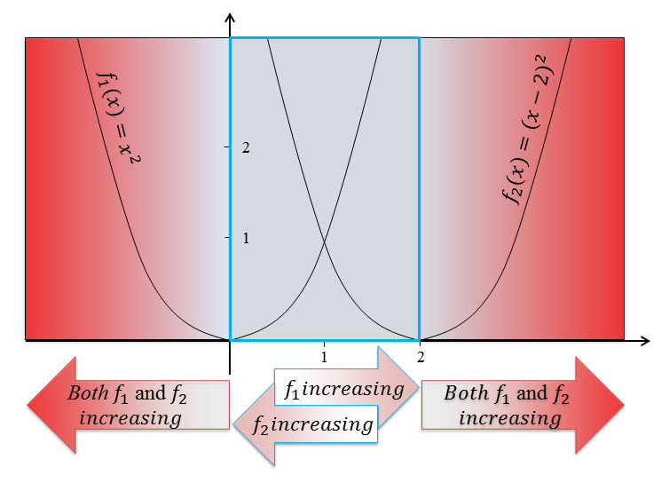
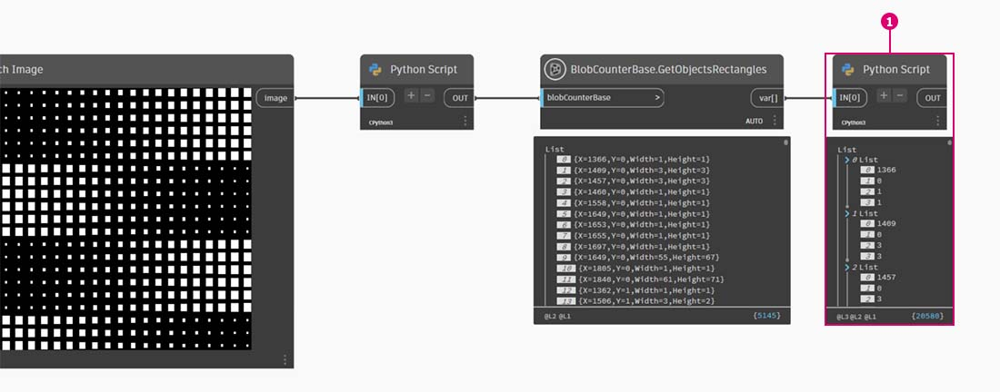

# Zero-Touch Importing

### Zero-Touch の概要

Zero-Touch Importing とは、C# ライブラリを読み込むための単純なポイント アンド クリック操作のことです。Dynamo は、_.dll_ ファイルの public メソッドを読み取って Dynamo ノードに変換します。Zero-Touch を使用して、独自のカスタム ノードとカスタム パッケージを開発し、外部のライブラリを Dynamo 環境に読み込むことができます。


> 1. .dll ファイル
> 2. Dynamo ノード

Zero-Touch により、Dynamo 用に開発されたものではないライブラリを読み込み、一連の新しいノードを作成することができます。現在の Zero-Touch 機能は、Dynamo プロジェクトのクロスプラットフォーム志向性を体現しています。

このセクションでは、Zero-Touch を使用してサードパーティのライブラリを読み込む方法について説明します。独自の Zero-Touch ライブラリを開発する方法については、[Dynamo の Wiki ページ](https://github.com/DynamoDS/Dynamo/wiki/Zero-Touch-Plugin-Development)を参照してください。

### Zero-Touch パッケージ

Zero-touch パッケージは、ユーザが定義するカスタム ノードを補完するパッケージです。次の図は、C# ライブラリを使用するいくつかのパッケージを示しています。パッケージの詳細については、付録の「[パッケージ](../../a\_appendix/a-3\_packages.md)」セクションを参照してください。

| **ロゴ/イメージ**                                                               | **名前**                                                                    |
| ---------------------------------------------------------------------------- | --------------------------------------------------------------------------- |
| \.jpg>)                        | [Mesh Toolkit](https://github.com/DynamoDS/Dynamo/wiki/Dynamo-Mesh-Toolkit) |
| \.jpg>) | [Dynamo Unfold](http://dynamobim.com/dynamounfold/)                         |
|                                              | [Rhynamo](http://www.case-inc.com/blog/what-is-rhynamo)                     |
|                                               | [Optimo](https://github.com/BPOpt/Optimo)                                   |

## ケース スタディ - AForge の読み込み

このケース スタディでは、[AForge](http://www.aforgenet.com) の外部 _.dll_ ライブラリをインポートする方法について説明します。AForge は、イメージ処理機能から人工知能まで、さまざまな機能を提供する堅固なライブラリです。ここでは、AForge のイメージ クラスを使用して、いくつかのイメージ処理を行う方法について説明します。

最初に、AForge をダウンロードします。[AForge のダウンロード ページ](http://www.aforgenet.com/framework/downloads.html)で_[Download Installer]_を選択し、ダウンロードが完了したらインストールを実行します。

Dynamo で、新しいファイルを作成して_[ファイル] > [ライブラリを読み込む...]_を選択します。


次に、dll ファイルを見つけます。


> 1. ポップアップ ウィンドウで、AForge のインストール環境のリリース フォルダにナビゲートします。通常は、_C:¥Program Files (x86)¥AForge.NET¥Framework¥Release_ などのフォルダになります。
> 2. このケース スタディでは、**AForge.Imaging.dll** だけを使用します。この _.dll_ ファイルを選択して_[開く]_をクリックします。

Dynamo に戻ると、ノードの**[AForge]**グループがライブラリに新しく表示されます。これで、ビジュアル プログラミングから AForge のイメージ ライブラリにアクセスできるようになりました。


### 演習 1 - 輪郭線の検出

> 下のリンクをクリックして、サンプル ファイルをダウンロードします。
>
> すべてのサンプル ファイルの一覧については、付録を参照してください。



ライブラリを読み込んだら、最初に簡単な演習を行います(_01-EdgeDetection.dyn_)。ここでは、サンプルのイメージに対して基本的なイメージ処理を実行することにより、AForge イメージのフィルタ機能について説明します。_Watch Image_ ノードを使用して処理の実行結果を表示し、Dynamo のフィルタを適用します。Dynamo のフィルタは、Photoshop のフィルタに似ています。

イメージをインポートするには、**File Path** ノードをキャンバスに追加し、演習フォルダで soapbubbles.jpg を選択します(次の画面で使用されている画像の出典元: [flickr](https://www.flickr.com/photos/wwworks/667298782))。


File Path ノードにより、ユーザが選択したイメージのパスの文字列が提供されます。次に、Dynamo で使用可能なイメージ ファイルに変換する必要があります。


> 1. **File From Path** を使用して、ファイル パス項目を Dynamo 環境のイメージに変換します。
> 2. **File Path** ノードを **File.FromPath** ノードに接続します。
> 3. **Image.ReadFromFile** ノードを使用して、file 出力をイメージに変換します。
> 4. 最後に、結果を確認します。**Watch Image** ノードをキャンバスにドロップして **Image.ReadFromFile** ノードに接続します。ここでは AForge をまだ使用していませんが、イメージを Dynamo 環境に正しく読み込むことができました。

ナビゲーション メニューの AForge.Imaging.AForge.Filters の下に、さまざまな使用可能なフィルタが表示されます。ここでは、1 つのフィルタを使用し、しきい値に基づいてイメージの彩度を下げてみましょう。


> 1. 3 つのスライダをキャンバスにドロップし、各スライダの範囲を 0 から 1 に変更して、ステップ値を 0.01 に変更します。
> 2. キャンバスに **Grayscale.Grayscale** ノードを追加します。これは、グレースケール フィルタをイメージに適用する AForge フィルタです。手順 1 の 3 つのスライダを、Grayscale.Grayscale ノードの入力(cr、cg、cb)にそれぞれ接続します。1 番目と 3 番目のスライダの値を 1 に設定し、2 番目のスライダの値を 0 に設定します。
> 3. グレースケール フィルタを適用するには、イメージに対してアクションを実行する必要があります。この場合、**BaseFilter.Apply** を使用します。イメージを image 入力に接続し、**Grayscale.Grayscale** ノードを baseFilter 入力に接続します。
> 4. **Watch Image** ノードに接続すると、イメージの彩度が下がります。

赤、緑、青のしきい値に基づいて、イメージの彩度を下げる方法をコントロールすることができます。これらのしきい値は、**Grayscale.Grayscale** ノードに対する入力によって定義されます。上図のイメージは暗くなっていますが、これは、スライダで緑のしきい値が 0 に設定されているためです。


> 1. 次に、1 番目と 3 番目のスライダの値を 0 に設定し、2 番目のスライダの値を 1 に設定します。この設定により、彩度を下げたイメージが明確に表示されます。

次に、彩度を下げたイメージに対して別のフィルタを適用します。彩度が低いイメージにはいくらかのコントラストがあります。ここでは、輪郭線の検出をテストしてみましょう。


> 1. キャンバスに **SobelEdgeDetector.SobelEdgeDetector** ノードを追加します。
> 2. これを **BaseUsingCopyPartialFilter.Apply** に接続し、彩度を下げたイメージをこのノードの image 入力に接続します。
> 3. Sobel Edge Detector により、新しいイメージ内で輪郭線がハイライト表示されます。

拡大表示すると、Edge Detector により、イメージ内の泡の輪郭がピクセル単位で描画されていることがわかります。AForge ライブラリには、このような処理を行うためのツールや、Dynamo のジオメトリを作成するためのツールが用意されています。Dynamo のジオメトリを作成する方法については、次の演習で説明します。


### 演習 2 - 長方形の作成

前の演習では、基本的なイメージ処理について確認しました。この演習では、イメージを使用して Dynamo のジオメトリを操作してみましょう。簡単な操作として、AForge と Dynamo を使用してイメージの「_ライブ トレース_」を実行します。説明を簡単にするため、ここでは参照イメージから長方形を抽出しますが、AForge には、より複雑な操作を実行するための各種ツールが用意されています。この演習では、ダウンロードした演習ファイルの _02-RectangleCreation.dyn_ を使用します。


> 1. File Path ノードを使用して、演習フォルダの grid.jpg にナビゲートします。
> 2. 残りの一連のノードを接続し、パラメトリック グリッドを表示します。

次の手順では、イメージ内の白い正方形を表示して、実際の Dynamo ジオメトリに変換します。AForge には、多くの便利な Computer Vision ツールが用意されていますが、ここでは、その中でも特に重要なツールを [BlobCounter](http://www.aforgenet.com/framework/docs/html/d7d5c028-7a23-e27d-ffd0-5df57cbd31a6.htm) というライブラリに対して使用します。


> 1. BlobCounter をキャンバスに追加したら、前の演習で使用した **BaseFilter.Apply** ツールと同じような方法でイメージを処理する必要があります。

しかし、Process Image ノードは Dynamo ライブラリ内に直接表示されません。これは、このノード(関数)を AForge のソース コード内で表示することができないためです。この問題を解決するには、何らかの回避策が必要です。


> 1. キャンバスに Python ノードを追加し、Python ノードに次のコードを追加します。このコードによって AForge ライブラリが読み込まれ、読み込まれたイメージが処理されます。

```
import sys
import clr
clr.AddReference('AForge.Imaging')
from AForge.Imaging import *

bc= BlobCounter()
bc.ProcessImage(IN[0])
OUT=bc
```

Watch Image ノードの image 出力を Python Script ノードの入力に接続すると、Python Script ノードによって AForge.Imaging.BlobCounter の結果が取得されます。


次の手順では、[AForge Imaging API](http://www.aforgenet.com/framework/docs/html/d087503e-77da-dc47-0e33-788275035a90.htm) を使用する場合のヒントとなる操作をいくつか紹介します。ただし、Dynamo で作業を行う場合に、すべての操作を理解する必要はありません。これらの操作を参照して、外部のライブラリを Dynamo 環境内で柔軟に使用できることを理解するのが目的です。


> 1. Python Script ノードの出力を BlobCounterBase.GetObjectRectangles に接続します。この操作により、しきい値に基づいてイメージ内のオブジェクトが読み取られ、定量化された長方形がピクセル スペースから抽出されます。



> 1. 別の Python Script ノードをキャンバスに追加して GetObjectRectangles に接続し、次のコードを入力します。この操作により、Dynamo オブジェクトの整理されたリストが作成されます。

```
OUT = []
for rec in IN[0]:
	subOUT=[]
	subOUT.append(rec.X)
	subOUT.append(rec.Y)
	subOUT.append(rec.Width)
	subOUT.append(rec.Height)
	OUT.append(subOUT)
```


> 1. 前の手順で追加した Python Script ノードの出力を置き換えます。この操作により、各長方形の X 座標、Y 座標、幅、高さを表す 4 つのリストが作成されます。
> 2. Code Block ノードを使用して、Rectangle.ByCornerPoints ノードに対応する構造にデータを編成します(次のコードを参照)。

```
recData;
x0=List.GetItemAtIndex(recData,0);
y0=List.GetItemAtIndex(recData,1);
width=List.GetItemAtIndex(recData,2);
height=List.GetItemAtIndex(recData,3);
x1=x0+width;y1=y0+height;
p0=Autodesk.Point.ByCoordinates(x0,y0);
p1=Autodesk.Point.ByCoordinates(x0,y1);
p2=Autodesk.Point.ByCoordinates(x1,y1);
p3=Autodesk.Point.ByCoordinates(x1,y0);
```

イメージ内の白い正方形を表す長方形の配列が表示されます。この演習では、プログラミング コードを入力して、Illustrator のライブ トレースに類似する機能を作成しました。

ただし、まだクリーンアップが必要です。拡大表示すると、必要のない小さな長方形がたくさん残っていることがわかります。


次に、不要な長方形を削除するためのコードを記述します。


> 1. GetObjectRectangles ノードと別の Python ノードの間に Python ノードを挿入します。このノードのコードは次のとおりです。このコードで指定したサイズよりも小さな長方形がすべて削除されます。

```
rectangles=IN[0]
OUT=[]
for rec in rectangles:
 if rec.Width>8 and rec.Height>8:
  OUT.append(rec)
```

不要な長方形を削除したら、それらの長方形からサーフェスを作成し、その長方形の面積に基づく距離を使用して長方形を押し出してみましょう。


both_sides 入力パラメータを false に変更すると、長方形が一方向に押し出されます。この操作により、非常に面白いテーブルが作成されます。


ここで紹介した例はどれも基本的なものばかりですが、その概念は実際のアプリケーションでも応用することができます。Computer Vision は、さまざまなプロセスで使用することができます。バーコード リーダー、パースペクティブ マッチング、[プロジェクション マッピング](https://www.youtube.com/watch?v=XSR0Xady02o)、[オーグメンテッド リアリティ](http://aforgenet.com/aforge/articles/gratf\_ar/)などはその一例です。この演習に関する AForge の詳細なトピックについては、[この記事](http://aforgenet.com/articles/shape\_checker/)を参照してください。
