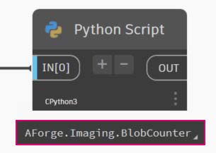

# Importação sem toque

### O que é a funcionalidade Sem toque?

A importação sem toque é um método simples de apontar e clicar para importar bibliotecas C#. O Dynamo lê os métodos públicos de um arquivo _.dll_ e os converte em nós do Dynamo. É possível usar a funcionalidade Sem toque para desenvolver seus próprios nós e pacotes personalizados e para importar bibliotecas externas para o ambiente do Dynamo.


> 1. Arquivos .dll
> 2. Nós do Dynamo

Com a funcionalidade Sem toque, é possível importar de fato uma biblioteca que não foi necessariamente desenvolvida para o Dynamo e criar um conjunto de novos nós. A funcionalidade Sem toque atual demonstra a mentalidade do projeto do Dynamo entre plataformas.

Esta seção demonstra como usar a funcionalidade Sem toque para importar uma biblioteca de terceiros. Para obter informações sobre como desenvolver sua própria biblioteca sem toque, consulte a [página wiki do Dynamo](https://github.com/DynamoDS/Dynamo/wiki/Zero-Touch-Plugin-Development).

### Pacotes sem toque

Os pacotes sem toque são um bom complemento aos nós personalizados definidos pelo usuário. Alguns pacotes que usam bibliotecas C# são listados na tabela abaixo. Para obter informações mais detalhadas sobre os pacotes, consulte a seção [Pacotes ](../../a\_appendix/a-3\_packages.md)no Apêndice.

| **Logotipo/Imagem**                                                                   | **Nome**                                                                    |
| -------------------------------------------------------------------------------- | --------------------------------------------------------------------------- |
| .jpg>)                            | [Kit de ferramentas de malha](https://github.com/DynamoDS/Dynamo/wiki/Dynamo-Mesh-Toolkit) |
|  (1).jpg>) | [Dynamo Unfold](http://dynamobim.com/dynamounfold/)                         |
|                                                  | [Rhynamo](http://www.case-inc.com/blog/what-is-rhynamo)                     |
|                                                   | [Optimo](https://github.com/BPOpt/Optimo)                                   |

## Estudo de caso – Importar o AForge

Neste estudo de caso, vamos mostrar como importar a biblioteca _.dll_ externa [AForge](http://www.aforgenet.com). O AForge é uma biblioteca robusta que oferece uma variedade de funcionalidades de processamento de imagens para inteligência artificial. Vamos fazer referência à classe de imagens no AForge para fazer alguns exercício de processamento de imagens abaixo.

Vamos começar por fazer o download do AForge. Na [página de download do AForge](http://www.aforgenet.com/framework/downloads.html), selecione _[Instalador de download]_ e faça a instalação após a conclusão do download.

No Dynamo, crie um novo arquivo e selecione _Arquivo > Importar biblioteca..._


Em seguida, localize o arquivo dll.


> 1. Na janela pop-up, navegue até a pasta de lançamento na instalação do AForge. Provavelmente isso estará em uma pasta semelhante a esta: _C:\\Arquivos de Programas (x86)\\AForge.NET\\Framework\\Release_.
> 2. **AForge.Imaging.dll:** somente queremos usar esse arquivo da biblioteca do AForge para este estudo de caso. Selecione este arquivo _.dll_ e clique em _“Abrir”_.

De volta ao Dynamo, você deve ver um grupo de nós do **AForge** adicionados à biblioteca. Agora, temos acesso à biblioteca de imagens do AForge do nosso programa visual.


### Exercício 1 – Detecção de bordas

> Faça o download do arquivo de exemplo clicando no link abaixo.
>
> É possível encontrar uma lista completa de arquivos de exemplo no Apêndice.



Agora que a biblioteca foi importada, começaremos de forma simples com este primeiro exercício (_01-EdgeDetection.dyn_). Vamos fazer um processamento básico de imagens em uma imagem de amostra para mostrar como o AForge filtra as imagens. Usaremos o nó _“Inspeção de imagem”_ para mostrar nossos resultados e aplicar filtros no Dynamo de forma similar aos do Photoshop.

Para importar uma imagem, adicione um nó **Caminho do arquivo** à tela e selecione “soapbubbles.jpg” na pasta de exercícios (créd. foto: [flickr](https://www.flickr.com/photos/wwworks/667298782)).


O nó Caminho do arquivo simplesmente fornece uma sequência de caracteres do caminho para a imagem que selecionamos. Em seguida, precisamos convertê-la em um arquivo de imagem usável no Dynamo.


> 1. Use **Arquivo do caminho** para converter o item do caminho do arquivo em uma imagem no ambiente do Dynamo.
> 2. Conecte o nó **Caminho do arquivo** ao nó **File.FromPath**.
> 3. Para converter esse arquivo em uma imagem, usaremos o nó **Image.ReadFromFile**.
> 4. Por último, vamos ver o resultado. Solte um nó **Inspeção de imagem** na tela e conecte-se a **Image.ReadFromFile**. Ainda não usamos o AForge, mas importamos com êxito uma imagem para o Dynamo.

Em AForge.Imaging.AForge.Imaging.Filters (no menu de navegação), você notará que há uma ampla gama de filtros disponíveis. Agora, vamos usar um desses filtros para diminuir a saturação de uma imagem com base nos valores-limite.


> 1. Solte três controles deslizantes na tela, altere seus intervalos para que fiquem de 0 a 1 e seus valores de etapas para 0,01.
> 2. Adicione o nó **Grayscale.Grayscale** à tela. Esse é um filtro do AForge que aplica um filtro de escala de cinza a uma imagem. Conecte os três controles deslizantes da etapa 1 a cr, cg e cb. Altere os controles deslizantes superior e inferior para ter um valor de 1 e o controle deslizante do meio para ter um valor de 0.
> 3. Para aplicar o filtro escala de cinza, é necessário executar uma ação em nossa imagem. Para isso, usamos **BaseFilter.Apply**. Conecte a imagem à entrada de imagem e **Grayscale.Grayscale** à entrada baseFilter.
> 4. A conexão a um nó **Inspeção de imagem** permitirá obter uma imagem sem saturação.

Podemos ter controle sobre como diminuir a saturação dessa imagem com base nos valores-limite para vermelho, verde e azul. Esses valores são definidos pelas entradas para o nó **Grayscale.Grayscale**. Observe que a imagem parece muito escura, pois o valor verde está definido como 0 no controle deslizante.


> 1. Altere os controles deslizantes superior e inferior para ter um valor de 0 e o controle deslizante do meio para ter um valor de 1. Dessa forma, obtemos uma imagem sem saturação mais legível.

Vamos usar a imagem sem saturação e aplicar outro filtro. A imagem sem saturação tem algum contraste, por isso, vamos testar a detecção de bordas.


> 1. Adicione um nó **SobelEdgeDetector.SobelEdgeDetector** à tela.
> 2. Conecte-o a **BaseUsingCopyPartialFilter.Apply** e conecte a imagem sem saturação à entrada de imagem desse nó.
> 3. O Sobel Edge Detector realçou as bordas em uma nova imagem.

Aproximando o zoom, o detector de bordas destacou os contornos das bolhas com pixels. A biblioteca AForge tem ferramentas para obter resultados como este e criar a geometria do Dynamo. Vamos explorar isso no próximo exercício.


### Exercício 2 – Criação de retângulo

Agora que aprendemos alguns conceitos básicos do processamento de imagens, vamos usar uma imagem para determinar a geometria do Dynamo. Neste exercício, em um nível elementar, temos como objetivo fazer um _“Traço automático”_ de uma imagem usando o AForge e o Dynamo. Vamos simplificar e extrair retângulos de uma imagem de referência, mas há ferramentas disponíveis no AForge para operações mais complexas. Vamos trabalhar com _02-RectangleCreation.dyn_ dos arquivos de exercício que transferimos por download.


> 1. Com o nó Caminho do arquivo, navegue para grid.jpg na pasta de exercícios.
> 2. Conecte as séries restantes de nós acima para revelar um eixo paramétrico de curso.

Nesta próxima etapa, queremos fazer referência aos quadrados brancos na imagem e convertê-los em geometria real do Dynamo. O AForge tem muitas ferramentas eficazes de Pesquisa visual computacional e, aqui, vamos usar uma ferramenta particularmente importante para a biblioteca chamada [BlobCounter](http://www.aforgenet.com/framework/docs/html/d7d5c028-7a23-e27d-ffd0-5df57cbd31a6.htm).


> 1. Após adicionar BlobCounter à tela, precisamos de uma forma de processar a imagem (de modo semelhante à ferramenta **BaseFilter.Apply** no exercício anterior).

Infelizmente, o nó “Processar imagem” não está imediatamente visível na biblioteca do Dynamo. Isso acontece porque a função pode não estar visível no código fonte do AForge. Para corrigir isso, precisamos encontrar uma solução alternativa.


> 1. Adicione um nó Python à tela e adicione o seguinte código ao nó Python. Esse código importa a biblioteca AForge e, em seguida, processa a imagem importada.

```
import sys
import clr
clr.AddReference('AForge.Imaging')
from AForge.Imaging import *

bc= BlobCounter()
bc.ProcessImage(IN[0])
OUT=bc
```

Conectando a saída da imagem à entrada do nó Python, obtemos um resultado AForge.Imaging.BlobCounter do nó Python.



As próximas etapas abrangem alguns truques que demonstram familiaridade com a [API de imagem do AForge](http://www.aforgenet.com/framework/docs/html/d087503e-77da-dc47-0e33-788275035a90.htm). Não é necessário aprender tudo isso para trabalhar no Dynamo. Esta é mais uma demonstração de como trabalhar com bibliotecas externas dentro da flexibilidade do ambiente do Dynamo.


> 1. Conecte a saída do script Python a BlobCounterBase.GetObjectRectangles. Essa ação faz a leitura de objetos em uma imagem, com base em um valor-limite, e extrai retângulos quantificados do espaço de pixel.


> 1. Adicione outro nó Python à tela, conecte-se a GetObjectRectangles e insira o código abaixo. Isso criará uma lista organizada de objetos do Dynamo.

```
OUT = []
for rec in IN[0]:
	subOUT=[]
	subOUT.append(rec.X)
	subOUT.append(rec.Y)
	subOUT.append(rec.Width)
	subOUT.append(rec.Height)
	OUT.append(subOUT)
```


> 1. Transponha a saída do nó Python da etapa anterior. Isso cria quatro listas, cada uma representando X, Y, Largura e Altura para cada retângulo.
> 2. Usando o bloco de código, organizamos os dados em uma estrutura que acomoda o nó Rectangle.ByCornerPoints (código abaixo).

```
recData;
x0=List.GetItemAtIndex(recData,0);
y0=List.GetItemAtIndex(recData,1);
width=List.GetItemAtIndex(recData,2);
height=List.GetItemAtIndex(recData,3);
x1=x0+width;y1=y0+height;
p0=Autodesk.Point.ByCoordinates(x0,y0);
p1=Autodesk.Point.ByCoordinates(x0,y1);
p2=Autodesk.Point.ByCoordinates(x1,y1);
p3=Autodesk.Point.ByCoordinates(x1,y0);
```

Temos uma matriz de retângulos representando os quadrados brancos na imagem. Através da programação, fizemos algo (quase) similar a um traço automático no Illustrator.

No entanto, ainda precisamos fazer um pouco de limpeza. Aumentando o zoom, podemos ver que temos vários retângulos pequenos indesejados.


Em seguida, vamos escrever códigos para nos livrar de retângulos indesejados.


> 1. Insira um nó Python entre o nó GetObjectRetangle e outro nó Python. O código do nó está abaixo e remove todos os retângulos que estão abaixo de um determinado tamanho.

```
rectangles=IN[0]
OUT=[]
for rec in rectangles:
 if rec.Width>8 and rec.Height>8:
  OUT.append(rec)
```

Com os retângulos supérfluos removidos, apenas para testar, vamos criar uma superfície com base nesses retângulos e efetuar a extrusão deles por uma distância baseada em suas áreas.


Por último, altere a entrada both_sides para falso e obtemos uma extrusão em uma direção. Mergulhe a peça em resina e você obtém uma mesa supermoderna.


Esses são exemplos básicos, mas os conceitos descritos aqui também podem ser usados em aplicativos reais incríveis. É possível usar a pesquisa visual computacional para diversos processos. Para nomear apenas alguns: leitores de código de barras, correspondência de perspectiva, [mapeamento de projeção](https://www.youtube.com/watch?v=XSR0Xady02o) e [realidade aumentada](http://aforgenet.com/aforge/articles/gratf\_ar/). Para obter informações sobre tópicos mais avançados com o AForge relacionados a este exercício, leia [este artigo](http://aforgenet.com/articles/shape\_checker/).
