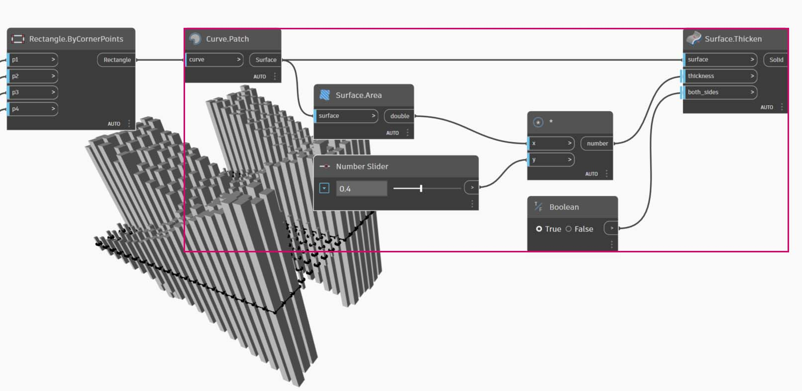

# Importazione zero-touch

### Che cos'è zero-touch?

L'importazione zero-touch si riferisce a un semplice metodo di puntamento e clic per l'importazione di librerie C#. Dynamo consentirà di leggere i metodi pubblici di un file _.dll_ e di convertirli in nodi di Dynamo. È possibile utilizzare la funzione zero-touch per sviluppare nodi e pacchetti personalizzati e per importare librerie esterne nell'ambiente di Dynamo.


> 1. File DLL
> 2. Nodi di Dynamo

Con la funzione zero-touch, è possibile infatti importare una libreria che non è stata necessariamente sviluppata per Dynamo e creare una suite di nuovi nodi. La funzionalità zero-touch corrente dimostra la mentalità multipiattaforma del progetto di Dynamo.

In questa sezione è illustrato come utilizzare la funzione zero-touch per importare una libreria di terze parti. Per informazioni sullo sviluppo della propria libreria zero-touch, fare riferimento alla [pagina Wiki di Dynamo](https://github.com/DynamoDS/Dynamo/wiki/Zero-Touch-Plugin-Development).

### Pacchetti zero-touch

I pacchetti zero-touch sono un buon complemento ai nodi personalizzati definiti dall'utente. Nella tabella riportata di seguito sono elencati alcuni pacchetti che utilizzano le librerie C#. Per informazioni più dettagliate sui pacchetti, visitare la [sezione dei pacchetti ](../../a\_appendix/a-3\_packages.md)dell'Appendice.

| **Logo/Immagine**                                                                   | **Nome**                                                                    |
| -------------------------------------------------------------------------------- | --------------------------------------------------------------------------- |
| .jpg>)                            | [Mesh Toolkit](https://github.com/DynamoDS/Dynamo/wiki/Dynamo-Mesh-Toolkit) |
|  (1).jpg>) | [Dynamo Unfold](http://dynamobim.com/dynamounfold/)                         |
|                                                  | [Rhynamo](http://www.case-inc.com/blog/what-is-rhynamo)                     |
|                                                   | [Optimo](https://github.com/BPOpt/Optimo)                                   |

## Case study - Importazione di AForge

In questo case study, sarà mostrato come importare la libreria [AForge](http://www.aforgenet.com) _.dll_ esterna. AForge è una solida libreria che offre una vasta gamma di funzionalità, dall'elaborazione delle immagini all'intelligenza artificiale. Verrà fatto riferimento alla classe di immagini in AForge per eseguire alcuni esercizi di elaborazione delle immagini riportati di seguito.

Per iniziare, scaricare AForge. Nella [pagina di download di AForge](http://www.aforgenet.com/framework/downloads.html), selezionare _[Download Installer]_ ed eseguire l'installazione dopo il completamento del download.

In Dynamo, creare un nuovo file e selezionare _File > Importa libreria_.


Quindi, individuare il file .dll.


> 1. Nella finestra a comparsa, accedere alla cartella Release nella directory di installazione di AForge. Probabilmente si troverà in una cartella simile a quella seguente: _C:\\Programmi (x86)\\AForge.NET\\Framework\\Release_.
> 2. **AForge.Imaging.dll:** per questo case study si desidera utilizzare solo questo file della libreria AForge. Selezionare questo file _.dll_ e fare clic su _Apri_.

Tornando a Dynamo, dovrebbe essere visualizzato un gruppo di nodi **AForge** aggiunto alla Libreria. Ora è possibile accedere alla libreria delle immagini AForge dal programma visivo in uso.


### Esercizio 1 - Rilevamento di spigoli

> Scaricare il file di esempio facendo clic sul collegamento seguente.
>
> Un elenco completo di file di esempio è disponibile nell'Appendice.



Ora che la libreria è stata importata, questo primo esercizio consentirà di iniziare con facilità (_01-EdgeDetection.dyn_). Per mostrare come applicare i filtri alle immagini AForge, si procederà con l'elaborazione di base di un'immagine di esempio. Verrà utilizzato il nodo _Watch Image_ per mostrare i risultati e applicare i filtri in Dynamo in modo simile a quelli in Photoshop

Aggiungere un nodo **File Path** all'area di disegno e selezionare "soapbubbles.jpg" dalla cartella degli esercizi scaricati (credito fotografico: [flickr](https://www.flickr.com/photos/wwworks/667298782)).


Il nodo File Path fornisce semplicemente una stringa del percorso dell'immagine selezionata. Successivamente, è necessario convertirla in un file di immagine utilizzabile in Dynamo.


> 1. Utilizzare **File From Path** per convertire l'elemento del percorso del file in un'immagine nell'ambiente di Dynamo.
> 2. Collegare il nodo **File Path** al nodo **File.FromPath**.
> 3. Per convertire questo file in un'immagine, utilizzare il nodo **Image.ReadFromFile**.
> 4. Infine, osservare il risultato. Rilasciare un nodo **Watch Image** nell'area di disegno e collegarlo a **Image.ReadFromFile**. Non è stato ancora utilizzato AForge, ma è stata importata correttamente un'immagine in Dynamo.

In AForge.Imaging.AForge.Imaging.Filters (nel menu di navigazione), si noterà che è disponibile una vasta gamma di filtri. Ora si utilizzerà uno di questi filtri per desaturare un'immagine in base ai valori soglia.


> 1. Rilasciare tre dispositivi di scorrimento nell'area di disegno, modificarne gli intervalli in modo che siano compresi tra 0 e 1 e i valori di incremento corrispondenti in modo che siano 0.01.
> 2. Aggiungere il nodo **Grayscale.Grayscale** all'area di disegno. Si tratta di un filtro di AForge che applica un filtro della scala di grigi ad un'immagine. Collegare i tre dispositivi di scorrimento del punto 1 a cr, cg e cb. Modificare i dispositivi di scorrimento superiore e inferiore in modo che il valore 1 e il dispositivo di scorrimento centrale abbiano un valore pari a 0.
> 3. Per applicare il filtro Grayscale, è necessario eseguire un'azione sull'immagine. Per questo, viene utilizzato **BaseFilter.Apply**. Collegare l'immagine all'input image e **Grayscale.Grayscale** all'input baseFilter.
> 4. Collegandola ad un nodo **Watch Image**, viene visualizzata un'immagine desaturata.

Si può avere il controllo su come desaturare questa immagine in base ai valori soglia per rosso, verde e blu. Questi vengono definiti dagli input nel nodo **Grayscale.Grayscale**. Notare che l'immagine risulta abbastanza attenuata perché il valore verde è impostato su 0 nel dispositivo di scorrimento.


> 1. Modificare i dispositivi di scorrimento superiore e inferiore in modo che il valore 0 e il dispositivo di scorrimento centrale abbiano un valore pari a 1. In questo modo, si ottiene un'immagine desaturata più leggibile.

Utilizzare l'immagine desaturata e applicarvi un altro filtro. L'immagine desaturata presenta un certo livello di contrasto, quindi si cercherà di verificare il rilevamento degli spigoli.


> 1. Aggiungere un nodo **SobelEdgeDetector.SobelEdgeDetector** all'area di disegno.
> 2. Collegarlo a **BaseUsingCopyPartialFilter.Apply** e collegare l'immagine desaturata all'input image di questo nodo.
> 3. SobelEdgeDetector ha evidenziato gli spigoli in una nuova immagine.

Se si esegue lo zoom avanti, il rilevamento degli spigoli ha richiamato i contorni delle bolle con i pixel. La libreria AForge dispone di strumenti per ottenere risultati simili a questi e creare la geometria di Dynamo. Verranno descritti nel prossimo esercizio.


### Esercizio 2 - Creazione di rettangoli

Dopo aver introdotto alcune operazioni di base per l'elaborazione di immagini, si utilizzerà un'immagine per gestire la geometria di Dynamo. A livello elementare, in questo esercizio si intende eseguire una _"traccia dal vivo"_ di un'immagine utilizzando AForge e Dynamo. Si tratta di un esercizio semplice in cui vengono estratti rettangoli da un'immagine di riferimento, ma sono disponibili strumenti in AForge per operazioni più complesse. Si utilizzerà _02-RectangleCreation.dyn_ dei file degli esercizi scaricati.


> 1. Con il nodo File Path, accedere a grid.jpg nella cartella degli esercizi.
> 2. Collegare le serie rimanenti di nodi riportati sopra per mostrare una griglia parametrica dell'itinerario.

Nel passaggio successivo, si desidera fare riferimento ai quadrati bianchi presenti nell'immagine e convertirli nella geometria di Dynamo effettiva. AForge dispone di molti potenti strumenti di visione artificiale. Si utilizzerà uno strumento particolarmente importante per la libreria chiamato [BlobCounter](http://www.aforgenet.com/framework/docs/html/d7d5c028-7a23-e27d-ffd0-5df57cbd31a6.htm).


> 1. Dopo aver aggiunto uno strumento BlobCounter all'area di disegno, è necessario un modo per elaborare l'immagine (simile allo strumento **BaseFilter.Apply** nell'esercizio precedente).

Purtroppo il nodo Process Image non è immediatamente visibile nella libreria di Dynamo. Ciò è dovuto al fatto che la funzione potrebbe non essere visibile nel codice sorgente di AForge. Per risolvere questo problema, occorrerà trovare una soluzione alternativa.


> 1. Aggiungere un nodo Python all'area di disegno e aggiungere il seguente codice al nodo Python. Questo codice importa la libreria AForge, quindi elabora l'immagine importata.

```
import sys
import clr
clr.AddReference('AForge.Imaging')
from AForge.Imaging import *

bc= BlobCounter()
bc.ProcessImage(IN[0])
OUT=bc
```

Collegando l'output image all'input del nodo Python, si ottiene un risultato AForge.Imaging.BlobCounter dal nodo Python.


Nei passaggi successivi sono illustrati alcuni suggerimenti che dimostrano familiarità con l'[API di creazione delle immagini AForge](http://www.aforgenet.com/framework/docs/html/d087503e-77da-dc47-0e33-788275035a90.htm). Non è necessario apprenderli tutti per far funzionare Dynamo. È qualcosa di più di una dimostrazione dell'utilizzo delle librerie esterne con tutta la flessibilità dell'ambiente Dynamo.


> 1. Collegare l'output dello script di Python a BlobCounterBase.GetObjectRectangles. In questo modo vengono letti gli oggetti in un'immagine, in base ad un valore soglia, e vengono estratti rettangoli quantificati dallo spazio in pixel.


> 1. Aggiungendo un altro nodo Python all'area di disegno, collegarlo a GetObjectRectangles e immettere il codice riportato di seguito. Così verrà creato un elenco organizzato di oggetti di Dynamo.

```
OUT = []
for rec in IN[0]:
	subOUT=[]
	subOUT.append(rec.X)
	subOUT.append(rec.Y)
	subOUT.append(rec.Width)
	subOUT.append(rec.Height)
	OUT.append(subOUT)
```


> 1. Trasporre l'output del nodo Python del passaggio precedente. Vengono creati quattro elenchi, ciascuno dei quali rappresenta X, Y, larghezza e altezza per ciascun rettangolo.
> 2. Utilizzando Code Block, organizzare i dati in una struttura che contiene il nodo Rectangle.ByCornerPoints (codice riportato di seguito).

```
recData;
x0=List.GetItemAtIndex(recData,0);
y0=List.GetItemAtIndex(recData,1);
width=List.GetItemAtIndex(recData,2);
height=List.GetItemAtIndex(recData,3);
x1=x0+width;y1=y0+height;
p0=Autodesk.Point.ByCoordinates(x0,y0);
p1=Autodesk.Point.ByCoordinates(x0,y1);
p2=Autodesk.Point.ByCoordinates(x1,y1);
p3=Autodesk.Point.ByCoordinates(x1,y0);
```

È presente una serie di rettangoli che rappresentano i quadrati bianchi presenti nell'immagine. Attraverso la programmazione, è stato fatto qualcosa (all'incirca) simile a una traccia dal vivo in Illustrator.

Tuttavia, occorre ancora fare un po' di ordine. Se si esegue lo zoom avanti, è possibile vedere che sono presenti alcuni piccoli rettangoli indesiderati.


Successivamente, verranno scritti dei codici per eliminare i rettangoli indesiderati.


> 1. Inserire un nodo Python tra il nodo GetObjectRectangles e un altro nodo Python. Il codice del nodo è riportato di seguito e rimuove tutti i rettangoli che si trovano al di sotto di una determinata dimensione.

```
rectangles=IN[0]
OUT=[]
for rec in rectangles:
 if rec.Width>8 and rec.Height>8:
  OUT.append(rec)
```

Con i rettangoli superflui eliminati, solo per divertimento, creare una superficie da questi rettangoli ed estruderli ad una distanza basata sulle loro aree.



Infine, modificare l'input both_sides in false; si ottiene un'estrusione in una direzione. Immergendo questo elemento nella resina, si ottiene un tavolo di design.


Questi sono esempi di base, ma i concetti qui delineati sono trasferibili a straordinarie applicazioni reali. La visione artificiale può essere utilizzata per un'intera serie di processi. Per citarne alcuni: lettori di codici a barre, corrispondenza della prospettiva, [mappatura della proiezione](https://www.youtube.com/watch?v=XSR0Xady02o) e [realtà aumentata](http://aforgenet.com/aforge/articles/gratf\_ar/). Per argomenti più avanzati su AForge correlati a questo esercizio, leggere [questo articolo](http://aforgenet.com/articles/shape\_checker/).
