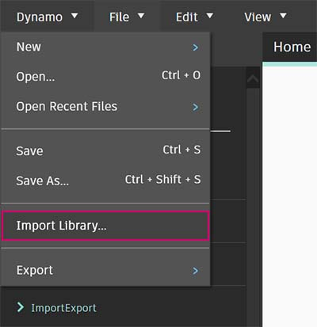

# Zero-Touch-Import

### Was ist Zero-Touch?

Unter Zero-Touch-Import versteht man ein einfaches Verfahren zum Importieren von C#-Bibliotheken durch Zeigen und Klicken. Dynamo liest die öffentlichen Methoden einer _DLL_-Datei und konvertiert sie in Dynamo-Blöcke. Sie können mithilfe von Zero-Touch Ihre eigenen benutzerdefinierten Blöcke und Pakete entwickeln sowie externe Bibliotheken in die Dynamo-Umgebung importieren.


> 1. DLL-Dateien
> 2. Dynamo-Blöcke

Mit Zero-Touch können Sie Bibliotheken importieren, die nicht unbedingt für Dynamo entwickelt wurden, und Suites mit neuen Blöcken erstellen. Die aktuelle Zero-Touch-Funktion zeigt das plattformübergreifende Konzept des Dynamo-Projekts.

In diesem Abschnitt wird gezeigt, wie Sie mithilfe von Zero-Touch externe Bibliotheken importieren können. Informationen zum Entwickeln eigener Zero-Touch-Bibliotheken finden Sie auf der [Dynamo-Wiki-Seite](https://github.com/DynamoDS/Dynamo/wiki/Zero-Touch-Plugin-Development).

### Zero-Touch-Pakete

Zero-Touch-Pakete sind eine gute Ergänzung für benutzerdefinierte Blöcke. In der folgenden Tabelle sind einige Pakete angegeben, in denen C#-Bibliotheken verwendet werden. Genauere Informationen über die Pakete finden Sie im [Abschnitt zu Paketen](../../a\_appendix/a-3\_packages.md) im Anhang.

| **Logo/Abbildung**                                                                   | **Name**                                                                    |
| -------------------------------------------------------------------------------- | --------------------------------------------------------------------------- |
| .jpg>)                            | [Mesh Toolkit](https://github.com/DynamoDS/Dynamo/wiki/Dynamo-Mesh-Toolkit) |
|  (1).jpg>) | [Dynamo Unfold](http://dynamobim.com/dynamounfold/)                         |
|                                                  | [Rhynamo](http://www.case-inc.com/blog/what-is-rhynamo)                     |
|                                                   | [Optimo](https://github.com/BPOpt/Optimo)                                   |

## Fallstudie – Importieren von AForge

In dieser Fallstudie wird der Import der externen [AForge](http://www.aforgenet.com)-_DLL_-Bibliothek gezeigt. AForge ist eine zuverlässige Bibliothek mit einem breiten Spektrum von Funktionen, angefangen mit der Bildbearbeitung und bis hin zu künstlicher Intelligenz. Hier referenzieren Sie die Bildverarbeitungsklasse von AForge für die im weiteren Verlauf dieses Abschnitts folgenden Übungen zur Bildverarbeitung.

Beginnen Sie, indem Sie AForge herunterladen. Wählen Sie auf der [Download-Seite von AForge](http://www.aforgenet.com/framework/downloads.html) die Option _[Download Installer]_. Wenn der Download abgeschlossen ist, installieren Sie das Programm.

Erstellen Sie in Dynamo eine neue Datei und wählen Sie _Datei > Bibliothek importieren_.



Suchen Sie als Nächstes die DLL-Datei.


> 1. Navigieren Sie im Popup-Fenster zum Release-Ordner in Ihrer AForge-Installation. Dies ist wahrscheinlich ein Ordner ähnlich dem folgenden: _C:\\Program Files (x86)\\AForge.NET\\Framework\\Release_.
> 2. **AForge.Imaging.dll**: Für diese Fallstudie benötigen Sie nur diese eine Datei aus der AForge-Bibliothek. Wählen Sie diese _DLL_-Datei aus und klicken Sie auf _Öffnen_.

In Dynamo sollte in der Bibliothek jetzt eine Gruppe von Blöcken namens **AForge** hinzugekommen sein. Damit haben Sie innerhalb des visuellen Programms Zugriff auf die AForge-Bildbearbeitungsbibliothek.


### Übung 1 – Kantenerkennung

> Laden Sie die Beispieldatei herunter, indem Sie auf den folgenden Link klicken.
>
> Eine vollständige Liste der Beispieldateien finden Sie im Anhang.



Nachdem Sie die Bibliothek importiert haben, beginnen Sie mit der ersten einfachen Übung (_01-EdgeDetection.dyn_). Sie führen einige einfache Bildverarbeitungsvorgänge an einem Beispielbild durch, um die Funktionsweise der Bildfilter in AForge zu demonstrieren. Dabei zeigen Sie die Ergebnisse in einem _Watch Image_-Block an und wenden in Dynamo Filter an, die denen von Photoshop ähnlich sind.

Um ein Bild zu importieren, fügen Sie einen **File Path**-Block im Ansichtsbereich hinzu, und wählen Sie die Datei "soapbubbles.jpg" aus dem Übungsordner (Foto: [flickr](https://www.flickr.com/photos/wwworks/667298782)) aus.


Im File Path-Block wird lediglich der Pfad zum ausgewählten Bild als Zeichenfolge angegeben. Als Nächstes müssen Sie den Pfad in eine verwendbare Bilddatei in Dynamo konvertieren.


> 1. Verwenden Sie einen **File.FromPath**-Block, um das Dateipfadelement in ein Bild in der Dynamo-Umgebung zu konvertieren.
> 2. Verbinden Sie den **File Path**-Block mit dem **File.FromPath**-Block.
> 3. Um diese Datei in ein Bild zu konvertieren, verwenden Sie den **Image.ReadFromFile**-Block.
> 4. Schließlich zeigen Sie das Ergebnis an. Fügen Sie einen **Watch Image**-Block in den Ansichtsbereich ein und verbinden Sie ihn mit dem **Image.ReadFromFile**-Block. Sie haben AForge noch nicht verwendet, aber das Bild erfolgreich in Dynamo importiert.

Unter AForge.Imaging.AForge.Imaging.Filters (im Navigationsmenü) stehen zahlreiche Filter zur Verfügung. Sie reduzieren mithilfe eines dieser Filter die Farbsättigung des Bildes anhand von Schwellenwerten.


> 1. Fügen Sie drei Schieberegler in den Ansichtsbereich ein und ändern Sie ihre Bereiche in 0 bis 1 und ihre Schrittwerte in 0,01.
> 2. Fügen Sie den **Grayscale.Grayscale**-Block in den Ansichtsbereich ein. Dies ist ein AForge-Filter, der einen Graustufenfilter auf das Bild anwendet. Verbinden Sie die drei Schieberegler aus Schritt 1 mit cr, cg und cb. Legen Sie im oberen und unteren Schieberegler jeweils den Wert 1 und im mittleren den Wert 0 fest.
> 3. Damit der Graustufenfilter angewendet wird, benötigen Sie eine Aktion für das Bild. Verwenden Sie hierfür einen **BaseFilter.Apply**-Block. Verbinden Sie das Bild mit der image-Eingabe und den **Grayscale.Grayscale**-Block mit der baseFilter-Eingabe.
> 4. Wenn Sie hier einen **Watch Image**-Block verbinden, erhalten Sie ein entsättigtes Bild.

Sie können mithilfe von Schwellenwerten für Rot, Grün und Blau steuern, wie das Bild entsättigt werden soll. Diese Werte werden über die Eingaben des **Grayscale.Grayscale**-Blocks definiert. Das Bild wirkt recht dunkel. Der Grund dafür ist, dass im Schieberegler für den Grün-Wert 0 eingestellt ist.


> 1. Legen Sie im oberen und unteren Schieberegler jeweils den Wert 0 und im mittleren den Wert 1 fest. Auf diese Weise erhalten Sie deutlicheres entsättigtes Bild.

Als Nächstes wenden Sie einen zusätzlichen Filter auf das entsättigte Bild an. Das entsättigte Bild weist einen gewissen Kontrast auf. Testen Sie daher jetzt die Kantenerkennung.


> 1. Fügen Sie im Ansichtsbereich einen **SobelEdgeDetector.SobelEdgeDetector**-Block hinzu.
> 2. Verbinden Sie diesen mit einem **BaseUsingCopyPartialFilter.Apply**-Block, und verbinden Sie das entsättigte Bild mit der image-Eingabe dieses Blocks.
> 3. Die Sobel-Kantenerkennung hebt in einem neuen Bild die Kanten hervor.

Die vergrößerte Darstellung zeigt, dass die Kantenerkennung die Umrisse der Blasen mit Pixeln markiert. In der AForge-Bibliothek stehen Werkzeuge zur Verfügung, mit denen Sie aus Ergebnissen wie diesem Dynamo-Geometrie erstellen können. Dies wird in der nächsten Übung genauer betrachtet.


### Übung 2 – Erstellen von Rechtecken

Nach dieser Einführung in die einfache Bildverarbeitung wird hier gezeigt, wie Sie ein Bild dazu verwenden können, um Dynamo-Geometrie zu steuern. In dieser Übung führen Sie mithilfe von AForge und Dynamo einen einfachen _Live Trace_-Vorgang für ein Bild durch. Dieses Beispiel ist relativ einfach: Aus einem Referenzbild werden Rechtecke extrahiert. In AForge stehen jedoch auch Werkzeuge für komplexere Operationen zur Verfügung. Sie arbeiten mit der Datei _02-RectangleCreation.dyn_ aus den heruntergeladenen Übungsdateien.


> 1. Navigieren Sie im File Path-Block zu grid.jpg im Übungsordner.
> 2. Verbinden Sie die übrigen Blöcke der oben gezeigten Folge, um ein durch Verlaufsparameter definiertes Raster anzuzeigen.

Im nächsten Schritt sollen die weißen Quadrate in diesem Bild referenziert und in Dynamo-Geometrie konvertiert werden. AForge bietet eine Vielfalt leistungsstarker Computer Vision-Werkzeuge. Hier verwenden Sie ein besonders wichtiges Werkzeug in der Bibliothek: [BlobCounter](http://www.aforgenet.com/framework/docs/html/d7d5c028-7a23-e27d-ffd0-5df57cbd31a6.htm).


> 1. Nachdem Sie einen BlobCounter-Block im Ansichtsbereich hinzugefügt haben, benötigen Sie eine Funktion zur Verarbeitung des Bildes (ähnlich dem **BaseFilter.Apply**-Werkzeug in der vorigen Übung).

Der Process Image-Block ist jedoch nicht direkt in der Dynamo-Bibliothek sichtbar. Der Grund hierfür ist, dass die Funktion eventuell nicht im AForge-Quellcode sichtbar ist. Dies müssen Sie mit einer Umgehungslösung beheben.


> 1. Fügen Sie im Ansichtsbereich einen Python-Block hinzu, und geben Sie im Python-Block den folgenden Code ein. Dieser Code importiert die AForge-Bibliothek und verarbeitet dann das importierte Bild.

```
import sys
import clr
clr.AddReference('AForge.Imaging')
from AForge.Imaging import *

bc= BlobCounter()
bc.ProcessImage(IN[0])
OUT=bc
```

Indem Sie die image-Ausgabe mit der Eingabe des Python-Blocks verbinden, erhalten Sie ein AForge.Imaging.BlobCounter-Ergebnis aus dem Python-Block.


Die Vorgänge in den nächsten Schritten setzen eine gewisse Kenntnis der [AForge-Imaging-API](http://www.aforgenet.com/framework/docs/html/d087503e-77da-dc47-0e33-788275035a90.htm) voraus. Für die Arbeit mit Dynamo müssen Sie diese nicht komplett erlernen. Dies dient mehr zur Demonstration der Arbeit mit externen Bibliotheken innerhalb der Dynamo-Umgebung mit ihrer großen Flexibilität.


> 1. Verbinden Sie die Ausgabe des Python-Skripts mit BlobCounterBase.GetObjectRectangles. Dieser Block liest Objekte in einem Bild anhand eines Schwellenwerts und extrahiert quantifizierte Rechtecke aus dem Pixelraum.


> 1. Fügen Sie einen weiteren Python-Block in den Ansichtsbereich ein, verbinden Sie ihn mit GetObjectRectangles und geben Sie den unten stehenden Code ein. Dadurch erhalten Sie eine strukturierte Liste von Dynamo-Objekten.

```
OUT = []
for rec in IN[0]:
	subOUT=[]
	subOUT.append(rec.X)
	subOUT.append(rec.Y)
	subOUT.append(rec.Width)
	subOUT.append(rec.Height)
	OUT.append(subOUT)
```


> 1. Vertauschen Sie die Listenebenen aus der Ausgabe des Python-Blocks aus dem vorigen Schritt mithilfe von Transpose. Dadurch erhalten Sie vier Listen, jeweils mit den x-, y-, Breiten- und Höhenwerten der einzelnen Rechtecke.
> 2. Mithilfe eines Codeblocks ordnen Sie die Daten in einer für den Rectangle.ByCornerPoints-Block geeigneten Struktur (mithilfe des folgenden Codes).

```
recData;
x0=List.GetItemAtIndex(recData,0);
y0=List.GetItemAtIndex(recData,1);
width=List.GetItemAtIndex(recData,2);
height=List.GetItemAtIndex(recData,3);
x1=x0+width;y1=y0+height;
p0=Autodesk.Point.ByCoordinates(x0,y0);
p1=Autodesk.Point.ByCoordinates(x0,y1);
p2=Autodesk.Point.ByCoordinates(x1,y1);
p3=Autodesk.Point.ByCoordinates(x1,y0);
```

Wir sehen eine Reihe von Rechtecken, die die weißen Quadrate aus dem Bild darstellen. Durch diese Programmierung haben Sie einen Vorgang durchgeführt, der der Live Trace-Funktion von Illustrator recht nahe kommt.

Das Ergebnis muss jedoch noch bereinigt werden. Die vergrößerte Darstellung zeigt, dass einige unerwünschte kleine Rechtecke vorhanden sind.


Als Nächstes schreiben wir Code, um unerwünschte Rechtecke zu entfernen.


> 1. Fügen Sie einen Python-Block zwischen dem GetObjectRectangles-Block und einem anderen Python-Block ein. Der Code für diesen Block wird unten gezeigt. Er entfernt alle Rechtecke, die kleiner als die angegebene Größe sind.

```
rectangles=IN[0]
OUT=[]
for rec in rectangles:
 if rec.Width>8 and rec.Height>8:
  OUT.append(rec)
```

Damit haben Sie die überflüssigen Rechtecke beseitigt. Erstellen Sie jetzt interessehalber eine Oberfläche aus diesen Rechtecken und extrudieren Sie diese um eine Entfernung in Abhängigkeit von ihrer Fläche.


Ändern Sie zum Schluss die both_sides-Eingabe in "false". Damit erhalten Sie eine Extrusion in nur eine Richtung. Tauchen Sie diese Form in Kunstharz, um den perfekten Tisch für Nerds zu erhalten!


Die hier gezeigten Beispiele sind relativ einfach, die beschriebenen Konzepte jedoch lassen sich auf faszinierende reale Anwendungen übertragen. Computer Vision kann für eine Vielzahl von Prozessen verwendet werden. Hierzu gehören, um nur einige Beispiele zu nennen, Barcode-Scanner, Perspective Matching, [Projektionsmapping](https://www.youtube.com/watch?v=XSR0Xady02o) und [erweiterte Realität](http://aforgenet.com/aforge/articles/gratf\_ar/). Erweiterte Themen mit AForge für diese Übung finden Sie in [diesem Artikel](http://aforgenet.com/articles/shape\_checker/).
