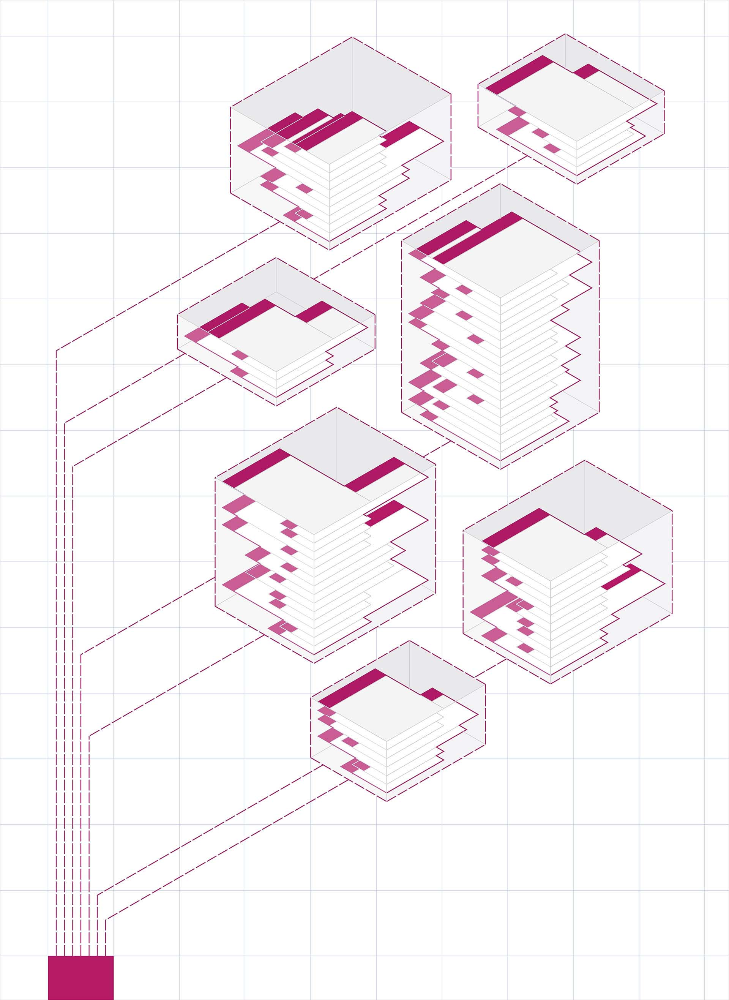

# Packages

Une fois que vous avez créé quelques nœuds personnalisés, l’étape suivante consiste à les organiser et à les publier au moyen de packages, une méthode pratique pour stocker et partager vos nœuds avec la communauté Dynamo.

