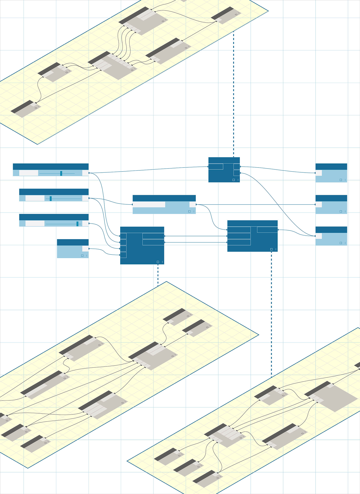

# Nodos y paquetes personalizados

De forma predefinida, Dynamo tiene muchas funciones almacenadas en su biblioteca de nodos. Para las rutinas de uso frecuente o ese gráfico especial que desea compartir con la comunidad, los nodos y los paquetes personalizados son un método excelente para ampliar Dynamo aún más.

