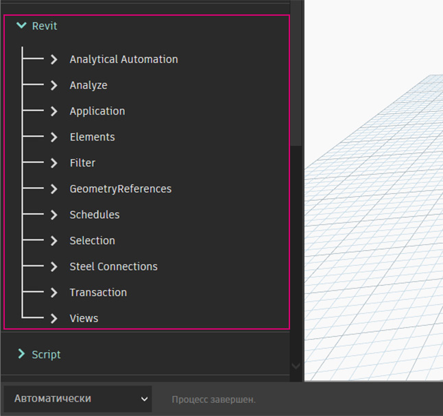
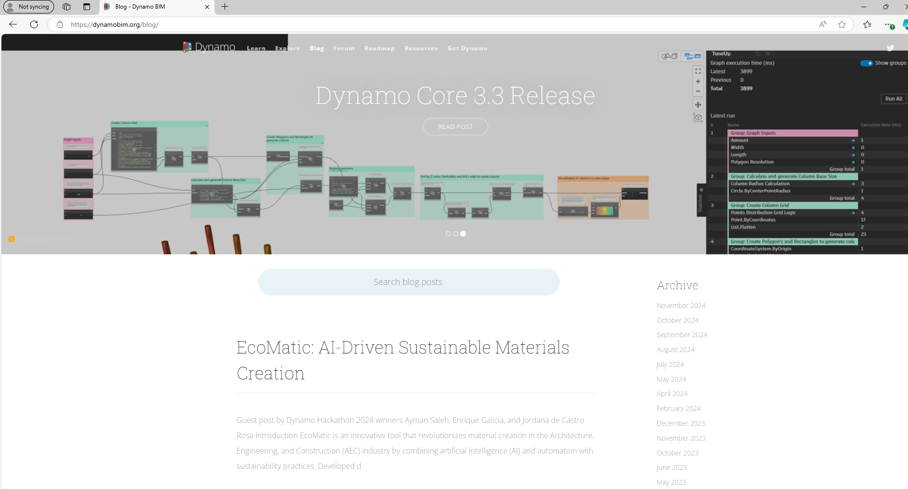

# Подключение к Revit

Надстройка Dynamo для Revit расширяет возможности информационного моделирования зданий за счет среды логики и данных, предоставляемой графическим редактором алгоритмов. Ее гибкие возможности в сочетании с обширной базой данных Revit позволяют перевести BIM на новый уровень.

В этой главе рассматриваются рабочие процессы Dynamo для BIM. Почти каждый раздел включает упражнения, так как знакомство с графическим редактором алгоритмов для BIM эффективнее всего проводится на практике. Но для начала изучите истоки этой программы.

### Совместимость с разными версиями Revit

Поскольку Revit и Dynamo постоянно обновляются, в какой-то момент используемая версия Revit может оказаться несовместимой с установленной на компьютере версией Dynamo для Revit. Ниже приведены сведения о том, какие версии надстройки Dynamo для Revit совместимы с программой Revit.

| Версия Revit | Первая стабильная версия Dynamo                                                       | Последняя поддерживаемая версия Dynamo для Revit                                                                                                                                |
| ------------- | --------------------------------------------------------------------------------- | ---------------------------------------------------------------------------------------------------------------------------------------------------------------------- |
| 2013          | [0.6.1](https://downloads.dynamobuilds.com/DynamoInstall0.6.1.exe) | [0.6.3](https://downloads.dynamobuilds.com/DynamoInstall0.6.3.exe)                                                                                      |
| 2014          | [0.6.1](https://downloads.dynamobuilds.com/DynamoInstall0.6.1.exe) | [0.8.2](https://downloads.dynamobuilds.com/DynamoInstall0.8.2.exe)                                                                                      |
| 2015          | [0.7.1](https://downloads.dynamobuilds.com/DynamoInstall0.7.1.exe) | [1.2.1](https://downloads.dynamobuilds.com/DynamoInstall1.2.1.exe)                                                                                      |
| 2016          | [0.7.2](https://downloads.dynamobuilds.com/DynamoInstall0.7.2.exe) | [1.3.2](https://downloads.dynamobuilds.com/DynamoInstall1.3.2.exe)                                                                                      |
| 2017          | [0.9.0](https://downloads.dynamobuilds.com/DynamoInstall0.9.0.exe) | [1.3.4](https://downloads.dynamobuilds.com/DynamoInstall1.3.4.exe) / [2.0.3](https://downloads.dynamobuilds.com/DynamoInstall2.0.3.exe) |
| 2018          | [1.3.0](https://downloads.dynamobuilds.com/DynamoInstall1.3.0.exe) | [1.3.4](https://downloads.dynamobuilds.com/DynamoInstall1.3.4.exe) / [2.0.3](https://downloads.dynamobuilds.com/DynamoInstall2.0.3.exe) |
| 2019          | [1.3.3](https://downloads.dynamobuilds.com/DynamoInstall1.3.3.exe) | [1.3.4](https://downloads.dynamobuilds.com/DynamoInstall1.3.4.exe) / [2.0.4](https://downloads.dynamobuilds.com/DynamoInstall2.0.4.exe) |
| 2020+         | 2.1.0 (Revit 2020 или более поздней версии теперь включает Dynamo и обновляется в соответствии с графиком обновлений Revit.)      | Отсутствует                                                                                                                                                                    |

### История Dynamo

Благодаря упорству разработчиков и активному вкладу сообщества пользователей этот проект прошел большой путь от скромной надстройки до того, чем он является сейчас.

Изначально приложение Dynamo разрабатывалось как средство оптимизации рабочих процессов Revit для сферы архитектуры и строительства. Хотя в Revit для каждого проекта создается обширная база данных, пользователи со средним уровнем подготовки могут столкнуться с проблемами при доступе к информации за пределами интерфейса. Revit располагает полнофункциональным интерфейсом API, благодаря которому сторонние разработчики могут создавать специализированные инструменты. И программисты пользовались этим API на протяжении многих лет, однако стоит признать, что создание текстовых сценариев под силу далеко не всем. Благодаря Dynamo и понятному графическому редактору алгоритмов данные Revit становятся более доступными для пользователей с разными уровнями подготовки.

Используя базовые узлы Dynamo в сочетании со специализированными узлами Revit, пользователи могут существенно расширить параметрические рабочие процессы для обеспечения совместимости, выпуска документации, анализа и генерации объектов. Dynamo позволяет автоматизировать повседневные рабочие процессы и направить все силы проектировщиков на анализ и изучение проектов.

### Работа с Dynamo в Revit

В редакторе проектов или семейств Revit перейдите в раздел «Надстройки» и выберите Dynamo*.

 * Программа Dynamo будет выполняться только в том файле, в котором была открыта. 

\.jpg>)

При открытии Dynamo в Revit отображается новая категория с именем Revit. Это мощное дополнение к пользовательскому интерфейсу, включающее узлы, специально предназначенные для использования в рабочих процессах Revit*.

* При использовании семейства узлов, предназначенного для Revit, график Dynamo будет работать только при открытии в Dynamo для Revit. Если график, предназначенный для работы в Dynamo для Revit, открыть в однопользовательской версии Dynamo, то все узлы Revit из него пропадут. 

### Замораживание узлов

Поскольку Revit является платформой, которая обеспечивает широкие возможности по управлению проектами, параметрические операции в Dynamo могут быть сложными, а их расчет может занимать много времени. Если Dynamo требуется много времени для расчета узлов, возможно, следует воспользоваться функцией заморозки, чтобы приостановить выполнение операций Revit во время создания графика.

 Подробные сведения о замораживании узлов см. в разделе [4_nodes_and_wires  ](../4\_nodes\_and\_wires/ "mention") . 

### Блог и сообщество Dynamo

Приложение Dynamo изначально разрабатывалось для использования в сфере архитектуры и строительства, и наше постоянно растущее сообщество пользователей — это отличный ресурс для обучения и общения с отраслевыми экспертами. В сообщество пользователей Dynamo входят архитекторы, инженеры, программисты и проектировщики, которые любят изобретать и делиться своими изобретениями.

Dynamo — это проект с открытым исходным кодом, который постоянно развивается, и многие нововведения касаются Revit. Если вы пока что новичок, переходите на форум и начинайте [задавать вопросы](http://dynamobim.org/forums/forum/dyn/). Если вы программист и хотите принять участие в разработке Dynamo, посетите страницу [репозитория GitHub](https://github.com/DynamoDS/Dynamo). Кроме того, если вас интересуют библиотеки сторонних разработчиков, рекомендуем ознакомиться с [Dynamo Package Manager](http://dynamopackages.com). Многие из этих пакетов предназначены для сферы архитектуры и строительства. В этой главе рассматривается использование пакетов сторонних разработчиков для создания дополнительных панелей.

Разработчики Dynamo также ведут активный блог. Ознакомьтесь с последними публикациями, чтобы быть в курсе всех новостей.

