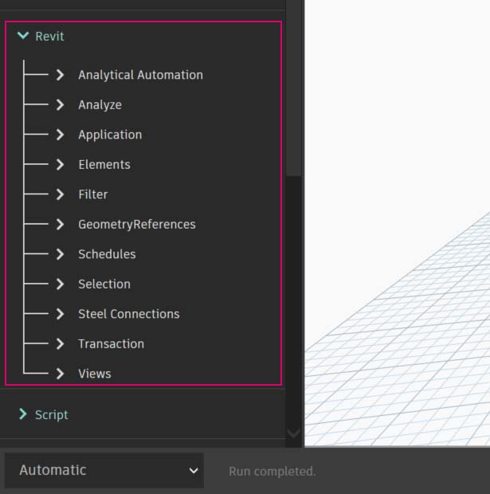

# Propojení s aplikací Revit

Modul Dynamo for Revit rozšiřuje informační model budovy o data a logiku grafického editoru algoritmů. Jeho flexibilita spolu s robustní databázi aplikace Revit umožňují pracovat na BIM inovativním způsobem.

Tato kapitola se zaměřuje na práci na BIM v rozhraní Dynamo. Jednotlivé části jsou zaměřeny zejména na praktická cvičení, protože práce na projektu je nejlepší způsob, jak se seznámit s grafickým editorem algoritmů pro BIM. Řekněme si ale nejdřív něco k počátkům programu.

### Kompatibilita verzí aplikace Revit

Protože se aplikace Revit i aplikace Dynamo neustále vyvíjejí, může dojít k situaci, kdy verze aplikace Revit nebude kompatibilní s nainstalovanou verzí modulu Dynamo pro aplikaci Revit. Níže jsou uvedeny verze modulu Dynamo pro aplikaci Revit, které jsou kompatibilní s aplikací Revit.

| Verze aplikace Revit | Pevní stabilní verze aplikace Dynamo                                                       | Poslední podporovaná verze modulu Dynamo pro aplikaci Revit                                                                                                                                |
| ------------- | --------------------------------------------------------------------------------- | ---------------------------------------------------------------------------------------------------------------------------------------------------------------------- |
| 2013          | [0.6.1](http://dyn-builds-data.s3-us-west-2.amazonaws.com/DynamoInstall0.6.1.exe) | [0.6.3](http://dyn-builds-data.s3-us-west-2.amazonaws.com/DynamoInstall0.6.3.exe)                                                                                      |
| 2014          | [0.6.1](http://dyn-builds-data.s3-us-west-2.amazonaws.com/DynamoInstall0.6.1.exe) | [0.8.2](http://dyn-builds-data.s3-us-west-2.amazonaws.com/DynamoInstall0.8.2.exe)                                                                                      |
| 2015          | [0.7.1](http://dyn-builds-data.s3-us-west-2.amazonaws.com/DynamoInstall0.7.1.exe) | [1.2.1](http://dyn-builds-data.s3-us-west-2.amazonaws.com/DynamoInstall1.2.1.exe)                                                                                      |
| 2016          | [0.7.2](http://dyn-builds-data.s3-us-west-2.amazonaws.com/DynamoInstall0.7.2.exe) | [1.3.2](http://dyn-builds-data.s3-us-west-2.amazonaws.com/DynamoInstall1.3.2.exe)                                                                                      |
| 2017          | [0.9.0](http://dyn-builds-data.s3-us-west-2.amazonaws.com/DynamoInstall0.9.0.exe) | [1.3.4](http://dyn-builds-data.s3-us-west-2.amazonaws.com/DynamoInstall1.3.4.exe) / [2.0.3](https://dyn-builds-data.s3-us-west-2.amazonaws.com/DynamoInstall2.0.3.exe) |
| 2018          | [1.3.0](http://dyn-builds-data.s3-us-west-2.amazonaws.com/DynamoInstall1.3.0.exe) | [1.3.4](http://dyn-builds-data.s3-us-west-2.amazonaws.com/DynamoInstall1.3.4.exe) / [2.0.3](https://dyn-builds-data.s3-us-west-2.amazonaws.com/DynamoInstall2.0.3.exe) |
| 2019          | [1.3.3](http://dyn-builds-data.s3-us-west-2.amazonaws.com/DynamoInstall1.3.3.exe) | [1.3.4](http://dyn-builds-data.s3-us-west-2.amazonaws.com/DynamoInstall1.3.4.exe) / [2.0.4](https://dyn-builds-data.s3-us-west-2.amazonaws.com/DynamoInstall2.0.4.exe) |
| 2020+         | 2.1.0 – Aplikace Revit 2020 a novější nyní obsahuje aplikaci Dynamo, která je aktualizována, stejně jako Revit.)      | Není použito                                                                                                                                                                    |

### Historie aplikace Dynamo

Díky specializovanému týmu vývojářů a aktivní komunitě ušel projekt od svým počátku dlouhou cestu.

Aplikace Dynamo původně sloužila ke zjednodušení pracovních postupů AEC v aplikaci Revit. Ačkoliv aplikace Revit pro každý projekt vytváří robustní databázi, průměrní uživatelé měli problém při přistupování k těmto datům mimo rozhraní. Aplikace Revit nabízí rozsáhlé API (aplikační programové rozhraní), které umožňuje vývojářům vytvářet přizpůsobené nástroje. Programátoři toto API využívali dlouhá léta, ale textové programování není pro každého. Aplikace Dynamo sloužila ke zpřístupnění dat aplikace Revit prostřednictvím jednoduchého grafického editoru.

Pomocí základních uzlů aplikace Dynamo spolu s uzly pro aplikaci Revit je možné rozšířit parametrické pracovní postupy pro interoperabilitu, dokumentaci, analýzu a generování. S aplikací Dynamo lze zdlouhavé pracovní postupy automatizovat a zaměřit se pouze na návrh.

### Spuštění aplikace Dynamo v aplikaci Revit

V projektu aplikace Revit nebo Editoru rodiny přejděte na doplňky a klikněte na možnost Dynamo.*


 *Aplikace Dynamo se spustí pouze v souboru, ve kterém byla otevřena. 


.jpg>)

Po otevření aplikace Dynamo v aplikaci Revit je k dispozici nová kategorie s názvem „Revit“. Jedná se o rozšíření uživatelského rozhraní, které nabízí uzly pro práci s aplikací Revit.*


 *Pokud použijete uzly určené pro práci v aplikaci Revit, graf aplikace Dynamo bude fungovat pouze při otevření v modulu Dynamo for Revit. Pokud graf modulu Dynamo for Revit otevřete například v aplikaci Dynamo Sandbox, uzly aplikace Revit budou chybět. 


### Zmrazení uzlů

Protože Revit je platforma s robustními funkcemi pro správu projektů, výpočet parametrických operací v aplikaci Dynamo může být složitý a pomalý. Pokud aplikaci Dynamo trvá výpočet uzlů dlouho, bude možná užitečné využít funkci „zmrazení“ uzlu, která pozastaví provádění operací aplikace Revit, zatímco vyvíjíte graf.


 Další informace o zmrazení uzlů naleznete v části [4_nodes_and_wires](../4\_nodes\_and\_wires/ "mention"). 


### Komunita a blog aplikace Dynamo

Aplikace Dynamo byla původně vytvořena pro AEC a její velká a rostoucí komunita nabízí skvělou příležitost spojit se a učit se od expertů z oboru. Komunitu aplikace Dynamo tvoří architekti, inženýři, programátoři a konstruktéři, kteří rádi sdílejí a tvoří.

Aplikace Dynamo je projekt s otevřeným zdrojovým kódem, která se neustále vyvíjí, přičemž velké množství vývoje souvisí také s aplikací Revit. Pokud s aplikací začínáte, neváhejte a [ptejte se](http://dynamobim.org/forums/forum/dyn/) na diskuzním fóru! Pokud jste programátor a chcete se zapojit do vývoje aplikace Dynamo, přejděte na [úložiště na Githubu](https://github.com/DynamoDS/Dynamo). Skvělým zdrojem knihoven třetích stran je také nástroj [Dynamo Package Manager](http://dynamopackages.com). Mnoho z těchto balíčků bylo vyvinuto s ohledem na AEC a v této kapitole budou probrány balíčky třetích stran pro panelizaci.

Aplikace Dynamo také provozuje aktivní blog. Přečtěte si nejnovější příspěvky z vývoje.

