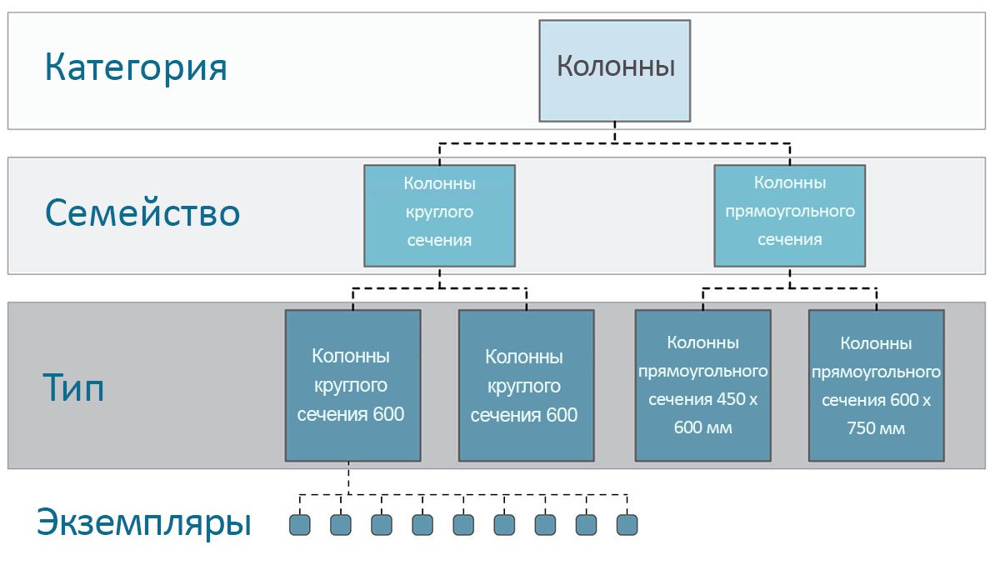
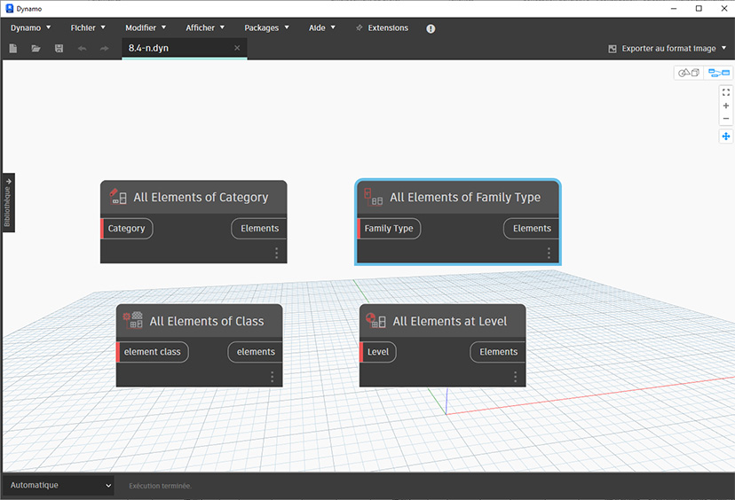

# Selección

### Seleccionar elementos de Revit

Revit es un entorno con gran cantidad de datos. Esto nos proporciona una gama de posibilidades de selección que se expande mucho más allá de "señalar y hacer clic". Podemos consultar la base de datos de Revit y vincular dinámicamente elementos de Revit a la geometría de Dynamo mientras realizamos operaciones paramétricas.

La biblioteca de Revit de la interfaz de usuario ofrece la categoría "Selection" (selección) que permite elegir varias formas de seleccionar la geometría.

### Jerarquía de Revit

Para seleccionar elementos de Revit correctamente, es importante comprender totalmente la jerarquía de elementos de Revit. ¿Desea seleccionar todos los muros de un proyecto? Seleccione por categoría. ¿Desea seleccionar todas las sillas Eames en su lobby moderno de mediados de siglo? Seleccione por familia.

Vamos a revisar rápidamente la jerarquía de Revit.

¿Recuerda la taxonomía de la biología? Reino, phylum, clase, orden, familia, género y especie. Los elementos de Revit se clasifican de forma similar. En un nivel básico, la jerarquía de Revit se puede dividir en categorías, familias, tipos* y ejemplares. Un ejemplar es un elemento de modelo individual (con un ID exclusivo), mientras que una categoría define un grupo genérico (como "muros" o "suelos"). Con la base de datos de Revit organizada de este modo, podemos seleccionar un elemento y elegir todos los elementos similares en función de un nivel especificado en la jerarquía.

 * Los tipos en Revit se definen de forma distinta a los tipos en programación. En Revit, un tipo hace referencia a una ramificación de la jerarquía, en lugar de a un "tipo de datos". 

### Navegación por las bases de datos con nodos de Dynamo

Las tres imágenes siguientes dividen las categorías principales para la selección de elementos de Revit en Dynamo. Son herramientas excelentes para usarlas en combinación y exploraremos algunas de ellas en los ejercicios siguientes.

_Señalar y hacer clic_ es el método más sencillo para seleccionar directamente un elemento de Revit. Puede seleccionar un elemento de modelo completo o partes de su topología (como una cara o un borde). Este elemento permanece vinculado dinámicamente a ese objeto de Revit, por lo que, cuando el archivo de Revit actualiza su ubicación o parámetros, el elemento de Dynamo al que se hace referencia se actualiza en el gráfico.

Los _menús desplegables_ crean una lista de todos los elementos a los que se puede acceder en un proyecto de Revit. Puede utilizar esta opción para hacer referencia a elementos de Revit que no están necesariamente visibles en una vista. Esta es una herramienta excelente para consultar elementos existentes o crear nuevos elementos en un editor de proyectos o familias de Revit.

También puede seleccionar elementos de Revit por niveles específicos en la _jerarquía de Revit_. Esta es una opción eficaz para personalizar grandes matrices de datos para preparar la documentación o la creación de ejemplares y personalización generativas.

Teniendo en cuenta las tres imágenes anteriores, vamos a profundizar en un ejercicio que selecciona elementos de un proyecto básico de Revit para preparar las aplicaciones paramétricas que crearemos en las secciones restantes de este capítulo.

## Ejercicio

> Descargue el archivo de ejemplo. Para ello, haga clic en el vínculo siguiente.
>
> En el Apéndice, se incluye una lista completa de los archivos de ejemplo.



En este archivo de Revit de ejemplo, tenemos tres tipos de elementos de un edificio sencillo. Vamos a usar este archivo como ejemplo para seleccionar elementos de Revit en el contexto de la jerarquía de Revit.

> 1. Masa de construcción
> 2. Vigas (armazón estructural)
> 3. Vigas de celosía (componentes adaptativos)

¿Qué conclusiones podemos sacar de los elementos que hay en la vista de proyecto de Revit? Y, ¿cuánto debemos descender en la jerarquía para seleccionar los elementos adecuados? Por supuesto, esta tarea se volverá más compleja al trabajar en un proyecto de gran tamaño. Hay una gran cantidad de opciones disponibles; se pueden seleccionar elementos por categorías, niveles, familias, ejemplares, etc.

### Selección de masa y superficies

> 1. Como estamos trabajando con una configuración básica, seleccionaremos la masa de construcción eligiendo _"Mass"_ en el nodo desplegable Categories. Puede encontrarlo en la ficha Revit > Selection.
> 2. La salida de la categoría Mass es solo la categoría en sí. Debemos seleccionar los elementos. Para ello, se utiliza el nodo _"All Elements of Category"_.

En este punto, observe que no se ve ninguna geometría en Dynamo. Hemos seleccionado un elemento de Revit, pero no lo hemos convertido en geometría de Dynamo. Se trata de una distinción importante. Si tuviéramos que seleccionar un gran número de elementos, no es deseable obtener una vista preliminar de todos ellos en Dynamo porque esto ralentizaría todo el proceso. Dynamo es una herramienta para gestionar un proyecto de Revit sin realizar necesariamente operaciones de geometría, y lo veremos en la siguiente sección de este capítulo.

En este caso trabajamos con geometría sencilla, por lo que vamos a incorporar la geometría a la vista preliminar de Dynamo. Junto al elemento "BldgMass" del nodo Watch anterior aparece un número verde. Esto representa el ID del elemento e indica que estamos trabajando con un elemento de Revit, no con una geometría de Dynamo. El siguiente paso es convertir este elemento de Revit en geometría en Dynamo.

> 1. Mediante el nodo _Element.Faces_, se obtiene una lista de las superficies que representan cada cara de la masa de Revit. Ahora podemos ver la geometría en la ventana gráfica de Dynamo y comenzar a hacer referencia a la cara para realizar operaciones paramétricas.

A continuación se incluye un método alternativo. En este caso, no vamos a realizar la selección mediante la jerarquía de Revit _("All Elements of Category")_, sino que vamos a seleccionar de forma explícita la geometría en Revit.

> 1. Mediante el nodo _"Select Model Element"_, haga clic en el botón *"select" *(o _"change"_). En la ventana gráfica de Revit, seleccione el elemento que desee. En este caso, seleccionamos la masa de construcción.
> 2. En lugar de _Element.Faces_, se puede seleccionar la masa completa como una geometría sólida mediante _Element.Geometry_. De este modo, se selecciona toda la geometría contenida en la masa.
> 3. Mediante _Geometry.Explode_, podemos obtener la lista de superficies de nuevo. Estos dos nodos funcionan de la misma forma que _Element.Faces_, pero ofrecen opciones alternativas para profundizar en la geometría de un elemento de Revit.

Mediante algunas operaciones de lista básicas, podemos consultar una cara de interés.

> 1. En primer lugar, genere los elementos seleccionados anteriormente en el nodo Element.Faces.
> 2. A continuación, el nodo _List.Count_ indica que estamos trabajando con 23 superficies en la masa.
> 3. Al hacer referencia a este número, se cambia el valor máximo de un *control deslizante de enteros *a _"22"_.
> 4. Con _List.GetItemAtIndex_, se introducen las listas y el *control deslizante de enteros *para el _índice_. Deslizamos la selección y nos detenemos cuando lleguemos al _índice 9_ y hayamos aislado la fachada principal que contiene las vigas de celosía.

El paso anterior era un poco engorroso. Esto se puede hacer mucho más deprisa con el nodo _"Select Face"_. Este nos permite aislar una cara que no es un elemento en el proyecto de Revit. Se aplica la misma interacción que con _"Select Model Element"_, excepto que seleccionamos la superficie en lugar del elemento completo.

Supongamos que deseamos aislar los muros de las fachadas principales del edificio. Para ello, se puede utilizar el nodo _"Select Faces"_. Haga clic en el botón "Select" y, a continuación, seleccione las cuatro fachadas principales en Revit.

Después de seleccionar los cuatro muros, asegúrese de hacer clic en el botón "Finalizar" en Revit.

Las caras se importan en Dynamo como superficies.

### Selección de vigas

Ahora, veamos las vigas situadas sobre el atrio.

> 1. Con el nodo _"Select Model Element"_, seleccione una de las vigas.
> 2. Conecte el elemento de viga al nodo _Element.Geometry_; la viga aparecerá en la ventana gráfica de Dynamo.
> 3. Podemos ampliar la geometría con un nodo _Watch3D_ (si no ve la viga en Watch 3D, haga clic con el botón derecho y pulse "Ajustar en ventana").

Una duda que puede aparecer con frecuencia en los flujos de trabajo de Revit o Dynamo es la siguiente: ¿cómo selecciono un elemento y obtengo todos los elementos similares? Como el elemento de Revit seleccionado contiene toda su información jerárquica, podemos consultar su tipo de familia y seleccionar todos los elementos de ese tipo.

> 1. Conecte el elemento de viga a un nodo _Element.ElementType_.
> 2. El nodo _Watch_ indica que la salida es ahora un símbolo de familia en lugar de un elemento de Revit.
> 3. _Element.ElementType_ es una consulta sencilla, por lo que podemos realizarla en el bloque de código de la misma forma con `x.ElementType;` y obtener los mismos resultados.

> 1. Para seleccionar las vigas restantes, utilizaremos el nodo _"All Elements of Family Type"_.
> 2. El nodo Watch muestra que se han seleccionado cinco elementos de Revit.

> 1. También podemos convertir estos cinco elementos en geometría de Dynamo.

¿Y si tuviéramos 500 vigas? Convertir todos estos elementos en geometría de Dynamo sería muy lento. Si Dynamo tarda mucho tiempo en calcular los nodos, puede usar la función "Bloquear" para poner en pausa la ejecución de operaciones de Revit mientras desarrolla el gráfico. Para obtener más información sobre el bloqueo de nodos, consulte la sección ["Bloqueo"](../essential-nodes-and-concepts/5\_geometry-for-computational-design/5-6\_solids.md#freezing) del capítulo sobre sólidos.

En cualquier caso, si importamos 500 vigas, ¿necesitamos que todas las superficies realicen la operación paramétrica deseada? ¿O podemos extraer información básica de las vigas y realizar tareas generativas con geometría fundamental? Esta es una pregunta que tendremos en cuenta a medida que avanzamos en este capítulo. Por ejemplo, veamos a continuación el sistema de vigas de celosía:

### Selección de vigas de celosía

Con el mismo gráfico de nodos, seleccione el elemento de viga de celosía en lugar del elemento de viga. Antes de hacerlo, suprima el nodo Element.Geometry del paso anterior.

A continuación, ya estamos listos para extraer información básica del tipo de familia de vigas de celosía.

> 1. En el nodo _Watch_, podemos ver que tenemos una lista de componentes adaptativos seleccionados en Revit. Vamos a extraer la información básica, por lo que comenzaremos con los puntos adaptativos.
> 2. Conecte el nodo _"All Elements of Family Type"_ al nodo _"AdaptiveComponent.Location"_. Esto nos proporciona una lista de listas, cada una con tres puntos que representan las ubicaciones de los puntos adaptativos.
> 3. Al conectar un nodo _"Polygon.ByPoints"_, se obtiene una PolyCurve. Se puede ver en la ventana gráfica de Dynamo. Con este método, hemos visualizado la geometría de un elemento y hemos abstraído la geometría de la matriz de elementos restantes (que podría ser mayor en número que este ejemplo).

 Consejo: Si hace clic en el número verde de un elemento de Revit en Dynamo, la ventana gráfica de Revit ampliará ese elemento. 
