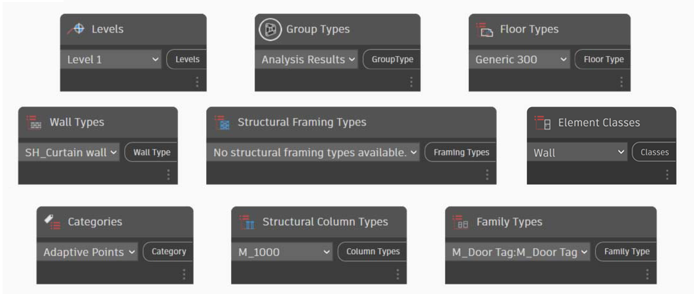
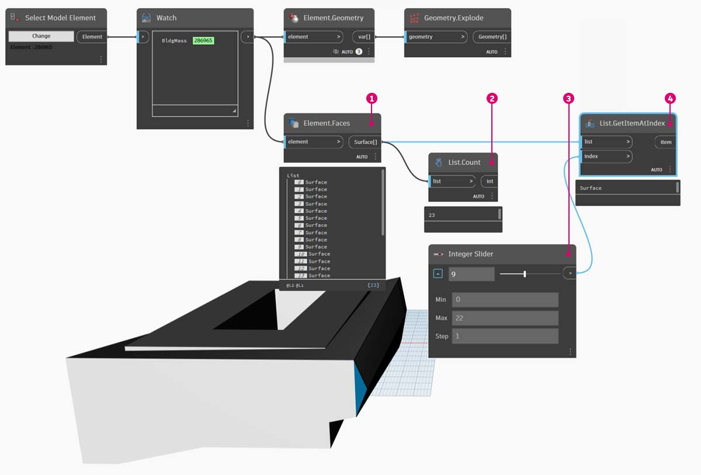

# 選択

### Revit 要素を選択する

Revit は、非常に豊富なデータを扱う環境です。このため、選択機能が「ポイント アンド クリック」をはるかに超えた範囲にまで拡張されています。パラメトリックな操作の実行中に、Revit のデータベースにクエリーを行い、Revit の要素を Dynamo のジオメトリに動的にリンクすることができます。

[Revit]ライブラリの[Selection]カテゴリから、さまざまな方法でジオメトリを選択できます。

### Revit の階層

Revit の要素を選択するには、Revit の要素の階層構造について十分に理解しておくことが大切です。プロジェクト内のすべての壁を選択するには、カテゴリ単位で選択します。ミッドセンチュリー モダン スタイルのロビーに配置したイームズ チェアをすべて選択するには、ファミリ単位で選択します。

Revit の階層を簡単に確認してみましょう。

生物学ではあらゆる生物が体系的に分類されており、その分類法は、上位から下位にかけて、界、門、網、目、科、属、種という階層構造から成り立っています。Revit における要素の分類法はこれに似ています。基本的には、Revit の階層構造は、上位から下位にかけて、カテゴリ、ファミリ、タイプ、インスタンスに分かれています。インスタンスは(ユニークな ID を持つ)個別のモデル要素です。カテゴリは、「壁」や「床」などの一般的なグループのことです。このようにして構成されている Revit のデータベースを使用して、1 つの要素を選択したり、階層構造の中の指定したレベルに基づいて同種の要素をすべて選択することができます。

 *Revit における「タイプ」の定義は、プログラミングでいう「型」とは異なります。Revit でいう「タイプ」は、いわゆる「データ型」の「型」ではなく、分類階層における 1 つの枝を指します。

### Dynamo のノードを使用したデータベース ナビゲーション

次の 3 つの画像では、Revit の要素を Dynamo で 選択するいくつかの主だった方法を紹介しています。これらのツールを組み合わせて使用すると便利です。その一部をこれ以降の演習で実際に使用してみましょう。

_ポイント アンド クリック_ は、Revit の要素を直接選択する最も簡単な方法です。モデル要素全体であれ、そのトポロジの一部(たとえば 1 つの面や 1 つのエッジ)であれ、選択することができます。この方法では Revit オブジェクトへの動的なリンクが維持されるため、Revit ファイルの場所やパラメータが変更されると、グラフ内で参照されている Dynamo の要素が更新されます。

_ドロップダウン メニュー_ で、Revit プロジェクト内のアクセス可能なすべての要素のリストが作成されます。ビューで確認できない Revit の要素も含めて、これで参照できます。Revit プロジェクトやファミリ エディタで既存の要素をクエリーしたり、新しい要素を作成するには、このツールが役に立ちます。

\

Revit の要素の選択方法としては、他に _Revit の階層構造_ から特定の階層を指定する方法もあります。この方法は、設計図書作成、インスタンスの生成とカスタマイズなどのために準備されている大規模なデータ配列をカスタマイズするのにとても役立ちます。

上記の 3 点の画像に留意して、この章の続きで説明するパラメトリック アプリケーションの作成に備えて、基本的な Revit プロジェクトから要素を選択する演習を開始しましょう。

## 演習

> 下のリンクをクリックして、サンプル ファイルをダウンロードします。
>
> すべてのサンプル ファイルの一覧については、付録を参照してください。



この Revit ファイルのサンプルには、3 つの要素タイプから成る 1 つの単純な建物モデルが含まれています。それでは、このモデルを見本として使用して、次に挙げる Revit の階層構造の中で Revit の要素を選択してみましょう。

\ (1).jpg>)

> 1. 建物のマス(基本形状)
> 2. 梁(構造フレーム)
> 3. トラス(アダプティブ コンポーネント)

Revit のプロジェクト ビューに表示されている要素から、どのような結論を導き出すことができますか。また、適切な要素を選択するには、階層をいくつ降りていく必要があるでしょうか。言うまでもありませんが、大規模なプロジェクトで作業する際にはこの問題はもっと複雑になります。使用できるオプションはたくさんあり、カテゴリ別、レベル別、ファミリ別、インスタンス別に要素を選択することができます。

### マスとサーフェスを選択する

> 1. ここでは基本的な構造を扱っているので、Categories ドロップダウン ノードで[_Mass_]を選択して、建物のマスを選択してみましょう。これは、[Revit] > [Selection]タブにあります。
> 2. [Mass]カテゴリのノードでは、単純にカテゴリ自体が出力されるので、要素を選択する必要があります。これを実行するには、_All Elements of Category_ ノードを使用します。

この時点では、Dynamo にジオメトリが何も表示されません。Revit の要素が既に選択されていますが、まだ Dynamo ジオメトリに変換されてはいません。この区別は重要です。多数の要素を選択する場合は、すべての動作が非常に遅くなるおそれがあるため、すべての要素を Dynamo でプレビューすることは好ましくありません。Dynamo は、ジオメトリ操作の実行を必要とせずに Revit のプロジェクトを管理することのできるツールです。そのことについては、この章の次のセクションで説明します。

ここでは単純なジオメトリを使用して演習を行っているので、Dynamo のプレビューでジオメトリを表示できるようにします。上記の Watch ノード中の「BldgMass」の隣に、緑の背景色付きで数値が表示されています。これは要素の ID を表しており、この ID からユーザが Dynamo ジオメトリではなく Revit 要素を扱っていることがわかります。次の手順で、この Revit 要素を Dynamo ジオメトリに変換してみましょう。

> 1. _Element.Faces_ ノードを使用して、Revit のマスの各面を表すサーフェスのリストを取得します。これで、Dynamo のビューポートでジオメトリを表示し、その面をパラメトリック操作の際に参照できるようになりました。

別の方法を紹介します。この場合は、(_All Elements of Category_ ノードを使用して) Revit の階層から選択を行い、Revit のジオメトリを指定して明示的に選択するという方法を採りません。

> 1. _Select Model Element_ ノードを使用して、[選択] (または _[変更]_ )ボタンをクリックします。Revit のビューポートで、目的の要素を選択します。この場合は、建物のマスを選択することにします。
> 2. _Element.Faces_ ノードではなく _Element.Geometry_ ノードを使用すると、マス全体を 1 つのソリッド ジオメトリとして選択できます。このノードでは、そのマスの内部に含まれるすべてのジオメトリが選択されます。
> 3. _Geometry.Explode_ ノードを使用した場合も、サーフェスのリストを取得できます。これら 2 つのノードは、_Element.Faces_ と同様の機能に加えて、Revit 要素のジオメトリを掘り下げるのに役立つオプションを提供します。

リストの基本的操作をいくつか行うことで、対象の面のクエリーを実行できます。

\

> 1. 最初に、選択した要素を前のノードから Element.Faces ノードに出力します。
> 2. 次に _List.Count_ ノードを使用して、作業中のマスに 23 のサーフェスが含まれていることを確認します。
> 3. この数値を基準として、Integer Slider ノードの最大値を _「22」_ に変更します。
> 4. _List.GetItemAtIndex_ ノードを使用して、list と _index_ に入力します(index には Integer Slider ノードを使用)。選択したスライダを _index 9_ まで動かして、トラスをホストしているメイン ファサードが選択表示された段階で停止します。

前の手順は少し面倒でした。_Select Face_ ノードを使用すると、同じことをもっとすばやく実行できます。この方法では、Revit プロジェクト内ではそれ自体で 1 つの要素として扱われない面も選択できます。_Select Model Element_ でも同様の操作を行うことができます。ただし、こちらでは要素全体ではなくサーフェスを選択します。

建物のメイン ファサードの壁を選択してみましょう。_Select Faces_ ノードを使用してこれを行うことができます。[選択]ボタンをクリックし、Revit で 4 つのメイン ファサードを選択します。

4 つの壁面を選択した後で、必ず Revit で[終了]ボタンをクリックしてください。

これで、面が Dynamo にサーフェスとして読み込まれました。

### 梁を選択する

さて、アトリウムの上の梁を見てみましょう。

> 1. _Select Model Element_ ノードを使用して、梁のうち 1 つを選択します。
> 2. 梁の要素を _Element.Geometry_ ノードに接続すると、Dynamo のビューポートで梁が表示されるようになります。
> 3. _Watch 3D_ ノードを使用してジオメトリを拡大表示することができます(Watch 3D で梁が表示されない場合は、右クリックしてから[全体表示]を選択します)。

Revit と Dynamo の使用中にしばしば生じる疑問として、1 つの要素を選択して、それに類似するすべての要素を取得するにはどうすればいいのか、というものがあります。選択した Revit 要素にはその要素の階層に関する情報がすべて含まれているので、そのファミリ タイプをクエリーして、同じタイプの要素をすべて選択することができます。

> 1. 梁の要素を _Element.ElementType_ ノードに接続します。
> 2. _Watch_ ノードで、出力が Revit 要素ではなくファミリ記号になっていることが確認できます。
> 3. _Element.ElementType_ は単純なクエリーであるため、コード ブロック内で `x.ElementType;` と入力するだけで同様の結果を得ることができます。

> 1. 残りの梁を選択するには、_All Elements of Family Type_ ノードを使用します。
> 2. Watch ノードで、5 つの Revit 要素が選択されていることを確認します。

> 1. これら 5 つの要素すべてを Dynamo のジオメトリに変換することもできます。

しかし、500 本の梁を変換しなければならないとしたら、どうでしょうか。すべての要素を Dynamo ジオメトリに変換するにはたいへんな時間がかかるでしょう。Dynamo によるノード計算で時間がかかる場合は、ノードを「フリーズ」する機能を使用して、グラフの開発中に Revit 関連操作の実行を停止することができます。ノードをフリーズする操作の詳細については、「ソリッド」の章の「[フリーズ](../essential-nodes-and-concepts/5\_geometry-for-computational-design/5-6\_solids.md#freezing)」セクションを参照してください。

いずれにせよ、500 本の梁を読み込まなければならない場合、目的のパラメータ操作を実行するのにすべてのサーフェスは必要でしょうか。それとも、梁から基本情報を抽出して、基本的なジオメトリを使用して生成タスクを実行すればよいでしょうか。この問いを念頭に置きながら、この章での演習を進めていくことにしましょう。たとえば、次はトラス システムについて考えてみましょう。

### トラスを選択する

同じノードのグラフを使用して、梁要素ではなくトラス要素を選択します。この操作を行う前に、ここまでの手順で使用した Element.Geometry を削除してください。

次に、トラスのファミリ タイプから基本的な情報を抽出する準備を行います。

> 1. _Watch_ ノードで、Revit から選択されたアダプティブ コンポーネントのリストを取得していることを確認できます。基本情報を抽出するために、まずはアダプティブ点からとりかかります。
> 2. _All Elements of Family Type_ ノードを _AdaptiveComponent.Location_ ノードに接続します。これによってリストのリストが 1 つ作成されます。各リストは、アダプティブ点の場所を表す 3 つの点から構成されています。
> 3. _Polygon.ByPoints_ ノードを接続すると、ポリカーブが返されます。これは Dynamo のビューポートで確認できます。この方法により、1 つの要素のジオメトリを表示し、残りの要素配列のジオメトリを抽出しました(なお、ここで扱った例よりも多くの要素を抽出することが可能です)。

 ヒント: Dynamo で、Revit 要素の緑の背景色付きで表示されている数字をクリックすると、Revit のビューポートでその要素が拡大表示されます。
