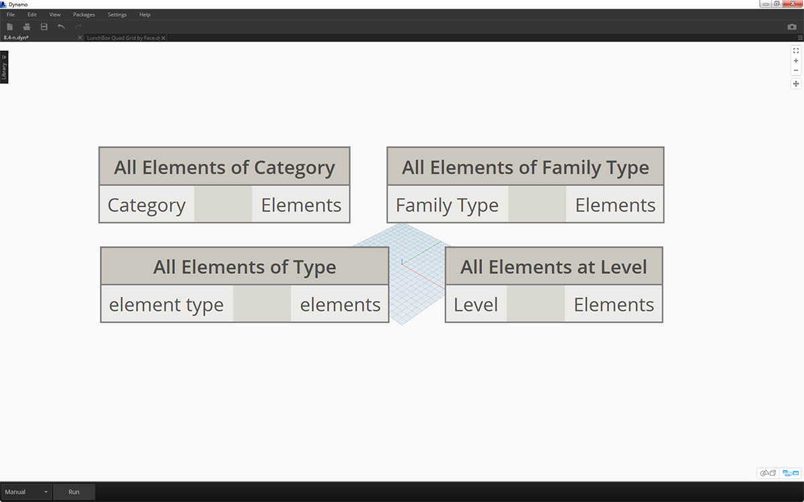

# 选择

### 选择 Revit 图元

Revit 是一个数据丰富的环境。这为我们提供了一系列选择功能，使其远超“点击”范围。我们可以查询 Revit 数据库，以及在执行参数化操作的同时将 Revit 图元动态链接到 Dynamo 几何图形。

UI 中的 Revit 库提供了“选择”类别，该类别允许通过多种方式选择几何图形。

还记得生物学的分类法吗？界、门类、类别、等级、族、属、种？Revit 图元以类似方式分类。在基本级别上，Revit 层次结构可以分解为“类别”、“族”、“类型*”和“实例”。 实例是一个模型图元（具有唯一 ID），而类别则定义常规组（如“墙”或“楼板”）。通过这种方式组织 Revit 数据库，我们可以选择一个图元，并根据层次结构中的指定级别选择所有相似图元。

*注意 - Revit 中的类型定义与编程中的类型不同。 在 Revit 中，类型是指层次结构的分支，而不是“数据类型”。

### 使用 Dynamo 节点进行数据库导航

下面的三幅图像对 Dynamo 中 Revit 图元选择的主要类别进行了细分。这些是可结合使用的优秀工具，我们将在以下练习中介绍其中一些工具。

_“点击”_是直接选择 Revit 图元的最简单方法。可以选择完整的模型图元或其一部分拓扑（如面或边）。这会保持与该 Revit 对象的动态链接，因此，当 Revit 文件更新其位置或参数时，参照的 Dynamo 图元将在图形中更新。

![](<.

_“下拉”菜单_在 Revit 项目中创建所有可访问图元的列表。可以使用此选项来参照在视图中不一定可见的 Revit 图元。这是一款优秀的工具，可用于查询现有图元或者在 Revit 项目或族编辑器中创建新图元。

![](<.

还可以在 _Revit 层次结构_中按特定层级选择 Revit 图元。这是一个功能强大的选项，可用于自定义大型数据阵列，以准备文档或衍生式实例化和自定义。

在上述三幅图像中，我们将深入探讨一个练习，该练习从基本 Revit 项目中选择图元，为我们将在本章的其余部分创建的参数化应用程序做好准备。

## 练习

> Download the example file by clicking on the link below.
>
> 可以在附录中找到示例文件的完整列表。



在此 Revit 文件示例中，我们有三种图元类型的简单建筑。我们将以此为例，在 Revit 层次结构的上下文中选择 Revit 图元：

![](<.

> 1. 建筑体量
> 2. 梁（结构框架）
> 3. 桁架（自适应构件）

基于 Revit 项目视图中当前的图元，我们可以得出哪些结论？我们需要在层次结构中向下行进多远来选择相应图元？当然，在处理大型项目时，这将成为一项更为复杂的任务。有许多可用选项：我们可以按“类别”、“标高”、“族”、“实例”等选择图元。

### Selecting Mass and Surfaces

![](<.

> 1. 由于我们使用的是基本设置，因此我们选择“类别”下拉节点中的_“体量”_来选择建筑体量。这可在 Revit >“选择”选项卡中找到。
> 2. “体量”类别的输出只是类别本身。我们需要选择相应图元。为此，我们使用_“所有类别图元”_节点。

请注意，此时我们在 Dynamo 中看不到任何几何图形。我们已选择 Revit 图元，但尚未将该图元转换为 Dynamo 几何图形。这是非常重要的差异。如果要选择大量图元，您不会希望在 Dynamo 中预览所有这些图元，因为这会降低所有操作的速度。Dynamo 是一款用于管理 Revit 项目的工具（无需执行几何图形操作），我们将在本章的下一部分中进行介绍。

在本例中，我们使用的是简单几何图形，因此我们希望将几何图形输入 Dynamo 预览。上述观察节点中的“BldgMass”旁边有一个绿色数字*。 这表示该图元的 ID，指示处理的是 Revit 图元，而不是 Dynamo 几何图形。下一步是在 Dynamo 中将此 Revit 图元转换为几何图形。

![](<.

> 1. Faces_ 节点，我们得到一个曲面列表，表示 Revit 体量的每个面。_ 现在，我们可以在 Dynamo 视口中看到几何图形，然后开始参照相应面进行参数化操作。

以下是另一种方法。在这种情况下，我们将不通过 Revit 层次结构_（“所有类别图元”）_进行选择，而是改为在 Revit 中明确选择几何图形。

![](<.

> 1. 使用_“选择模型图元”_节点，单击_“选择”_（或“更改”）按钮。 在 Revit 视口中，选择所需的图元。在本例中，我们选择的是建筑体量。
> 2. 我们可以使用 _Element.Geometry_ 将完整体量作为一个实体几何图形进行选择，而不是使用 _Element.Faces_。这将选择该体量中包含的所有几何图形。
> 3. 使用 _Geometry.Explode_，我们可以再次获得曲面列表。这两个节点的工作方式与 _Element.Faces_ 相同，但提供了用于深入到 Revit 图元的几何图形的替代选项。

使用一些基本列表操作，我们可以查询关注的面。

![](<.

> 1. First, output the selected elements from earlier to Element.Faces node.
> 2. 首先，_List.Count_ 节点显示我们正在处理体量中的 23 个曲面。
> 3. 参照此数字，我们将_整数滑块_的最大值更改为“22”。
> 4. 使用 _List.GetItemAtIndex_，我们为索引输入列表和_整数滑块_。 在选定内容之间滑动，直到到达_索引 9_ 并隔离将桁架用作主要外立面时，便停止。

上一步有点麻烦。我们可以使用_“选择面”_节点更快地完成此操作。这样，我们便可以隔离 Revit 项目中本身不是图元的面。除了我们选择曲面而非完整图元之外，与_“选择模型图元”_相同的交互也适用。

中的“冻结”部分。

在任何情况下，如果要输入 500 个梁，我们是否需要所有曲面都来执行所需的参数化操作？或者，我们是否可以从梁中提取基本信息，并使用基本几何图元执行衍生式任务？在学习本章时，我们要牢记这个问题。例如，我们来看一下桁架系统：

### Selecting Trusses

使用相同的节点图，选择桁架图元而不是梁图元。在执行此操作之前，请在上一步中删除 Element.Geometry。

![](<.

Next we are ready to extract some basic information from trusses family type.

![](<.

> 1. 在_观察_节点中，我们可以看到从 Revit 中选择的自适应构件列表。我们要提取基本信息，因此我们从自适应点开始操作。
> 2. 将_“所有族类型的图元”_节点连接到_“AdaptiveComponent.Location”_节点。这样，我们就得到了一列列表，每个列表都有三个点，这三个点代表自适应点的位置。
> 3. 连接_“Polygon.ByPoints”_节点将返回一条复合线。我们可以在 Dynamo 视口中看到这一结果。通过此方法，我们已可视化了一个图元的几何图形，并对其余图元阵列的几何图形进行了抽象处理（其数量可能大于本示例）。

*提示：如果在 Dynamo 中单击 Revit 图元的绿色数字，Revit 视口将缩放到该图元。

