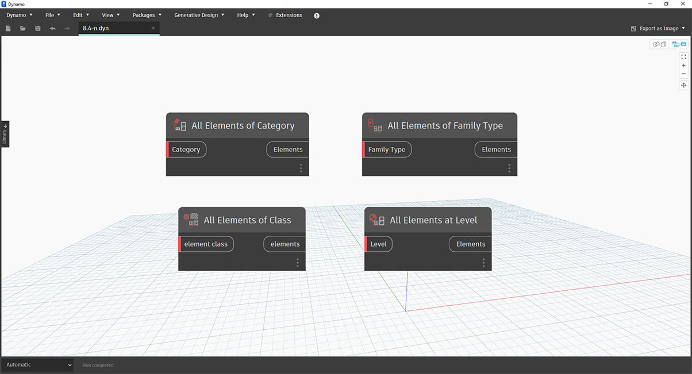

# Выбор

### Выбор элементов Revit

Revit — это насыщенная данными среда. Она поддерживает самые разные возможности выбора объектов, не ограничиваясь стандартным щелчком кнопкой мыши. Dynamo позволяет опрашивать базу данных Revit и динамически связывать элементы Revit с геометрией Dynamo во время выполнения параметрических операций.

Библиотека Revit, доступная в пользовательском интерфейсе, включает категорию Selection, которая предлагает несколько способов выбора геометрии.

### Иерархия Revit

Для использования правильного метода выбора элементов Revit необходимо иметь четкое представление об их иерархии. Необходимо выбрать все стены в проекте? Используйте выбор по категории. Требуется выбрать все кресла фирмы Eames для приемной в стиле 1950-х? Используйте выбор по семейству.

Кратко рассмотрим иерархию Revit.

Помните таксономические ранги, которые проходят на уроках биологии? Согласно им, все организмы в природе делятся на царства, типы, классы, порядки, семейства, рода и виды. Элементы Revit упорядочены аналогичным образом. На базовом уровне иерархию Revit можно разделить на категории, семейства, типы* и экземпляры. Экземпляр представляет собой отдельный элемент модели (с уникальным идентификатором), а категория определяет типовую группу (например, «стены» или «полы»). Такая организация базы данных Revit позволяет выбрать один элемент и все аналогичные ему элементы на основании указанного уровня иерархии.

 * Определение типов в Revit отличается от определения типов в программировании. В Revit термин «тип» относится к ветви иерархии, а не к типу данных. 

### Навигация по базе данных с помощью узлов Dynamo

На трех изображениях ниже представлены основные категории выбора элементов Revit в Dynamo. Эти инструменты прекрасно сочетаются друг с другом, в чем вы убедитесь при выполнении последующих упражнений.

_Щелчок кнопкой мыши_ — самый простой способ непосредственного выбора элементов в Revit. Таким образом можно выбрать весь элемент модели или части его топологии (например, грань или ребро). При этом сохраняется динамическая связь с объектом Revit, благодаря чему при обновлении местоположения или параметров файла Revit связанный элемент Dynamo также будет обновлен на графике.

_Раскрывающиеся меню_ отображают список всех доступных элементов в проекте Revit. Их можно использовать для задания ссылок на элементы Revit, которые могут не отображаться на виде. Это удобный инструмент для опроса существующих или создания новых элементов в проекте Revit или редакторе семейств.

Кроме того, элементы Revit можно выбирать по определенному уровню _иерархии Revit_. Это удобно при адаптации крупных массивов данных для подготовки документации или генеративного создания экземпляров и адаптации.

Теперь, когда вы ознакомились с приведенными выше изображениями, можно переходить к упражнению для выбора элементов базового проекта Revit, чтобы подготовиться к параметрическим операциям, которые вам предстоит создать в последующих разделах этой главы.

## Упражнение

> Скачайте файл примера, щелкнув указанную ниже ссылку.
>
> Полный список файлов примеров можно найти в приложении.



Данный файл примеров Revit содержит три типа элементов стандартного здания. Мы используем его в качестве примера для выбора элементов Revit в контексте иерархии Revit.

> 1. Формообразующий элемент здания
> 2. Балки (несущий каркас)
> 3. Фермы (адаптивные компоненты)

Какие выводы можно сделать на основе элементов, отображаемых на виде проекта Revit? Как глубоко в иерархии находятся соответствующие элементы? Чем масштабнее проект, тем сложнее найти ответы на подобные вопросы. Доступно множество вариантов: элементы можно выбирать по категориям, уровням, семействам, экземплярам и т. д.

### Выбор формообразующих элементов и поверхностей

> 1. Так как мы используем базовую настройку, выберите формообразующий элемент здания, щелкнув _Mass_ в раскрывающемся меню узла Categories. Эта функция также доступна на вкладке Revit > «Выбор».
> 2. На выходе узла категории Mass мы получаем только саму категорию. Необходимо выбрать элементы. Для этого используйте узел _All Elements of Category_.

Обратите внимание, что на этом этапе в Dynamo геометрия не отображается. Вы выбрали элемент Revit, но еще не преобразовали его в геометрию Dynamo. Важно различать эти операции. Когда требуется выбрать большое количество элементов, нежелательно отображать их все в Dynamo, так как это замедлит работу программы. Dynamo — это инструмент для управления проектом Revit без обязательного выполнения операций с геометрией. Мы остановимся на этом подробнее в следующем разделе главы.

В данном случае вы работаете с простой геометрией, поэтому ее вполне можно добавить в область предварительного просмотра Dynamo. Рядом с элементом BldgMass узла Watch отображается число, выделенное зеленым цветом. Это идентификатор элемента, который позволяет понять, что вы работаете с элементом Revit, а не геометрией Dynamo. Теперь необходимо преобразовать этот элемент Revit в геометрию Dynamo.

> 1. Используя узел _Element.Faces_, можно получить список поверхностей, представляющий все грани формообразующего элемента. Теперь можно просмотреть геометрию на видовом экране Dynamo и использовать грань как опорный элемент для параметрических операций.

Есть и другой способ. Вместо выбора с помощью иерархии Revit _(узел All Elements of Category)_ можно выбрать геометрию непосредственно в Revit.

> 1. В узле _Select Model Element_ щелкните кнопку *Select* (или _Change_). На видовом экране Revit выберите нужный элемент. В данном случае следует выбрать формообразующий элемент здания.
> 2. Вместо выбора с помощью узла _Element.Faces_ можно выбрать весь формообразующий элемент как единое геометрическое тело, применив _Element.Geometry_. При этом будет выбрана вся геометрия в пределах формообразующего элемента.
> 3. С помощью _Geometry.Explode_ можно снова сформировать список поверхностей. Эти два узла работают аналогично узлу _Element.Faces_, но содержат дополнительные параметры для изучения геометрии элемента Revit.

Используя базовые операции для списков, можно опросить нужную грань.

> 1. Сначала необходимо вывести выбранные элементы из предыдущего узла в узел Element.Faces.
> 2. Узел _List.Count_ показывает, что в пределах формообразующего элемента присутствует 23 поверхности.
> 3. Учитывая эти сведения, измените максимальное значение узла *Integer Slider* на _22_.
> 4. С помощью узла _List.GetItemAtIndex_ задайте списки в качестве входных данных и соедините *Integer Slider* с портом ввода _index_. Изменяя положение регулятора с выбранными элементами, остановитесь на _индексе 9_, когда будет изолирован главный фасад с фермами.

Предыдущий шаг был довольно трудоемким. Его можно выполнить гораздо проще и быстрее с помощью узла _Select Face_. Он позволяет изолировать в проекте Revit грань, которая не является самостоятельным элементом. Это же действие можно выполнить с помощью _Select Model Element_, выбрав поверхность вместо целого элемента.

Предположим, нужно изолировать стены главного фасада здания. Для этого можно использовать узел _Select Faces_. Нажмите кнопку выбора, а затем выберите четыре основных фасада в Revit.

Выбрав четыре стены, нажмите в Revit кнопку «Готово».

Грани импортируются в Dynamo в качестве поверхностей.

### Выбор балок

Теперь рассмотрим балки над атриумом.

> 1. С помощью узла _Select Model Element_ выберите одну из балок.
> 2. Соедините элемент балки с портом ввода узла _Element.Geometry_, после чего балка появится на видовом экране Dynamo.
> 3. С помощью узла _Watch 3D_ можно увеличить геометрию (если балка не отображается в Watch 3D, щелкните правой кнопкой мыши и выберите Zoom to Fit).

При работе в Revit и Dynamo часто возникает вопрос: как, выбрав один элемент, выделить все аналогичные элементы? Так как выбранный элемент Revit содержит всю иерархическую информацию, можно запросить его типоразмер в семействе и выбрать все элементы данного типа.

> 1. Соедините элемент балки с портом ввода узла _Element.ElementType_.
> 2. Изображение в узле _Watch_ показывает, что выходные данные теперь являются обозначением семейства, а не элементом Revit.
> 3. _Element.ElementType_ — это простой запрос, который можно легко выполнить в узле Code Block с помощью синтаксиса `x.ElementType;` и получить те же результаты.

> 1. Для выбора остальных балок используйте узел _All Elements of Family Type_.
> 2. Узел Watch показывает, что выбрано пять элементов Revit.

> 1. Эти пять элементов также можно преобразовать в геометрию Dynamo.

Что, если бы в проекте было 500 балок? Преобразование всех этих элементов в геометрию Dynamo заняло бы очень много времени. Если Dynamo требуется много времени для расчета узлов, возможно, следует воспользоваться функцией заморозки, чтобы приостановить выполнение операций Revit во время создания графика. Для получения дополнительных сведений о замораживании узлов см. раздел [Замораживание](../essential-nodes-and-concepts/5\_geometry-for-computational-design/5-6\_solids.md#freezing) в главе «Тела».

В любом случае, даже если бы мы и хотели импортировать 500 балок, нужны ли нам все поверхности для выполнения задуманной параметрической операции? Или же мы можем извлечь основную информацию из балок и выполнить генеративные задачи с помощью фундаментальной геометрии? Подумайте над этим вопросом, пока мы продолжаем разбирать данную главу. Для примера рассмотрим систему ферм.

### Выбор ферм

С помощью того же графика узлов выберите элемент фермы вместо балки. Перед этим удалите узел Element.Geometry, добавленный в предыдущем шаге.

Теперь можно извлечь основные сведения из типоразмера семейства ферм.

> 1. В узле _Watch_ отображается список адаптивных компонентов из Revit. Так как необходимо извлечь основную информацию, начните с адаптивных точек.
> 2. Соедините узел _All Elements of Family Type_ с узлом _AdaptiveComponent.Location_. В результате получится список списков, каждый из которых содержит три точки, представляющие местоположения адаптивных точек.
> 3. При присоединении узла _Polygon.ByPoints_ образуется сложная кривая. Она отображается на видовом экране Dynamo. Благодаря этому методу вы визуализировали геометрию одного элемента и абстрагировали геометрию оставшегося массива элементов (которых может быть больше, чем в данном примере).

 Совет. Если щелкнуть зеленый номер элемента Revit в Dynamo, масштаб этого элемента в видовом экране Revit будет увеличен. 
