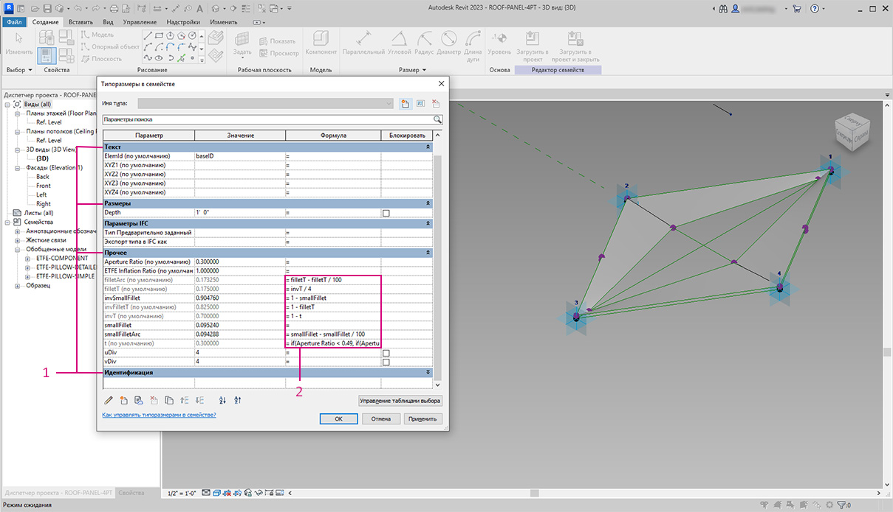

# 편집

Dynamo의 강력한 기능은 파라메트릭 수준에서 매개변수를 편집할 수 있다는 것입니다. 예를 들어 생성 알고리즘 또는 시뮬레이션 결과를 사용하여 요소 배열의 매개변수를 구동할 수 있습니다. 이렇게 하면 Revit 프로젝트에서 동일한 패밀리의 인스턴스 세트에 사용자 특성을 지정할 수 있습니다.

### 유형 및 인스턴스 매개변수

.jpg>)

> 1. 인스턴스 매개변수는 지붕 표면의 패널 조리개를 정의하며, 조리개 비율은 0.1에서 0.4 사이입니다.
> 2. 유형 기반 매개변수는 동일한 패밀리 유형이므로 표면의 모든 요소에 적용됩니다. 예를 들어, 각 패널의 재료는 유형 기반 매개변수로 구동될 수 있습니다.

> 1. 이전에 Revit 패밀리를 설정한 경우 매개변수 유형(문자열, 숫자, 치수 등)을 지정해야 합니다. Dynamo에서 매개변수를 지정할 때는 올바른 데이터 유형을 사용해야 합니다.
> 2. 또한 Dynamo를 Revit 패밀리의 특성에 정의된 파라메트릭 구속조건과 함께 사용할 수 있습니다.

Revit의 매개변수를 빠르게 검토하면 유형 매개변수와 인스턴스 매개변수가 있다는 것을 알 수 있습니다. 둘 다 Dynamo에서 편집할 수 있지만 아래 연습에서는 인스턴스 매개변수를 사용하겠습니다.

 편집 매개변수의 다양한 응용 방법을 알게 되면 Dynamo를 사용하여 Revit의 많은 요소를 편집해볼 수 있습니다. 이 작업은 _계산이 오래 걸리는_ 작업일 수 있습니다. 즉, 속도가 느릴 수 있습니다. 많은 수의 요소를 편집하는 경우 그래프를 개발하는 동안 Revit 작업 실행을 일시 중지하기 위해 노드 "동결" 기능을 사용할 수도 있습니다. 노드 동결에 대한 자세한 내용은 솔리드 장의 "[동결](../essential-nodes-and-concepts/5\_geometry-for-computational-design/5-6\_solids.md#freezing)" 섹션을 확인하십시오.

### 단위

버전 0.8부터 Dynamo에는 기본적으로 단위가 없습니다. 이를 통해 Dynamo에서는 추상적 시각적 프로그래밍 환경을 유지할 수 있습니다. Revit 치수와 상호 작용하는 Dynamo 노드에서는 Revit 프로젝트의 단위를 참조합니다. 예를 들어, Dynamo에서 Revit의 길이 매개변수를 설정하는 경우 Dynamo의 해당 값에는 Revit 프로젝트의 기본 단위가 적용됩니다. 아래의 연습에서는 미터를 사용합니다.

단위를 빠르게 변환하려면 _"Convert Between Units"_ 노드를 사용합니다. 이 노드는 길이, 면적 및 체적 단위를 즉시 변환하는 데 유용한 도구입니다.

## 연습

> 아래 링크를 클릭하여 예제 파일을 다운로드하십시오.
>
> 전체 예시 파일 리스트는 부록에서 확인할 수 있습니다.



 아래의 연습에서는 미터를 사용합니다. 

이 연습에서는 Dynamo에서 기하학적 작업을 수행하지 않고, Revit 요소를 편집하는 데 중점을 둡니다. 여기서는 Dynamo 형상을 가져오지 않고 Revit 프로젝트에서 매개변수를 편집하기만 합니다. 이 연습은 기본적인 연습이며, 고급 Revit 사용자의 경우 매스의 인스턴스 매개변수이더라도 동일한 논리를 요소 배열에 적용하여 대규모 축척에 맞게 사용자화할 수 있습니다. 이 모든 작업은 "Element.SetParameterByName" 노드에서 수행됩니다.

### 건물 매스 매개변수 편집

이 섹션의 Revit 파일 예시로 시작합니다. 이전 섹션에서 구조 요소 및 가변 트러스를 제거했습니다. 이 연습에서는 Revit의 파라메트릭 리그와 Dynamo의 조작을 집중적으로 살펴보겠습니다.

Revit의 매스에서 건물을 선택하면 특성 패널에 인스턴스 매개변수의 배열이 표시됩니다.

Dynamo에서는 대상 요소를 선택하여 매개변수를 검색할 수 있습니다.

> 1. _"Select Model Element"_ 노드를 사용하여 건물 매스를 선택합니다.
> 2. _"Element.Parameters"_ 노드를 사용하여 이 매스의 모든 매개변수를 조회할 수 있습니다. 여기에는 유형 및 인스턴스 매개변수가 포함됩니다.

> 1. _Element. Parameters_ 노드를 참조하여 대상 매개변수를 찾습니다. 또는 이전 단계의 특성 패널을 보고, 편집하려는 매개변수 이름을 선택할 수 있습니다. 이 경우 건물 매스에서 대규모 형상 이동에 영향을 미치는 매개변수를 찾습니다.
> 2. _Element.SetParameterByName_ 노드를 사용하여 Revit 요소를 변경해 보겠습니다.
> 3. C_ode Block_을 사용하여 매개변수 리스트를 정의하고 각 항목을 따옴표로 묶어 문자열을 나타냅니다. 또한 일련의 _"string"_ 노드가 여러 입력에 연결되어 있는 List.Create 노드를 사용할 수 있지만 Code block이 더 빠르고 쉽습니다. Revit에서 문자열이 대/소문자를 구분하여 정확한 이름과 일치하는지 확인합니다. `{"BldgWidth","BldgLength","BldgHeight", "AtriumOffset", "InsideOffset","LiftUp"};`

> 1. 각 매개변수의 값을 지정할 수도 있습니다. 캔버스에 6개의 _"integer sliders"_ 를 추가하고 리스트의 해당 매개변수로 이름을 바꿉니다. 또한 각 슬라이더의 값을 위 이미지로 설정합니다. 하향식 순서: 62,92,25,22,8,12
> 2. 매개변수 이름과 동일한 길이의 리스트를 사용하여 다른 _code block_ 을 정의합니다. 이 경우 _code block_ 에 대해 입력을 작성하는 변수(따옴표 제외) 이름을 지정합니다. 각 개별 입력에 _slider_ 를 연결합니다. `{bw,bl,bh,ao,io,lu};`
> 3. Code Block을 _"Element.SetParameterByName"*_ 값 입력에 연결합니다. 자동으로 실행을 선택하면 결과가 자동으로 표시됩니다.

 *이 예시는 인스턴스 매개변수에서는 작동하지만 유형 매개변수에서는 작동하지 않습니다. 

Revit에서와 마찬가지로 이러한 매개변수 중 다수는 서로 종속됩니다. 물론 형상이 끊어질 수도 있는 결합도 있습니다. 매개변수 특성의 정의된 수식에서 이 문제를 해결하거나 Dynamo에서 수학 연산을 사용하여 유사한 논리를 설정할 수 있습니다(이는 연습 범위를 확장하려는 경우 추가로 수행해야 하는 과제임).

> 1. 이러한 결합을 통해 건물 매스에 멋진 새 설계가 제공됩니다. 100, 92, 100, 25, 13, 51

### 정면 매개변수 편집

다음으로, 유사한 프로세스를 사용하여 정면을 편집하는 방법을 살펴보겠습니다.

> 1. 그래프를 복사하여 트러스 시스템을 하우징할 정면 유리에 집중해 봅니다. 이 경우 다음 네 개의 매개변수를 분리합니다. `{"DblSkin_SouthOffset","DblSkin_MidOffset","DblSkin_NorthOffset","Facade Bend Location"};`
> 2. 또한 _number sliders_ 를 작성하고 적절한 매개변수로 이름을 바꿉니다. 하향식의 처음 3개의 슬라이더는 [0,10] 도메인에 다시 매핑되어야 하지만 최종 슬라이더인 _"Facade Bend Location"_ 은 [0,1] 도메인에 다시 매핑되어야 합니다. 이러한 하향식 값은 다음과 같은 값으로 시작해야 합니다(임의의 값임). 2.68, 2.64, 2.29, 0.5
> 3. 새 Code block을 정의하고 슬라이더를 연결합니다. `{so,mo,no,fbl};`

> 1. 그래프의 이 부분에서 _sliders_ 를 변경하여 정면 유리를 훨씬 더 크게 만들 수 있습니다. 9.98, 10.0, 9.71 ,0.31
