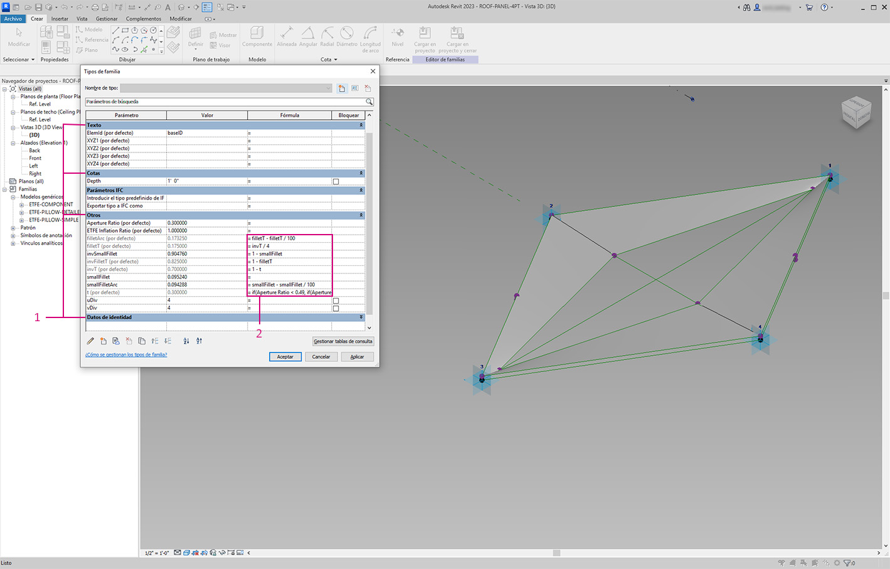

# Edición

Una característica útil de Dynamo es la posibilidad de editar parámetros en un nivel paramétrico. Por ejemplo, se puede utilizar un algoritmo generativo o los resultados de una simulación para controlar los parámetros de una matriz de elementos. De este modo, un conjunto de ejemplares de la misma familia puede tener propiedades personalizadas en el proyecto de Revit.

### Parámetros de tipo y ejemplar

.jpg>)

> 1. Los parámetros de ejemplar definen la apertura de los paneles en la superficie de la cubierta, desde una proporción de apertura de 0,1 a 0,4.
> 2. Los parámetros basados en tipo se aplican a todos los elementos de la superficie porque son del mismo tipo de familia. El material de cada panel, por ejemplo, puede controlarse mediante un parámetro basado en tipo.

> 1. Si ha configurado una familia de Revit con anterioridad, recuerde que debe asignar un tipo de parámetro (cadena, número, cota, etc.). Asegúrese de utilizar el tipo de datos correcto al asignar parámetros de Dynamo.
> 2. También puede utilizar Dynamo en combinación con restricciones paramétricas definidas en las propiedades de una familia de Revit.

Como revisión rápida de los parámetros en Revit, recordemos que existen parámetros de tipo y parámetros de ejemplar. Ambos se pueden editar en Dynamo, pero trabajaremos con parámetros de ejemplar en el ejercicio siguiente.


A medida que descubra la amplia aplicación de la edición de parámetros, puede que desee editar una gran cantidad de elementos en Revit con Dynamo. Esta puede ser una operación _computacionalmente exigente_, lo que significa que puede ser lenta. Si va a editar un gran número de elementos, puede usar la función de nodo "Bloquear" para poner en pausa la ejecución de operaciones de Revit mientras desarrolla el gráfico. Para obtener más información sobre el bloqueo de nodos, consulte la sección "[Bloqueo](../essential-nodes-and-concepts/5\_geometry-for-computational-design/5-6\_solids.md#freezing)" del capítulo sobre sólidos.


### Unidades

A partir de la versión 0.8, Dynamo prácticamente no trabaja con unidades. Esto permite que Dynamo siga siendo un entorno de programación visual abstracto. Los nodos de Dynamo que interactúan con las cotas de Revit harán referencia a las unidades del proyecto de Revit. Por ejemplo, si configura un parámetro de longitud en Revit desde Dynamo, el número del valor en Dynamo se corresponderá con las unidades por defecto del proyecto de Revit. El siguiente ejercicio utiliza metros.

Para obtener una conversión rápida de unidades, utilice el nodo _"Convert Between Units"_. Esta es una herramienta práctica para convertir unidades de longitud, área y volumen sobre la marcha.

## Ejercicio:

> Descargue el archivo de ejemplo. Para ello, haga clic en el vínculo siguiente.
>
> En el Apéndice, se incluye una lista completa de los archivos de ejemplo.




En el siguiente ejercicio, se utilizan metros.


Este ejercicio se centra en la edición de elementos de Revit sin realizar operaciones geométricas en Dynamo. No vamos a importar la geometría de Dynamo aquí, solo vamos a editar los parámetros de un proyecto de Revit. Este ejercicio es básico; para los usuarios más avanzados de Revit, observe que se trata de parámetros de ejemplar de una masa, pero la misma lógica se puede aplicar a una matriz de elementos para personalizarlos a gran escala. Esto se realiza con el nodo "Element.SetParameterByName".

### Edición de parámetros de masa de edificio

Empiece con el archivo de ejemplo de Revit para esta sección. Hemos eliminado los elementos estructurales y las vigas de celosía adaptativas de la sección anterior. En este ejercicio, nos centraremos en una manipulación paramétrica en Revit y en la manipulación en Dynamo.

Al seleccionar el edificio dentro de Masa en Revit, vemos una matriz de parámetros de ejemplar en el panel Propiedades.

En Dynamo, podemos recuperar los parámetros mediante la selección del elemento de destino.

> 1. Seleccione la masa de construcción con el nodo _Select Model Element"_.
> 2. Se pueden consultar todos los parámetros de esta masa mediante el nodo _"Element.Parameters"_. Esto incluye los parámetros de tipo y ejemplar.

> 1. Consulte el nodo _Element. Parameters_ para buscar los parámetros de destino. También podemos ver el panel Propiedades del paso anterior para elegir los nombres de parámetro que deseamos editar. En este caso, buscamos los parámetros que afectan a los grandes movimientos geométricos en la masa de construcción.
> 2. Realizaremos cambios en el elemento de Revit mediante el nodo _Element.SetParameterByName_.
> 3. Utilice un b\_loque de código para\_ definir una lista de parámetros con cada elemento entre comillas para indicar una cadena. También podemos utilizar el nodo List.Create con una serie de nodos _"string"_ conectados a varias entradas, pero el uso de un bloque de código es más rápido y sencillo. Asegúrese de que la cadena coincida con el nombre exacto de Revit teniendo en cuenta mayúsculas y minúsculas: `{"BldgWidth","BldgLength","BldgHeight", "AtriumOffset", "InsideOffset","LiftUp"};`

> 1. También vamos a designar valores para cada parámetro. Añada seis _"controles deslizantes de enteros"_ al lienzo y cambie el nombre de estos al parámetro correspondiente de la lista. Asimismo, defina los valores de cada control deslizante a los que se pueden ver en la imagen anterior. Por orden de arriba a abajo: 62,92,25,22,8,12.
> 2. Defina otro _bloque de código_ con una lista de la misma longitud que los nombres de parámetro. En este caso, se asignan nombres a las variables (sin comillas) que crean entradas para el _bloque de código._Conecte los _controles deslizantes_ a cada entrada respectiva: `{bw,bl,bh,ao,io,lu};`
> 3. Conecte el bloque de código _a la entrada de valor "Element.SetParameterByName"\*_. Con opción Ejecutar automáticamente seleccionada, veremos los resultados automáticamente.


\* Esta demostración funciona con parámetros de ejemplar, pero no con parámetros de tipo.


Al igual que en Revit, muchos de estos parámetros dependen unos de otros. Por supuesto, existen combinaciones en las que la geometría se puede partir. Podemos solucionar este problema con las fórmulas definidas en las propiedades de los parámetros, o bien podemos configurar una lógica similar con operaciones matemáticas en Dynamo (este es un reto adicional si desea ampliar el ejercicio).

> 1. Esta combinación proporciona un nuevo diseño con estilo a la masa de construcción: 100, 92, 100, 25, 13, 51.

### Edición de parámetros de fachada

A continuación, veamos cómo podemos editar la fachada mediante un proceso similar.

> 1. Copie el gráfico y céntrese en la cristalera de la fachada que alojará el sistema de vigas de celosía. En este caso, se aíslan cuatro parámetros: `{"DblSkin_SouthOffset","DblSkin_MidOffset","DblSkin_NorthOffset","Facade Bend Location"};`.
> 2. Además, creamos _controles deslizantes de número_ y les cambiamos el nombre por los parámetros adecuados. Los tres primeros controles deslizantes empezando por arriba deben asignarse de nuevo a un dominio de \[0,10], mientras que el control deslizante final, _"Facade Bend Location"_, se debe asignar de nuevo a un dominio de \[0,1]. Estos elementos, de arriba a abajo, deben empezar con estos valores (aunque son arbitrarios): 2,68, 2,64, 2,29, 0,5.
> 3. Defina un nuevo bloque de código y conecte los controles deslizantes: `{so,mo,no,fbl};`

> 1. Al cambiar los _controles deslizantes_ en esta parte del gráfico, podemos hacer que la cristalera de la fachada sea mucho más sustancial: 9,98, 10,0, 9,71, 0,31.
