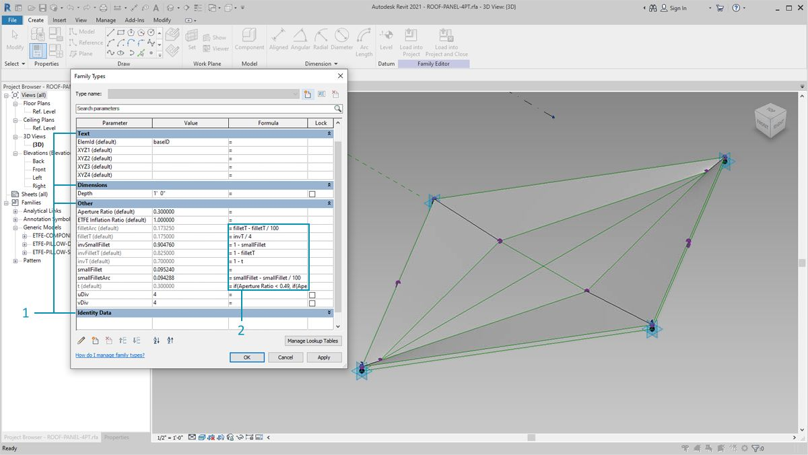

# 編集

Dynamo には、パラメトリック レベルでパラメータを編集するための強力な機能が用意されています。たとえば、生成アルゴリズムやシミュレーションの結果を使用して、要素の配列のパラメータをコントロールすることができます。この方法で、同じファミリのインスタンスの集合に、Revit プロジェクトのカスタム プロパティを設定することができます。

### タイプ パラメータとインスタンス パラメータ

.jpg>)

> 1. インスタンス パラメータは、0.1 ～ 0.4 の開口率で、屋根サーフェス上のパネルの開口部を定義します。
> 2. タイプベースのパラメータは、サーフェス上のすべての要素に適用されます。これらの要素は同じファミリ タイプであるためです。たとえば、各パネルのマテリアルをタイプベースのパラメータによってコントロールすることができます。

> 1. これまでに Revit ファミリを使用したことがあれば、文字列、数値、寸法などのパラメータ タイプを指定する必要があることはわかるでしょう。Dynamo からパラメータを割り当てる場合は、必ず正しいデータ タイプを使用してください。
> 2. また、Revit ファミリのプロパティで定義されたパラメトリック拘束と組み合わせて Dynamo を使用することもできます。

Revit のパラメータの簡単な復習として、タイプ パラメータとインスタンス パラメータの 2 種類があることを思い出してください。両方とも Dynamo で編集できますが、次の演習ではインスタンス パラメータを使用します。


編集するパラメータの用途は幅広いため、Revit と Dynamo を併用すると、多くの要素を編集することができます。これは_計算量が多い_演算であるため、速度が低下することがあります。 多くの要素を編集する場合は、ノードを「フリーズ」する機能を使用して、グラフの作成中に Revit に関連した操作の実行を一時的に停止することをお勧めします。ノードをフリーズする操作の詳細については、「ソリッド」の章の「[フリーズ](../essential-nodes-and-concepts/5\_geometry-for-computational-design/5-6\_solids.md#freezing)」セクションを参照してください。

### 単位

バージョン 0.8 以降、基本的に Dynamo では単位が使用されなくなりました。これにより、抽象的なビジュアル プログラミング環境が実現します。Revit の寸法を使用する Dynamo のノードは、Revit プロジェクトの単位を参照します。 たとえば、Revit の長さパラメータを Dynamo で設定する場合、Dynamo の数値は Revit プロジェクトの既定の単位に対応します。次の演習では、メートル単位の数値を操作します。

単位を素早く変換するには、_Convert Between Units_ ノードを使用します。 このノードは、長さ、面積、体積の単位をその場で変換できる便利なツールです。

## 演習

> 下のリンクをクリックして、サンプル ファイルをダウンロードします。
>
> すべてのサンプルファイルの一覧については、付録を参照してください。




次の演習では、メートル単位の数値を操作します。


この演習では、Dynamo でジオメトリ操作を実行することなく Revit 要素を編集します。Dynamo ジオメトリを読み込まず、Revit プロジェクトで直接パラメータを編集します。これは基本的な演習です。Revit の上級ユーザであれば、次の図のパラメータはマスのインスタンス パラメータであることがわかるでしょう。同じロジックを要素の配列に適用し、大規模なカスタマイズを行うことができます。これは、すべて Element.SetParameterByName ノードで行います。

### 建物マスのパラメータを編集する

このセクションでは、最初にサンプルの Revit ファイルを使用します。構造要素とアダプティブ トラスは、前のセクションで削除されました。この演習では、Revit のパラメータ機能を確認しながら、Dynamo で操作を行います。

Revit で建物のマスを選択すると、プロパティ パネルにインスタンス パラメータの配列が表示されます。

Dynamo では、ターゲット要素を選択してパラメータを取得することができます。

> 1. _Select Model Element_ ノードを使用して、建物のマスを選択します。
> 2. _Element.Parmaters_ ノードを使用して、このマスのすべてのパラメータのクエリーを実行することができます。 パラメータには、タイプ パラメータとインスタンス パラメータがあります。

> 1. _ 要素を参照します。Parameters_ ノードをクリックして、ターゲット パラメータを検索します。または、前の手順のプロパティ パネルを表示して、編集するパラメータ名を選択することもできます。この場合、建物のマスの形状に大きく影響するパラメータを探す必要があります。
> 2. _Element.SetParameterByName_ ノードを使用して、Revit 要素に変更を加えます。
> 3. Code Block ノードを使用してパラメータ リストを定義します。各アイテムを引用符で囲んで文字列を示します。List.Create ノードを複数の入力に接続された一連の「_文字列_」ノードとともに使用することもできますが、Code Block ノードを使用すると処理が高速かつ簡単になります。文字列が Revit の名前と一致していることを確認します(大文字と小文字は区別されます)。`{"BldgWidth","BldgLength","BldgHeight", "AtriumOffset", "InsideOffset","LiftUp"};`

> 1. 各パラメータの値を指定します。_Integer Slider_ ノードを 6 つキャンバスに追加し、リスト内のパラメータに合わせて名前を変更します。 また、各スライダの値を上の図のように設定します。上から下に、62、92、25、22、8、12 の順で設定します。
> 2. パラメータ名の数と同じ長さのリストを使用して、別の _Code Block_ ノードを定義します。 その際、Code Block ノードの入力を作成する変数の名前を、引用符を使用せずに入力します。__それぞれの入力に_スライダ_を接続します。`{bw,bl,bh,ao,io,lu};`
> 3. Code Block ノードを _「Element.SetParameterByName」\*_ の入力値に接続します。[自動実行]をオンにすると、結果が自動的に表示されます。


\*このデモンストレーションは、インスタンス パラメータには対応していますが、タイプ パラメータには対応していません。


Revit と同様に、これらのパラメータの多くは相互に依存関係があります。これらの中には、ジオメトリが壊れてしまう組み合わせもあります。この問題を解決するには、定義済みの式をパラメータ プロパティで使用するか、Dynamo の数値演算で同様のロジックを設定します。余裕があれば、この演習の追加の課題として取り組んでみてください。

> 1. 100、92、100、25、13、51 という組み合わせにより、特徴的な新しいデザインが建物のマスに追加されます。

### ファサードのパラメータを編集する

次に、同様のプロセスを使用してファサードを編集する方法について説明します。

> 1. グラフをコピーして、トラス システムを格納するファサード ガラスを確認します。この場合、4 つのパラメータを分離します。`{"DblSkin_SouthOffset","DblSkin_MidOffset","DblSkin_NorthOffset","Facade Bend Location"};`
> 2. また、_Number Slider_ ノードを使用して、対応するパラメータに合わせて名前を変更します。 上から 3 つのスライダは\[0,10]の範囲に再マップし、一番下のスライダ(_Facade Bend Location_)は\[0,1]の範囲に再マップします。次に、これらの値を 2.68、2.64、2.29、0.5 にそれぞれ設定します(実際は任意です)。
> 3. 新しい Code Block ノードを定義し、スライダを接続します。`{so,mo,no,fbl};`

> 1. グラフのこの部分の各 _Number Slider_ ノードの値をそれぞれ 9.98、10.0、9.71、0.31 に変更すると、ファサード ガラスがさらにがっしりとした形状になります。
