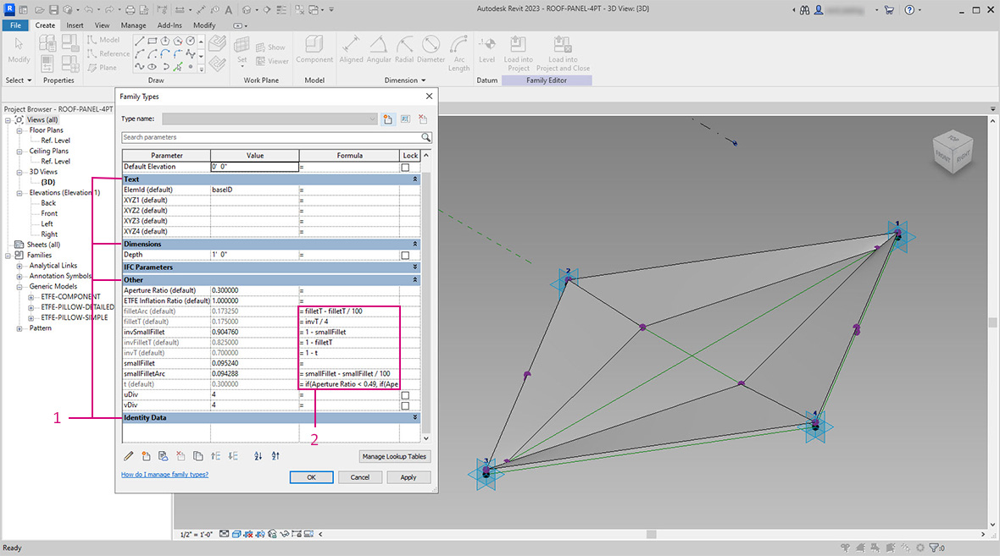
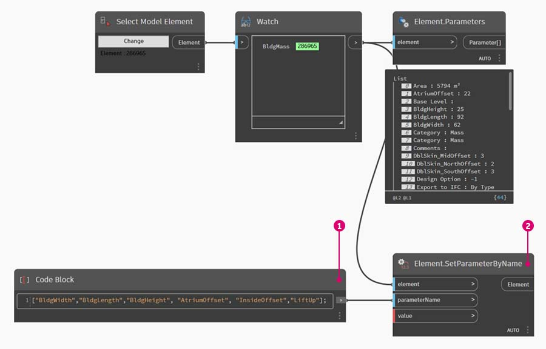

# Edytowanie

Zaawansowaną funkcją dodatku Dynamo jest możliwość edycji parametrów na poziomie parametrycznym. Na przykład algorytm generatywny lub wyniki symulacji mogą być używane do sterowania parametrami szyku elementów. W ten sposób zestaw wystąpień z tej samej rodziny może mieć niestandardowe właściwości w projekcie programu Revit.

### Parametry typu i wystąpienia

\.jpg>)

> 1. Parametry wystąpienia definiują aperturę paneli na powierzchni dachu, od współczynnika apertury 0,1 do 0,4.
> 2. Parametry oparte na typie są stosowane do każdego elementu na powierzchni, ponieważ mają one ten sam typ rodziny. Na przykład materiał każdego panelu może być sterowany przez parametr oparty na typie.

> 1. Jeśli wcześniej skonfigurowano rodzinę programu Revit, należy pamiętać, że trzeba przypisać typ parametru (ciąg, liczbę, wymiar itp.). Podczas przypisywania parametrów z poziomu dodatku Dynamo należy używać odpowiedniego typu danych.
> 2. Dodatku Dynamo można również używać w połączeniu z wiązaniami parametrycznymi zdefiniowanymi we właściwościach rodziny programu Revit.

Jeśli chodzi o parametry w programie Revit, występują w nim parametry typu i parametry wystąpienia. Oba typy można edytować z poziomu dodatku Dynamo, ale w ćwiczeniu poniżej będziemy pracować z parametrami wystąpienia.

 Po zapoznaniu się z szeroką gamą zastosowań edycji parametrów można edytować dużą liczbę elementów w programie Revit za pomocą dodatku Dynamo. Może to być _kosztowna pod względem obliczeń_ operacja, co oznacza, że może być powolna. W przypadku edytowania dużej liczby elementów można użyć funkcji zablokowania węzła, aby wstrzymać wykonywanie operacji programu Revit podczas tworzenia wykresu. Aby uzyskać więcej informacji na temat blokowania węzłów, zobacz sekcję [„Blokowanie”](../5\_essential\_nodes\_and\_concepts/5-2\_geometry-for-computational-design/6-solids.md) w rozdziale poświęconym bryłom. 

### Jednostki

Od wersji 0.8 dodatek Dynamo jest zasadniczo pozbawiony jednostek. Dzięki temu dodatek Dynamo pozostaje abstrakcyjnym środowiskiem programowania wizualnego. Węzły Dynamo, które wchodzą w interakcje z wymiarami programu Revit, będą odnosiły się do jednostek projektu programu Revit. Na przykład w razie ustawiania z poziomu dodatku Dynamo parametru długości w programie Revit ta liczba w dodatku Dynamo będzie wyrażona w domyślnych jednostkach w projekcie programu Revit. W ćwiczeniu poniżej używane są metry.

Aby szybko przekształcić jednostki, użyj węzła _„Convert Between Units”_. Jest to przydatne narzędzie do przekształcania jednostek długości, powierzchni i objętości na bieżąco.

## Ćwiczenie

> Pobierz plik przykładowy, klikając poniższe łącze.
>
> Pełna lista plików przykładowych znajduje się w załączniku.



 W ćwiczeniu poniżej używane są metry. 

W tym ćwiczeniu skupiono się na edycji elementów programu Revit bez wykonywania operacji geometrycznej w dodatku Dynamo. Nie importujemy tutaj geometrii dodatku Dynamo, a jedynie edytujemy parametry w projekcie programu Revit. To ćwiczenie jest podstawowe. Bardziej zaawansowani użytkownicy programu Revit powinni zwrócić uwagę na to, że choć używane są tu parametry wystąpienia bryły, ta sama logika może być stosowana do szyku elementów w celu dostosowywania ich w dużej skali. Wszystkie te operacje wykonuje się za pomocą węzła „Element.SetParameterByName”.

### Edytowanie parametrów brył budynku

Rozpocznij od przykładowego pliku programu Revit dla tej sekcji. Usunięto elementy konstrukcyjne i kratownice adaptacyjne z poprzedniej sekcji. W tym ćwiczeniu skoncentrujemy się na obsłudze parametrów w programie Revit i manipulowaniu w dodatku Dynamo.

Po wybraniu budynku w obszarze Bryła w programie Revit zostanie wyświetlony szyk parametrów wystąpienia w panelu właściwości.

W dodatku Dynamo można pobrać parametry, wybierając element kierowania.

> 1. Wybierz bryłę budynku za pomocą węzła _„Select Model Element”_.
> 2. Za pomocą węzła _„Element.Parameters”_ możemy stosować zapytania dotyczące wszystkich parametrów tej bryły. Obejmuje to parametry typu i wystąpienia.

> 1. Sprawdź węzeł _Element. Parameters_, aby znaleźć parametry docelowe. Można również wyświetlić panel właściwości z poprzedniego kroku, aby wybrać nazwy parametrów do edycji. W tym przypadku szukamy parametrów, które mają wpływ na duże przesunięcia geometryczne bryły budynku.
> 2. Wprowadzimy zmiany w elemencie programu Revit za pomocą węzła _Element.SetParameterByName_
> 3. Używając węzła C_ode Block,_ zdefiniuj listę parametrów, ujmując każdy z nich w cudzysłowy, aby wskazać, że są to ciągi. Można również użyć węzła List.Create z serią węzłów _„string”_ połączonych z wieloma wejściami, ale użycie węzła Code Block jest szybsze i łatwiejsze. Należy się jednak upewnić, że ciąg jest w pełni zgodny z nazwą w programie Revit (z uwzględnieniem wielkości liter): `{"BldgWidth","BldgLength","BldgHeight", "AtriumOffset", "InsideOffset","LiftUp"};`

> 1. Chcemy również wyznaczyć wartości dla każdego parametru. Dodaj do obszaru rysunku sześć węzłów _Integer Slider_ i zmień ich nazwy na nazwy odpowiednich parametrów na liście. Ustaw też wartości każdego z tych suwaków zgodnie z powyższą ilustracją. W kolejności od góry do dołu: 62, 92, 25, 22, 8, 12
> 2. Zdefiniuj kolejny węzeł _Code Block_ z listą o długości zgodnej z nazwami parametrów. W tym przypadku nazwiemy zmienne (bez cudzysłowów) tworzące wejścia dla węzła _Code Block_. Podłącz _suwaki_ do odpowiednich wejść: `{bw,bl,bh,ao,io,lu};`
> 3. Połącz węzeł Code Block z wejściem wartości _„Element.SetParameterByName”*_. Gdy jest zaznaczona opcja automatycznego uruchamiania, wyniki zostaną wyświetlone automatycznie.

 *Ten pokaz działa z parametrami wystąpienia, ale nie z parametrami typu. 

Podobnie jak w programie Revit, wiele z tych parametrów jest od siebie zależnych. Istnieją oczywiście takie kombinacje, przy których geometria może się załamać. Można rozwiązać ten problem z użyciem zdefiniowanych formuł we właściwościach parametru lub skonfigurować podobną logikę z operacjami matematycznymi w dodatku Dynamo (jest to dodatkowe wyzwanie dla osób, które chcą rozszerzyć to ćwiczenie).

> 1. Ta kombinacja nadaje bryle budynku nowy, interesujący wygląd: 100, 92, 100, 25, 13, 51

### Edytowanie parametrów fasady

Teraz przyjrzyjmy się temu, jak można edytować fasadę przy użyciu podobnego procesu.

> 1. Skopiuj wykres i skup się na oszkleniu fasady, które będzie zawierać system kratownicowy. W tym przypadku wyodrębnimy cztery parametry: `{"DblSkin_SouthOffset","DblSkin_MidOffset","DblSkin_NorthOffset","Facade Bend Location"};`
> 2. Dodatkowo utworzymy węzły _Number Slider_ i zmienimy ich nazwy na nazwy odpowiednich parametrów. Pierwsze trzy suwaki od góry do dołu powinny zostać ponownie odwzorowane na domenę [0,10], natomiast ostatni suwak — _„Facade Bend Location”_ — powinien zostać ponownie odwzorowany na domenę [0,1]. Te wartości, od góry do dołu, powinny zaczynać się od tych (chociaż są dowolne): 2,68, 2,64, 2,29, 0,5
> 3. Zdefiniuj nowy węzeł Code Block i połącz suwaki: `{so,mo,no,fbl};`

> 1. Zmieniając _suwaki_ w tej części wykresu, możemy znacznie wzmocnić oszklenie fasady: 9,98, 10,0, 9,71, 0,31
