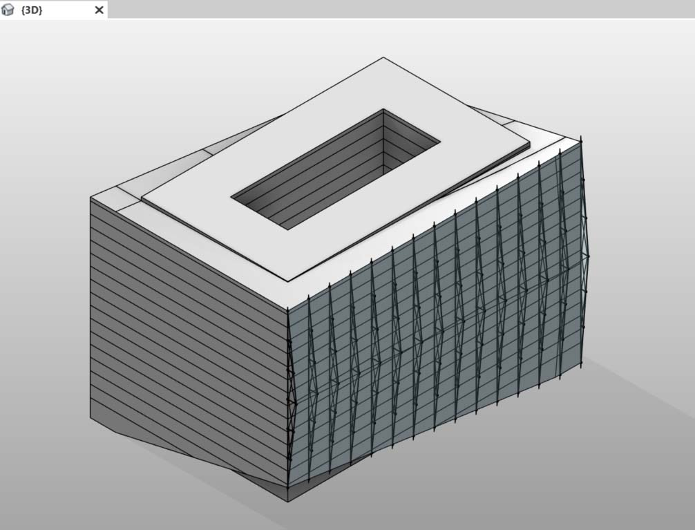

# Tvorba

V aplikaci Dynamo můžete pomocí plně parametrického ovládání vytvořit pole prvků aplikace Revit. Uzly aplikace Revit v aplikaci Dynamo nabízí možnost importovat prvky z obecných geometrií do určitých typů kategorií (například stěny a podlaží). V této části se zaměříme na import parametricky flexibilních prvků s adaptivními komponentami.

### Adaptivní komponenty

Adaptivní komponenta je flexibilní kategorie rodiny, která se dobře hodí ke generativním aplikacím. Po vytvoření instance můžete vytvořit složitý geometrický prvek, který je řízen základním umístěním adaptivních bodů.

Níže je uveden příklad tříbodové adaptivní komponenty v Editoru rodin. Tím se vytvoří příhradový nosník, který je definován pozicí každého adaptivního bodu. V níže uvedeném cvičení vygenerujeme pomocí této komponenty sérii příhradových nosníků přes celé průčelí.

### Principy interoperability

Adaptivní komponenta je dobrým příkladem doporučených postupů interoperability. Pole adaptivních komponent je možné vytvořit definováním základních adaptivních bodů. A při přenosu těchto dat do jiných programů existuje možnost zredukovat geometrii na jednoduchá data. Import a export pomocí programu, jako je například aplikace Excel, se řídí podobnou logikou.

Řekněme, že konzultant průčelí chce znát umístění prvků příhradových nosníků, aniž by bylo třeba počítat s plně kloubovou geometrií. Při přípravě výroby se může konzultant odkazovat na umístění adaptivních bodů a regenerovat geometrii v programech, jako je Inventor.

Pracovní postup použitý v níže uvedeném cvičení umožňuje přístup ke všem těmto datům při tvorbě definice pro tvorbu prvků aplikace Revit. Tímto procesem sjednotíme konceptualizaci, dokumentaci a výrobu do jednoho plynulého pracovního postupu. Tímto se vytvoří inteligentnější a efektivnější proces pro interoperabilitu.

### Více prvků a seznamů

[První cvičení](4-creating.md#exercise-generate-elements-and-lists) níže znázorňuje, jak aplikace Dynamo odkazuje na data pro tvorbu prvků aplikace Revit. Chcete-li vytvořit více adaptivních komponent, definujte seznam seznamů, kde každý seznam obsahuje tři body představující každý bod adaptivní komponenty. Toto mějte na paměti při správě datových struktur v aplikaci Dynamo.

### Prvky přímých tvarů

Další metodou importu parametrické geometrie aplikace Dynamo do aplikace Revit je DirectShape. V souhrnu prvek DirectShape a související třídy podporují možnost externě ukládat vytvořené geometrické tvary do dokumentu aplikace Revit. Geometrie může obsahovat uzavřená tělesa nebo sítě. Prvek DirectShape je primárně určen k importu tvarů z jiných datových formátů, například IFC nebo STEP, kde není k dispozici dostatek informací k vytvoření „skutečného“ prvku aplikace Revit. Prvek DirectShape, podobně jako u pracovního postupu formátů IFC a STEP, funguje dobře při importu geometrií vytvořených v aplikaci Dynamo do projektů aplikace Revit jako skutečných prvků.

Nyní následuje rozbor a [druhé cvičení](4-creating.md#exercise-directshape-elements) týkající se importu geometrie aplikace Dynamo jako prvku DirectShape do projektu aplikace Revit. Pomocí této metody můžeme přiřadit importované geometrii kategorii, materiál a název – to vše při zachování parametrického propojení s grafem aplikace Dynamo.

## Cvičení: Generování prvků a seznamů

> Kliknutím na odkaz níže si stáhněte vzorový soubor.
>
> Úplný seznam vzorových souborů najdete v dodatku.



Počínaje tímto souborem příkladu z této části (případně pokračováním v práci se souborem aplikace Revit v předchozí relaci) se zobrazuje stejný objem aplikace Revit.

> 1. Takto soubor vypadá po otevření.
> 2. Toto je systém příhradových nosníků vytvořený pomocí aplikace Dynamo, který je inteligentně propojen s objemem aplikace Revit.

Byly použity uzly _Select Model Element_ a _Select Face_ a nyní pokračujeme o jeden krok v hierarchii geometrie níže a použijeme příkaz _Select Edge_. Pokud je spouštění výpočetního modulu aplikace Dynamo nastaveno na hodnotu _Automaticky_, graf se bude průběžně aktualizovat podle změn v souboru aplikace Revit. Vybraná hrana je dynamicky svázána s topologií prvků aplikace Revit. Dokud se topologie* nezmění, připojení mezi aplikacemi Revit a Dynamo zůstane aktivní.

> 1. Vyberte horní křivku proskleného průčelí. Tato křivka se táhne přes celou délku budovy. Pokud máte s výběrem hrany potíže, nezapomeňte, že můžete vybrat výběr v aplikaci Revit přesunutím kurzoru nad hranu a opakovaným stisknutím klávesy _Tab_, dokud se nezvýrazní požadovaná hrana.
> 2. Pomocí dvou uzlů _Select Edge_ vyberte každou hranu představující náklon uprostřed průčelí.
> 3. Totéž proveďte u dolních hran průčelí v aplikaci Revit.
> 4. Uzly _Watch_ zobrazují, že se nyní v aplikaci Dynamo nacházejí čáry. Toto se automaticky převede na geometrii aplikace Dynamo, protože hrany samy nejsou prvky aplikace Revit. Tyto křivky jsou reference, pomocí kterých se vytvoří instance adaptivních příhradových nosníků na průčelí.

\r\n *Abychom zachovali konzistentní topologii, odkazujeme se na model, který nemá přidány další plochy ani hrany. Zatímco parametry mohou změnit její tvar, způsob, jakým je vytvořena, zůstává konzistentní. \r\n

Nejprve je potřeba spojit křivky a sloučit je do jednoho seznamu. Tímto způsobem je možné _„seskupit“_ křivky za účelem provedení operací geometrie.

> 1. Vytvořte seznam pro dvě křivky uprostřed průčelí.
> 2. Spojte tyto dvě křivky do objektu Polycurve připojením komponenty _List.Create_ do uzlu _Polycurve.ByJoinedCurves_.
> 3. Vytvořte seznam pro dvě křivky v dolní části průčelí.
> 4. Spojte tyto dvě křivky do objektu Polycurve připojením komponenty _List.Create_ do uzlu _Polycurve.ByJoinedCurves_.
> 5. Nakonec spojte tři hlavní křivky (jednu úsečku a dva objekty polycurve) do jednoho seznamu.

Chceme využít horní křivku, což je čára představující plný rozsah průčelí. Podél této čáry vytvoříme roviny, které se protnou se sadou křivek, jež jsme seskupili do seznamu.

> 1. V _bloku kódu_ definujte rozsah pomocí následující syntaxe: `0..1..#numberOfTrusses;`
> 2. Do vstupu bloku kódu přidejte *celočíselný posuvník*. Jak jste už možná uhodli, toto bude představovat počet příhradových nosníků. Všimněte si, že posuvník ovládá počet položek v rozsahu definovaném od *0 *do _1_.
> 3. Připojte _blok kódu_ ke vstupu _param_ uzlu _Curve.PlaneAtParameter_ a připojte horní hranu ke vstupu _curve_. Tímto získáte deset rovin rovnoměrně rozložených po celém rozsahu průčelí.

Rovina je abstraktní část geometrie, která představuje dvourozměrný prostor, který je nekonečný. Roviny jsou skvělé k tvorbě obrysů a protínání, což provedeme i v tomto kroku.

> 1. Pomocí uzlu _Geometry.Intersect_ (nastavte vázání na kartézský součin) připojte uzel _Curve.PlaneAtParameter_ ke vstupu _entity_ uzlu _Geometry.Intersect_. Připojte hlavní uzel _List.Create_ ke vstupu _geometry_. Nyní jsou ve výřezu aplikace Dynamo zobrazeny body, které představují průsečík každé křivky s definovanými rovinami.

Všimněte si, že výstup je seznam seznamů. Příliš mnoho seznamů pro tento účel. Je třeba zde provést částečné vyrovnání. Je také třeba postoupit o krok níže v seznamu a vyrovnat výsledek. K tomuto účelu použijte operaci _List.Map_, jak je popsáno v kapitole o seznamech.

> 1. Připojte uzel _Geometry.Intersect_ ke vstupu seznamu uzlu _List.Map_.
> 2. Připojte uzel _Flatten_ ke vstupu f(x) uzlu _List.Map_. Výsledkem jsou 3 seznamy a každý z nich obsahuje stejný počet příhradových nosníků.
> 3. Tato data je třeba změnit. Pokud chceme vytvořit instanci příhradového nosníku, je nutné použít stejný počet adaptivních bodů, jaký je definován v rodině. Jedná se o tříbodovou adaptivní komponentu, takže místo tří seznamů o 10 položkách (numberOfTrusses) chceme 10 seznamů o 3 položkách. Tímto způsobem je možné vytvořit 10 adaptivních komponent.
> 4. Připojte uzel _List.Map_ k uzlu _List.Transpose_. Nyní máme požadovaný výstup dat.
> 5. Chcete-li potvrdit správnost dat, přidejte na kreslicí plochu uzel _Polygon.ByPoints_ a zkontrolujte náhled v aplikaci Dynamo.

Stejným způsobem jako jste vytvořili polygony, uspořádejte do pole i adaptivní komponenty.

> 1. Přidejte na kreslicí plochu uzel _AdaptiveComponent.ByPoints_ a připojte uzel _List.Transpose_ ke vstupu _points_.
> 2. Pomocí uzlu _Family Types_ vyberte rodinu _AdaptiveTruss_ a připojte ji ke vstupu _FamilyType_ uzlu _AdaptiveComponent.ByPoints_.

V aplikaci Revit nyní máme deset příhradových nosníků rovnoměrně rozložených po průčelí.

Při kontrole grafu zvyšte hodnotu numberOfTrusses na 30 pomocí posuvníku. Mnohé příhradové nosníky nejsou příliš realistické, ale parametrické propojení funguje. Po ověření nastavte hodnotu numberOfTrusses na 15.

A v rámci posledního testu můžeme výběrem objemu v aplikaci Revit a úpravou parametrů instance změnit tvar budovy a sledovat chování příhradových nosníků. Nezapomeňte, že abyste tyto aktualizace mohli vidět, graf aplikace Dynamo musí být otevřený, a propojení bude přerušeno ihned, jakmile bude graf zavřen.

## Cvičení: Prvky DirectShape

> Kliknutím na odkaz níže si stáhněte vzorový soubor.
>
> Úplný seznam vzorových souborů najdete v dodatku.



Začněte otevřením vzorového souboru této lekce – ARCH-DirectShape-BaseFile.rvt.

> 1. Ve 3D pohledu uvidíte objem budovy z předchozí lekce.
> 2. Podél hrany atria vede jedna referenční křivka, na kterou se poté v aplikaci Dynamo odkážeme.
> 3. Podél protilehlé hrany atria je další referenční křivka, na kterou se v aplikaci Dynamo odkážeme také.

> 1. Pokud se chcete odkázat na geometrii, použijte uzel _Select Model Element_ pro každého člena v aplikaci Revit. Vyberte objem v aplikaci Revit a importujte geometrii do aplikace Dynamo pomocí uzlu _Element.Faces_ – objem by měl být nyní viditelný v náhledu aplikace Dynamo.
> 2. Pomocí uzlů _Select Model Element_ a _CurveElement.Curve_ importujte do aplikace Dynamo první referenční křivku.
> 3. Pomocí uzlů _Select Model Element_ a _CurveElement.Curve_ importujte do aplikace Dynamo druhou referenční křivku.

> 1. Po oddálení a posunu pohledu doprava ve vzorovém grafu je vidět velká skupina uzlů – jedná se o geometrické operace, které generují konstrukci mřížkované střechy viditelnou v náhledu aplikace Dynamo. Tyto uzly se generují pomocí funkce _Uzel na kód_, jak je popsáno v [části bloku kódu](../coding-in-dynamo/7\_code-blocks-and-design-script/7-2\_design-script-syntax.md#Node) této příručky.
> 2. Konstrukce je řízena třemi hlavními parametry – Diagonal Shift (Diagonální posun), Camber (Nadvýšení) a Radius (Poloměr).

Zde je vidět podrobné přiblížení parametrů tohoto grafu. Tyto parametry je možné upravit, tak aby bylo možné dosáhnout jiných výstupních geometrií.

> 1. Jakmile přetáhnete uzel _DirectShape.ByGeometry_ na kreslicí plochu, uvidíte, že obsahuje čtyři vstupy: _geometry_**,** _category_**,** _material_ a _name_.
> 2. Vstup geometry bude těleso vytvořené v části tvorby geometrie grafu.
> 3. Vstup category je možné vybrat pomocí rozevíracího uzlu _Category_. V tomto případě použijeme možnost Structural Framing (Rámová konstrukce).
> 4. Vstup material se vybere pomocí výše uvedeného pole uzlů – v tomto případě je však možné jej snadno definovat jako „Výchozí“.

Po spuštění aplikace Dynamo se bude v aplikaci Revit uvnitř projektu na střeše nacházet importovaná geometrie. Jedná se spíš o prvek rámové konstrukce než o obecný model. Parametrické propojení s aplikací Dynamo zůstane neporušené.

