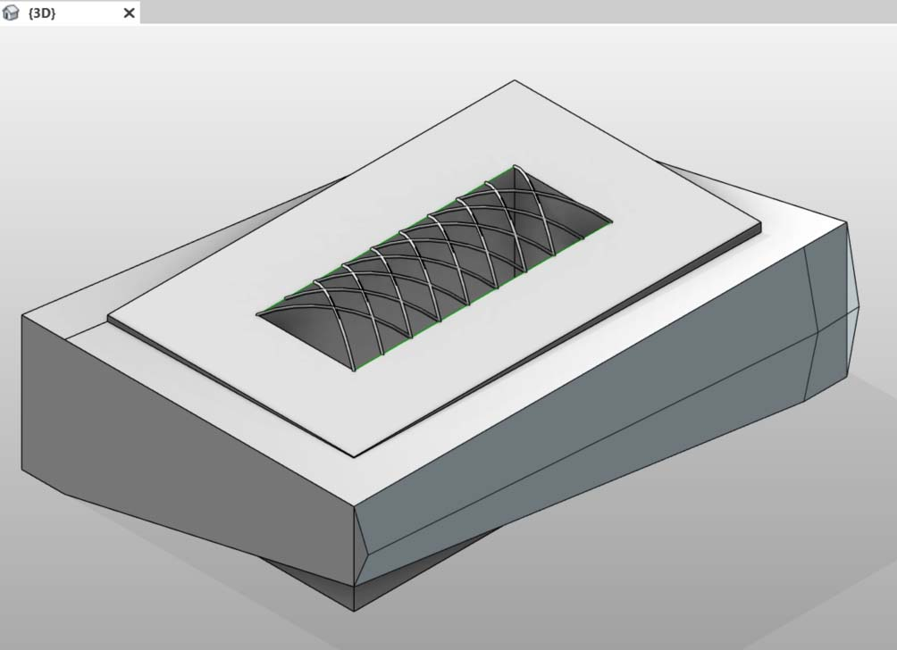

# Создание

В Dynamo можно создать массив элементов Revit с полным параметрическим управлением. Узлы Revit в Dynamo позволяют импортировать элементы из типовых геометрических объектов в категории определенных типов (например, стены и перекрытия). В этом разделе рассматривается импорт параметрически гибких элементов с адаптивными компонентами.

### Адаптивные компоненты

Адаптивный компонент — это гибкая категория семейства, которая хорошо подходит для генеративных приложений. После создания экземпляра можно построить сложный геометрический элемент, который определяется исходным положением адаптивных точек.

Ниже приведен пример адаптивного компонента на основе трех точек в редакторе семейств. Создается ферма, определяемая положением каждой адаптивной точки. В упражнении ниже с помощью этого компонента будет создана серия ферм по ширине фасада.

### Принципы взаимодействия

Адаптивный компонент — хороший пример применения взаимодействия. Задав опорные адаптивные точки, можно создать массив адаптивных компонентов. В свою очередь, при переносе этих данных в другие программы есть возможность свести геометрию к простым данным. Примерно такая же логическая схема используется при импорте и экспорте в программе Excel.

Предположим, что консультант по фасадным работам хочет узнать местоположение элементов фермы без разбиения готовой геометрии. При подготовке к производству консультант может указать местоположение адаптивных точек для регенерации геометрии в такой программе, как Inventor.

Рабочий процесс, который будет рассмотрен в упражнении ниже, позволяет получить доступ ко всем этим данным во время создания определения формирования элементов Revit. Благодаря этому можно объединить этапы создания концепции, разработки документации и производства в единый рабочий процесс. В результате формируется более интеллектуальный и эффективный механизм взаимодействия.

### Несколько элементов и списков

В [первом упражнении](4-creating.md#exercise-generate-elements-and-lists) ниже описывается то, как в Dynamo используются ссылки на данные для создания элементов Revit. Для формирования нескольких адаптивных компонентов необходимо создать список списков, в каждом из которых будет три точки, соответствующие трем точкам адаптивного компонента. Это будет необходимо учитывать при управлении структурами данных в Dynamo.

### Элементы DirectShape

Еще одним способом импорта параметрической геометрии Dynamo в Revit является DirectShape. В целом элемент DirectShape и связанные классы отвечают за хранение созданных во внешних программах геометрических форм в документах Revit. Геометрия может включать в себя замкнутые тела или сети. Основной задачей DirectShape является импорт форм из других форматов данных, например IFC или STEP, когда недостаточно информации для создания реального элемента Revit. Как и при работе с форматами IFC и STEP, функция DirectShape подходит для импорта созданных в Dynamo геометрических объектов в проекты Revit в качестве реальных элементов.

Во [втором упражнении](4-creating.md#exercise-directshape-elements) рассматривается использование DirectShape для импорта геометрии Dynamo в проект Revit. С помощью этого метода можно назначить категорию, материал и имя импортированной геометрии, сохранив при этом параметрическую связь с графиком Dynamo.

## Упражнение «Создание элементов и списков»

> Скачайте файл примера, щелкнув указанную ниже ссылку.
>
> Полный список файлов примеров можно найти в приложении.



Возьмите файл примеров из этого раздела (или продолжите работу с файлом Revit из предыдущего сеанса), содержащий уже знакомый вам формообразующий элемент Revit.

> 1. После открытия файл выглядит следующим образом.
> 2. Видна система ферм, созданная при помощи Dynamo и интеллектуально связанная с формообразующим элементом Revit.

Теперь, когда мы применили узлы _Select Model Element_ и _Select Face_, опустимся на одну ступень вниз по иерархии геометрии и воспользуемся узлом _Select Edge_. Если решатель Dynamo находится в _автоматическом_ режиме, то при внесении изменений в файл Revit график будет постоянно обновляться. Ребро, которое необходимо выбрать, динамически привязано к топологии элементов Revit. Пока топология* остается неизменной, связь между Revit и Dynamo не прерывается.

> 1. Выберите самую верхнюю кривую остекленного фасада. Она проходит по всей длине здания. Если выбрать ребро не удается, в Revit можно навести на него указатель и нажимать клавишу _TAB_ до тех пор, пока этот объект не будет выделен.
> 2. С помощью двух узлов _Select Edge_ выберите ребра, представляющие скос в центре фасада.
> 3. Проделайте то же самое с нижними ребрами фасада в Revit.
> 4. Узлы _Watch_ теперь демонстрируют наличие линий в Dynamo. Данные автоматически преобразуются в геометрию Dynamo, так как сами ребра не являются элементами Revit. Эти кривые будут использоваться в качестве опорных элементов для создания экземпляров адаптивных ферм по ширине фасада.

\r\n * Чтобы сохранить единообразную топологию, используется модель, в которую не были включены дополнительные грани или ребра. Параметры могут изменять ее форму, однако способ ее построения остается неизменным. \r\n

Сначала нужно соединить кривые и объединить их в общем списке. Это позволит _«сгруппировать»_ кривые для выполнения операций с геометрией.

> 1. Создайте список для двух кривых по центру фасада.
> 2. Объедините эти две кривые в сложную кривую, подключив компонент _List.Create_ к узлу _Polycurve.ByJoinedCurves_.
> 3. Создайте список для двух кривых в нижней части фасада.
> 4. Объедините эти две кривые в сложную кривую, подключив компонент _List.Create_ к узлу _Polycurve.ByJoinedCurves_.
> 5. Наконец, объедините три основные кривые (одну линию и две сложные кривые) в один список.

Воспользуйтесь верхней кривой, которая представляет собой линию, расположенную по всей ширине фасада. Создайте плоскости вдоль этой линии для пересечения с набором кривых, которые были сгруппированы в списке.

> 1. С помощью узла _Code Block_ задайте диапазон, используя синтаксис `0..1..#numberOfTrusses;`.
> 2. Соедините узел *Integer Slider* с портом ввода узла Code Block. Как можно догадаться, он будет задавать количество ферм. Обратите внимание, что регулятор контролирует количество объектов в диапазоне от *0* до _1_.
> 3. Соедините узел _Code Block_ с портом ввода _param_ узла _Curve.PlaneAtParameter_, а верхнее ребро — с портом ввода _curve_. Будет создано десять плоскостей, равномерно распределенных по ширине фасада.

Плоскость — это абстрактный элемент геометрии, представляющий собой бесконечное двумерное пространство. Плоскости отлично подходят для создания контуров и пересечений, что и требуется на данном этапе.

> 1. Используя узел _Geometry.Intersect_ (задайте режим переплетения «Векторное произведение»), соедините компонент _Curve.PlaneAtParameter_ с портом ввода _entity_ узла _Geometry.Intersect_. Соедините основной узел _List.Create_ с портом ввода _geometry_. Теперь на видовом экране Dynamo можно увидеть точки, обозначающие пересечение кривых с заданными плоскостями.

Обратите внимание, что выходные данные содержат список, в который вложен список с еще одним вложенным списком. Слишком большое число списков для решаемой задачи. Необходимо частично выровнять их. Спустимся на шаг вниз по списку и применим к результату функцию выравнивания. Для этого используем операцию _List.Map_, описанную в главе руководства, посвященной спискам.

> 1. Соедините узел _Geometry.Intersect_ с портом ввода list узла _List.Map_.
> 2. Соедините узел _Flatten_ с портом ввода f(x) узла _List.Map_. В результате получится 3 списка с количеством элементов, соответствующим количеству ферм.
> 3. Необходимо изменить эти данные. Для создания экземпляра фермы следует использовать такое же количество адаптивных точек, какое определено в семействе. Так как адаптивный компонент состоит из трех точек, вместо трех списков, содержащих по 10 элементов (numberOfTrusses), необходимо получить 10 списков с тремя элементами в каждом. Так можно создать 10 адаптивных компонентов.
> 4. Соедините узел _List.Map_ с портом ввода узла _List.Transpose_. Теперь у вас есть нужные выходные данные.
> 5. Чтобы убедиться в правильности данных, добавьте узел _Polygon.ByPoints_ в рабочую область и проверьте результат в области предварительного просмотра Dynamo.

Массив адаптивных компонентов создается так же, как полигоны.

> 1. Добавьте узел _AdaptiveComponent.ByPoints_ в рабочую область и соедините узел _List.Transpose_ с портом ввода _points_.
> 2. С помощью узла _Family Types_ выберите семейство _AdaptiveTruss_ и соедините его с портом ввода _FamilyType_ узла _AdaptiveComponent.ByPoints_.

В Revit можно увидеть десять ферм, равномерно размещенных по ширине фасада.

Для «зондирования» графика увеличьте значение numberOfTrusses до 30 с помощью регулятора. В итоге получилось слишком большое и нереальное количество ферм, но при этом параметрическая связь действует. После проверки задайте для параметра numberOfTrusses значение 15.

В качестве финальной проверки выберите формообразующий элемент в Revit и отредактируйте параметры экземпляра. После изменения формы здания ферма тоже должна измениться. Обратите внимание, что это изменение можно наблюдать, только если график Dynamo открыт. Сразу после закрытия связь будет разорвана.

## Упражнение «Элементы DirectShape»

> Скачайте файл примера, щелкнув указанную ниже ссылку.
>
> Полный список файлов примеров можно найти в приложении.



Сначала откройте файл примеров для этого урока: ARCH-DirectShape-BaseFile.rvt.

> 1. На 3D-виде отображается формообразующий элемент здания из предыдущего урока.
> 2. Вдоль кромки атриума имеется одна базовая кривая. Она будет использоваться в Dynamo в качестве опорной.
> 3. Вдоль противоположной кромки атриума проходит еще одна базовая кривая. Она также будет использоваться в Dynamo в качестве опорной.

> 1. Чтобы установить связь с геометрией в Dynamo, используйте узел _Select Model Element_ для каждого элемента в Revit. Выберите формообразующий элемент в Revit и импортируйте геометрию в Dynamo с помощью _Element.Faces_. Формообразующий элемент должен отображаться в области предварительного просмотра Dynamo.
> 2. Импортируйте первую базовую кривую в Dynamo с помощью _Select Model Element_ и _CurveElement.Curve_.
> 3. Импортируйте вторую базовую кривую в Dynamo с помощью _Select Model Element_ и _CurveElement.Curve_.

> 1. Если уменьшить масштаб графика и панорамировать его вправо, можно увидеть большую группу узлов. Это геометрические операции, которые создают решетчатую конструкцию на крыше, отображаемую в области предварительного просмотра Dynamo. Эти узлы генерируются с помощью функции _Node to Code_, описанной в разделе данного руководства, посвященного [блокам кода](../coding-in-dynamo/7\_code-blocks-and-design-script/7-2\_design-script-syntax.md#Node).
> 2. Конструкция определяется тремя основными параметрами: Diagonal Shift, Camber и Radius.

Увеличьте масштаб отображения параметров этого графика. Можно выполнить их зондирование, чтобы получить другие выходные данные геометрии.

> 1. Если поместить узел _DirectShape.ByGeometry_ в рабочую область, можно увидеть, что у него есть четыре порта ввода: _geometry_**,** _category_**,** _material_ и _name_.
> 2. Геометрия представляет собой твердое тело, созданное на основе той части графика, с помощью которой формируется геометрия.
> 3. Входные параметры категории выбираются с помощью узла _Categories_. В данном случае используется параметр Structural Framing.
> 4. Входные данные материала выбираются с помощью вышеупомянутого массива узлов, хотя в данном случае проще задать значение по умолчанию.

Вернитесь в Revit после выполнения сценария Dynamo. Импортированную геометрию можно видеть на крыше в проекте. Это скорее не обобщенная модель, а элемент несущего каркаса. Параметрическая связь с Dynamo сохраняется.

