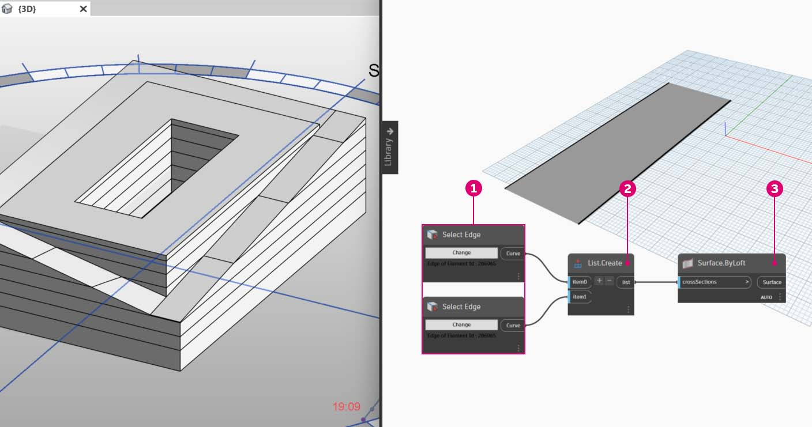

# 定制

尽管我们之前介绍了如何编辑基本建筑体量，但我们希望一次编辑大量图元，以便深入了解 Dynamo/Revit 链接。由于数据结构需要更高级的列表操作，因此大比例自定义会变得更加复杂。但是，其执行背后的基本原则在根本上是相同的。让我们基于一组自适应构件来研究一些可能的分析。

### 点位置

假定我们创建了一系列自适应构件，并希望根据其点位置编辑参数。例如，这些点可以驱动与图元面积相关的厚度参数。或者，它们可以驱动一年内与日光曝晒相关的不透明度参数。Dynamo 支持通过几个简单步骤将分析与参数相连接，我们将在下面的练习中探讨基本版本。

> 使用**“AdaptiveComponent.Locations”**节点查询选定自适应构件的自适应点。这样，我们便可以使用 Revit 图元的抽象版本进行分析。

通过提取自适应构件的点位置，我们可以针对该图元运行一系列分析。例如，通过四点自适应构件可以研究与给定嵌板的平面之间的偏差。

### 日光方向分析

> 使用“重映射”将一组数据映射到参数范围。这是参数化模型中所使用的基本工具，我们将在下面的练习中进行演示。

使用 Dynamo，自适应构件的点位置可用于创建每个图元的最佳拟合平面。我们还可以在 Revit 文件中查询太阳位置，并研究该平面与太阳的相对方向与其他自适应构件的比较。让我们在下面的练习中通过创建算法屋顶图来进行设置。

## 练习

> 单击下面的链接下载示例文件。
>
> 可以在附录中找到示例文件的完整列表。



本练习将进一步介绍上一节中演示的技术。在本例中，我们将基于 Revit 图元定义参数化曲面、实例化四点自适应构件，然后根据太阳的方向对其进行编辑。

> 1. 首先，使用_“Select Edge”_节点选择两条边。这两条边是中庭的长跨度。
> 2. 使用_“List.Create”_节点将两条边合并为一个列表。
> 3. 使用_“Surface.ByLoft”_在两条边之间创建曲面。

> 1. 使用_“代码块”_，定义介于 0 到 1 之间的一个范围（包含 10 个等间距值）：`0..1..#10;`
> 2. 将_“代码块”_连接到_“Surface.PointAtParameter”_节点的*“u”*和_“v”_输入，并将_“Surface.ByLoft”_节点连接到_“surface”_输入。在节点上单击鼠标右键，并将_“连缀”_更改为_“笛卡尔积”_。这将在曲面上提供点栅格。

该点栅格用作参数化定义的曲面的控制点。我们要提取其中每个点的 u 和 v 位置，以便可以将它们连接到参数化公式并保持相同的数据结构。可以通过查询刚才创建的点的参数位置来执行此操作。

> 1. 将_“Surface.ParameterAtPoint”_节点添加到画布，连接输入，如上所示。
> 2. 使用“UV.U”节点查询这些参数的_“u”_值。
> 3. 使用“UV.V”节点查询这些参数的_“v”_值。
> 4. 输出显示曲面每个点对应的_“u”_和_“v”_值。现在，在正确的数据结构中，每个值的范围介于 _0_ 到 _1_ 之间，因此我们准备好应用参数算法。

> 1. 将_“代码块”_添加到画布，然后输入代码：`Math.Sin(u*180)*Math.Sin(v*180)*w;`。这是一个参数化函数，可从平面创建正弦平滑。
> 2. 将_“UV.U”_连接到_“u”_输入，并将“UV.V”连接到_“v”_输入。
> 3. _“w”_输入表示形状的_“振幅”_，因此我们向其附加_“数字滑块”_。

> 1. 现在，我们得到了由算法定义的一列值。让我们使用该列值在_“+Z”_方向上上移点。使用_“Geometry.Translate”_，将*“代码块”*连接到_“zTranslation”_，并将_“Surface.PointAtParameter”_连接到_“geometry”_输入。您应该会看到新点显示在 Dynamo 预览中。
> 2. 最后，我们使用_“NurbsSurface.ByPoints”_节点创建曲面，从而将上一步中的节点连接到点输入。我们自己有一个参数化曲面。可以随意拖动滑块来观察多边形收缩和扩展。

使用参数化曲面，我们需要定义一种方法来进行镶板，以便布置四点自适应构件。Dynamo 没有现成的功能来进行曲面镶板，因此我们可以向社区寻求有用的 Dynamo 软件包。

> 1. 转到_“软件包”>“搜索软件包...”_
> 2. 搜索_“LunchBox”_，然后安装_“LunchBox for Dynamo”_。对于此种情况，这是一组非常有用的几何图形操作工具。

> 1. 完成下载后，现在可以完全访问 LunchBox 套件。搜索_“四边形栅格”_，然后选择_“LunchBox 四边形栅格(按面)”_。将参数化曲面连接到_“surface”_输入，并分别将_“U”_和_“V”_设置为_“15”_。您应该会在 Dynamo 预览中看到四分面板的曲面。

> 如果您对其设置很满意，可以双击_“Lunch Box”_节点，查看其设置。

> 返回 Revit，让我们快速看一下在此处使用的自适应构件。无需再继续，但这是我们要实例化的屋顶嵌板。它是四点自适应构件，是 ETFE 系统的粗略表示。中心空心的光圈位于名为_“ApertureRatio”_的参数上。

> 1. 我们要在 Revit 中实例化许多几何图形，因此请确保将 Dynamo 解算器设置为_“手动”_。
> 2. 向画布添加_“Family Types”_节点，然后选择_“ROOF-PANEL-4PT”_。
> 3. 将_“AdaptiveComponent.ByPoints”_节点添加到画布，将_“LunchBox 四边形栅格(按面)”_输出中的_“Panel Pts”_连接到_“points”_输入。将_“Family Types”_节点连接到_“familySymbol”_输入。
> 4. 点击_“运行”_。当创建几何图形时，Revit 必定会_考虑_一下。如果需要太长时间，请将_代码块的“15”_减少到较小数字。这将减少屋顶上嵌板的数量。

_注意：如果 Dynamo 计算节点需要较长时间，可能需要使用“冻结”节点功能，以便在开发图形时暂停执行 Revit 操作。有关冻结节点的详细信息，请参见“实体”章节中的“冻结”部分。_

> 返回 Revit，我们在屋顶上有一组嵌板。

> 放大后，可以更仔细地查看其曲面质量。

### 分析

> 1. 从上一步继续操作，我们进一步根据每个嵌板到太阳的曝光来驱动其光圈。放大 Revit 并选择一个嵌板，我们在特性栏中可以看到有一个名为_“Aperture Ratio”_的参数。设置族，以便使光圈范围大致介于_“0.05”_到_“0.45”_之间。

> 1. 如果打开日光路径，可以在 Revit 中看到当前的太阳位置。

> 1. 我们可以使用_“SunSettings.Current”_节点来参照此太阳的位置。

1. 将“日光设置”连接到_“Sunsetting.SunDirection”_以获得太阳向量。
2. 从用于创建自适应构件的_“Panel Pts”_，使用_“Plane.ByBestFitThroughPoints”_以近似计算构件的平面。
3. 查询此平面的_“法线”_。
4. 使用_“点积”_计算太阳方向。点积是一个用于确定两个向量的平行度或反平行度的公式。我们采用每个自适应构件的平面法线，并将其与太阳向量进行比较以粗略模拟太阳方向。
5. 获取结果的_“绝对值”_。这可确保点积在平面法线朝向反转方向时是准确的。
6. 点击_“运行”_。

> 1. 我们看一下_“点积”_，这里有很多数字。我们想要使用它们的相对分布，但我们需要将数字压缩到计划编辑的_“Aperture Ratio”_参数的适当范围。

1. _“Math.RemapRange”_是一个适用于此种情况的优秀工具。它采用输入列表并将其边界重新映射到两个目标值。
2. 在_“代码块”_中，将目标值定义为_“0.15”_和_“0.45”_。
3. 点击_“运行”_。

> 1. 将重映射的值连接到_“Element.SetParameterByName”_节点。

1. 将字符串_“Aperture Ratio”_连接到_“parameterName”_输入。
2. 将_“自适应构件”_连接到_“element”_输入。
3. 点击_“运行”_。

> 返回 Revit，从远处我们可以看出太阳方向对 ETFE 嵌板光圈的影响。

> 放大，我们看到 ETFE 嵌板在面对太阳时更加闭合。此处，我们的目标是减少因日光曝晒而导致的过热情况。如果我们要根据日光曝晒让更多光线进入，只需切换_“Math.RemapRange”_上的域即可。
