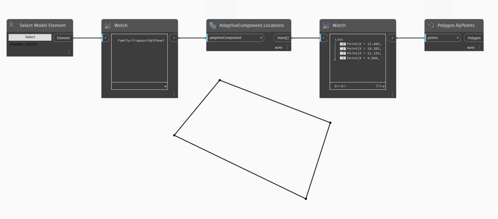

# Dostosowywanie

Poprzednio omówiliśmy edycję podstawowej bryły budynku, a teraz dokładniej poznamy współdziałanie rozwiązań Dynamo/Revit, edytując dużą liczbę elementów jednocześnie. Dostosowywanie na dużą skalę jest bardziej złożone, ponieważ struktury danych wymagają bardziej zaawansowanych operacji na listach. Podstawowe zasady dotyczące ich wykonania są jednak zasadniczo takie same. Poznajmy kilka możliwości analizy na podstawie zestawu komponentów adaptacyjnych.

### Położenie punktu

Załóżmy, że utworzyliśmy zakres komponentów adaptacyjnych, a teraz chcemy edytować parametry w oparciu o położenia punktów. Te punkty mogą na przykład sterować parametrem grubości, powiązanym z powierzchnią elementu. Mogą też sterować parametrem nieprzezroczystości, powiązanym z ekspozycją na słońce w ciągu roku. Dodatek Dynamo umożliwia połączenie analiz z parametrami w kilku prostych krokach. W poniższym ćwiczeniu poznamy podstawowy wariant.

> Wykonaj zapytanie o punkty adaptacyjne wybranego komponentu adaptacyjnego za pomocą węzła **AdaptiveComponent.Locations**. Dzięki temu możemy użyć abstrakcyjnej wersji elementu programu Revit do analizy.

Wyodrębniając położenie punktów komponentów adaptacyjnych, można wykonać wiele analiz dotyczących elementu. Komponent adaptacyjny z czterema punktami umożliwia na przykład zbadanie odchylenia danego panelu od płaszczyzny.

### Analiza kierunku oświetlenia naturalnego

> Użyj ponownego odwzorowania, aby odwzorować zbiór danych w zakresie parametrów. Jest to podstawowe narzędzie używane w modelu parametrycznym, a jego działanie pokazano w poniższym ćwiczeniu.

W dodatku Dynamo można użyć położenia punktów komponentów adaptacyjnych do utworzenia najlepiej dopasowanej płaszczyzny dla każdego elementu. Można również wykonać zapytanie o położenie słońca w pliku programu Revit i zbadać orientację tej płaszczyzny względem słońca w porównaniu z innymi komponentami adaptacyjnymi. Ustawimy to w poniższym ćwiczeniu, tworząc algorytmiczny dach.

## Ćwiczenie

> Pobierz plik przykładowy, klikając poniższe łącze.
>
> Pełna lista plików przykładowych znajduje się w załączniku.



To ćwiczenie przedstawia rozszerzenie technik omówionych w poprzedniej sekcji. W tym przypadku definiujemy powierzchnię parametryczną na podstawie elementów programu Revit, tworząc wystąpienia czteropunktowych komponentów adaptacyjnych, a następnie edytując je na podstawie orientacji względem słońca.

> 1. Najpierw wybierzemy dwie krawędzie, używając węzła _„Select Edge”_. Te dwie krawędzie to długie boki atrium.
> 2. Połącz te dwie krawędzie w jedną listę, używając węzła _List.Create_.
> 3. Utwórz powierzchnię między dwiema krawędziami za pomocą węzła _Surface.ByLoft_.

> 1. Używając węzła _Code Block_, zdefiniuj zakres od 0 do 1 z 10 wartościami w równych odstępach: `0..1..#10;`
> 2. Połącz węzeł _Code Block_ z elementami wejściowymi *u *i _v_ węzła _Surface.PointAtParameter_, a węzeł _Surface.ByLoft_ z elementem wejściowym _surface_. Kliknij węzeł prawym przyciskiem myszy i zmień opcję _skratowania_ na _Iloczyn wektorowy_. W ten sposób na powierzchni zostanie umieszczona siatka punktów.

Ta siatka punktów posłuży jako punkty sterujące dla powierzchni zdefiniowanej parametrycznie. Chcemy wyodrębnić położenia u i v każdego z tych punktów, aby można je było wstawić do wzoru parametrycznego i zachować tę samą strukturę danych. Można to zrobić za pomocą zapytania o położenia parametrów punktów, które właśnie utworzyliśmy.

> 1. Dodaj węzeł _Surface.ParameterAtPoint_ do obszaru rysunku i połącz elementy wejściowe tak, jak pokazano powyżej.
> 2. Wykonaj zapytanie o wartości _u_ tych parametrów, używając węzła UV.U.
> 3. Wykonaj zapytanie o wartości _v_ tych parametrów, używając węzła UV.V.
> 4. Wyniki zawierają odpowiednie wartości _u_ i _v_ dla każdego punktu powierzchni. Teraz w odpowiedniej strukturze danych istnieje zakres od _0_ do _1_ dla każdej wartości, więc możemy zastosować algorytm parametryczny.

> 1. Dodaj węzeł _Code Block_ do obszaru rysunku i wprowadź kod: `Math.Sin(u*180)*Math.Sin(v*180)*w;`. Jest to funkcja parametryczna umożliwiająca utworzenie sinusoidalnego wzniesienia na podstawie płaskiej powierzchni.
> 2. Umożliwia połączenie _UV.U_ z wejściem _u_ oraz UV.V z wejściem _v_.
> 3. Element wejściowy _w_ oznacza _amplitudę_ kształtu, dlatego należy dołączyć do niego węzeł _Number Slider_.

> 1. Otrzymaliśmy listę wartości zdefiniowaną przez algorytm. Użyjemy tej listy wartości, aby przesunąć punkty w górę w kierunku _+Z_. Używając węzła _Geometry.Translate_, połącz węzeł *Code Block *z elementem wejściowym _zTranslation_, a węzeł _Surface.PointAtParameter_ z elementem wejściowym _geometry_. Nowe punkty powinny być widoczne w podglądzie dodatku Dynamo.
> 2. Na koniec utworzymy powierzchnię za pomocą węzła _NurbsSurface.ByPoints_, łącząc węzeł z poprzedniego kroku z elementem wejściowym „points”. Otrzymaliśmy powierzchnię parametryczną. Możesz przeciągnąć suwak, aby zobaczyć, jak wzniesienie zmniejsza się i rośnie.

Używając tej powierzchni parametrycznej, chcemy zdefiniować podział na panele w celu utworzenia szyku czteropunktowych komponentów adaptacyjnych. Dodatek Dynamo nie zawiera gotowej funkcji podziału powierzchni na panele, poszukamy więc przydatnych pakietów dodatku Dynamo w społeczności.

> 1. Przejdź do obszaru _Pakiety>Wyszukaj pakiet..._
> 2. Wyszukaj _„LunchBox”_ i zainstaluj pakiet _„LunchBox for Dynamo”_. To bardzo pomocny zestaw narzędzi do operacji geometrycznych takich jak ta.

> 1. Po pobraniu pakietu LunchBox masz do niego pełny dostęp. Wyszukaj _„Quad Grid”_ i wybierz węzeł _„LunchBox Quad Grid By Face”_. Połącz powierzchnię parametryczną z elementem wejściowym _surface_ i ustaw podziały _U_ oraz _V_ na _15_. W podglądzie dodatku Dynamo powinna być widoczna powierzchnia podzielona na czworokątne panele.

> Jeśli chcesz sprawdzić, jak powstała, możesz kliknąć dwukrotnie węzeł _Lunch Box_, aby to zobaczyć.

> Wróćmy do programu Revit i pokrótce omówmy komponent adaptacyjny, którego używamy. Nie wchodząc w szczegóły, jest to panel dachowy, którego wystąpienia utworzymy. Jest to czteropunktowy komponent adaptacyjny, z grubsza odzwierciedlający panel z ETFE. Wielkość otworu pośrodku określa parametr o nazwie _„ApertureRatio”_.

> 1. Za chwilę zostanie otworzonych wiele wystąpień geometrii w programie Revit, dlatego należy wybrać _„Ręczne”_ rozwiązywanie w dodatku Dynamo.
> 2. Dodaj węzeł _Family Types_ do obszaru rysunku i wybierz opcję _„ROOF-PANEL-4PT”_.
> 3. Dodaj węzeł _AdaptiveComponent.ByPoints_ do obszaru rysunku i połącz element wyjściowy _Panel Pts_ węzła _„LunchBox Quad Grid by Face”_ z elementem wejściowym _points_. Połącz węzeł _Family Types_ z elementem wejściowym _familySymbol_.
> 4. Kliknij przycisk _Uruchom_. Podczas tworzenia geometrii program Revit przez pewien czas _nie będzie dostępny do pracy_. Jeśli trwa to zbyt długo, zmniejsz liczbę _„15” w węźle Code Block_ na niższą. Spowoduje to zmniejszenie liczby paneli na dachu.

_Uwaga: jeśli w dodatku Dynamo obliczanie węzłów trwa zbyt długo, można użyć funkcji zablokowania węzła, aby wstrzymać wykonywanie operacji programu Revit podczas tworzenia wykresu. Aby uzyskać więcej informacji na temat blokowania węzłów, zobacz sekcję „Blokowanie” w rozdziale poświęconym bryłom._

> W programie Revit otrzymaliśmy szyk paneli na dachu.

> Po powiększeniu można dokładniej przyjrzeć się właściwościom powierzchni.

### Analiza

> 1. W dalszej części określimy wielkość otworu każdego panelu na podstawie jego ekspozycji na słońce. W programie Revit po powiększeniu i wybraniu jednego panelu na pasku właściwości widać parametr o nazwie _„Aperture Ratio”_. Rodzina jest ustawiona tak, aby zakres wielkości otworu wynosił w przybliżeniu od _0,05_ do _0,45_.

> 2. Po włączeniu ustawienia Solar Path widzimy bieżące położenie słońca w programie Revit.

> 3. Można odnieść się do tego położenia słońca za pomocą węzła _SunSettings.Current_.

1. Aby uzyskać wektor oświetlenia naturalnego, należy połączyć element SunSettings z węzłem _Sunsetting.SunDirection_.
2. Połącz element _Panel Pts_ używany do utworzenia komponentów adaptacyjnych z węzłem _Plane.ByBestFitThroughPoints_, aby utworzyć przybliżoną płaszczyznę dla komponentu.
3. Wykonaj zapytanie o _normalną_ tej płaszczyzny.
4. Użyj _iloczynu skalarnego_, aby obliczyć kierunek oświetlenia naturalnego. Iloczyn skalarny to formuła określająca, na ile równoległe lub przeciwrównoległe są dwa wektory. Czyli porównujemy normalną płaszczyzny każdego elementu adaptacyjnego z wektorem oświetlenia naturalnego w celu wykonania przybliżonej symulacji kierunku oświetlenia naturalnego.
5. Oblicz _wartość bezwzględną_ wyniku. Dzięki temu iloczyn skalarny będzie prawidłowy także wtedy, gdy normalna płaszczyzna będzie skierowana w przeciwnym kierunku.
6. Kliknij przycisk _Uruchom_.

> 1) _Iloczyn skalarny_ zawiera szeroki zakres liczb. Chcemy użyć ich względnego rozkładu, ale musimy umieścić te liczby w zakresie odpowiednim dla parametru _„Aperture Ratio”_, który chcemy edytować.

1. Węzeł _Math.RemapRange_ to doskonałe narzędzie do tego celu. Umożliwia on ponowne odwzorowanie wejściowej listy w granicach dwóch wartości docelowych.
2. Zdefiniuj wartości docelowe _0,15_ i _0,45_ w węźle _Code Block_.
3. Kliknij przycisk _Uruchom_.

> 1) Połącz ponownie odwzorowane wartości z węzłem _Element.SetParameterByName_.

1. Połącz ciąg _„Aperture Ratio”_ z elementem wejściowym _parameterName_.
2. Połącz _komponenty adaptacyjne_ z elementem wejściowym _element_.
3. Kliknij przycisk _Uruchom_.

> W programie Revit z odległości widać wpływ kierunku oświetlenia naturalnego na wielkość otworu paneli z ETFE.

> Po powiększeniu widać, że panele z ETFE wystawione na słońce są bardziej zamknięte. Naszym celem jest ograniczenie przegrzewania się pod wpływem energii słonecznej. Jeśli chcemy uzyskać więcej światła poprzez wystawienie na słońce, wystarczy przełączyć dziedzinę w węźle _Math.RemapRange_.
