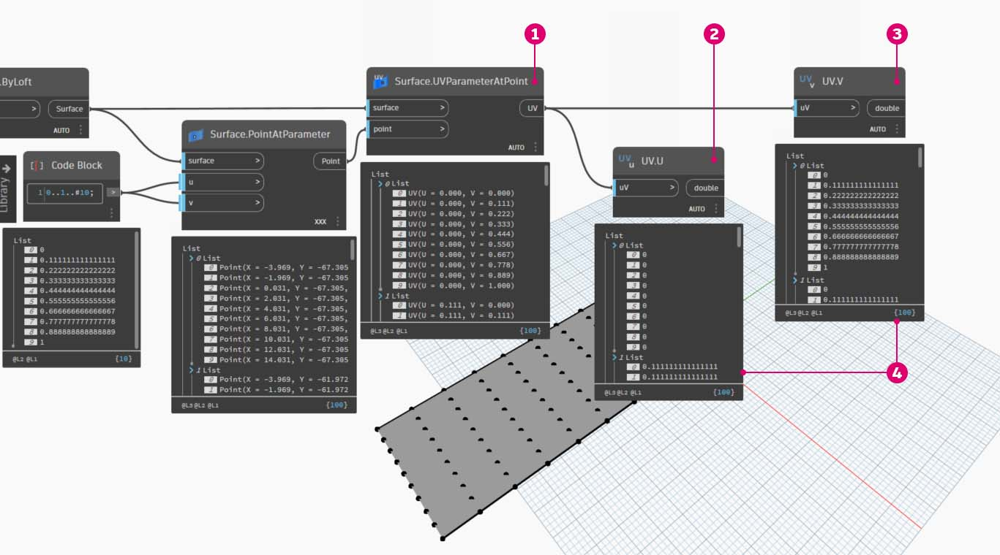
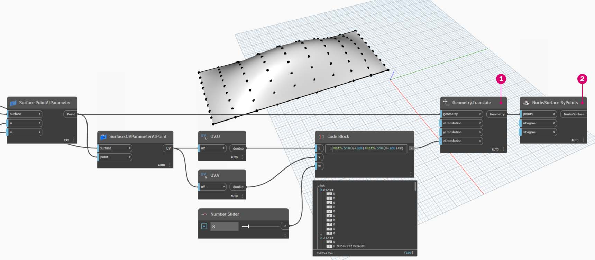

# Personalización

Aunque ya hemos visto cómo editar una masa de construcción básica, queremos profundizar en el vínculo entre Dynamo y Revit mediante la edición de un gran número de elementos de una sola vez. La personalización a gran escala se vuelve más compleja ya que las estructuras de datos requieren operaciones de lista más avanzadas. Sin embargo, los principios subyacentes de su ejecución son esencialmente los mismos. Vamos a estudiar algunas oportunidades de análisis a partir de un conjunto de componentes adaptativos.

### Ubicación de puntos

Supongamos que hemos creado un rango de componentes adaptativos y queremos editar parámetros en función de sus ubicaciones de puntos. Los puntos podrían, por ejemplo, controlar un parámetro de grosor relacionado con el área del elemento. O bien, podrían controlar un parámetro de opacidad relacionado con la exposición solar a lo largo del año. Dynamo permite la conexión de análisis a parámetros en unos sencillos pasos; exploraremos una versión básica en el ejercicio siguiente.

> Consulte los puntos adaptativos de un componente adaptativo seleccionado mediante el nodo **AdaptiveComponent.Locations**. Esto nos permite trabajar con una versión resumida de un elemento de Revit para el análisis.

Al extraer la ubicación de los puntos de los componentes adaptativos, se pueden ejecutar distintos análisis para ese elemento. Un componente adaptativo de cuatro puntos le permitirá estudiar la desviación desde el plano en un panel determinado, por ejemplo.

### Análisis de orientación solar

> Utilice la reasignación para asignar un conjunto de datos a un rango de parámetros. Esta es una herramienta fundamental que se utiliza en un modelo paramétrico. Haremos una demostración en el siguiente ejercicio.

Dynamo permite usar las ubicaciones de los puntos de los componentes adaptativos para crear un plano de ajuste óptimo para cada elemento. También podemos consultar la posición del sol en el archivo de Revit y estudiar la orientación relativa del plano con respecto al sol en comparación con otros componentes adaptativos. Configuremos esta acción en el siguiente ejercicio mediante la creación de una cubierta algorítmica.

## Ejercicio:

> Descargue el archivo de ejemplo. Para ello, haga clic en el vínculo siguiente.
>
> En el Apéndice, se incluye una lista completa de los archivos de ejemplo.



En este ejercicio se amplían las técnicas mostradas en la sección anterior. En este caso, vamos a definir una superficie paramétrica a partir de elementos de Revit; para ello, crearemos ejemplares de los componentes adaptativos de cuatro puntos y, a continuación, los editaremos según la orientación del sol.

> 1. Comience por seleccionar dos bordes con el nodo _"Select Edge"_. Los dos bordes son los tramos largos del atrio.
> 2. Combine los dos bordes en una lista con el nodo _List.Create_.
> 3. Cree una superficie entre los dos bordes con un nodo _Surface.ByLoft_.

> 1. Mediante el _bloque de código_, defina un rango de 0 a 1 con 10 valores espaciados uniformemente: `0..1..#10;`.
> 2. Conecte el _bloque de código_ a las entradas *u* y _v_ de un nodo _Surface.PointAtParameter_ y conecte el nodo _Surface.ByLoft_ a la entrada _surface_. Haga clic con el botón derecho en el nodo y cambie el _encaje_ a _Producto vectorial_. Esto proporcionará una rejilla de puntos en la superficie.

Esta rejilla de puntos sirve como puntos de control para una superficie definida paramétricamente. Queremos extraer las posiciones u y v de cada uno de estos puntos para poder conectarlos a una fórmula paramétrica y mantener la misma estructura de datos. Para ello, podemos consultar las ubicaciones de parámetros de los puntos que acabamos de crear.

> 1. Añada un nodo _Surface.ParameterAtPoint_ al lienzo y conecte las entradas como se muestra más arriba.
> 2. Consulte los valores _u_ de estos parámetros con el nodo UV.U.
> 3. Consulte los valores _v_ de estos parámetros con el nodo UV.V.
> 4. Las salidas muestran los valores _u_ y _v_ correspondientes a cada punto de la superficie. Ahora tenemos un rango de _0_ a _1_ para cada valor en la estructura de datos adecuada, por lo que estamos listos para aplicar un algoritmo paramétrico.

> 1. Añada un _bloque de código_ al lienzo e introduzca el siguiente código: `Math.Sin(u*180)*Math.Sin(v*180)*w;`. Esta es una función paramétrica que crea un relieve de seno a partir de una superficie plana.
> 2. Conecta _UV.U_ a la entrada _u_ y UV.V a la entrada _v_.
> 3. La entrada _w_ representa la _amplitud_ de la forma, por lo que le conectamos un _control deslizante de número_.

> 1. Ahora tenemos una lista de valores tal y como los define el algoritmo. Usaremos esta lista de valores para mover los puntos hacia arriba en la dirección _+Z_. Con _Geometry.Translate_, conecte el *bloque de código *a _zTranslation_ y el nodo _Surface.PointAtParameter_ a la entrada _geometry_. Deben aparecer los nuevos puntos en la vista preliminar de Dynamo.
> 2. Por último, creamos una superficie con el nodo _NurbsSurface.ByPoints_ y conectamos el nodo del paso anterior a la entrada points. Ya tenemos una superficie paramétrica. Puede arrastrar el control deslizante para reducir o aumentar el relieve.

Con la superficie paramétrica, vamos a definir un método para dividirla en paneles y crear la matriz de componentes adaptativos de cuatro puntos. Dynamo no dispone de funciones predefinidas para la división en paneles de las superficies, por lo que podemos buscar en la comunidad paquetes de Dynamo útiles.

> 1. Vaya a _Paquetes > Buscar un paquete_.
> 2. Busque _"LunchBox"_ e instale _"LunchBox for Dynamo"_. Se trata de un conjunto de herramientas muy útil para operaciones de geometría como esta.

> 1. Tras la descarga, tendrá acceso completo a la suite de LunchBox. Busque _"Quad Grid"_ y seleccione _"LunchBox Quad Grid By Face"_. Conecte la superficie paramétrica a la entrada _surface_ y establezca las divisiones _U_ y _V_ en _15_. Debe aparecer una superficie con cuatro paneles en la vista preliminar de Dynamo.

> Si tiene curiosidad sobre su configuración, puede hacer doble clic en el nodo _Lunch Box_ y ver cómo se ha realizado.

> Volvamos a Revit para comprobar rápidamente el componente adaptativo que estamos utilizando aquí. No hace falta seguirlo, pero este es el panel de cubierta del que vamos a crear un ejemplar. Se trata de un componente adaptativo de cuatro puntos que es una representación en bruto de un sistema ETFE. La apertura del vacío central se encuentra en un parámetro denominado _"ApertureRatio"_.

> 1. Vamos a crear una gran cantidad de ejemplares de geometría en Revit, por lo que debe asegurarse de que el solucionador de Dynamo se encuentre en el modo _"Manual"_.
> 2. Añada un nodo _Family Types_ al lienzo y seleccione _"ROOF-PANEL-4PT"_.
> 3. Añada un nodo _AdaptiveComponent.ByPoints_ al lienzo, conecte _Panel Pts_ de la salida de _"LunchBox Quad Grid by Face"_ a la entrada _points_. Conecte el nodo _Family Types_ a la entrada _familySymbol_.
> 4. Pulse _Ejecutar_. Revit tendrá que _pensar_ un poco mientras se crea la geometría. Si tarda demasiado, reduzca el valor de _15 del bloque de código_ a un número inferior. De este modo, se reduce el número de paneles de la cubierta.

_Nota: Si Dynamo tarda mucho tiempo en calcular los nodos, puede usar la función "Bloquear" para poner en pausa la ejecución de operaciones de Revit mientras desarrolla el gráfico. Para obtener más información sobre el bloqueo de nodos, consulte la sección "Bloqueo" del capítulo sobre sólidos._

> Al volver a Revit, disponemos de la matriz de paneles en la cubierta.

> Al ampliar, podemos observar mejor las cualidades de la superficie.

### Análisis

> 1. Continuando con el ejemplo anterior, vamos a ir un paso más allá y vamos a definir la apertura de cada panel en función de su exposición al sol. Al ampliar en Revit y seleccionar un panel, vemos que hay un parámetro denominado _"Coeficiente de apertura"_ en la barra de propiedades. La familia se configura para que los rangos de apertura estén comprendidos aproximadamente entre _0,05_ y _0,45_.

> 1. Si se activa el camino solar, se puede ver la ubicación actual del sol en Revit.

> 1. Podemos hacer referencia a esta ubicación del sol mediante el nodo _SunSettings.Current_.

1. Conecte la configuración del sol a _Sunsetting.SunDirection_ para obtener el vector solar.
2. En el elemento _Panel Pts_ utilizado para crear los componentes adaptativos, utilice _Plane.ByBestFitThroughPoints_ para aproximar un plano para el componente.
3. Consulte la _normal_ de este plano.
4. Use el _producto escalar_ para calcular la orientación solar. El producto escalar es una fórmula que determina el grado de paralelismo o antiparalelismo de dos vectores. Por tanto, tomamos la normal del plano de cada componente adaptativo y lo comparamos con el vector solar para simular aproximadamente la orientación solar.
5. Tome el _valor absoluto_ del resultado. De esta forma, se garantiza que el producto escalar sea preciso si la normal del plano está orientada hacia la dirección inversa.
6. Pulse _Ejecutar_.

> 1. En el _producto escalar_, tenemos una amplia gama de números. Queremos usar su distribución relativa, pero debemos condensar los números en el rango apropiado del parámetro _"Coeficiente de apertura"_ que tenemos previsto editar.

1. _Math.RemapRange_ es una herramienta ideal para ello. Toma una lista de entrada y reasigna sus límites a dos valores objetivo.
2. Defina los valores objetivo en _0,15_ y _0,45_ en un _bloque de código_.
3. Pulse _Ejecutar_.

> 1. Conecte los valores reasignados a un nodo _Element.SetParameterByName_.

1. Conecte la cadena _"Coeficiente de apertura"_ a la entrada _parameterName_.
2. Conecte los _componentes adaptativos_ a la entrada _element_.
3. Pulse _Ejecutar_.

> De vuelta en Revit, visualizamos a una distancia que nos permita determinar el efecto de la orientación solar en la apertura de los paneles ETFE.

> Al ampliar, vemos que los paneles ETFE están más cerrados cuando miran hacia el sol. Nuestro objetivo es reducir el sobrecalentamiento por la exposición solar. Si quisiéramos dejar pasar más luz en función de la exposición solar, solo tendríamos que cambiar el dominio en _Math.RemapRange_.
