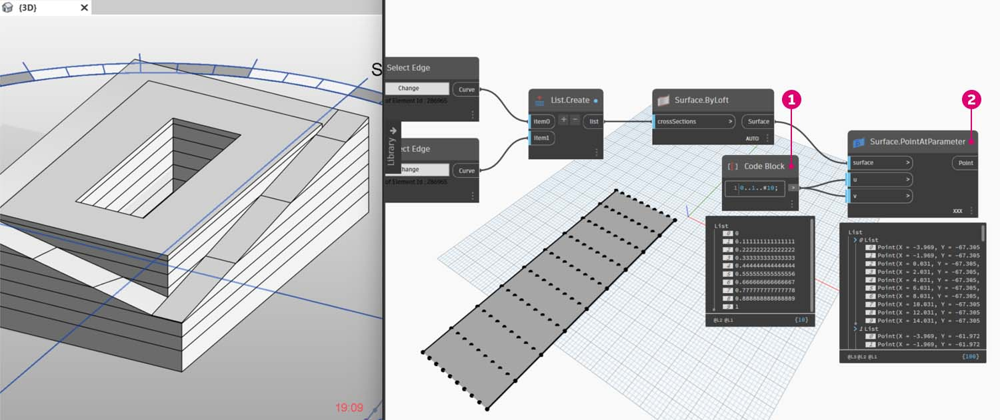

# Personalizzazione

Mentre in precedenza è stata esaminata la modifica della massa di un edificio di base, si vuole approfondire ulteriormente il collegamento di Dynamo/Revit modificando un numero elevato di elementi in un'unica operazione. La personalizzazione su larga scala diventa più complessa, poiché le strutture di dati richiedono operazioni con gli elenchi più avanzate. Tuttavia, i principi alla base della loro esecuzione sono fondamentalmente gli stessi. Verranno esaminate alcune opportunità per l'analisi da un gruppo di componenti adattivi.

### Posizione dei punti

Si supponga di aver creato un'ampia gamma di componenti adattivi e di voler modificare i parametri in base alle relative posizioni dei punti. I punti, ad esempio, potrebbero controllare un parametro di spessore correlato all'area dell'elemento. Oppure potrebbero controllare un parametro di opacità correlato all'esposizione solare durante tutto l'anno. Dynamo consente il collegamento dell'analisi ai parametri in pochi semplici passaggi. Verrà analizzata una versione di base nell'esercizio riportato di seguito.

> Eseguire una query sui punti adattivi del componente adattivo selezionato utilizzando il nodo **AdaptiveComponent.Locations**. Questo consente di utilizzare una versione astratta di un elemento di Revit per l'analisi.

Estraendo la posizione dei punti dei componenti adattivi, è possibile eseguire un'ampia gamma di analisi per tale elemento. Un componente adattivo a quattro punti consentirà, ad esempio, di studiare la deviazione dal piano di un determinato pannello.

### Analisi dell'orientamento solare

> Utilizzare il rimappaggio per associare un gruppo di dati ad un intervallo di parametri. Questo è uno strumento fondamentale utilizzato in un modello parametrico e verrà dimostrato nell'esercizio riportato di seguito.

Utilizzando Dynamo, le posizioni dei punti dei componenti adattivi possono essere utilizzate per creare un piano di adattamento per ogni elemento. È possibile anche eseguire una query sulla posizione del sole nel file di Revit e studiare l'orientamento relativo del piano rispetto al sole confrontandolo con altri componenti adattivi. Eseguire l'impostazione nell'esercizio riportato di seguito creando un tetto algoritmico.

## Esercizio

> Scaricare il file di esempio facendo clic sul collegamento seguente.
>
> Un elenco completo di file di esempio è disponibile nell'Appendice.



Questo esercizio verterà sulle tecniche illustrate nella sezione precedente. In questo caso, verrà definita una superficie parametrica degli elementi di Revit, saranno create istanze di componenti adattivi a quattro punti, che verranno poi modificati in base all'orientamento rispetto al sole.

> 1. Iniziare selezionando due spigoli con il nodo _Select Edge_. I due spigoli sono i tratti lunghi dell'atrio.
> 2. Combinare i due spigoli in un elenco con il nodo _List.Create_.
> 3. Creare una superficie tra i due spigoli con _Surface.ByLoft_.

> 1. Utilizzando _Code Block_, definire un intervallo da 0 a 1 con 10 valori a spaziatura uniforme: `0..1..#10;`.
> 2. Collegare _Code Block_ agli input *u *e _v_ di un nodo _Surface.PointAtParameter_ e collegare il nodo _Surface.ByLoft_ all'input _surface_. Fare clic con il pulsante destro del mouse sul nodo e modificare _Collegamento_ in _Globale_. In questo modo si ottiene una griglia di punti sulla superficie.

Questa griglia di punti funge da punti di controllo per una superficie definita in modo parametrico. Si desidera estrarre le posizioni u e v di ciascuno di questi punti in modo da poterle collegare ad una formula parametrica e mantenere la stessa struttura di dati. A tale scopo, è possibile eseguire una query sulle posizioni dei parametri dei punti appena creati.

> 1. Aggiungere un nodo _Surface.ParameterAtPoint_ all'area di disegno e collegare gli input come mostrato in precedenza.
> 2. Eseguire una query sui valori _u_ di questi parametri con il nodo UV.U.
> 3. Eseguire una query sui valori _v_ di questi parametri con il nodo UV.V.
> 4. Gli output mostrano i valori _u_ e _v_ corrispondenti per ogni punto della superficie. Ora è disponibile un intervallo compreso tra _0_ e _1_ per ogni valore, nella struttura di dati corretta, pertanto è possibile applicare un algoritmo parametrico.

> 1. Aggiungere _Code Block_ all'area di disegno e immettere il codice: `Math.Sin(u*180)*Math.Sin(v*180)*w;`. Si tratta di una funzione parametrica che crea una protuberanza sinusoidale da una superficie piana.
> 2. Collega _UV.U_ all'input _u_ e UV.V all'input _v_.
> 3. L'input _w_ rappresenta l'_ampiezza_ della forma, pertanto si associa _Number Slider_ ad esso.

> 1. Ora è disponibile un elenco di valori come definito dall'algoritmo. Utilizzare questo elenco di valori per spostare i punti verso l'alto nella direzione _+Z_. Utilizzando _Geometry.Translate_, collegare *Code Block *a _zTranslation_ e _Surface.PointAtParameter_ all'input _geometry_. I nuovi punti dovrebbero essere visualizzati nell'anteprima di Dynamo.
> 2. Infine, creare una superficie con il nodo _NurbsSurface.ByPoints_, collegando il nodo del passaggio precedente all'input points. Si ottiene una superficie parametrica. È possibile trascinare il dispositivo di scorrimento per restringere e ingrandire la protuberanza.

Con la superficie parametrica, si vuole definire un modo per suddividerla in pannelli al fine di creare la serie di componenti adattivi a quattro punti. Dynamo non dispone di funzionalità predefinite per la suddivisione della superficie in pannelli, pertanto è possibile accedere alla community per i pacchetti di Dynamo utili.

> 1. Passare a _Pacchetti > Cerca pacchetto_.
> 2. Cercare _LunchBox_ e installare _LunchBox for Dynamo_. Si tratta di un insieme veramente utile di strumenti per le operazioni di geometria come questa.

> 1. Dopo il download, si dispone ora dell'accesso completo alla suite LunchBox. Cercare _Quad Grid_ e selezionare _LunchBox Quad Grid By Face_. Collegare la superficie parametrica all'input _Surface_ e impostare le divisioni _U_ e _V_ su _15_. Nell'anteprima di Dynamo dovrebbe essere visualizzata una superficie in quattro pannelli.

> Se si desidera conoscere la relativa impostazione, è possibile fare doppio clic sul nodo _Lunch Box_ e vedere come viene eseguita.

> Tornando a Revit, si darà un rapido sguardo al componente adattivo utilizzato qui. Non occorre seguirlo, ma questo è il pannello del tetto di cui verrà creata un'istanza. Si tratta di un componente adattivo a quattro punti, che è una rappresentazione approssimata di un sistema ETFE. L'apertura del vuoto centrale si trova su un parametro denominato _Aperture Ratio_.

> 1. Verrà creata un'istanza di molti elementi della geometria in Revit. Assicurarsi quindi di impostare il risolutore Dynamo su _Manuale_.
> 2. Aggiungere un nodo _Family Types_ all'area di disegno e selezionare _ROOF-PANEL-4PT_.
> 3. Aggiungere un nodo _AdaptiveComponent.ByPoints_ all'area di disegno, collegare _Panel Pts_ dall'output _LunchBox Quad Grid by Face_ all'input _points_. Collegare il nodo _Family Types_ all'input _familySymbol.
> 4. Fare clic su _Esegui_. La creazione della geometria in Revit richiederà__ un po' di tempo. Se richiede troppo tempo, ridurre il valore 15 di _Code Block_ ad un numero inferiore. In questo modo si riduce il numero di pannelli sul tetto.

_Nota: se Dynamo richiede molto tempo per il calcolo dei nodi, potrebbe essere necessario utilizzare la funzionalità del nodo Congela per mettere in pausa l'esecuzione delle operazioni di Revit durante lo sviluppo del grafico. Per ulteriori informazioni sul congelamento dei nodi, controllare la sezione Congelamento nel capitolo sui solidi._

> Tornando in Revit, ecco la serie di pannelli sul tetto.

> Eseguendo lo zoom avanti, è possibile osservare più da vicino la qualità della superficie.

### Analisi

> 1. Continuando dal passaggio precedente, proseguire e controllare l'apertura di ogni pannello in base alla sua esposizione al sole. Se si esegue lo zoom in Revit e si seleziona un pannello, sulla barra delle proprietà viene visualizzato il parametro _Aperture Ratio_. La famiglia è impostata in modo che l'apertura sia compresa, approssimativamente, tra _0.05_ e _0.45_.

> 1. Se si osserva il percorso solare, è possibile vedere la posizione corrente del sole in Revit.

> 1. È possibile fare riferimento a questa posizione del sole utilizzando il nodo _SunSettings.Current_.

1. Collegare le impostazioni del sole a _Sunsetting.SunDirection_ per ottenere il vettore solare.
2. Dal nodo _Panel Pts_ utilizzato per creare i componenti adattivi, utilizzare _Plane.ByBestFitThroughPoints_ per approssimare un piano per il componente.
3. Eseguire una query sulla _normale_ di questo piano.
4. Utilizzare il _prodotto scalare_ per calcolare l'orientamento solare. Il prodotto scalare è una formula che determina il possibile grado di parallelismo o antiparallelismo dei due vettori. Quindi utilizzare la normale del piano di ogni componente adattivo e confrontarla con il vettore solare per simulare approssimativamente l'orientamento solare.
5. Utilizzare il _valore assoluto_ del risultato. In questo modo si garantisce che il prodotto scalare sia preciso se la normale del piano è rivolta verso la direzione inversa.
6. Fare clic su _Esegui_.

> 1. Osservando il _prodotto scalare_, si hanno diversi numeri. Si desidera utilizzare la distribuzione relativa, ma è necessario comprimere i numeri nell'intervallo appropriato del parametro _Aperture Ratio_ che si intende modificare.

1. _Math.RemapRange_ è uno strumento eccezionale per questa funzione. Prevede un elenco di input e ne riassocia i limiti a due valori obiettivo.
2. Definire i valori obiettivo come _0.15_ e_0.45_ in _Code Block_.
3. Fare clic su _Esegui_.

> 1. Collegare i valori riassociati ad un nodo _Element.SetParameterByName_.

1. Collegare la stringa _Aperture Ratio_ all'input _parameterName_.
2. Collegare _AdaptiveComponent_ all'input _element_.
3. Fare clic su _Esegui_.

> Tornando in Revit, da lontano è possibile notare l'effetto dell'orientamento solare sull'apertura dei pannelli ETFE.

> Eseguendo lo zoom avanti, si può vedere che i pannelli ETFE sono più vicini alla superficie del sole. L'obiettivo è ridurre il surriscaldamento derivante dall'esposizione solare. Se si desidera far passare più luce in base all'esposizione solare, occorre solo cambiare il dominio in _Math.RemapRange_.
