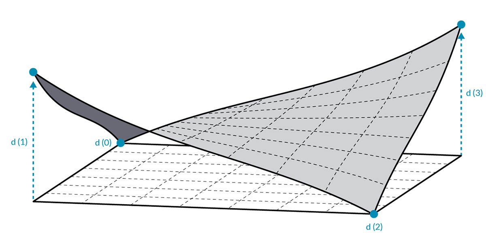
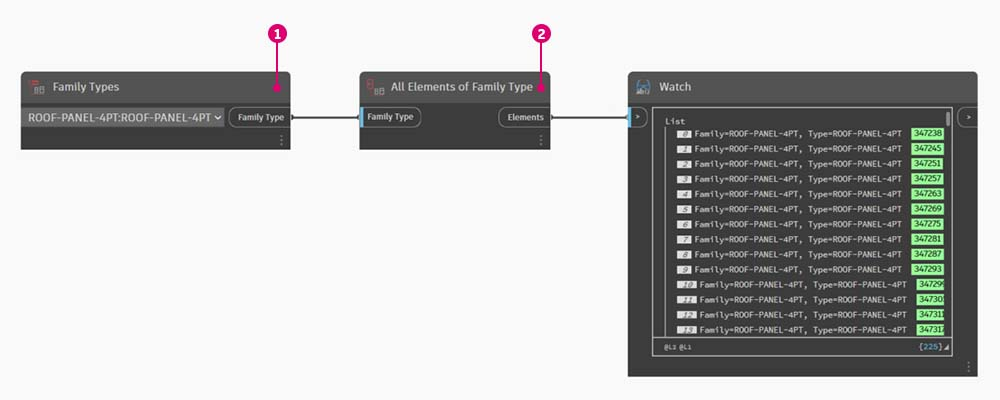
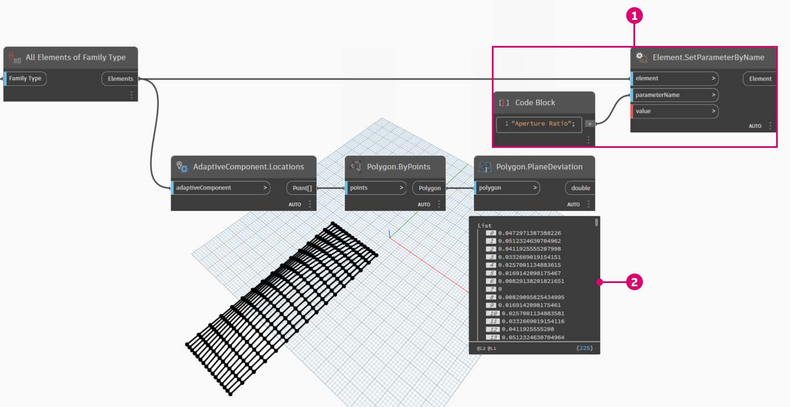

# Dokumentace

Úpravy parametrů dokumentace probíhají podle toho, jak je vysvětleno v předchozích částech. V této části se podíváme na parametry úprav, které nemají vliv na geometrické vlastnosti prvků, ale místo toho si připravíme soubor aplikace Revit pro dokumentaci.

### Odchylka

V níže uvedeném cvičení použijeme základní odchylku od uzlu roviny k vytvoření výkresu aplikace Revit pro dokumentaci. Každý panel na parametricky definované střešní konstrukci má jinou hodnotu odchylky. Chceme vyřadit rozsah hodnot pomocí barvy a naplánováním adaptivních bodů, které předáme konzultantovi fasád, inženýrovi nebo dodavateli.

> Odchylka od uzlu roviny vypočítá vzdálenost, o kterou se sada čtyř bodů liší od roviny optimálního proložení mezi nimi. Je to rychlý a snadný způsob, jak studovat proveditelnost stavby.

## Cvičení

### Část I: Nastavení poměru otvoru panelů na základě odchylky od uzlu roviny

> Kliknutím na odkaz níže si stáhněte vzorový soubor.
>
> Úplný seznam vzorových souborů najdete v dodatku.



Začněte se souborem aplikace Revit pro tuto část (nebo pokračujte od předchozí části). Tento soubor má pole panelů ETFE na střeše. Na tyto panely se budeme odkazovat v tomto cvičení.

> 1. Přidejte na kreslicí plochu uzel _Family Types_ a vyberte položku _ROOF-PANEL-4PT_.
> 2. Tento uzel připojte k uzlu Select _All Elements of Family Type_, abyste do aplikace Dynamo načetli všechny prvky z aplikace Revit.

> 1. Pomocí uzlu _AdaptiveComponent.Locations_ můžete dotazovat umístění adaptivních bodů pro každý prvek.
> 2. Vytvořte polygon z těchto čtyř bodů pomocí uzlu _Polygon.ByPoints_. Všimněte si, že nyní máme abstraktní verzi panelového systému v aplikaci Dynamo, aniž by bylo nutné importovat úplnou geometrii prvku aplikace Revit.
> 3. Vypočtěte rovinnou odchylku pomocí uzlu _Polygon.PlaneDeviation_.

Stejně jako v předchozím cvičení nastavíme poměr otvoru každého panelu podle jeho rovinné odchylky.

> 1. Přidejte na kreslicí plochu uzel _Element.SetParameterByName_ a připojte adaptivní komponenty ke vstupu _prvku_. Připojte _blok kódu_, který načte hodnotu _Aperture Ratio_ do vstupu _parameterName_.
> 2. Výsledky odchylek nelze přímo připojit ke vstupu hodnoty, protože je potřeba hodnoty přemapovat na rozsah parametrů.

> 1. Pomocí uzlu _Math.RemapRange_ přemapujte hodnoty odchylek do domény mezi 0.15 a 0_._45 zadáním `0.15; 0.45;` do _bloku kódu_.
> 2. Tyto výsledky zapište do hodnoty vstupu pro _Element.SetParameterByName_.

V aplikaci Revit můžeme _trochu_ pochopit změny otevření napříč povrchem.

Po přiblížení je zřejmé, že uzavřené panely jsou zatíženy vůči rohům povrchu. Otevřené rohy jsou směrem k horní části. Rohy představují oblasti větší odchylky, zatímco vyboulení má minimální zakřivení, což dává smysl.

### Část II: Barva a dokumentace

Nastavení Aperture Ratio jasně nedemonstruje odchylku panelů na střeše a také měníme geometrii skutečného prvku. Předpokládejme, že chceme pouze prozkoumat odchylku z hlediska proveditelnosti výroby. Bylo by užitečné vybarvit panely podle rozsahu odchylky pro naši dokumentaci. To můžeme provést pomocí řady kroků uvedených níže a velmi podobným postupem jako výše uvedené kroky.

> 1. Odstraňte uzel _Element.SetParameterByName_ a jeho vstupní uzly a přidejte uzel _Element.OverrideColourInView_.
> 2. Přidejte na kreslicí plochu uzel _Color Range_ a zadejte do vstupu barvy _Element.OverrideColorInView_. Aby bylo možné vytvořit gradient, je nutné propojit hodnoty odchylek s barevným rozsahem.
> 3. Pozastavením ukazatele myši nad vstupem _value_ lze vidět, že hodnoty pro vstup musí být mezi hodnotami _0_ a _1_, aby bylo možné mapovat barvu na každou hodnotu. Hodnoty odchylek je nutné přemapovat do tohoto rozsahu.

> 1. Pomocí uzlu _Math.RemapRange_ přemapujte hodnoty odchylky roviny do rozsahu od* 0* do _1_. (Poznámka: Pomocí uzlu _MapTo_ můžete také definovat zdrojovou doménu.)
> 2. Vložte výsledky do uzlu _Color Range_.
> 3. Všimněte si, že náš výstup je rozsah barev místo rozsahu čísel.
> 4. Pokud máte nastavenou možnost Ruční, klikněte na tlačítko _Spustit_. Od této chvíle si vystačíte s nastavením Automaticky.

V aplikaci Revit vidíme mnohem čitelnější gradient, který je reprezentativní pro rovinnou odchylku podle našeho rozsahu barev. Ale co když chceme přizpůsobit barvy? Minimální hodnoty odchylek jsou znázorněny červeně, což se zdá být opak toho, co bychom očekávali. Chceme mít maximální odchylku červenou a minimální odchylkou reprezentovanou klidnější barvou. Vraťme se zpátky do aplikace Dynamo, kde to opravíme.

> 1. Pomocí _bloku kódu_ přidejte dvě čísla na dva různé řádky: `0;` a `255;`.
> 2. Vytvořte červenou a modrou barvu zadáním příslušných hodnot do dvou uzlů _Color.ByARGB_.
> 3. Vytvořte seznam z těchto dvou barev.
> 4. Tento seznam vložte do vstupu _colors_ uzlu _Color Range_ a sledujte, jak se aktualizuje vlastní rozsah barev.

V aplikaci Revit nyní můžeme lépe rozpoznat oblasti maximální odchylky v rozích. Tento uzel slouží k přepsání barvy v pohledu, takže může být skutečně užitečné, pokud máme konkrétní výkres v sadě výkresů, které se soustředí na konkrétní typ analýzy.

.jpg)

### Část III: Plánování

Po výběru jednoho panelu ETFE v aplikaci Revit se zobrazí čtyři parametry instance: XYZ1, XYZ2, XYZ3, a XYZ4. Po vytvoření jsou všechny prázdné. Jedná se o textově orientované parametry a potřebují hodnoty. Pomocí aplikace Dynamo zapíšeme umístění adaptivních bodů do každého parametru. To napomáhá interoperabilitě, pokud je nutné geometrii poslat inženýrovi nebo konzultantovi fasád.

Ve vzorovém výkresu máme velký prázdný výkaz. Parametry XYZ jsou sdílené parametry v souboru aplikace Revit, které nám umožňují přidat je do výkazu.

.jpg)

Po přiblížení vidíme, že parametry XYZ nejsou dosud vyplněny. Aplikace Revit spravuje první dva parametry.

.jpg)

K zápisu do těchto hodnot provedeme složitou operaci nad seznamem. Samotný graf je jednoduchý, ale koncepty vychází z mapování seznamu, jak je popsáno v kapitole o seznamech.

> 1. Vyberte všechny adaptivní komponenty se dvěma uzly.
> 2. Extrahujte umístění každého bodu pomocí uzlu _AdaptiveComponent.Locations_.
> 3. Převeďte tyto body na řetězce. Nezapomeňte, že parametr je textový, takže je potřeba zadat správný typ dat.
> 4. Vytvořte seznam čtyř řetězců definujících parametry, které chcete změnit: _XYZ1, XYZ2, XYZ3_ a _XYZ4_.
> 5. Tento seznam vložte do vstupu _parameterName_ pro uzel _Element.SetParameterByName_.
> 6. Spojte uzel _Element.SetParameterByName_ se vstupem _combinator_ uzlu _List.Combine._ Připojte vstup _adaptive components_ ke vstupu _list1_. Připojte uzel _String_ z uzlu String from Object ke vstupu _list2_.

Zde mapujeme seznam, protože zapisujeme čtyři hodnoty pro každý prvek, který vytvoří složitou datovou strukturu. Uzel _List.Combine_ definuje operaci o jeden krok níže v hierarchii dat. Proto jsou vstupy element a value uzlu _Element.SetParameterByName_ ponechány prázdné. Uzel _List.Combine_ připojuje podseznamy svých vstupů k prázdným vstupům uzlu _List.SetParameterByName_ podle pořadí jejich připojení.

Po výběru panelu v aplikaci Revit nyní vidíme, že pro každý parametr máme hodnoty řetězce. Ve skutečnosti vytvoříme jednodušší formát pro zápis bodu (X,Y,Z). To lze provést pomocí řetězcových operací v aplikaci Dynamo, ale to nyní obejdeme, abychom neodbočovali od tématu.

.jpg)

Pohled ukázkového výkazu s vyplněnými parametry.

.jpg)

Každý panel ETFE nyní obsahuje souřadnice XYZ zapsané pro každý adaptivní bod, což představuje rohy jednotlivých panelů pro výrobu.

.jpg)
