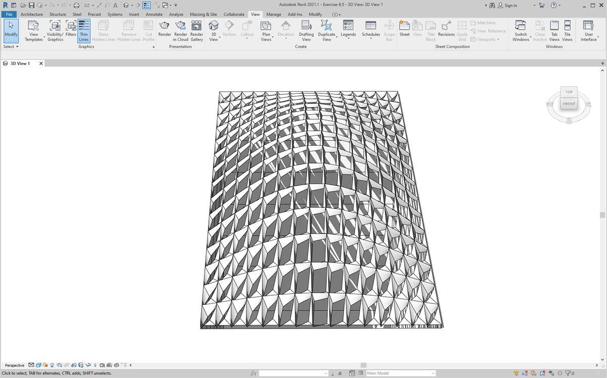
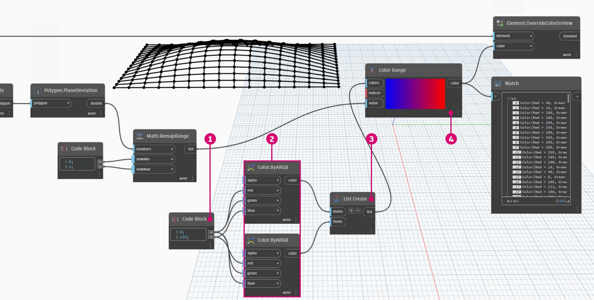
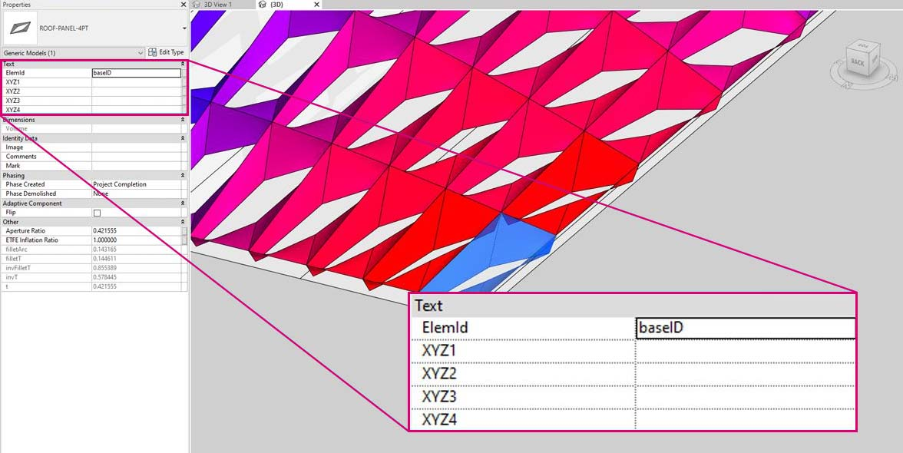

# 문서화

문서화를 위한 편집 매개변수에서는 이전 섹션에서 학습한 내용을 따릅니다. 이 섹션에서는 요소의 기하학적 특성에 영향을 주지 않고, 문서화를 위해 Revit 파일을 준비하는 편집 매개변수를 살펴봅니다.

### 편차

아래 연습에서는 평면 노드에서의 기본 편차를 사용하여 문서화를 위한 Revit 시트를 작성합니다. 파라메트릭 방식으로 정의된 지붕 구조의 각 패널은 편차 값이 다르므로, 색상을 사용하여 값 범위를 나타내고, 가변 점을 정면 컨설턴트, 엔지니어 또는 계약업체에 전달하도록 스케줄링합니다.

> 평면 노드와의 편차를 사용하면 점이 4개인 세트가 각 점 간에 가장 적합한 맞춤 평면에서 벗어나는 거리가 계산됩니다. 이 방법은 시공 가능성을 연구하는 빠르고 쉬운 방법입니다.

## 연습

### I부: 평면 노드에서의 편차를 기준으로 패널 조리개 비율 설정

> 아래 링크를 클릭하여 예제 파일을 다운로드하십시오.
>
> 전체 예제 파일 리스트는 부록에서 확인할 수 있습니다.



이 섹션의 Revit 파일로 시작하거나 이전 섹션부터 계속 진행합니다. 이 파일의 경우 지붕에 ETFE 패널 배열이 있습니다. 이 연습에서는 이러한 패널을 참조합니다.

> 1. 캔버스에 _Family Types_ 노드를 추가하고 _"ROOF-PANEL-4PT"_를 선택합니다.
> 2. 이 노드를 _All Elements of Family Type_ 노드에 연결하여 Revit에서 Dynamo로 모든 요소를 가져옵니다.

> 1. _AdaptiveComponent.Locations_ 노드를 사용하여 각 요소에 대한 가변 점의 위치를 조회합니다.
> 2. _Polygon.ByPoints_ 노드를 사용하여 이러한 4개의 점에서 다각형을 작성합니다. 이제 Revit 요소의 전체 형상을 가져오지 않고도 Dynamo에서 패널화된 시스템의 추상 버전이 제공됩니다.
> 3. _Polygon.PlaneDeviation_ 노드를 사용하여 평면 편차를 계산합니다.

재미 삼아 이전 연습처럼 해당 평면 편차를 기준으로 각 패널의 조리개 비율을 설정해 보겠습니다.

> 1. 캔버스에 _Element.SetParameterByName_ 노드를 추가하고 가변 구성요소를 _element_ 입력에 연결합니다. _"Aperture Ratio"_ 를 읽는 _Code Block_ 을 _parameterName_ 입력에 연결합니다.
> 2. 값을 매개변수 범위에 다시 매핑해야 하기 때문에 편차 결과를 값 입력에 직접 연결할 수 없습니다.

> 1. _Math.RemapRange_를 사용하고 _Code Block_에 `0.15; 0.45;`를 입력하여 편차 값을 0.15~ 0_._45 사이의 도메인에 다시 매핑합니다.
> 2. 이러한 결과를 _Element.SetParameterByName_ 의 값 입력에 연결합니다.

다시 Revit으로 돌아오면 표면의 조리개 변경을 _이해할 수 있습니다_.

확대하면 닫힌 패널에 표면의 코너 쪽으로 가중치가 부여되는 것을 명확히 확인할 수 있습니다. 열린 코너는 상단을 향합니다. 그 이유는 벌지는 최소 곡률을 갖지만 코너는 더 큰 편차 영역을 나타내기 때문입니다.

### 2부: 색상 및 문서화

조리개 비율을 설정해도 지붕에 있는 패널의 편차가 명확하게 표시되지 않으므로 실제 요소의 형상도 변경합니다. 제작 실행 가능성의 관점에서만 편차를 연구한다고 가정해 보겠습니다. 문서화를 위해 편차 범위를 기준으로 패널에 색상을 지정하는 것이 도움이 될 수 있습니다. 아래에 제시된 일련의 단계(위 단계의 프로세스와 매우 유사함)를 통해 이 작업을 수행할 수 있습니다.

> 1. _Element.SetParameterByName_과 해당 입력 노드를 제거하고 _Element.OverrideColorInView_를 추가합니다.
> 2. 캔버스에 _Color Range_ 노드를 추가하고 _Element.OverrideColorInView_ 의 색상 입력에 연결합니다. 그라데이션을 작성하려면 여전히 편차 값을 색상 범위에 연결해야 합니다.
> 3. _value_ 입력 위에 커서를 놓으면 각 값에 색상을 매핑하기 위해 입력 값이 _0_ 에서 _1_ 사이여야 함을 알 수 있습니다. 편차 값을 이 범위로 다시 매핑해야 합니다.

> 1. _Math.RemapRange_를 사용하여 평면 편차 값을 *0*에서 _1_ 사이의 범위로 다시 매핑합니다. (참고: _"MapTo"_ 노드를 사용하여 소스 도메인도 정의할 수 있습니다.)
> 2. 결과를 _Color Range_ 노드에 연결합니다.
> 3. 출력은 숫자 범위가 아니라 색상 범위입니다.
> 4. 수동으로 설정한 경우 _실행_ 을 누릅니다. 이 시점부터는 계속 수동으로 설정해서 작업하는 것이 좋습니다.

다시 Revit으로 돌아가면 색상 범위를 기준으로 하는 평면 편차를 나타내는 훨씬 더 확실한 그라데이션이 표시됩니다. 하지만 색상을 사용자화하려면 어떻게 해야 할까요? 최소 편차 값은 빨간색으로 표시되는데 이는 우리가 예상했던 것과 반대인 것 같습니다. 우리는 최대 편차를 빨간색으로 표시하고 최소 편차는 좀 더 차분한 색상으로 표시하려고 합니다. Dynamo로 돌아가서 이 문제를 해결하십시오.

> 1. _code block_을 사용하여 두 개의 다른 줄에 `0;` 및 `255;`의 두 숫자를 추가합니다.
> 2. 해당 값을 두 개의 _Color.ByARGB_ 노드에 연결하여 빨간색과 파란색을 작성합니다.
> 3. 이 두 가지 색상에서 리스트를 작성합니다.
> 4. 이 리스트를 _Color Range_ 의 _colors_ 입력에 연결하고 사용자 색상 범위 업데이트를 확인합니다.

Revit으로 돌아가면 이제 코너의 최대 편차 영역이 더 잘 구분됩니다. 이 노드는 뷰의 색상을 재지정하기 위한 것이므로, 도면 세트에 특정 유형의 해석에 중점을 둔 특정 시트가 있는 경우에 정말 유용할 수 있습니다.

.jpg)

### 3부: 일정

Revit에서 하나의 ETFE 패널을 선택하면 XYZ1, XYZ2, XYZ3 및 XYZ4의 4개 인스턴스 매개변수가 있는 것을 볼 수 있습니다. 이러한 매개변수는 작성된 후에 모두 비어 있습니다. 이러한 매개변수는 텍스트 기반 매개변수이며 값이 필요합니다. Dynamo를 사용하여 각 매개변수에 가변 점 위치를 작성합니다. 이렇게 하면 형상을 정면 컨설턴트 엔지니어에게 보내야 할 경우 상호 운용성이 향상됩니다.

샘플 시트에는 비어 있는 큰 일람표가 있습니다. XYZ 매개변수는 Revit 파일의 공유 매개변수이므로 일람표에 추가할 수 있습니다.

.jpg)

확대해 보면 XYZ 매개변수는 이미 채워져 있습니다. 처음 두 매개변수는 Revit에서 제어됩니다.

.jpg)

이러한 값을 작성하기 위해 복잡한 리스트 작업을 수행하겠습니다. 그래프 자체는 간단하지만, 리스트 장에 설명된 것처럼 개념은 주로 리스트 매핑에서 만들어집니다.

> 1. 두 개의 노드가 있는 모든 가변 구성요소를 선택합니다.
> 2. _AdaptiveComponent.Locations_ 를 사용하여 각 점의 위치를 추출합니다.
> 3. 이러한 점을 문자열로 변환합니다. 매개변수는 텍스트 기반이므로 올바른 데이터 유형을 입력해야 합니다.
> 4. 변경할 매개변수를 정의하는 4개의 문자열(_XYZ1, XYZ2, XYZ3,_ 및 _XYZ4_) 리스트를 작성합니다.
> 5. 이 리스트를 _Element.SetParameterByName_ 의 _parameterName_ 입력에 연결합니다.
> 6. _Element.SetParameterByName_ 을 _List.Combine_ 의 _combinator_ 입력에 연결합니다. _가변 구성요소_ 를 _list1_ 에 연결합니다. 객체의 _String_ 을 _list2_ 에 연결합니다.

여기서는 각 요소에 대해 4개의 값을 작성하여 복잡한 데이터 구조를 작성하게 되므로 리스트 매핑이 진행됩니다. _List.Combine_ 노드에서는 데이터 계층에서 한 단계 아래에 작업을 정의합니다. 이것이 바로 _Element.SetParameterByName_ 의 요소 및 값 입력이 비어 있는 이유입니다. _List.Combine_ 은 해당 입력의 하위 리스트를 연결된 순서에 따라 _Element.SetParameterByName_ 의 빈 입력에 연결합니다.

Revit에서 패널을 선택하면 각 매개변수에 대해 문자열 값이 표시되는 것을 볼 수 있습니다. 실제로는 점(X,Y,Z)을 작성하기 위한 보다 간단한 형식을 작성할 수 있습니다. 이 작업은 Dynamo에서 문자열 연산으로 수행할 수 있지만 여기서는 이 장의 범위를 벗어나지 않기 위해 해당 내용은 다루지 않습니다.

.jpg)

매개변수가 채워진 샘플 일람표의 뷰입니다.

.jpg)

이제 각 ETFE 패널에는 제작을 위한 각 패널의 코너를 나타내는 각 가변 점에 대해 XYZ 좌표가 작성되었습니다.

.jpg)
