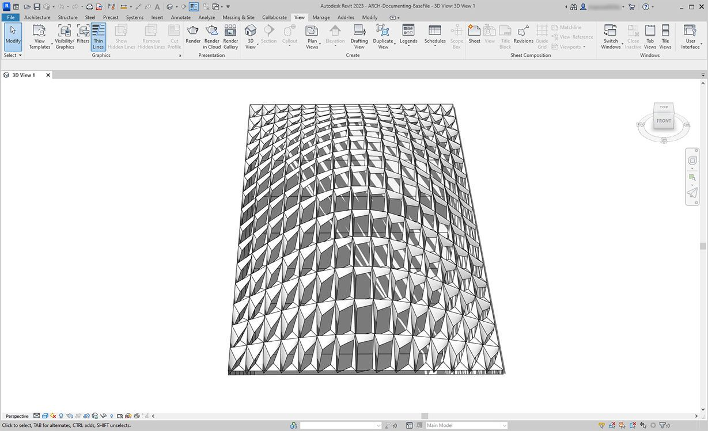
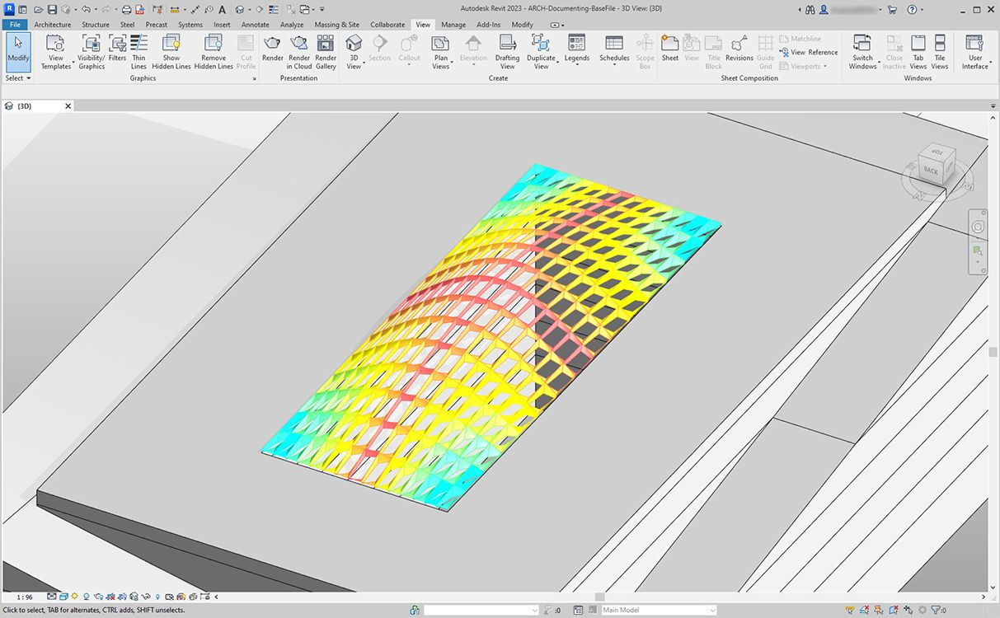

# 记录

编辑文档记录的参数时遵循前面几节课程中学到的经验教训。在本节中，我们将查看编辑参数，这些参数不会影响图元的几何特性，而是为文档记录准备 Revit 文件。

### 偏离

在下面的练习中，我们将使用与平面节点的基本偏差，来为文档记录创建 Revit 图纸。参数化定义的屋顶结构上的每个嵌板都有不同的偏差值，我们希望使用颜色来突出值的范围，并通过安排自适应点来移交给外立面顾问、工程师或承包商。

> “与平面的偏差”节点将计算四个点集与它们之间的最佳拟合平面之间的距离。这是一种研究可施工性快速而简便的方法。

## 练习

### 第 I 部分：基于平面节点偏差设置嵌板孔径比

> 单击下面的链接下载示例文件。
>
> 可以在附录中找到示例文件的完整列表。



从本部分的 Revit 文件开始（或从上一部分继续）。此文件中具有屋顶上 ETFE 嵌板的阵列。在本练习中，我们将参照这些嵌板。

\

> 1. 向画布添加_“族类型”_节点，然后选择_“ROOF-PANEL-4PT”_。
> 2. 将此节点连接到“选择_族类型的所有图元_”节点，以将所有图元从 Revit 输入到 Dynamo。

\

> 1. 使用_“AdaptiveComponent.Locations”_节点查询每个图元的自适应点位置。
> 2. 使用_“Polygon.ByPoints”_节点基于这四个点创建多边形。请注意，我们现在在 Dynamo 中拥有镶板系统的抽象版本，无需输入 Revit 图元的完整几何图形。
> 3. 使用_“Polygon.PlaneDeviation”_节点计算平面偏差。

接下来，与上一练习一样，我们会根据每个嵌板的平面偏差设置其孔径比。

\

> 1. 将_“Element.SetParameterByName”_节点添加到画布，然后将自适应构件连接到_“element”_输入。将读取_“Aperture Ratio”_的_“代码块”_连接到_“parameterName”_输入。
> 2. 我们无法直接将偏差结果连接到值输入，因为我们需要将这些值重新映射到参数范围。

\

> 1. 使用_“Math.RemapRange”_，通过在_“代码块”_中输入 `0.15; 0.45;`，将偏差值重新映射到介于 0.15 和 0.45 之间的域。
> 2. 将这些结果连接到_“Element.SetParameterByName”_的值输入。

返回 Revit，我们可以_稍微_了解曲面上孔径的变化。

放大后，可以更清楚地看到闭合的嵌板在曲面的各个角落上都具有权重。开口角点朝向顶部。角点表示偏差较大的区域，而凸度具有最小曲率，因此这很有意义。

### 第 II 部分：颜色和文档

设置“Aperture Ratio”并不能清楚地显示屋顶上嵌板的偏差，而且我们还要修改实际图元的几何图形。假定我们只想研究制造可行性的偏差。根据我们文档的偏差范围对嵌板进行着色会很有帮助。我们可以通过以下一系列步骤实现，并且过程与上述步骤非常相似。

\

> 1. 删除_“Element.SetParameterByName”_及其输入节点，然后添加_“Element.OverrideColorInView”_。
> 2. 将_“Color Range”_节点添加到画布，然后连接到_“Element.OverrideColorInView”_的颜色输入。为了创建渐变，我们仍需将偏差值连接到颜色范围。
> 3. 将光标悬停在_“value”_输入上时，我们可以看到输入值必须介于 _0_ 和 _1_ 之间，以便将颜色映射到每个值。我们需要将偏差值重新映射到此范围。

\

> 1. 使用_“Math.RemapRange”_，将平面偏差值重新映射到介于 *0* 和 _1_ 之间的范围（注意：也可以使用_“MapTo”_节点定义源域）。
> 2. 将结果连接到_“Color Range”_节点。
> 3. 请注意，我们的输出是颜色范围，而不是数字范围。
> 4. 如果设置为“手动”，请点击_“运行”_。此时，应该能够无需再设置为“自动”。

返回 Revit，我们看到了更清晰的渐变，它代表了基于我们颜色范围的平面偏差。如果我们要自定义颜色，该怎么办？请注意，最小偏差值以红色表示，这似乎与我们的预期相反。我们希望最大偏差以红色表示，最小偏差以较柔和的颜色表示。我们返回 Dynamo，然后修复此问题。

\

> 1. 使用_“代码块”_，在两个不同代码行上添加两个数字：`0;` 和 `255;`。
> 2. 通过将相应值连接到两个_“Color.ByARGB”_节点，即可创建红色和蓝色。
> 3. 以这两种颜色创建列表。
> 4. 将此列表连接到_“Color Range”_的_“colors”_输入，然后观察自定义颜色范围更新。

返回 Revit，我们现在可以更好地了解角点中偏差最大的区域。请记住，此节点用于替代视图中的颜色，因此如果我们在专注于特定分析类型的图形集中有特定图纸，这将非常有用。

\.jpg>)

### 第 III 部分：明细表

在 Revit 中选择一个 ETFE 嵌板，我们会看到有四个实例参数：XYZ1、XYZ2、XYZ3 和 XYZ4。创建这些参数后，它们的内容都为空。这些是基于文字的参数，都需要值。我们会使用 Dynamo 将自适应点位置写入每个参数。如果需要将几何图形发送给外立面顾问工程师，这有助于实现互操作性。

\

在样例图纸中，我们有一个大的空明细表。XYZ 参数是 Revit 文件中的共享参数，这样我们便可将它们添加到明细表中。

\.jpg>)

放大后，XYZ 参数尚未填充。前两个参数由 Revit 处理。

\.jpg>)

要写入这些值，我们将执行复杂的列表操作。该图本身很简单，但这些概念主要基于列表一章中讨论的列表映射进行构建。

\

> 1. 选择所有具有两个节点的自适应构件。
> 2. 使用_“AdaptiveComponent.Locations”_提取每个点的位置。
> 3. 将这些点转换为字符串。请记住，参数基于文字，因此我们需要输入正确的数据类型。
> 4. 创建包含四个字符串的列表，该列表定义要更改的参数：_XYZ1、XYZ2、XYZ3_ 和 _XYZ4_。
> 5. 将此列表连接到_“Element.SetParameterByName”_的_“parameterName”_输入。
> 6. 将_“Element.SetParameterByName”_连接到_“List.Combine”_的_“combinator”_输入。将_自适应构件_连接到_“list1”_。将 Object 的_“String”_连接到_“list2”_。

我们在此处进行列表映射，因为我们要为每个图元编写四个值，从而创建一个复杂的数据结构。_“List.Combine”_节点在数据层次结构中定义一个向下步骤的操作。这就是_“Element.SetParameterByName”_的图元和值输入保留为空的原因。根据_“Element.SetParameterByName”_的空输入的连接顺序，_“List.Combine”_会将其输入的子列表连接到这些空输入。

在 Revit 中选择一个嵌板后，现在会看到每个参数都有字符串值。实际上，我们将创建更简单的格式来写入点 (X,Y,Z)。这可以在 Dynamo 中使用字符串操作完成，但我们会绕过此处以停留在本章的范围内。

\.jpg>)

样例明细表的视图，其中已填充参数。

\.jpg>)

现在，每个 ETFE 嵌板都为每个自适应点写入了 XYZ 坐标，从而表示要预制的每个嵌板的角点。

\.jpg>)
