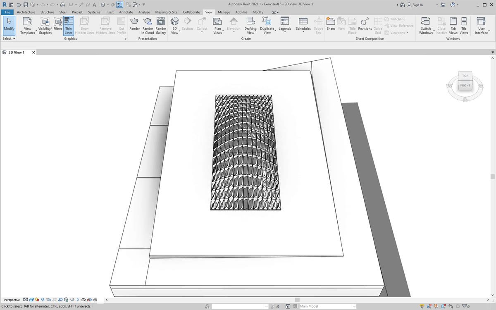

# Dokumentowanie

Edytowanie parametrów na potrzeby dokumentacji odbywa się zgodnie z informacjami przedstawionymi w poprzednich sekcjach. W tej części omówione zostanie edytowanie parametrów, które nie mają wpływu na właściwości geometryczne elementu, lecz pozwalają przygotować plik programu Revit do dokumentacji.

### Odchyłka

W poniższym ćwiczeniu użyjemy podstawowego odchylenia od węzła płaszczyzny, aby utworzyć arkusz programu Revit do dokumentacji. Każdy panel w konstrukcji dachu zdefiniowanej parametrycznie ma inną wartość odchylenia. Chcemy odwoływać się do zakresu wartości za pomocą koloru i zestawiając punkty adaptacyjne w celu przekazania ich konsultantowi, inżynierowi lub wykonawcy fasady.

> Odchylenie od węzła płaszczyzny spowoduje obliczenie odległości, o jaką zestaw czterech punktów odbiega od najlepiej dopasowanej płaszczyzny między nimi. Jest to szybki i łatwy sposób na zbadanie możliwości realizacji projektu.

## Ćwiczenie

### Część I. Ustawianie współczynnika apertury paneli na podstawie odchylenia od węzła płaszczyzny

> Pobierz plik przykładowy, klikając poniższe łącze.
>
> Pełna lista plików przykładowych znajduje się w załączniku.



Rozpocznij od pliku programu Revit dla tej sekcji (lub kontynuuj pracę z plikiem z poprzedniej sekcji). Ten plik zawiera szyk paneli ETFE na dachu. W ramach tego ćwiczenia będziemy odwoływać się do tych paneli.

> 1. Dodaj węzeł _Family Types_ do obszaru rysunku i wybierz opcję _„ROOF-PANEL-4PT”_.
> 2. Podłącz ten węzeł do węzła _All Elements of Family Type_, aby pobrać wszystkie elementy z programu Revit do dodatku Dynamo.

> 1. Za pomocą węzła _AdaptiveComponent.Locations_ sprawdź położenie poszczególnych punktów adaptacyjnych dla każdego elementu.
> 2. Utwórz wielobok z tych czterech punktów za pomocą węzła _Polygon.ByPoints_. Zwróć uwagę, że obecnie w dodatku Dynamo jest dostępna abstrakcyjna wersja systemu panelowanego bez konieczności importowania pełnej geometrii elementu programu Revit.
> 3. Oblicz odchylenie od płaszczyzny za pomocą węzła _Polygon.PlaneDeviation_.

Podobnie jak w poprzednim ćwiczeniu, w celu przeprowadzenia testu ustawmy współczynnik apertury każdego panelu na podstawie jego odchylenia od płaszczyzny.

> 1. Dodaj węzeł _Element.SetParameterByName_ do obszaru rysunku i połącz komponenty adaptacyjne z wejściem _element_. Węzeł _Code Block_ z ciągiem _„Aperture Ratio”_ połącz z wejściem _parameterName_.
> 2. Nie można bezpośrednio połączyć wyników odchylenia z wejściem wartości, ponieważ należy ponownie odwzorować te wartości na zakres parametrów.

> 1. Używając węzła _Math.RemapRange_, ponownie odwzoruj wartości odchylenia na domenę o zakresie od 0,15 do 0\_,\_45 przez wprowadzenie `0.15; 0.45;` w węźle _Code Block_.
> 2. Podłącz te wyniki do wejścia value węzła _Element.SetParameterByName_.

W programie Revit można _w pewnym sensie_ zinterpretować zmianę apertury na całej powierzchni.

Po powiększeniu staje się jasne, że panele zamknięte przeważają bliżej narożników powierzchni. Otwarte narożniki przeważają u góry. Narożniki reprezentują obszary o większym odchyleniu, podczas gdy wypukłość ma minimalną krzywiznę, więc ma to sens.

### Część II. Kolor i dokumentacja

Ustawienie współczynnika apertury nie wykazuje wyraźnie odchylenia paneli na dachu, a zmieniamy również geometrię rzeczywistego elementu. Załóżmy, że chcemy tylko zbadać odchylenie z punktu widzenia wykonalności elementów produkcyjnych. Pomocne byłoby nadanie kolorów panelom na podstawie zakresu odchylenia dla dokumentacji. Możemy to zrobić za pomocą serii kroków poniżej i w bardzo podobnym procesie do przedstawionego w krokach powyżej.

> 1. Usuń węzeł _Element.SetParameterByName_ i jego węzły wejściowe, a następnie dodaj węzeł _Element.OverrideColorInView_.
> 2. Dodaj węzeł _Color Range_ do obszaru rysunku. Następnie podłącz go do wejścia color węzła _Element.OverrideColorInView_. Nadal musimy połączyć wartości odchyleń z zakresem kolorów, aby utworzyć gradient.
> 3. Po ustawieniu kursora na wejściu _value_ można zauważyć, że wartości dla tego wejścia muszą zawierać się między _0_ a _1_, aby można było odwzorować kolor na każdą z wartości. Musimy ponownie odwzorować wartości odchylenia na ten zakres.

> 1. Używając węzła _Math.RemapRange_, ponownie odwzoruj wartości odchylenia od płaszczyzny na zakres od\* 0\* do _1_ (uwaga: można również użyć węzła _„MapTo”_, aby zdefiniować domenę źródłową).
> 2. Podłącz wyniki do węzła _Color Range_.
> 3. Zauważ, że wyjście stanowi zakres kolorów, a nie zakres liczb.
> 4. Jeśli ustawiono opcję uruchamiania ręcznego, kliknij przycisk _Uruchom_. Od tego momentu powinno być możliwe bezproblemowe korzystanie z opcji uruchamiania automatycznego.

W programie Revit widzimy znacznie czytelniejszy gradient, który reprezentuje odchylenie od płaszczyzny za pomocą zakresu kolorów. Jak jednak można dostosować te kolory? Minimalne wartości odchylenia są reprezentowane kolorem czerwonym, a więc odwrotnie do oczekiwań. Chcemy, aby maksymalne odchylenie miało kolor czerwony, a minimalne — kolor spokojniejszy. Wróćmy do dodatku Dynamo i poprawmy to.

> 1. Używając węzła _Code Block_, dodaj dwie liczby w dwóch różnych wierszach: `0;` i `255;`.
> 2. Utwórz kolor czerwony i niebieski, podłączając odpowiednie wartości do dwóch węzłów _Color.ByARGB_.
> 3. Utwórz z tych dwóch kolorów listę.
> 4. Podłącz tę listę do wejścia _colors_ węzła _Color Range_ i obserwuj aktualizację niestandardowego zakresu kolorów.

W programie Revit łatwiej jest teraz zrozumieć obszary maksymalnego odchylenia w narożnikach. Ten węzeł służy do nadpisywania koloru w widoku, więc dobrym rozwiązaniem jest używanie w zestawie rysunków określonych arkuszy poświęconych konkretnym typom analiz.

.jpg>)

### Część III. Zestawienia

Po wybraniu jednego panelu ETFE w programie Revit widoczne są cztery parametry wystąpienia: XYZ1, XYZ2, XYZ3 i XYZ4. Po utworzeniu wszystkie są puste. Są to parametry tekstowe i wymagają wartości. Użyjemy dodatku Dynamo do zapisania położeń punktów adaptacyjnych dla każdego parametru. Ułatwia to współdziałanie, jeśli geometrię trzeba wysłać do inżyniera na potrzeby doradztwa w sprawie fasady.

W przykładowym arkuszu mamy duże, puste zestawienie. Parametry XYZ są współdzielone w pliku programu Revit, co pozwala dodać je do zestawienia.

.jpg>)

Po powiększeniu widzimy, że parametry XYZ nie są jeszcze wypełnione. Pierwsze dwa parametry są obsługiwane przez program Revit.

.jpg>)

Aby zapisać te wartości, wykonamy złożoną operację na liście. Sam wykres jest prosty, ale używane koncepcje opierają się w znacznym stopniu na odwzorowaniu listy omówionym w rozdziale poświęconym listom.

> 1. Wybierz wszystkie komponenty adaptacyjne z dwoma węzłami.
> 2. Wyodrębnij położenie każdego punktu za pomocą węzła _AdaptiveComponent.Locations_.
> 3. Przekształć te punkty w ciągi. Pamiętaj, że parametr jest oparty na tekście, dlatego trzeba wprowadzić poprawny typ danych.
> 4. Utwórz listę czterech ciągów definiujących parametry do zmiany: _XYZ1, XYZ2, XYZ3_ i _XYZ4_.
> 5. Podłącz tę listę do wejścia _parameterName_ węzła _Element.SetParameterByName_.
> 6. Połącz węzeł _Element.SetParameterByName_ z wejściem _combinator_ węzła _List.Combine._ Połącz _komponenty adaptacyjne_ z wejściem _list1_. Połącz węzeł _String from Object_ z wejściem _list2_.

Tworzymy w tym miejscu odwzorowanie listy, ponieważ zapisujemy cztery wartości dla każdego elementu, co powoduje utworzenie złożonej struktury danych. Węzeł _List.Combine_ definiuje operację o jeden krok w dół w hierarchii danych. Dlatego właśnie wejścia element i value węzła _Element.SetParameterByName_ są pozostawione puste. Węzeł _List.Combine_ łączy listy podrzędne na swoich wejściach z pustymi wejściami węzła _Element.SetParameterByName_ na podstawie kolejności, w jakiej są one połączone.

Po wybraniu panelu w programie Revit widać teraz, że dla każdego parametru istnieją wartości ciągów. W rzeczywistości utworzylibyśmy prostszy format do zapisania punktu (X, Y, Z). Można to zrobić za pomocą operacji na ciągach w dodatku Dynamo, ale pominiemy to tutaj, aby nie wykraczać poza zakres niniejszego rozdziału.

.jpg>)

Widok przykładowego zestawienia z wypełnionymi parametrami.

.jpg>)

Każdy panel ETFE ma teraz współrzędne XYZ zapisane dla każdego punktu adaptacyjnego, co reprezentuje narożniki każdego panelu na potrzeby produkcji.

.jpg>)
