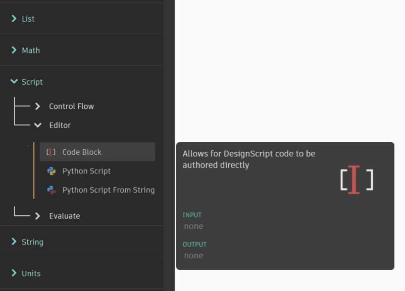

# Co je blok kódu

Bloky kódu umožňují pracovat v jazyce DesignScript, což je programovací jazyk používaný v aplikaci Dynamo. Jazyk DesignScript je čitelný a stručný jazyk, který nabízí okamžitou zpětnou vazbu k malým úsekům kódu, ale je v něm možné vytvářet také velké a složité programy. DesignScript také tvoří základ systému, který aplikace Dynamo používá „pod pokličkou“. Protože většina funkcí uzlů aplikace Dynamo je s tímto skriptovacím jazykem v rovnocenném vztahu, znamená to, že se lze plynule přesunout od uzlů ke skriptování.

Pro začátečníky lze uzly převést automaticky na text, což jim usnadní proces učení jazyka DesignScript, případně tím lze zpřehlednit velké části grafu. K tomu slouží proces „Uzel na kód“, který je podrobněji popsán v části [Syntaxe jazyka DesignScript](2-design-script-syntax.md). Pokročilejší uživatelé si mohou pomocí bloků kódu přizpůsobovat existující funkce a vytvářet standardní programátorské konstrukce. Pro všechny uživatele nezávisle na zkušenostech je k dispozici velké množství útržků s kódem, které jim pomohou při práci na návrzích. Ačkoliv výraz „blok kódu“ může být pro neprogramátory poněkud zastrašující, ve skutečnosti se jedná o snadno použitelnou funkci. Začátečník dokáže používat blok kódu efektivně i s minimem programování, zatímco pokročilý uživatel může vytvořit skriptované definice, které bude možné vyvolat na jiném místě definice aplikace Dynamo.

### Blok kódu: stručný přehled

Stručně řečeno, bloky kódu představují rozhraní pro textové skriptování v rámci prostředí vizuálního programování. Lze je používat jako čísla, řetězce, vzorce a další datové typy. Blok kódu je navržen přímo pro aplikaci Dynamo – uživatel může v bloku kódu definovat proměnné a ty budou následně automaticky přidány k uzlu jako vstupy:

Bloky kódu umožňují uživatelům flexibilně určit, které vstupy bude uzel obsahovat. Zde je několik způsobů, jak vytvořit základní bod se souřadnicemi _(10, 5, 0)_:

Jakmile se seznámíte s pokročilejšími funkcemi v knihovně, zjistíte, že ruční zadání textu „Point.ByCoordinates“ je rychlejší, než hledání správného uzlu v knihovně. Pokud například zadáte _Point._, aplikace Dynamo zobrazí seznam možných funkcí, které lze použít pro výraz Point. Díky tomu je skriptování intuitivnější a usnadní vám používání funkcí v aplikaci Dynamo.

### Tvorba uzlů pro bloky kódu

Blok kódu se nachází v části _Core>Input>Actions>Code Block_. Stačí však dvakrát kliknout na pracovní plochu a blok kódu se ihned zobrazí. Tento uzel se používá tak často, že jej lze vytvořit i dvojím kliknutím.

### Čísla, řetězce a vzorce

Bloky kódu umožňují flexibilní práci s datovými typy. Uživatel může rychle definovat čísla, řetězce a vzorce a blok kódu nastaví požadovaný výstup.

Na obrázku níže vidíte starý způsob práce, který je poněkud zdlouhavý: uživatel musí vyhledat požadovaný uzel v rozhraní, přidat uzel na pracovní plochu a poté zadat data. S blokem kódu uživateli stačí, když dvakrát klikne na pracovní plochu, čímž vytvoří uzel, a poté zadá požadovaná data splňující základní syntaxi.

Uzly number, string a formula představují příklady uzlů aplikace Dynamo, které jsou v porovnání s blokem kódu poněkud zastaralé.

> 1. „Stará škola“
> 2. Bloky kódu
