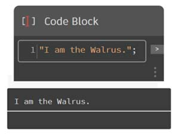

# Cos'è un blocco di codice?

I blocchi di codice sono una finestra sul mondo di DesignScript, il linguaggio di programmazione al centro di Dynamo. Sviluppato da zero per supportare i workflow di progettazione esplorativa, DesignScript è un linguaggio leggibile e conciso che offre feedback immediato a piccoli bit di codice e si adatta anche a interazioni complesse e di grandi dimensioni. DesignScript costituisce inoltre le fondamenta del motore che controlla la maggior parte degli aspetti di Dynamo "dietro le quinte". Poiché quasi tutte le funzionalità presenti nelle interazioni e nei nodi di Dynamo hanno una relazione uno ad uno con il linguaggio di scripting, esistono opportunità uniche di spostarsi tra le interazioni basate su nodi e lo scripting in modo fluido.  

Per i principianti, i nodi possono essere convertiti automaticamente in sintassi di testo per agevolare l'apprendimento di DesignScript o semplicemente per ridurre la dimensione di sezioni più grandi dei grafici. A tale scopo, è necessario utilizzare un processo denominato "Nodo da aggiungere al codice", descritto in dettaglio nella sezione [Sintassi di DesignScript](7-2\_design-script-syntax.md). Gli utenti più esperti possono utilizzare i blocchi di codice per creare mashup personalizzati delle funzionalità esistenti e relazioni create dall'utente utilizzando molti paradigmi di codifica standard. Tra il principiante e l'utente avanzato, esistono innumerevoli scorciatoie e frammenti di codice che accelerano i progetti. Sebbene il termine "blocco di codice" possa risultare un po' intimidatorio per gli utenti non esperti di programmazione, è facile da utilizzare ed efficace. Un principiante può utilizzare il blocco di codice in modo efficiente con una codifica minima e un utente avanzato può definire definizioni di script da richiamare altrove in una definizione di Dynamo.

### Blocco di codice: Una breve panoramica 

In breve, i blocchi di codice sono un'interfaccia dello scripting di testo all'interno di un ambiente di scripting visivo. Possono essere utilizzati come numeri, stringhe, formule e altri tipi di dati. Il blocco di codice è stato progettato per Dynamo, pertanto è possibile definire variabili arbitrarie nel blocco di codice e tali variabili vengono aggiunte automaticamente agli input del nodo:

Con i blocchi di codice, un utente ha la flessibilità di decidere come specificare gli input. Di seguito sono riportati diversi modi per creare un punto base con le coordinate _(10, 5, 0)_: 

Man mano che si acquisiscono ulteriori informazioni sulle funzioni disponibili nella libreria, si potrebbe persino scoprire che la digitazione di Point.ByCoordinates è più rapida rispetto alla ricerca nella libreria e all'individuazione del nodo appropriato. Quando si digita _Point_ ad esempio, in Dynamo verrà visualizzato un elenco di possibili funzioni da applicare ad un punto. Ciò rende più intuitivo lo scripting e aiuterà ad imparare come applicare le funzioni in Dynamo.

### Creazione di nodi di blocco di codice

Il blocco di codice è disponibile in _Core > Input > Actions > Code Block_. Ma per una procedura ancora più veloce per visualizzare il blocco di codice, è sufficiente fare doppio clic nell'area di disegno. Questo nodo viene utilizzato così spesso che dispone di tutte le funzioni accessibili con il doppio clic del mouse.

### Numeri, stringhe e formule

Anche i blocchi di codice sono flessibili rispetto ai tipi di dati. L'utente può definire rapidamente numeri, stringhe e formule e il blocco di codice fornirà l'output desiderato.

Nella seguente immagine, è possibile vedere che il modo di eseguire le operazioni della "vecchia scuola" è leggermente più lungo: l'utente cerca il nodo desiderato nell'interfaccia, aggiunge il nodo all'area di disegno e quindi inserisce i dati. Con il blocco di codice, l'utente può fare doppio clic nell'area di disegno per estrarre il nodo e digitare il tipo di dati corretto con la sintassi di base.

I nodi Number, String e Formula sono tre esempi di nodi di Dynamo che risultano probabilmente obsoleti rispetto al blocco di codice.

> 1. "Vecchia scuola"
> 2. Code Block

