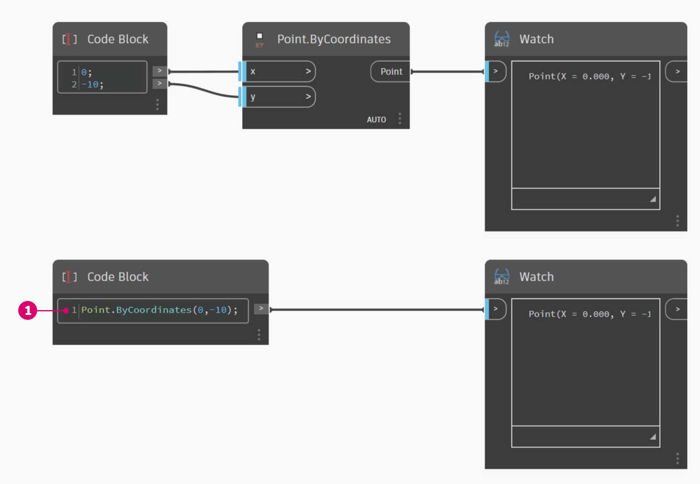
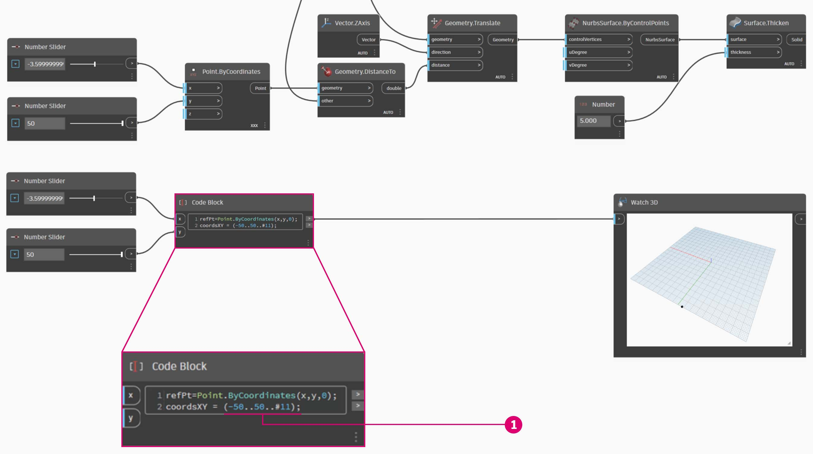

# Składnia języka DesignScript

W nazwach węzłów w dodatku Dynamo można zauważyć wspólną cechę: w każdym węźle używana jest składnia _„.”_ bez spacji. Jest tak dlatego, że tekst znajdujący się na górze każdego węzła odzwierciedla rzeczywistą składnię skryptów, a znak _„.”_ (lub _notacja kropkowa_) oddziela element od metod, które możemy wywołać. W ten sposób można łatwo przekształcać skrypty wizualne w skrypty tekstowe.

Omawiając notację kropkową przez analogię, zobaczmy, co możemy zrobić z parametrycznym jabłkiem w dodatku Dynamo. Poniżej przedstawiono kilka metod, które zastosujemy do jabłka, zanim zdecydujemy się je zjeść. (Uwaga: to nie są rzeczywiste metody dodatku Dynamo):

| Czytelne dla człowieka                 | Notacja kropkowa              | Wynik |
| ------------------------------ | ------------------------- | ------ |
| Jakiego koloru jest to jabłko?       | Apple.color (Jabłko.kolor)               | red (czerwone)    |
| Czy to jabłko jest dojrzałe?             | Apple.isRipe (Jabłko.czyDojrzałe)              | true (prawda)   |
| Ile waży to jabłko? | Apple.weight (Jabłko.waga)              | 6 uncji  |
| Skąd pochodzi to jabłko? | Apple.parent (Jabłko.elementNadrzędny)              | tree (drzewo)   |
| Co tworzy to jabłko?    | Apple.children (Jabłko.elementyPodrzędne)            | seeds (nasiona)  |
| Czy to jabłko jest uprawiane lokalnie?   | Apple.distanceFromOrchard (Jabłko.odległośćOdSadu) | 60 mil |

Można się nie zgodzić, ale wyniki w powyższej tabeli wskazują, że to bardzo smaczne jabłko. Możemy zastosować do niego funkcję _Apple.eat()_ (Jabłko.zjeść).

### Notacja kropkowa w bloku kodu

Pamiętając o porównaniu z jabłkiem, przyjrzyjmy się węzłowi _Point.ByCoordinates_ i zobaczmy, jak można utworzyć punkt za pomocą węzła Code Block.

Składnia `Point.ByCoordinates(0,10);` w węźle _Code Block_ daje taki sam wynik jak węzeł _Point.ByCoordinates_ w dodatku Dynamo, z tą różnicą, że umożliwia utworzenie punktu za pomocą jednego węzła. Jest to bardziej wydajne niż łączenie oddzielnego węzła ze współrzędnymi _„X”_ i _„Y”_.

> 1. Używając polecenia _Point.ByCoordinates_ w węźle Code Block, określamy dane wejściowe w takiej samej kolejności jak w gotowym węźle: _(X,Y)_.

### Wywoływanie węzłów — tworzenie, operacje, zapytanie

Można wywołać dowolny zwykły węzeł w bibliotece za pomocą węzła Code Block, o ile nie jest to specjalny _węzeł interfejsu użytkownika_, pełniący szczególną funkcję w interfejsie użytkownika. Można na przykład wywołać węzeł_ Circle.ByCenterPointRadius_, ale wywołanie węzła _Watch 3D_ nie miałoby sensu.

Zwykłe węzły (stanowiące większość biblioteki) należą do trzech ogólnych typów. Warto zauważyć, że biblioteka jest uporządkowana zgodnie z tymi kategoriami. Metody, czyli węzły, tych trzech typów są traktowane inaczej po wywołaniu w bloku kodu.

> 1. **Create** — umożliwiają utworzenie (lub konstruowanie) elementu.
> 2. **Action** — umożliwiają wykonywanie operacji na elementach.
> 3. **Query** — umożliwiają pobranie właściwości istniejącego elementu.

#### Tworzenie

Kategoria „Create” umożliwia tworzenie geometrii od podstaw. Wprowadzamy wartości w bloku kodu od lewej do prawej. Te dane wejściowe mają taką samą kolejność, jak elementy wejściowe węzła uporządkowane od góry do dołu.

Porównując węzeł _Line.ByStartPointEndPoint_ i odpowiadającą mu składnię w węźle Code Block, otrzymujemy te same wyniki.

#### Działanie

Określa operację wykonywaną na obiekcie danego typu. W dodatku Dynamo do wykonywania operacji na obiekcie używana jest _notacja kropkowa_, wspólna dla wielu języków kodowania. Po wpisaniu obiektu wpisz kropkę, a następnie nazwę operacji. Dane wejściowe metod typu Action są umieszczane w nawiasach, podobnie jak w przypadku metod typu Create, z tym że nie trzeba określać pierwszego elementu wejściowego widocznego w odpowiednim węźle. Zamiast tego należy określić element, na którym wykonywana jest operacja:

> 1. Węzeł **Point.Add** stanowi węzeł typu Action, dlatego składnia nieco się różni.
> 2. Dane wejściowe to (1) _point_ (punkt) i (2) _vektor_ (wektor), który ma być do niego dodany. W węźle **Code Block** nazwaliśmy ten punkt (obiekt) _„pt”_. Aby dodać wektor o nazwie *„vec”* do punktu _„pt”_, należy napisać _pt.Add(vec)_, czyli: obiekt, kropka, operacja. Operacja Add ma tylko jeden element wejściowy, czyli wszystkie elementy wejściowe węzła **Point.Add** z wyjątkiem pierwszego. Pierwszym elementem wejściowym węzła **Point.Add** jest sam punkt.

#### Zapytanie

Metody typu Query pobierają właściwość obiektu. Ponieważ sam obiekt jest elementem wejściowym, nie trzeba określać żadnych danych wejściowych. Nie są wymagane nawiasy.

### A co ze skratowaniem?

Skratowanie w przypadku węzłów i bloków kodu nieco się różni. W przypadku węzłów użytkownik klika prawym przyciskiem myszy węzeł i wybiera opcję skratowania, którą chce zastosować. W bloku kodu użytkownik ma znacznie większą kontrolę nad strukturą danych. W krótkiej składni metody w węźle Code Block wykorzystuje się _prowadnice replikacji_ do określenia, w jaki sposób połączyć w pary kilka jednowymiarowych list. Numery w nawiasach ostrych „<>” definiują hierarchię wynikowej listy zagnieżdżonej: <1>,<2>,<3> i tak dalej.

> 1. W tym przykładzie użyjemy krótkiej składni do zdefiniowania dwóch zakresów (więcej informacji na temat krótkiej składni przedstawiono w następnej sekcji tego rozdziału). Krótko mówiąc: `0..1;` odpowiada `{0,1}`, a `-3..-7` odpowiada `{-3,-4,-5,-6,-7}`. W wyniku tej operacji zostaną zwrócone listy 2 wartości x i 5 wartości y. Jeśli nie użyjemy prowadnic replikacji z tymi niedopasowanymi listami, otrzymamy listę dwóch punktów, ponieważ tyle wynosi długość najkrótszej listy. Za pomocą prowadnic replikacji można znaleźć wszystkie możliwe kombinacje 2 i 5 współrzędnych (czyli iloczyn wektorowy).
> 2. Użycie składni **Point.ByCoordinates**`(x_vals<1>,y_vals<2>);` umożliwia uzyskanie _dwóch_ list, z których każda zawiera _pięć_ elementów.
> 3. Użycie składni **Point.ByCoordinates**`(x_vals<2>,y_vals<1>);` umożliwia uzyskanie _pięciu_ list, z których każda zawiera _dwa_ elementy.

Przy tym zapisie możemy także określić, która lista będzie dominująca: 2 listy po 5 elementów czy 5 list po 2 elementy. W tym przykładzie zmiana kolejności prowadnic replikacji powoduje, że wynikiem jest lista wierszy punktów lub lista kolumn punktów w siatce.

### Konwersja węzłów na kod

Chociaż przyzwyczajenie się do metod bloków kodu może wymagać trochę wysiłku, w dodatku Dynamo dostępna jest funkcja konwersji węzłów na kod, która to ułatwia. Aby użyć tej funkcji, wybierz szyk węzłów na wykresie dodatku Dynamo, kliknij prawym przyciskiem myszy obszar rysunku i wybierz opcję „Węzeł do kodowania”. Dodatek Dynamo połączy te węzły w blok kodu zawierający wszystkie dane wejściowe i wyjściowe. To nie tylko doskonałe narzędzie do poznawania bloków kodu, ale też sposób na uzyskanie bardziej wydajnych i parametrycznych wykresów dodatku Dynamo. Poniższe ćwiczenie wymaga użycia konwersji węzłów na kod, więc nie przegap tego.

## Ćwiczenie: przyciąganie powierzchni

> Pobierz plik przykładowy, klikając poniższe łącze.
>
> Pełna lista plików przykładowych znajduje się w załączniku.



Aby pokazać możliwości bloków kodu, przekształcimy istniejącą definicję pola atraktorowego w formę bloków kodu. Praca z istniejącą definicją pokazuje powiązania między blokiem kodu a skryptami wizualnymi i ułatwia naukę składni języka DesignScript.

Rozpocznij od odtworzenia definicji z powyższego rysunku (lub otwarcia pliku przykładowego).

> 1. Zwróć uwagę, że skratowanie węzła **Point.ByCoordinates** zostało ustawione na _iloczyn wektorowy_.
> 2. Każdy punkt na siatce jest przesunięty w górę w kierunku Z na podstawie odległości od punktu odniesienia.
> 3. Po odtworzeniu i pogrubieniu powierzchni w geometrii powstaje wypukłość zależna od odległości od punktu odniesienia.

> 1. Najpierw zdefiniujmy punkt odniesienia: **Point.ByCoordinates** `(x,y,0);` Użyjemy tej samej składni **Point.ByCoordinates** jak ta widoczna w górnej części węzła tworzącego punkt odniesienia.
> 2. Zmienne _x_ i _y_ są wstawione do węzła **Code Block**, dzięki czemu można je dynamicznie aktualizować za pomocą suwaków.
> 3. Dodaj _suwaki_ do wejść węzła **Code Block** mające zakres od –50 do 50. W ten sposób można objąć cały obszar domyślnej siatki dodatku Dynamo.

> 1. W drugim wierszu węzła **Code Block** zdefiniujemy skrót, który zastąpi węzeł sekwencji liczb: `coordsXY = (-50..50..#11);`Więcej informacji na ten temat podamy w następnej sekcji. Na razie wystarczy zauważyć, że ten skrót odpowiada węzłowi **Number Sequence** w skrypcie wizualnym.

> 1. Teraz chcemy utworzyć siatkę punktów na podstawie sekwencji _coordsXY_. W tym celu chcemy użyć składni **Point.ByCoordinates**, ale musimy też utworzyć _iloczyn wektorowy_ listy w taki sam sposób, jak w skrypcie wizualnym. W tym celu należy wpisać wiersz: `gridPts = Point.ByCoordinates(coordsXY<1>,coordsXY<2>,0);` Nawiasy ostre oznaczają odniesienie do iloczynu wektorowego.
> 2. W węźle **Watch 3D** widać, że na siatce dodatku Dynamo znajduje się siatka punktów.

> 1. Teraz trudniejsza część: chcemy przesunąć siatkę punktów w górę na podstawie ich odległości od punktu odniesienia. Najpierw nazwiemy nowy zestaw punktów _transPts_. Ponieważ przekształcenie jest operacją na istniejącym elemencie, zamiast `Geometry.Translate...` użyjemy `gridPts.Translate`.
> 2. Odczytując węzeł na obszarze rysunku, widzimy, że zawiera on trzy elementy wejściowe. Geometria do przekształcenia jest już zadeklarowana, ponieważ wykonujemy operację na tym elemencie (za pomocą składni _gridPts.Translate_). Pozostałe dwie wartości wejściowe, direction i _distance_, wstawimy w nawiasach funkcji.
> 3. Kierunek jest łatwy do ustawienia — użyjemy składni `Vector.ZAxis()` do przesunięcia w pionie.
> 4. Należy też obliczyć odległość między punktem odniesienia a każdym punktem siatki, dlatego wykonamy operację dotyczącą punktu odniesienia w ten sam sposób: `refPt.DistanceTo(gridPts)`
> 5. Ostatni wiersz kodu pozwala uzyskać przekształcone punkty: `transPts=gridPts.Translate(Vector.ZAxis(),refPt.DistanceTo(gridPts));`

> 1. Otrzymaliśmy siatkę punktów ze strukturą danych odpowiednią do utworzenia powierzchni NURBS. Konstruujemy powierzchnię, używając składni `srf = NurbsSurface.ByControlPoints(transPts);`

> 1. Na koniec dodamy do powierzchni głębię, tworząc bryłę przy użyciu składni `solid = srf.Thicken(5);` W tym przypadku pogrubiliśmy powierzchnię o 5 jednostek w kodzie, ale zawsze możemy zadeklarować tę wartość jako zmienną (na przykład o nazwie thickness) i określać ją suwakiem.

#### Upraszczanie wykresu dzięki konwersji węzłów na kod

Funkcja konwersji węzłów na kod umożliwia zautomatyzowanie całego ćwiczenia, które właśnie wykonaliśmy, jednym kliknięciem przycisku. Jest to nie tylko wydajny sposób tworzenia niestandardowych definicji i bloków kodu wielokrotnego użytku, ale również naprawdę przydatne narzędzie do nauki tworzenia skryptów w dodatku Dynamo:

> 1. Rozpocznij od istniejącego skryptu wizualnego z kroku 1\. ćwiczenia. Wybierz wszystkie węzły, kliknij prawym przyciskiem myszy obszar rysunku i wybierz polecenie _„Węzeł do kodowania”_. To wystarczy.

W dodatku Dynamo została automatycznie utworzona tekstowa wersja wykresu graficznego, wraz ze skratowaniem i innymi elementami. Przetestuj tę funkcję na własnych skryptach wizualnych i wykorzystaj możliwości bloków kodu.

