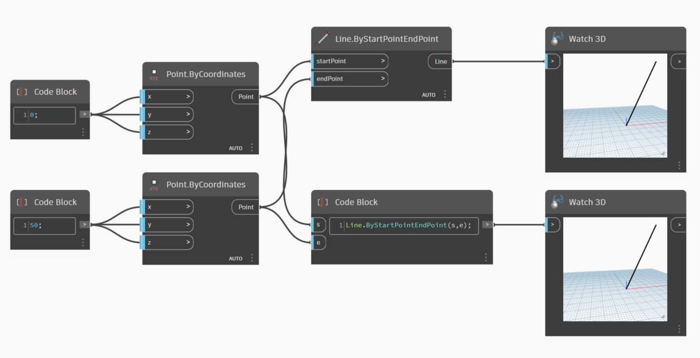

# Синтаксис DesignScript

Возможно, вы уже заметили закономерность в именах узлов Dynamo: для каждого узла используется синтаксис _"."_ без пробелов. Это связано с тем, что текст в верхней части каждого узла представляет собой фактический синтаксис для создания сценариев, а символ _"."_ (или _запись через точку_) отделяет элемент от доступных методов, которые можно вызвать. Это позволяет легко переходить от визуальных сценариев к текстовым.

В качестве примера использования записи через точку рассмотрим возможные действия с параметрическим яблоком в Dynamo. Ниже представлены несколько методов, которые можно применить к яблоку, перед тем как съесть (разумеется, на самом деле этих методов в Dynamo не существует, не ищите).

| На языке пользователя                 | Запись через точку              | Вывод |
| ------------------------------ | ------------------------- | ------ |
| Какого цвета яблоко?       | Apple.color               | Красный    |
| Яблоко зрелое?             | Apple.isRipe              | true   |
| Сколько весит это яблоко? | Apple.weight              | 170 г  |
| Откуда взялось это яблоко? | Apple.parent              | дерево   |
| Что останется после яблока?    | Apple.children            | семена  |
| Это яблоко выращено недалеко отсюда?   | Apple.distanceFromOrchard | 96,5 км |

Судя по данным в таблице выше, это очень вкусное яблоко. Я бы его с удовольствием _Apple.eat()_.

### Запись через точку в узлах Code Block

Используя аналогию с яблоком, рассмотрим узел _Point.ByCoordinates_ и процесс создания точки с помощью узла Code Block.

Синтаксис `Point.ByCoordinates(0,10);` для _Code Block_ позволяет получить тот же результат, что и узел _Point.ByCoordinates_ в Dynamo, но его преимущество состоит в том, что для создания точки требуется лишь один узел. Это проще и эффективнее, чем соединять отдельный узел с портами ввода _X_ и _Y_.

> 1. Используя синтаксис _Point.ByCoordinates_ в узле Code Block, необходимо указать входные данные в том же порядке, что и в готовом узле _(X,Y)_.

### Вызов узлов Create, Actions, Query

С помощью узла Code Block можно вызвать любой стандартный узел библиотеки, кроме _узлов пользовательского интерфейса_, обладающих особыми функциями для пользовательского интерфейса. Например, можно вызвать узел _Circle.ByCenterPointRadius_, а вот вызывать узел _Watch 3D_ не стоит.

Стандартные узлы, которых в библиотеке большинство, делятся на три типа. Как вы видите, вся библиотека упорядочена с учетом этих категорий. Методы (или узлы) этих трех типов обрабатываются иначе при вызове с помощью Code Block.

> 1. **Create** — узлы, позволяющие создавать или конструировать что-либо.
> 2. **Action** — узлы для выполнения действий с чем-либо.
> 3. **Query** — узлы для получения свойства существующего объекта.

#### Создание

Категория Create позволяет создавать геометрию с нуля. Значения вводятся в Code Block слева направо. Они располагаются в том же порядке, что и порты ввода в узле (сверху вниз).

При сравнении узла _Line.ByStartPointEndPoint_ и соответствующего синтаксиса в узле Code Block мы получаем один и тот же результат.

#### Действие

Действие — это операция, выполняемая с объектами определенного типа. Для применения действий к объектам в Dynamo используется _запись через точку_, что является распространенным принципом для многих языков программирования. Если у вас есть объект, введите его название, затем точку, а затем название действия, которое с этим объектом нужно выполнить. Входные данные для метода этого типа помещаются в скобки, как и при использовании методов Create, однако для него не требуется указывать первые входные данные, которые отображаются в соответствующем узле. Вместо этого требуется указать элемент, с которым будет выполняться действие:

> 1. Поскольку узел **Point.Add** представляет собой узел типа Action, его синтаксис работает несколько иначе.
> 2. Входные данные включают в себя (1) _точку_ и (2) _вектор_, который требуется к ней добавить. В синтаксисе узла **Code Block** точка (объект) обозначена как _pt_. Чтобы добавить вектор (*vec*) к точке (_pt_), нужно ввести _pt.Add(vec)_, то есть «объект, точка, действие». Для операции добавления используются все порты ввода узла **Point.Add**, кроме первого. Первый порт ввода узла **Point.Add** — это сама точка.

#### Query

Методы типа Query позволяют получить свойство объекта. Указывать какие-либо входные данные в этом случае не требуется, так как входными данными является сам объект. Скобки также не нужны.

### Использование переплетения

Переплетение при использовании узлов отличается от переплетения с помощью Code Block. В первом случае пользователь щелкает узлы правой кнопкой мыши и выбирает параметр переплетения, который требуется применить. При работе с Code Block у пользователя есть гораздо больше возможностей для управления структурой данных. При объединении нескольких одномерных списков в пары с помощью сокращенного метода Code Block используются _руководства по репликации_. Цифры в угловых скобках «<>» определяют уровень иерархии итогового вложенного списка: <1>, <2>, <3> и т. д.

> 1. В этом примере мы используем сокращенную запись для определения двух диапазонов (подробнее о сокращенном методе можно узнать в следующем разделе этой главы). Проще говоря, `0..1;` эквивалентно `{0,1}`, а `-3..-7` эквивалентно `{-3,-4,-5,-6,-7}`. В результате мы получаем список из двух значений X и пяти значений Y. Если работать с этими несогласованными списками без руководств по репликации, то будет получен список, содержащий две точки, что соответствует длине кратчайшего списка. Использование руководств по репликации позволяет найти все возможные сочетания двух и пяти значений координат (а точнее, их векторное произведение).
> 2. Синтаксис **Point.ByCoordinates**`(x_vals<1>,y_vals<2>);` позволяет получить _два_ списка с _пятью_ элементами в каждом.
> 3. Синтаксис **Point.ByCoordinates**`(x_vals<2>,y_vals<1>);` позволяет получить _пять_ списков с _двумя_ элементами в каждом.

Такой способ записи позволяет указать, какой список будет основным: два списка из пяти элементов или пять списков из двух. В этом примере результат будет представлять собой список строк точек или список столбцов точек в сетке в зависимости от изменения порядка руководств по репликации.

### Узел для кодировки

Чтобы овладеть описанными выше методами работы с Code Block, требуется определенное время. Функция «Узел для кодировки» Dynamo значительно упрощает этот процесс. Чтобы использовать эту функцию, выберите массив узлов в графике Dynamo, щелкните правой кнопкой мыши в рабочей области и выберите «Узел для кодировки». Программа Dynamo объединяет эти узлы в единый узел Code Block, содержащий все входные и выходные данные. Это не только отличный инструмент для изучения принципов работы узлов Code Block, но также он позволяет создавать с более эффективные параметрические графики Dynamo. Рекомендуем выполнить упражнение ниже, так как в нем используется функция «Узел для кодировки».

## Упражнение «Точка притяжения поверхности»

> Скачайте файл с примером, щелкнув ссылку ниже.
>
> Полный список файлов с примерами можно найти в приложении.



Для демонстрации возможностей узла Code Block преобразуйте существующее определение поля притяжения в форму Code Block. Использование существующего определения позволяет продемонстрировать связь Code Block с визуальным программированием, а также помогает в изучении синтаксиса DesignScript.

Для начала повторно создайте определение, показанное на изображении выше (или просто откройте файл примера).

> 1. Обратите внимание, что для параметра переплетения узла **Point.ByCoordinates** задано значение _Векторное произведение_.
> 2. Каждая точка сетки перемещена вверх по оси Z в соответствии с расстоянием до опорной точки.
> 3. Поверхность создана повторно и утолщена, что создает прогиб в геометрии относительно расстояния до опорной точки.

> 1. Сначала определите опорную точку: **Point.ByCoordinates**`(x,y,0);`. Используйте синтаксис **Point.ByCoordinates**, указанный в верхней части узла опорной точки.
> 2. Переменные _x_ и _y_ вставляются в **Code Block**, чтобы их можно было динамически обновлять с помощью регуляторов.
> 3. Присоедините _регуляторы_ к портам ввода узла **Code Block** и задайте их значения в диапазоне от –50 до 50. Это позволит работать по всей сетке Dynamo по умолчанию.

> 1. Во второй строке **Code Block** определите сокращенную запись для замены узла порядкового номера: `coordsXY = (-50..50..#11);`. Мы рассмотрим это подробнее в следующем разделе. Обратите внимание, что такая сокращенная запись эквивалентна узлу визуального программирования **Number Sequence**.

> 1. Теперь нужно создать сетку из точек последовательности _coordsXY_. Для этого необходимо использовать синтаксис **Point.ByCoordinates**. Кроме того, требуется запустить _векторное произведение_ списка так же, как вы это делали при визуальном программировании. Для этого введите следующую строку: `gridPts = Point.ByCoordinates(coordsXY<1>,coordsXY<2>,0);`. Угловые скобки обозначают векторное произведение.
> 2. Обратите внимание на узел **Watch3D**, в котором отображается сетка точек на сетке Dynamo.

> 1. Теперь самое сложное: нужно переместить сетку точек вверх в соответствии с расстоянием до опорной точки. Для начала присвойте этому новому набору точек имя _transPts_. Так как выполняется преобразование уже существующего элемента, вместо узла `Geometry.Translate...` используйте узел `gridPts.Translate`.
> 2. Считывая данные из этого узла в рабочей области, мы видим, что он содержит три порта ввода. Преобразуемая геометрия уже определена, так как действие выполняется с текущим элементом (с использованием _gridPts.Translate_). Названия двух оставшихся портов (direction и _distance_) следует поместить в скобки функции.
> 3. Определить значение direction несложно, так как для перемещения по вертикали используется `Vector.ZAxis()`.
> 4. Теперь необходимо рассчитать расстояние между опорной точкой и каждой точкой сетки. Выполните это действие с опорной точкой аналогичным образом: `refPt.DistanceTo(gridPts)`.
> 5. Последняя строка кода содержит преобразованные точки: `transPts=gridPts.Translate(Vector.ZAxis(),refPt.DistanceTo(gridPts));`.

> 1. Теперь у вас есть сетка точек, структура данных которой позволяет создать поверхность NURBS. Поверхность создается с помощью `srf = NurbsSurface.ByControlPoints(transPts);`.

> 1. Чтобы придать поверхности глубину, создайте тело с помощью синтаксиса `solid = srf.Thicken(5);`. Данный код увеличивает толщину поверхности на пять единиц, однако толщину также можно сделать переменной (например, с именем thickness), а затем изменять ее значение с помощью регулятора.

#### Упрощение графика с помощью функции «Узел для кодировки»

Функция «Узел для кодировки» позволяет автоматизировать все действия, которые вы выполнили в предыдущем упражнении, и применять их одним нажатием кнопки. Этот мощный инструмент не только позволяет создавать пользовательские определения и узлы Code Block для многократного использования, но и помогает в изучении процесса создания сценариев в Dynamo.

> 1. Для начала откройте существующий визуальный сценарий из первого шага упражнения. Выберите все узлы, щелкните правой кнопкой мыши в рабочей области и выберите _Узел для кодировки_. Проще простого.

Приложение Dynamo позволяет автоматизировать текстовую версию визуального графика, включая переплетение и прочие операции. Поэкспериментируйте с использованием этой функции при работе с другими визуальными сценариями и ознакомьтесь со всеми возможностями Code Block.

