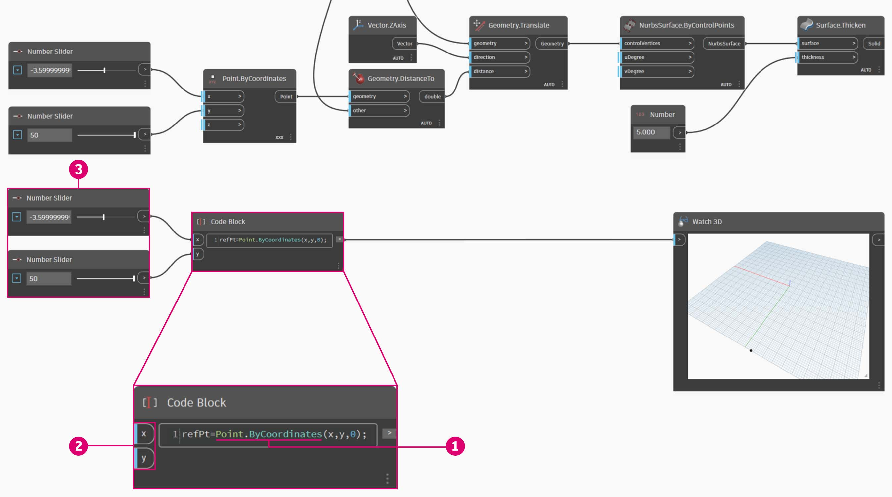
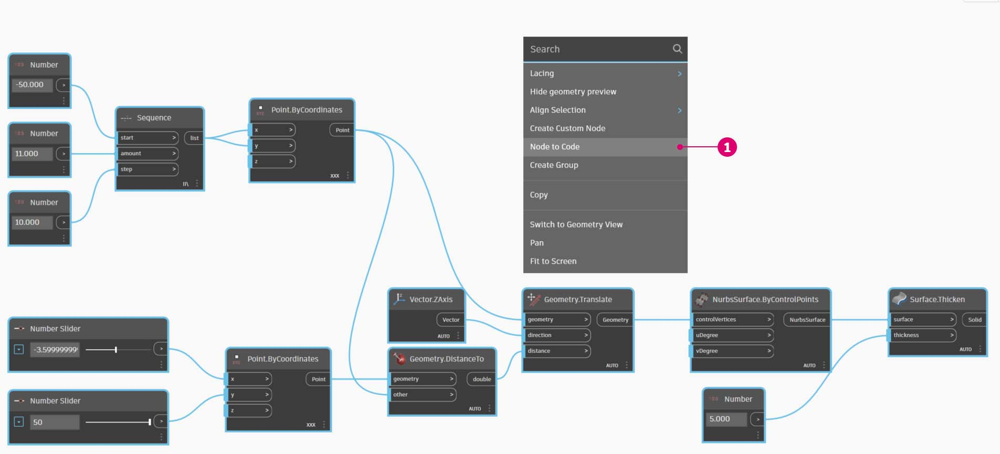

# Syntaxe DesignScript

Možná jste si všimli běžného tématu v názvech uzlů v aplikaci Dynamo: každý uzel používá syntaxi se znakem _"."_ bez mezer. Je tomu tak proto, že text v horní části každého uzlu představuje skutečnou syntaxi pro skriptování a _"."_ (neboli _tečková notace_) odděluje prvek od možných metod, které je možné volat. Toto umožňuje snadný přesun od vizuálního skriptování k textovému.

Jak v rámci obecné analogie tečkové notace postupovat u parametrického jablka v aplikaci Dynamo? Níže je uvedeno několik metod, které použijeme na jablko než se rozhodneme, zda je sníst. (Poznámka: Nejedná se o skutečné metody aplikace Dynamo):

| Čitelné pro člověka                 | Tečková notace              | Výstup |
| ------------------------------ | ------------------------- | ------ |
| Jakou barvu má jablko?       | Jablko.barva               | červená    |
| Je jablko zralé?             | Jablko.jeZrale              | ano   |
| Kolik jablko váží? | Jablko.vaha              | 6 oz.  |
| Z čeho jablko pochází? | Jablko.rodic              | strom   |
| Co to jablko vytváří?    | Jablko.produkty            | semena  |
| Bylo toto jablko vypěstováno zde?   | Jablko.vzdalenostOdSadu | 60 mi. |

Nevím, jak ty, ale soudě podle výstupů v tabulce výše, to vypadá, že jablko je chutné. Myslím, že provedu operaci _Jablko.snist()_.

### Tečková notace v bloku kódu

S ohledem na analogii jablka se podívejte na uzel _Point.ByCoordinates_ a určete, jak můžeme vytvořit bod pomocí bloku kódu.

Syntaxe _bloku kódu_ `Point.ByCoordinates(0,10);` předává stejný výsledek jako uzel _Point.ByCoordinates_ v aplikaci Dynamo, s výjimkou toho, že je možné vytvořit bod pomocí jednoho uzlu. Je to mnohem efektivnější než připojení dvou samostatných uzlů k hodnotám _„X“_ a _„Y“_.

> 1. Pokud použijete uzel _Point.ByCoordinates_ v bloku kódu, určíte vstupy ve stejném pořadí jako uzel ve výchozím natavení _(X,Y)_.

### Volání uzlů – Tvorba, Akce, Dotaz

Jakýkoliv běžný uzel v knihovně je možné volat prostřednictvím bloku kódu, pokud uzel není speciálním _„uzlem uživatelského rozhraní“_: uzly se speciální funkcí uživatelského rozhraní. Můžete například volat uzel _Circle.ByCenterPointRadius_, ale nemělo by smysl volat uzel _Watch 3D_.

Běžné uzly (většina knihovny) jsou obvykle tří typů. Můžete vidět, že knihovna je organizována s ohledem na tyto kategorie. Metody nebo uzly těchto tří typů jsou při volání v bloku kódu zpracovávány odlišně.

> 1. **Tvorba** – něco se vytvoří (nebo zkonstruuje).
> 2. **Akce** – provede u položky nějakou akci.
> 3. **Dotaz** – získá vlastnost položky, která již existuje.

#### Tvorba

Kategorie „Tvorba“ vytvoří geometrii od začátku. V bloku kódu se zadají vstupní hodnoty zleva doprava. Tyto vstupy jsou ve stejném pořadí jako vstupy uzlu shora dolů.

Pokud použijete uzel _Line.ByStartPointEndPoint_ a porovnáte výsledek s odpovídající syntaxí v bloku kódu, zjistíte, že výsledky jsou stejné.

#### Akce

Akce je něco, co se provede u objektu daného typu. Aplikace Dynamo používá k provedení akce u určité položky _tečkovou notaci_, která je běžná v mnoha jazycích kódů. Jakmile zadáte název položky, zadejte tečku a poté název akce. Vstup metody typu Akce je umístěn v závorkách stejně jako u metody typu Tvorba, jen není třeba určovat první vstup, který uvidíte na odpovídajícím uzlu. Místo toho určíte, u kterého prvku se akce provede:

> 1. Uzel **Point.Add** je uzel typu Akce, takže syntaxe funguje trochu jinak.
> 2. Vstupy jsou (1) _bod_ a (2) _vektor_, které se mají přidat. V **bloku kódu** jsme bod (položku) pojmenovali výrazem _„pt“_. Chcete-li přidat vektor s názvem *„vec *k bodu _„pt“_, zadejte výraz _pt.Add(vec)_ neboli položka, tečka, akce. Akce Add má pouze jeden vstup nebo všechny vstupy z uzlu **Point.Add **kromě prvního. První vstup uzlu **Point.Add** je samotný bod.

#### Dotaz

Metody typu Dotaz získají vlastnost objektu. Vzhledem k tomu, že objekt samotný je vstupem, není třeba určovat žádné vstupy. Nejsou třeba žádné závorky.

### Jak je to s vázáním?

Vázání na uzly se poněkud liší od vázání na blok kódu. U uzlů klikne uživatel pravým tlačítkem na uzel a vybere možnost vázání, kterou chce provést. Díky bloku kódu má uživatel mnohem větší kontrolu nad tím, jak jsou data strukturována. Metoda zkratky bloku kódu používá _vodítka replikací_ k nastavení způsobu, jakým by mělo být párováno několik jednorozměrných seznamů. Čísla v šikmých závorkách „<>“ definují hierarchii výsledného vnořeného seznamu: <1>,<2>,<3> atd.

> 1. V tomto příkladu definujeme dva rozsahy pomocí zkratky (více o zkratkách naleznete v následující části této kapitoly). Stručně řečeno, `0..1;` je ekvivalentní `{0,1}` a `-3..-7` je ekvivalentní `{-3,-4,-5,-6,-7}`. Výsledkem je seznam 2 hodnot X a 5 hodnot Y. Pokud se nepoužijí vodítka replikací společně s těmito neshodujícími se seznamy, vznikne seznam dvou bodů, který má délku nejkratšího seznamu. Pomocí vodítek replikací je možné najít všechny možné kombinace 2 a 5 souřadnic (neboli kartézský součin).
> 2. Pomocí syntaxe **Point.ByCoordinates**`(x_vals<1>,y_vals<2>);` získáte _dva_ seznamy s _pěti_ položkami v každém seznamu.
> 3. Pomocí syntaxe **Point.ByCoordinates**`(x_vals<2>,y_vals<1>);` získáte _pět_ seznamů s _dvěma_ položkami v každém seznamu.

Pomocí této notace můžeme také určit, který seznam bude dominantní: 2 seznamy 5 položek nebo 5 seznamů 2 položek. V tomto příkladu změna pořadí vodítek replikací vytvoří seznam řádků bodů v osnově nebo seznam sloupců bodů v osnově.

### Uzel na kód

Zatímco na výše uvedené metody bloku kódu si možná budete chvíli zvykat, v aplikace Dynamo existuje i funkce s názvem „Uzel na blok“ která celý proces usnadní. Chcete-li tuto funkci použít, vyberte pole uzlů v grafu aplikace Dynamo, klikněte pravým tlačítkem na kreslicí plochu a vyberte položku „Uzel na kód“. Aplikace Dynamo tyto uzly zhustí do bloku kódu včetně všech vstupů a výstupů. Nejenže se jedná o skvělý nástroj k výuce práce s blokem kódu, ale tato funkce také umožňuje práci s efektivnějším a parametrickým grafem aplikace Dynamo. Cvičení je zakončeno využitím funkce „Uzel na kód“, nepropásněte tuto část.

## Cvičení: Atraktor povrchu

> Kliknutím na odkaz níže si stáhněte vzorový soubor.
>
> Úplný seznam vzorových souborů najdete v dodatku.



Nyní demonstrujeme sílu bloku kódu převedením existující definice pole atraktoru do tvaru bloku kódu. Práce s existující definicí ukazuje, jak blok kódu souvisí s vizuálním skriptem, a je užitečná k seznámení se se syntaxí jazyka DesignScript.

Začněte znovuvytvořením definice na obrázku výše (nebo otevřením vzorového souboru).

> 1. Všimněte si, že vázání uzlu **Point.ByCoordinates** bylo nastaveno na hodnotu _Kartézský součin_.
> 2. Každý bod v osnově se posune nahoru ve směru Z podle jeho vzdálenosti od referenčního bodu.
> 3. Povrch je znovu vytvořen a zesílen, čímž se vytvoří vyboulení v geometrii relativně ke vzdálenosti od referenčního bodu.

> 1. Na začátku nejprve definujeme referenční bod: **Point.ByCoordinates**`(x,y,0);`. Použijeme stejnou syntaxi **Point.ByCoordinates**, jaká je zadána v horní části uzlu referenčního bodu.
> 2. Proměnné _x_ a _y_ se vloží do **bloku kódu**, aby bylo možné je dynamicky aktualizovat pomocí posuvníků.
> 3. Přidejte _posuvníky_ ke vstupům **bloku kódu**, které se pohybují v rozsahu od -50 do 50. Tímto zajistíme dosah přes celou výchozí osnovu aplikace Dynamo.

> 1. Ve druhém řádku **bloku kódu** definujeme zkratku, která nahradí uzel posloupnosti čísel: `coordsXY = (-50..50..#11);`. Tímto se budeme dále zabývat v další části. V tuto chvíli si všimněte, že tato zkratka odpovídá uzlu **Number Sequence** ve vizuálním skriptu.

> 1. Nyní chceme vytvořit osnovu z bodů v posloupnosti položek _coordsXY_. Za tímto účelem je vhodné použít syntaxi **Point.ByCoordinates**, ale také je nutné spustit _Kartézský součin_ seznamu stejným způsobem, jako to bylo provedeno ve vizuálním skriptu. Zadejte následující řádek: `gridPts = Point.ByCoordinates(coordsXY<1>,coordsXY<2>,0);`. Šikmé závorky označují odkaz na kartézský součin.
> 2. Všimněte si, že v uzlu **Watch3D** se nachází osnova bodů přes celou osnovu aplikace Dynamo.

> 1. Nyní nastává ta náročná část: Je třeba přesunout osnovu bodů nahoru podle vzdáleností bodů od referenčního bodu. Nejprve pojmenujte tuto novou sadu bodů _transPts_. A vzhledem k tomu, že převod je akce na existujícím prvku, použijte místo výrazu `Geometry.Translate...` výraz `gridPts.Translate`.
> 2. Při čtení ze skutečného uzlu na kreslicí ploše je vidět, že obsahuje tři vstupy. Geometrie, kterou chcete převést, je již deklarována, protože na tomto prvku provádíme akci (pomocí metody _gridPts.Translate_). Zbývající dva vstupy budou vloženy do závorek funkce: směr a _vzdálenost_.
> 3. Směr je jednoduchý vstup, k jeho vertikálnímu posunutí se použije výraz `Vector.ZAxis()`.
> 4. Dále je třeba vypočítat vzdálenost mezi referenčním bodem a každým bodem osnovy. Toto provedeme stejným způsobem jako akci u referenčního bodu: `refPt.DistanceTo(gridPts)`.
> 5. Poslední řádek kódu nám poskytuje převedené body: `transPts=gridPts.Translate(Vector.ZAxis(),refPt.DistanceTo(gridPts));`

> 1. Nyní máme osnovu bodů s vhodnou datovou strukturou k vytvoření povrchu Nurbs. Vytvoříme povrch pomocí `srf = NurbsSurface.ByControlPoints(transPts);`.

> 1. A nakonec, abychom povrchu dodali trochu hloubky, vytvoříme těleso pomocí výrazu `solid = srf.Thicken(5);`. V tomto případě jsme v kódu zesílili povrch o 5 jednotek, tuto hodnotu bychom však mohli deklarovat jako proměnnou (kterou můžete nazvat například tloušťka) a poté řídit její hodnotu pomocí posuvníku.

#### Zjednodušení grafu pomocí možnosti „Uzel na kód“

Funkce „Uzel na kód“ automatizuje celé toto právě dokončené cvičení pomocí kliknutí na tlačítko. Nejenže se jedná o výkonné řešení tvorby vlastních definic a opakovaně použitelných bloků kódu, ale také je to velmi užitečný nástroj k výuce skriptování v aplikaci Dynamo:

> 1. Začněte existujícím vizuálním skriptem z kroku 1 tohoto cvičení. Vyberte všechny uzly, klikněte pravým tlačítkem na kreslicí plochu a vyberte možnost _Uzel na kód_. Až tak jednoduché to je.

Aplikace Dynamo má automatizovanou textovou verzi vizuálního grafu, vázání a dalších. Vyzkoušejte si tuto funkci u vašich vizuálních skriptů a využijte výkon bloku kódu.

