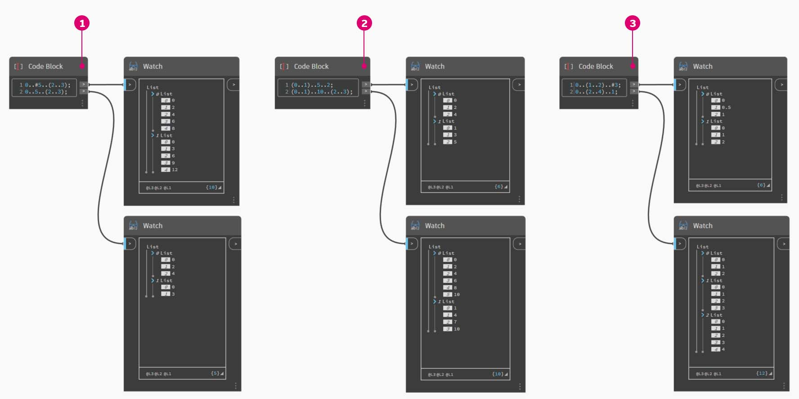
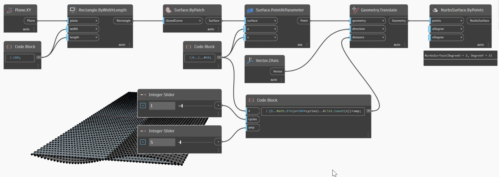
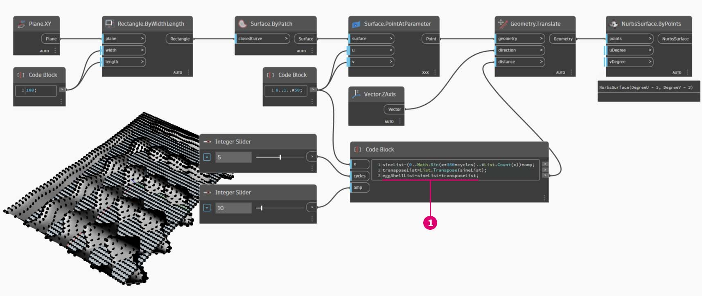

# 速寫

### 速寫

程式碼區塊有一些基本的速寫方法，簡言之，這些方法可以_顯著_降低資料管理的難度。以下我們將分類講解基本知識，並討論如何使用此速寫來建立與查詢資料。

| **資料類型**          | **標準 Dynamo**                                      | **Code Block 對等項**                                    |
| ---------------------- | -------------------------------------------------------- | ------------------------------------------------------------- |
| 數字                |        |        |
| 字串                |         |          |
| 序列              |        |        |
| 範圍                 |           |          |
| 取得索引處的項目      |  |  |
| 建立清單            |    |    |
| 連接字串    |  |  |
| 條件陳述式 |    |    |

### 其他語法

|                                     |                           |                                                                                          |
| ----------------------------------- | ------------------------- | ---------------------------------------------------------------------------------------- |
| **節點**                         | **Code Block 對等項** | **附註**                                                                                 |
| 任何運算子 (+、&&、>=、Not... 等等) | +、&&、>=、!... 等等        | 請注意，「Not」變成「！」，但節點稱為「Not」以便與「階乘」區分 |
| Boolean True                        | true;                     | 請注意小寫                                                                          |
| Boolean False                       | false;                    | 請注意小寫                                                                          |

### 範圍和序列

定義範圍與序列的方法可以精簡為基本速寫。使用以下影像作為「..」語法的指南，以使用程式碼區塊定義一系列數值資料。瞭解此標記法後，建立數值資料就會非常有效率：

> 1. 在此範例中，數字範圍由定義 `beginning..end..step-size;` 的基本 **Code Block** 語法所取代。以數字方式表示，我們得到：`0..10..1;`
> 2. 請注意，語法 `0..10..1;` 相當於 `0..10;` 步長大小 1 是速寫標記法的預設值。因此 `0..10;` 將產生從 0 到 10 且步長大小為 1 的序列。
> 3. _序列_範例很類似，只是我們使用「#」來說明希望清單包含 15 個值，而非清單中的值不超過 15。在此範例中，我們將定義：`beginning..#ofSteps..step-size:` 序列的實際語法為 `0..#15..2`
> 4. 使用上一步的 _#_，現在將其放在語法的 _step-size_ 部分。現在，我們產生一個從 _beginning_ 到 _end_ 的_數字範圍_，_step-size_ 標記將許多值均勻分佈在這兩個值之間：`beginning..end..#ofSteps`

### 進階範圍

藉由建立進階範圍，我們能以簡單方式使用清單的清單。在以下範例中，我們將隔離變數與主要範圍標記，並建立該清單的另一個範圍。

> 1\.建立巢狀範圍，對含與不含「#」的標記進行比較。套用基本範圍內的相同邏輯，只是變得稍複雜一些。
>
> 2\.可以在主要範圍內的任何位置定義子範圍，請注意我們可以有兩個子範圍。
>
> 3\.透過控制範圍內的「end」值，我們可以建立長度不同的多個範圍。

比較以上兩個速寫，並嘗試剖析_子範圍_與 _#_ 標記如何產生結果輸出，來作為邏輯練習。

### 建立清單與取得清單中的項目

除了使用速寫建立清單外，我們也可以快速建立清單。這些清單可以包含多種元素類型，也可以進行查詢 (請記住，清單本身就是物件)。總而言之，使用程式碼區塊，您將使用括號 (方括號) 建立清單和查詢清單中的項目：

> 1\.使用字串快速建立清單，並使用項目索引查詢清單。
>
> 2\.使用變數建立清單，並使用範圍速寫標記查詢清單。

使用巢狀清單進行管理是類似的程序。請注意清單順序，並使用多組方括號呼叫：

> 1\.定義清單的清單。
>
> 2\.使用單邊括號查詢清單。
>
> 3\.使用雙邊括號查詢項目。

## 練習：正弦曲面

> 按一下下方的連結下載範例檔案。
>
> 附錄中提供完整的範例檔案清單。



在本練習中，我們將靈活運用新的速寫技能，以建立由範圍與公式定義的炫酷蛋殼曲面。在本練習中，請注意我們如何搭配使用程式碼區塊與既有 Dynamo 節點：我們對處理大量資料的工作使用程式碼區塊，而以視覺方式配置 Dynamo 節點以實現定義的易讀性。

首先，透過連接以上節點以建立曲面。不是使用數字節點來定義寬度與長度，而是按兩下圖元區，然後在程式碼區塊中輸入 `100;`。

> 1. 在 **Code Block** 中輸入 `0..1..#50`，定義介於 0 至 1 之間且分為 50 份的範圍。
> 2. 將該範圍連接至 **Surface.PointAtParameter**，這會在曲面內為 u 與 v 指定介於 0 與 1 之間的值。請記得在 **Surface.PointAtParameter** 節點上按一下右鍵，將「交織」變更為「笛卡兒積」。

在此步驟中，我們使用第一個函數在 Z 方向將點的格線上移。此格線將根據基本函數驅動產生的曲面。如以下影像所示新增節點

> 1. 我們不使用公式節點，而是使用包含 `(0..Math.Sin(x*360)..#50)*5;` 這一行的 **Code Block**。為了快速詳細說明這一點，我們將定義內含公式的範圍。此公式是正弦函數。正弦函數會接收 Dynamo 中輸入的角度，因此為了取得完整的正弦波形，我們將 x 值 (這是 0 到 1 的範圍輸入) 乘以 360。接下來，我們希望份數與每列的控制格線點數量相同，所以使用 #50 定義五十份。最後，乘數 5 只是為了增加平移的振幅，方便我們在 Dynamo 預覽中查看效果。

> 1. 雖然上一個 **Code Block** 運作地很好，但它並非完全是參數式方法。我們要動態驅動其參數，因此我們將上一步的程式碼行取代為 `(0..Math.Sin(x*360*cycles)..#List.Count(x))*amp;`。藉此我們能根據輸入定義這些值。

透過變更滑棒 (範圍從 0 到 10)，我們得到一些有趣的結果。

> 1. 透過對數字範圍執行轉置，我們反轉窗簾波浪的方向：`transposeList = List.Transpose(sineList);`

> 1. 加入 sineList 與 tranposeList 後會得到一個扭曲的蛋殼曲面：`eggShellList = sineList+transposeList;`

變更下面指定的滑棒值，將此演算法「變平靜」。

最後，我們使用程式碼區塊查詢資料的隔離部分。若要重新產生具有特定範圍點的曲面，請在 **Geometry.Translate** 與 **NurbsSurface.ByPoints** 節點之間加入以上程式碼區塊。這包括文字行：`sineStrips[0..15..1];`。這將選取前 16 列的點 (從 50 個點中)。重新建立曲面，我們可以看到已產生點格線的隔離部分。

> 1. 在最後一個步驟中，為了讓此 **Code Block** 的參數式程度更高，我們使用範圍從 0 至 1 的滑棒來驅動該查詢。我們使用這一行程式碼執行此作業：`sineStrips[0..((List.Count(sineStrips)-1)*u)];`。這可能有些混亂，但使用該行程式碼可以快速運用介於 0 和 1 之間的乘數來擴充清單長度。

若使用滑棒值 `0.53`，會建立一個剛好通過格線中點的曲面。

與預期一致，使用滑棒值 `1` 時，會從完整的點格線建立一個曲面。

查看視覺圖表，我們可以亮顯程式碼區塊，並查看其中的每項函數。

> 1\.第一個 **Code Block** 取代 **Number** 節點。
>
> 2\.第二個 **Code Block** 取代 **Number Range** 節點。
>
> 3\.第三個 **Code Block** 取代 **Formula** 節點 (以及 **List.Transpose**、**List.Count** 與 **Number Range**)。
>
> 4 種。第四個 **Code Block** 查詢清單的清單，取代 **List.GetItemAtIndex** 節點。
