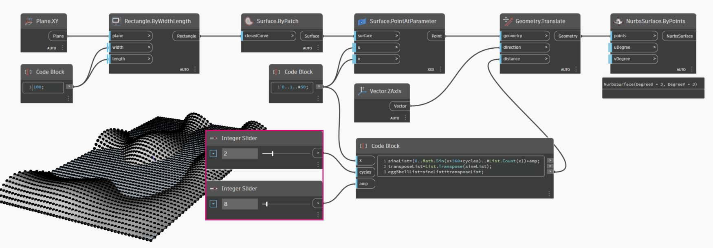

# Abreviação

### Abreviação

Existem alguns métodos de abreviação básicos no bloco de código que, em termos simples, facilitam _muito_ o gerenciamento de dados. Vamos explicar os conceitos básicos abaixo e discutir como a abreviação pode ser usada para criar e consultar dados.

| **Tipo de dados**          | **Dynamo padrão**                                      | **Equivalente ao bloco de código**                                    |
| ---------------------- | -------------------------------------------------------- | ------------------------------------------------------------- |
| Números                |        |        |
| Sequências de caracteres                |         |          |
| Sequências              |        |        |
| Intervalos                 |           |          |
| Obter item no índice      |  |  |
| Criar lista            |    |    |
| Concatenar sequências de caracteres    |  |  |
| Declarações condicionais |    |    |

### Sintaxe adicional

|                                     |                           |                                                                                          |
| ----------------------------------- | ------------------------- | ---------------------------------------------------------------------------------------- |
| **Nó(s)**                         | **Equivalente ao bloco de código** | **Nota**                                                                                 |
| Qualquer operador (+, &&, >=, Not, etc.) | +, &&, >=, !, etc.        | Observe que “Not” se torna “!”, mas o nó é chamado “Not” para distinguir de “Factorial” |
| Booleano true                        | true;                     | Repare nas minúsculas                                                                          |
| Booleano false                       | false;                    | Repare nas minúsculas                                                                          |

### Intervalos e sequências

É possível reduzir o método para definir intervalos e sequências para a abreviação básica. Use a imagem abaixo como um guia para a sintaxe “...” para definir uma lista de dados numéricos com o bloco de código. Após obter o travamento dessa notação, a criação de dados numéricos é um processo realmente eficiente:

> 1. Neste exemplo, um intervalo de números é substituído pela sintaxe básica do **Bloco de código** que define `beginning..end..step-size;` . Representados numericamente, temos: `0..10..1;`
> 2. Observe que a sintaxe `0..10..1;` é equivalente a `0..10;` Um tamanho de etapa de 1 é o valor padrão para a notação abreviada. Assim, `0..10;` será fornecida uma sequência de 0 a 10 com um tamanho de etapa de 1.
> 3. O exemplo de _Sequência_ é semelhante, exceto se usarmos “#” para indicar que desejamos 15 valores na lista em vez de uma lista que vai até 15. Neste caso, estamos definindo: `beginning..#ofSteps..step-size:` A sintaxe real para a sequência é `0..#15..2`
> 4. Usando o símbolo _“#”_ da etapa anterior, agora o colocamos na parte _“step-size”_ da sintaxe. Agora, temos um _intervalo de números_ que se estende de _“beginning”_ até _“end”_, e a notação _“step-size”_ distribui uniformemente alguns valores entre os dois: `beginning..end..#ofSteps`

### Intervalos avançados

A criação de intervalos avançados nos permite trabalhar com uma lista de listas de forma simples. Nos exemplos abaixo, vamos isolar uma variável da notação do intervalo principal e criar outro intervalo dessa lista.

> 1\. Criando intervalos aninhados, compare a notação com “#” e a notação sem. A mesma lógica se aplica a intervalos básicos, exceto pelo fato de que fica um pouco mais complexo.
>
> 2\. Podemos definir um subintervalo em qualquer lugar dentro do intervalo principal e observar que também podemos ter dois subintervalos.
>
> 3\. Controlando o valor “end” em um intervalo, criamos mais intervalos de comprimentos diferentes.

Como um exercício lógico, compare as duas abreviações acima e tente analisar como os _subintervalos_ e a notação _#_ controlam a saída resultante.

### Criar listas e obter itens de uma lista

Além de criar listas com abreviações, podemos criar listas imediatamente. Essas listas podem conter um amplo intervalo de tipos de elementos e também podem ser consultadas (lembre-se: as próprias listas são objetos). Para resumir, com o bloco de código você faz listas e consulta itens de uma lista com colchetes :

> 1\. Crie listas rapidamente com sequências de caracteres e consulte-as usando o índice do item.
>
> 2\. Crie listas com variáveis e consulte usando a notação de abreviação de intervalo.

O gerenciamento com listas aninhadas é um processo semelhante. Esteja ciente da ordem da lista e chame de volta usando vários conjuntos de colchetes:

> 1\. Defina uma lista de listas.
>
> 2\. Consulte uma lista com uma notação de colchete único.
>
> 3\. Consulte um item com uma notação de colchete duplo.

## Exercício: Superfície senoidal

> Faça o download do arquivo de exemplo clicando no link abaixo.
>
> É possível encontrar uma lista completa de arquivos de exemplo no Apêndice.



Neste exercício, flexibilizaremos nossas novas habilidades de abreviação para criar uma superfície de casca de ovo moderna definida por intervalos e fórmulas. Durante este exercício, observe como usamos o bloco de código e os nós do Dynamo existentes em conjunto: usamos o bloco de código para o levantamento de dados pesados enquanto os nós do Dynamo são visualmente dispostos para a legibilidade da definição.

Comece criando uma superfície conectando os nós acima. Em vez de usar um nó de número para definir a largura e o comprimento, clique duas vezes na tela e digite `100;` em um bloco de código

> 1. Defina um intervalo entre 0 e 1 com 50 divisões digitando `0..1..#50` em um **Bloco de código**.
> 2. Conecte o intervalo a **Surface.PointAtParameter**, que usa os valores u e v entre 0 e 1 na superfície. Lembre-se de alterar a Amarra para Produto transversal clicando com o botão direito do mouse no nó **Surface.PointAtParameter**.

Nesta etapa, empregamos nossa primeira função para mover o eixo de pontos para cima no Z. Esse eixo controlará uma superfície gerada com base na função subjacente. Adicione novos nós, como mostrado na imagem abaixo

> 1. Em vez de usar um nó de fórmula, usamos um **Bloco de código** com a linha: `(0..Math.Sin(x*360)..#50)*5;`. Para analisar isso rapidamente, definimos um intervalo com uma fórmula dentro dele. Essa fórmula é a função Seno. A função seno recebe entradas de grau no Dynamo, portanto, para obter uma onda senoidal completa, multiplicamos nossos valores de x (essa é a entrada de intervalo de 0 a 1) por 360. Em seguida, queremos o mesmo número de divisões que os pontos de eixo de controle para cada linha, portanto, definimos cinquenta subdivisões com #50. Finalmente, o multiplicador de 5 simplesmente aumenta a amplitude da conversão para que possamos ver o efeito na Visualização do Dynamo.

> 1. Apesar de o **Bloco de código** anterior funcionar bem, não era completamente paramétrico. Queremos controlar os parâmetros dinamicamente; portanto, substituiremos a linha da etapa anterior por `(0..Math.Sin(x*360*cycles)..#List.Count(x))*amp;`. Isso nos oferece a capacidade de definir esses valores com base nas entradas.

Alterando os controles deslizantes (de 0 a 10), obtemos resultados interessantes.

> 1. Efetuando uma transposição no intervalo de números, inverteremos a direção da onda da cortina: `transposeList = List.Transpose(sineList);`

> 1. Obtemos uma superfície de casca de ovo distorcida quando adicionamos sineList e tranposeList: `eggShellList = sineList+transposeList;`

Vamos alterar os valores dos controles deslizantes especificados abaixo para “acalmar as águas” deste algoritmo.

Por último, vamos consultar partes isoladas dos dados com o bloco de código. Para regenerar a superfície com um intervalo específico de pontos, adicione o bloco de código acima entre os nós **Geometry.Translate** e **NurbsSurface.ByPoints**. Isso tem a linha de texto: `sineStrips[0..15..1];`. Isso selecionará as primeiras 16 linhas de pontos (de 50). Recriando a superfície, podemos ver que geramos uma parte isolada do eixo de pontos.

> 1. Na etapa final, para tornar esse **Bloco de código** mais paramétrico, controlaremos a consulta usando um controle deslizante que varia entre 0 e 1. Fazemos isso com esta linha de código: `sineStrips[0..((List.Count(sineStrips)-1)*u)];`. Isso pode parecer confuso, mas a linha de código nos fornece uma forma rápida de dimensionar o comprimento da lista em um multiplicador entre 0 e 1.

Um valor de `0.53` no controle deslizante cria uma superfície logo após o ponto central do eixo.

E, conforme esperado, um controle deslizante de `1` cria uma superfície com base no eixo completo de pontos.

Analisando o gráfico visual, podemos realçar os blocos de código e ver cada uma de suas funções.

> 1\. O primeiro **Bloco de código** substitui o nó **Número**.
>
> 2\. O segundo **Bloco de código** substitui o nó **Intervalo de números**.
>
> 3\. O terceiro **Bloco de código** substitui o nó **Fórmula** (assim como **List.Transpose**, **List.Count** e **Intervalo de números**).
>
> 4\. O quarto **Bloco de código** consulta uma lista de listas, substituindo o nó **List.GetItemAtIndex**.
