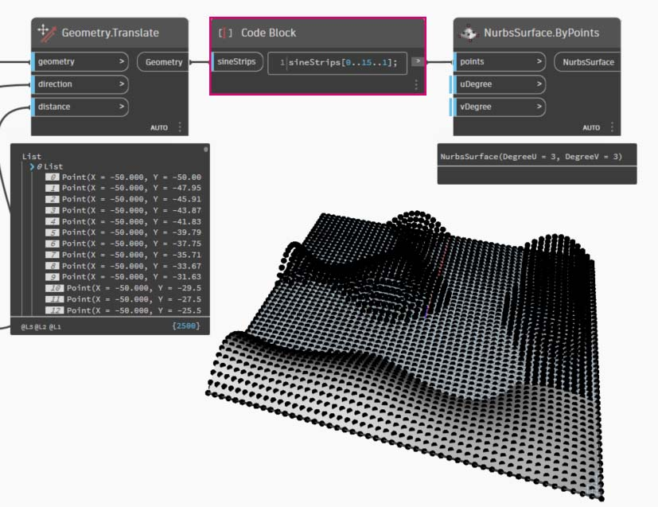
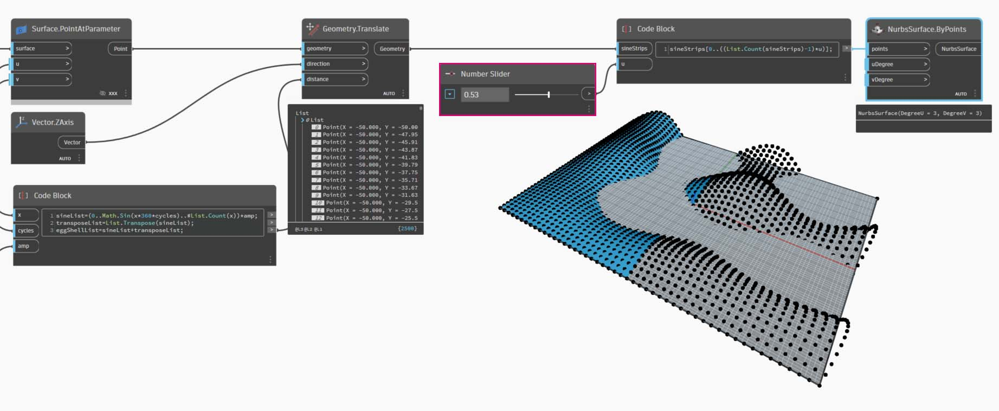
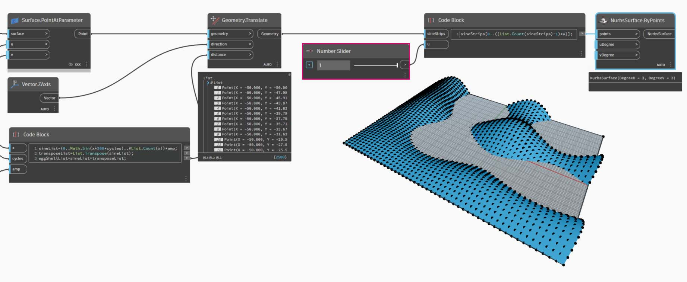

# 省略表記

### 省略表記

Code Block にはデータ管理を_大幅に_容易にする基本的な省略表記方法がいくつかあります。ここでは基本の概要を示し、この省略表記をデータの作成とクエリーの両方に使用する方法を説明します。

| **データ タイプ**          | **標準 Dynamo**                                      | **Code Block の同等表記**                                    |
| ---------------------- | -------------------------------------------------------- | ------------------------------------------------------------- |
| 数値                |        |        |
| 文字列                |         |          |
| シーケンス              |        |        |
| 範囲                 |           |          |
| インデックスでの項目の取得      |  |  |
| リストの作成            |    |    |
| 文字列の連結    |  |  |
| 条件ステートメント |    |    |

### その他の構文

|                                     |                           |                                                                                          |
| ----------------------------------- | ------------------------- | ---------------------------------------------------------------------------------------- |
| **ノード**                         | **Code Block の同等表記** | **注**                                                                                 |
| 演算子(+、&&、>=、Not など) | +、&&、>=、! など        | 「Not」は「!」になりますが、「Factorial」(階乗)と区別するためにノードは「Not」と呼ばれます |
| ブールの True                        | true;                     | 小文字を使用します                                                                          |
| ブールの False                       | false;                    | 小文字を使用します                                                                          |

### 範囲とシーケンス

基本的な省略表記を組み合わせることで、範囲とシーケンスを設定することができます。下記の画像を「..」構文のガイドとして参照し、Code Block を使用して数値データのリストを設定してみましょう。この表記に慣れると、数値データを効率的に作成できるようになります。

> 1. この例では、数値範囲を `beginning..end..step-size;` の基本的な **Code Block** 構文で置き換えて設定します。数値で表すと、`0..10..1;` になります。
> 2. 構文 `0..10..1;` は `0..10;` と同等です。ステップサイズの 1 は、省略表記の既定値です。つまり、`0..10;` はステップサイズが 1 であるシーケンス 0 から 10 を表しています。
> 3. _シーケンス_の例も同様です。ただし、「#」を使用して、15 までの値を含むリストではなく、15 個の値を含むリストを指定しています。このケースでは、`beginning..#ofSteps..step-size:` を定義しています。シーケンスの実際の構文は `0..#15..2` です。
> 4. 今度は前の手順の「_#_」を構文の _step-size_ 部分に配置してみましょう。これで、_数値範囲_は _beginning_ から _end_ に設定され、これらの 2 つの間の値が _step-size_ 表記に指定された値で均等に分割されます: `beginning..end..#ofSteps`

### 高度な範囲

高度な範囲を作成すると、リストのリストを簡単な方法で使用できます。次の例では、メイン範囲の表記から変数を分離して、このリストに別の範囲を作成します。

> 1\.ネストされた範囲を作成して、「#」が指定されている表記と指定されていない表記とを比較してみましょう。ロジックは基本的な範囲と同じですが、多少複雑になります。
>
> 2\.サブ範囲はメイン範囲内の任意の場所に設定できます。また、2 つのサブ範囲を設定することもできます。
>
> 3\.範囲内の「end」値をコントロールすることにより、長さが異なる範囲を追加で作成できます。

ロジックの演習として上記の 2 つの省略表記を比較し、_サブ範囲_と _#_ 表記が出力をどのようにコントロールしているかを読み解いてください。

### リストを作成してリストから項目を取得する

リストは省略表記を使用して作成できる他、すばやく作成することも可能です。これらのリストには幅広い要素タイプを含めることができ、クエリーを実行することも可能です(リストはリスト自体がオブジェクトです)。簡単に言うと、Code Block でブラケット(角括弧)を使用してリストを作成し、リスト内の項目のクエリーを実行します。

> 1\.文字列を使用してリストをすばやく作成し、項目のインデックスを使用してクエリーを実行します。
>
> 2\.変数を使用してリストを作成し、範囲の省略表記を使用してクエリーを実行します。

ネストされたリストを管理するプロセスは同様です。リストの順番に配慮し、複数の角括弧のセットを使用します。

> 1\.リストのリストを設定します。
>
> 2\.1 つの角括弧の表記を使用してクエリーを実行します。
>
> 3\.2 つの角括弧の表記を使用して項目のクエリーを実行します。

## 演習: 正弦サーフェス

> 下のリンクをクリックして、サンプル ファイルをダウンロードします。
>
> すべてのサンプル ファイルの一覧については、付録を参照してください。



この演習では、新しい省略表記のスキルを使用して範囲と式を設定し、一風変わった卵型のサーフェスを作成します。この演習では、Code Block と既存の Dynamo ノードを並行して使用する方法を学習します。Dynamo ノードを視覚的に配置して設定を確認しながら、Code Block を使用して大きなデータを処理します。

まず上記のノードを接続してサーフェスを作成します。数値ノードを使用して幅と長さを設定する代わりに、キャンバスをダブルクリックして、Code Block に `100;` と入力します。

> 1. **Code Block **に `0..1..#50` と入力して、0 から 1 の範囲を 50 個に分割するように設定します。
> 2. 範囲を **Surface.PointAtParameter** ノードに接続します。これは 0 から 1 の範囲内にある u と v の値を取得してサーフェス全体に設定します。**Surface.PointAtParameter** ノードを右クリックし、レーシングを[外積]に変更します。

この手順では、最初の関数を適用して、グリッドを Z の正の向きに移動します。このグリッドは基盤となる関数に基づいて生成されるサーフェスをコントロールします。下図に示すように、新しいノードを追加します。

> 1. 式ノードを使用する代わりに、**Code Block** を使用して `(0..Math.Sin(x*360)..#50)*5;` を指定します。この式を簡単に分割して説明するために、式内に範囲を設定します。この式は正弦関数です。正弦関数は Dynamo で角度(度)入力を受け取ります。このため、完全な正弦波を取得するには、x 値(0 から 1 までの入力範囲)を 360 で乗算します。次に、各行のコントロール グリッドの点と同じ数だけ分割するため、#50 を指定して 50 個のサブディビジョンを設定します。最後に、Dynamo プレビューで効果を確認できるようにするため、累乗の指数に 5 を指定して変換の振幅を大きくします。

> 1. 以前の **Code Block** は正常に動作しましたが、完全にパラメータではありませんでした。動的にパラメータをコントロールするため、前の手順の行を `(0..Math.Sin(x*360*cycles)..#List.Count(x))*amp;` に置き換えます。こうすることで、これらの値を入力に基づいて設定できるようになります。

スライダ(範囲 0 から 10)を変更して、どのような結果が生じるか確認します。

> 1. 数値範囲を転置することにより、カーテン ウェーブの方向を反転します: `transposeList = List.Transpose(sineList);`。

> 1. sineList と tranposeList を追加すると、歪曲した卵型のサーフェスが生成されます: `eggShellList = sineList+transposeList;`。

以下に指定するスライダの値を変更して、このアルゴリズムをなだらかにします。

最後に、Code Block を使用して、データの一部のクエリーを実行しましょう。特定の範囲の点を指定してサーフェスを再生成するには、**Geometry.Translate** ノードと **NurbsSurface.ByPoints** ノードの間に上記の Code Block ノードを追加します。`sineStrips[0..15..1];` が指定されています。これにより、50 行の最初の 16 行の点が選択されます。サーフェスを再作成すると、点のグリッドの一部が分離されて生成されていることがわかります。

> 1. 最後の手順では、この **Code Block** をよりパラメトリックなものにするため、範囲 0 から 1 のスライダを使用してクエリーをコントロールします。これは、次のコード行で行います。`sineStrips[0..((List.Count(sineStrips)-1)*u)];`わかりにくいかもしれませんが、このコード行により、リストの長さを乗数 0 から 1 の値を使用してすばやくスケールできます。

スライダに `0.53` の値を設定すると、グリッドの中央をわずかに超えるサーフェスが作成されます。

想定どおり、スライダを `1` に設定すると、すべての点のグリッドを使用してサーフェスが作成されます。

ビジュアル プログラムを参照する際、Code Block をハイライト表示して Code Block ノードの各関数を確認できます。

> 1\.最初の **Code Block** ノードは **Number** ノードを置き換えます。
>
> 2\.2 番目の **Code Block** ノードは **Number Range** ノードを置き換えます。
>
> 3\.3 番目の **Code Block** ノードは **Formula** ノード(および **List.Transpose**、**List.Count**、**Number Range** の各ノード)を置き換えます。
>
> 4\.4 番目の **Code Block** ノードはリストのリストのクエリーを実行し、**List.GetItemAtIndex** ノードを置き換えます。
