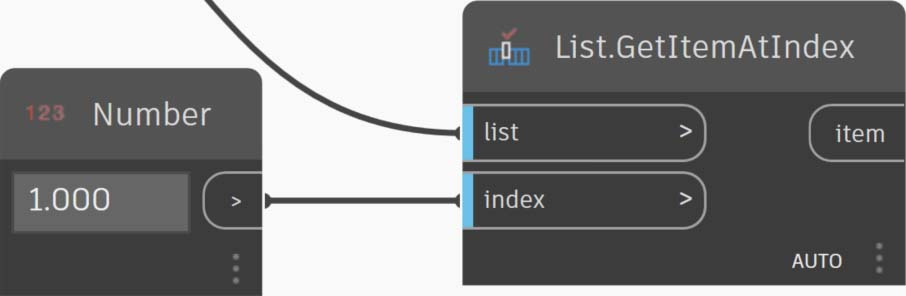

# Zkratka

### Zkratka

V bloku kódu je několik základních metod zkratky, které umožňují správu dat _velice_ usnadnit. Rozdělíme si základy níže a prodiskutujeme, jak lze tuto zkratku použít k vytváření a zadávání dotazů na data.

| **Typ dat**          | **Standardní aplikace Dynamo**                                      | **Ekvivalent bloku kódu**                                    |
| ---------------------- | -------------------------------------------------------- | ------------------------------------------------------------- |
| Čísla                |        |        |
| Řetězce                |         |          |
| Posloupnosti              |        |        |
| Rozsahy                 |           |          |
| Získat položku na indexu      |  |  |
| Vytvořit seznam            |    |    |
| Zřetězit řetězce    |  |  |
| Podmíněné výrazy |    |    |

### Další syntaxe

|                                     |                           |                                                                                          |
| ----------------------------------- | ------------------------- | ---------------------------------------------------------------------------------------- |
| **Uzly**                         | **Ekvivalent bloku kódu** | **Poznámka**                                                                                 |
| Libovolný operátor (+, &&, >=, Not atd.) | +, &&, >=, ! atd.        | Všimněte si, že z „Not“ se stane „!“, ale uzel se nazývá Not, aby se odlišil od uzlu „Factorial“. |
| Booleovská hodnota True                        | true;                     | Poznámka: malá písmena                                                                          |
| Booleovská hodnota False                       | false;                    | Poznámka: malá písmena                                                                          |

### Rozsahy a posloupnosti

Metodu definování rozsahů a posloupností lze redukovat na základní zkratku. Při definování seznamu číselných dat v bloku kódu pomocí syntaxe „..“ použijte jako vodítko obrázek níže. Po osvojení této notace je vytváření číselných dat skutečně efektivní proces:

> 1. V tomto příkladu je číselný rozsah nahrazen základní syntaxí **bloku kódu** definující `beginning..end..step-size;`. Číselně vyjádřeno získáte: `0..10..1;`.
> 2. Všimněte si, že syntaxe `0..10..1;` je ekvivalentní `0..10;`. Velikost kroku 1 je výchozí hodnotou pro notaci zkratky. Proto `0..10;` přidělí posloupnost od 0 do 10 s velikostí kroku 1.
> 3. Příklad s uzlem _Sequence_ je podobný, ale s tím rozdílem, že použijeme znak „#“, abychom určili, že chceme v seznamu zadat 15 hodnot, nikoli seznam, který pokračuje do 15. V tomto případě definujeme: `beginning..#ofSteps..step-size:`. Skutečná syntaxe posloupnosti je `0..#15..2`.
> 4. Pomocí _„#“_ z předchozího kroku nyní ji nyní umístíme do části _step-size_ syntaxe. Nyní máme _číselný rozsah_ sahající od _beginning_ do _end_ a notace _step-size_ rovnoměrně rozděluje počet hodnot mezi obě části: `beginning..end..#ofSteps`.

### Pokročilé rozsahy

Vytváření pokročilých rozsahů umožňuje jednoduše pracovat se seznamem seznamů. V příkladech níže izolujeme proměnnou od uzlu primárního rozsahu a vytvoříme další rozsah tohoto seznamu.

> 1\. Vytvořte vnořené rozsahy a porovnejte notaci s „#“ a bez ní. Stejná logika se používá v základních rozsazích, ale je trochu složitější.
>
> 2\. Můžeme definovat podrozsah na libovolném místě v primárním rozsahu a všimněte si, že můžeme mít také dva podrozsahy.
>
> 3\. Řízením hodnoty „end“ v rozsahu vytvoříme více rozsahů různých délek.

V rámci logického cvičení porovnejte dvě výše uvedené zkratky a zkuste analyzovat, jak notace _podrozsahů_ a _#_ určují výsledný výstup.

### Tvorba seznamů a získání položek ze seznamu

Kromě vytváření seznamů pomocí zkratky můžeme také vytvořit seznamy za běhu. Tento seznam může obsahovat širokou škálu typů prvků a lze jej také dotazovat (nezapomeňte, že seznamy jsou samy o sobě objekty). Stručně řečeno, pomocí bloku kódu můžete vytvářet seznamy a získávat položky ze seznamu pomocí hranatých závorek:

> 1\. Seznamy můžete rychle vytvářet pomocí řetězců a dotazovat je pomocí položek indexů.
>
> 2\. Pomocí notace zkratky můžete vytvářet seznamy s proměnnými a dotazy.

Správa s vnořenými seznamy je podobný proces. Při použití více sad hranatých závorek si dávejte pozor na pořadí seznamu:

> 1\. Definujte seznam seznamů.
>
> 2\. Získání seznamu s použitím notace s jednou hranatou závorkou.
>
> 3\. Získání položky s použitím notace se dvěma hranatými závorkami.

## Cvičení: Sinusový povrch

> Kliknutím na odkaz níže si stáhněte vzorový soubor.
>
> Úplný seznam vzorových souborů najdete v dodatku.



V tomto cvičení vyzkoušíme naše nové dovednosti zápisu a vytvoříme zábavný zvlněný povrch definovaný rozsahy a vzorci. Během tohoto cvičení si všimněte, jak se používá blok kódu a existující uzly aplikace Dynamo společně: K oddělení práce s daty použijeme blok kódu, zatímco uzly aplikace Dynamo jsou vizuálně rozvrženy pro čitelnost definice.

Začněte vytvořením povrchu spojením výše uvedených uzlů. Místo použití číselného uzlu k definování šířky a délky dvakrát klikněte na kreslicí plochu a do bloku kódu zadejte hodnotu `100;`.

> 1. Definujte rozsah mezi 0 a 1 s 50 děleními zadáním hodnoty `0..1..#50` do **bloku kódu**.
> 2. Připojte rozsah k uzlu **Surface.PointAtParameter**, který nabývá hodnot u a v v rozsahu 0 až 1 v celém povrchu. Nezapomeňte změnit hodnotu vázání na Kartézský součin kliknutím pravým tlačítkem myši na uzel **Surface.PointAtParameter**.

V tomto kroku použijeme první funkci k přesunutí rastru bodů nahoru v ose Z. Tento rastr bude řídit generovaný povrch podle základní funkce. Přidejte nové uzly, jak je znázorněno na obrázku níže.

> 1. Místo použití uzlu vzorce použijeme **blok kódu** s řádkem: `(0..Math.Sin(x*360)..#50)*5;`. Jednoduše řečeno, definujeme rozsah se vzorcem uvnitř něj. Tento vzorec je funkce Sinus. Funkce sinus získá v aplikaci Dynamo vstupy ve stupních, takže abychom získali plnou sinusovou vlnu, je nutné násobit hodnoty x (toto je vstup rozsahu od 0 do 1) hodnotou 360. Dále chceme stejný počet dělení jako řídicí body rastru pro každý řádek, takže definujeme padesát oddílů pomocí #50. Nakonec násobitel hodnoty 5 jednoduše zvýší amplitudu převodu, abychom viděli účinek v náhledu aplikace Dynamo.

> 1. I když předchozí **blok kódu** fungoval dobře, nebyl zcela parametrický. Chceme dynamicky řídit jeho parametry, takže nahradíme řádek z předchozího kroku řetězcem `(0..Math.Sin(x*360*cycles)..#List.Count(x))*amp;`. Díky tomu můžeme definovat tyto hodnoty podle vstupů.

Změnou posuvníků (v rozmezí od 0 do 10) získáme zajímavé výsledky.

> 1. Provedením transpozice na číselný rozsah obrátíme směr vlny závěsu: `transposeList = List.Transpose(sineList);`.

> 1. Pokud do kódu přidáme sineList a tranposeList, vytvoří se deformovaný povrch vaječné skořápky: `eggShellList = sineList+transposeList;`.

Změňte hodnoty posuvníků uvedené níže, abychom získali klidnější průběh tohoto algoritmu.

Nakonec se budeme dotazovat na izolované části dat pomocí bloku kódu. Chcete-li regenerovat povrch s určitým rozsahem bodů, přidejte blok kódu nad uzel **Geometry.Translate** a **NurbsSurface.ByPoints**. Tento blok kódu obsahuje řádek s následujícím textem: `sineStrips[0..15..1];`. Tím se vybere prvních 16 řádků bodů (z 50). Při dalším vytvoření povrchu vidíme, že jsme vytvořili izolovanou část rastru bodů.

> 1. V posledním kroku, abychom tento **blok kódu** vytvořili více parametrický, budeme dotaz řídit pomocí posuvníku v rozsahu od 0 do 1. Provedeme to pomocí tohoto řádku kódu: `sineStrips[0..((List.Count(sineStrips)-1)*u)];`. Může se to zdát matoucí, ale řádek kódu nám umožňuje rychle změnit měřítko délky seznamu na násobitel mezi 0 a 1.

Hodnota `0.53` na posuvníku vytvoří povrch těsně za středem osnovy.

Posuvník `1` podle očekávání vytvoří povrch z plné osnovy bodů.

Při pohledu na vizuální graf můžeme zvýraznit bloky kódu a zobrazit jednotlivé funkce.

> 1\. První **blok kódu** nahrazuje uzel **Number**.
>
> 2\. Druhý **blok kódu** nahrazuje uzel **Number Range**.
>
> 3\. Třetí**blok kódu** nahrazuje uzel **Formula** (a také uzly **List.Transpose**, **List.Count** a **Number Range**).
>
> 4\. Čtvrtý **blok kódu** se dotazuje na seznam seznamů, přičemž nahrazuje uzel **List.GetItemAtIndex**.
