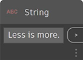
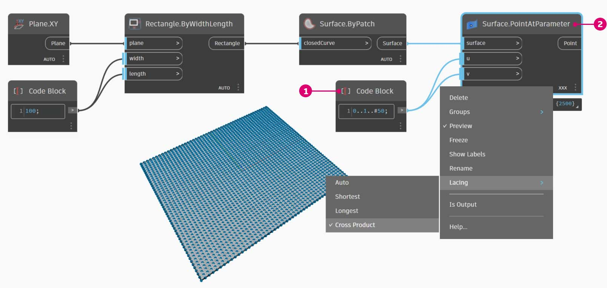
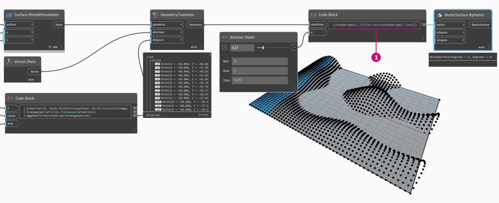
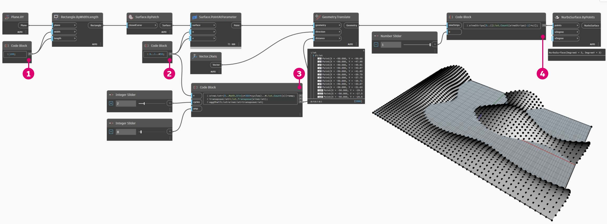

# 简写

### 简写

简单来说，代码块中有一些基本的简写方法，这些方法使数据管理 _更加_ 容易。我们将详细介绍下面的基础知识，并讨论如何使用此简写来创建和查询数据。

| **数据类型**          | **标准 Dynamo**                                      | **等效代码块**                                    |
| ---------------------- | -------------------------------------------------------- | ------------------------------------------------------------- |
| 数字                |        |        |
| 字符串                |         |          |
| 序列              |        |        |
| 范围                 |           |          |
| 获取索引处的项目      |  |  |
| 创建列表            |    |    |
| 连接字符串    |  |  |
| 条件语句 |    |    |

### 其他语法

|                                     |                           |                                                                                          |
| ----------------------------------- | ------------------------- | ---------------------------------------------------------------------------------------- |
| **节点**                         | **等效代码块** | **注释**                                                                                 |
| 任何运算符（+、&&、>=、Not 等） | +、&&、>=、! 等        | 请注意，“Not”变为“!”，但该节点被称为“Not”以区分“阶乘” |
| 布尔值 True                        | true;                     | 注意小写                                                                          |
| 布尔值 False                       | false;                    | 注意小写                                                                          |

### 范围和序列

定义范围和序列的方法可缩减为基本简写。使用下图作为“..”语法的指导，以使用代码块定义数值数据列表。在完成此标记法后，创建数值数据是一个非常有效的过程：

> 1. 在本例中，数字范围会替换为定义 `beginning..end..step-size;` 的基本 **“代码块”** 语法。通过以数字表示，可以得到：`0..10..1;`
> 2. 请注意，语法 `0..10..1;` 等同于 `0..10;`，步长 1 是简写表示法的默认值。因此，`0..10;` 将给出一个从 0 到 10 的序列（步长为 1）。
> 3. _“序列”_ 示例类似，除了我们使用“#”来指明我们希望列表中包含 15 个值，而不是列表中的最大值为 15。在本例中，我们将定义：`beginning..#ofSteps..step-size:`。序列的实际语法为 `0..#15..2`
> 4. 使用上一步中的 _“#”_ ，我们现在将其放置在语法的 _“step-size”_ 部分中。现在，我们有一个 _数字范围_，从 _“beginning”_ 到 _“end”_，_“step-size”_ 表示法指示两者之间均匀分布多个值：`beginning..end..#ofSteps`

### 高级范围

创建高级范围后，我们即可简单地处理列表的列表。在下面的示例中，我们将隔离主要范围表示法的变量，并创建该列表的另一个范围。

> 1\.创建嵌套范围，将带“#”的表示法与不带符号的表示法进行比较。相同逻辑在基本范围中都适用，但它稍显复杂。
>
> 2\.我们可以在主范围内的任意位置处定义子范围；请注意，我们也可以有两个子范围。
>
> 3\.通过控制范围中的“end”值，我们可以创建多个长度不同的的范围。

作为逻辑练习，请比较上述两个简写，并尝试解析 _“subranges”_ 和 _“#”_ 表示法如何驱动结果输出。

### 生成列表并从列表中获取项目

除了使用简写生成列表外，我们还可以即时创建列表。这些列表可以包含多种元素类型，也可以进行查询（请记住，列表本身就是对象）。总之，使用代码块时，可以创建列表，并从带括号的列表中查询项目（即“方括号”）：

> 1\.使用字符串快速创建列表，并使用项目索引进行查询。
>
> 2\.使用变量创建列表，并使用范围简写表示法进行查询。

管理嵌套列表的过程类似。请注意列表顺序，并使用多组方括号进行调用：

> 1\.定义一列列表。
>
> 2\.使用单括号表示法查询列表。
>
> 3\.使用双括号表示法查询项目。

## 练习：正弦曲面

> 单击下面的链接下载示例文件。
>
> 可以在附录中找到示例文件的完整列表。



在本练习中，我们将调整新的简写技能，以创建由范围和公式定义的精美蛋壳曲面。在本练习中，请注意我们如何串联使用代码块和现有 Dynamo 节点：我们将代码块用于繁重的数据提升，而 Dynamo 节点以可视方式布局来使定义清晰易读。

首先，通过连接上述节点创建曲面。请勿使用数字节点定义宽度和长度，而是双击画布并在代码块中键入 `100;`

> 1. 通过在 **“代码块”** 中键入 `0..1..#50`，定义一个介于 0 和 1 之间的范围（其中包含 50 个划分）。
> 2. 将该范围连接到 **“Surface.PointAtParameter”**，它会在曲面上提取介于 0 和 1 之间的 u 和 v 值。请记得通过在 **“Surface.PointAtParameter”** 节点上单击鼠标右键，将“连缀”更改为“叉积”。

在此步骤中，我们会使用第一个函数以在 Z 方向上向上移动点栅格。此栅格将基于底层函数驱动生成的曲面。添加新节点，如下图所示

> 1. 我们不使用公式节点，而是使用内含以下代码行的 **“代码块”**：`(0..Math.Sin(x*360)..#50)*5;`。为了对该内容快速详细介绍，我们定义了一个内部带有公式的范围。此公式为正弦函数。在 Dynamo 中，正弦函数接收度数输入，因此为了获得完整正弦波，我们将x 值（这一范围输入介于 0 到 1 之间）乘以 360。接下来，我们希望每行都具有与控制栅格点相同数量的划分，因此我们用 #50 定义了 50 个细分。最后，乘数 5 只会增加平移幅度，因此我们可以在 Dynamo 预览中查看效果。

> 1. 虽然上一个 **“代码块”** 正常工作，但它并非完全参数化。我们希望动态驱动其参数，因此我们会将上一步中的代码行替换为 `(0..Math.Sin(x*360*cycles)..#List.Count(x))*amp;`。这使我们可以根据输入定义这些值。

通过更改滑块（范围介于 0 到 10 之间），我们会得到一些有趣的结果。

> 1. 通过对数字范围执行转置，我们会反转幕墙波的方向：`transposeList = List.Transpose(sineList);`

> 1. 如果添加 sineList 和 tranposeList，我们会得到一个扭曲的蛋壳曲面：`eggShellList = sineList+transposeList;`

我们会更改下面指定的滑块值，以“平静地控制”该算法。

最后，让我们使用“代码块”查询数据的隔离部分。要使用特定范围的点重新生成曲面，请在 **“Geometry.Translate”** 和 **“NurbsSurface.ByPoints”** 节点之间添加上述代码块。这包含以下文本行：`sineStrips[0..15..1];`。这将选择前 16 行点（共 50 行）。通过重新创建曲面，可以看到我们已生成点栅格的隔离部分。

> 1. 在最后一步中，为了提高此 **“代码块”** 的参数化，我们使用介于 0 到 1 之间的滑块来驱动查询。我们使用以下代码行来执行此操作：`sineStrips[0..((List.Count(sineStrips)-1)*u)];`。这看起来可能会令人困惑，但代码行提供的方法让我们可以快速地将列表的长度缩放为 0 到 1 之间的乘数。

滑块上的值 `0.53` 会创建刚好经过栅格中点的曲面。

如预期的一样，值为 `1` 的滑块会基于完整的栅格点创建曲面。

通过查看可视图形，我们可以亮显代码块并查看其每个函数。

> 1\.第一个 **“代码块”** 替换 **“Number”** 节点。
>
> 2\.第二个 **“代码块”** 替换 **“Number Range”** 节点。
>
> 3\.第三个 **“代码块”** 替换 **“Formula”** 节点（以及 **“List.Transpose”** 、 **“List.Count”** 和 **“Number Range”** ）。
>
> 4\.第四个 **“代码块”** 查询一列列表，以便替换 **“List.GetItemAtIndex”** 节点。
