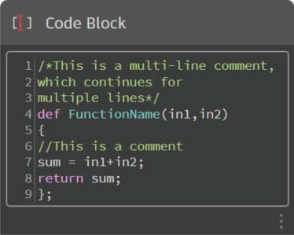
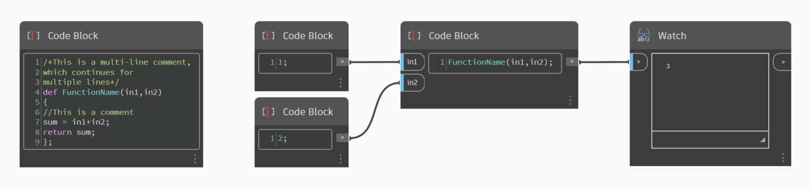
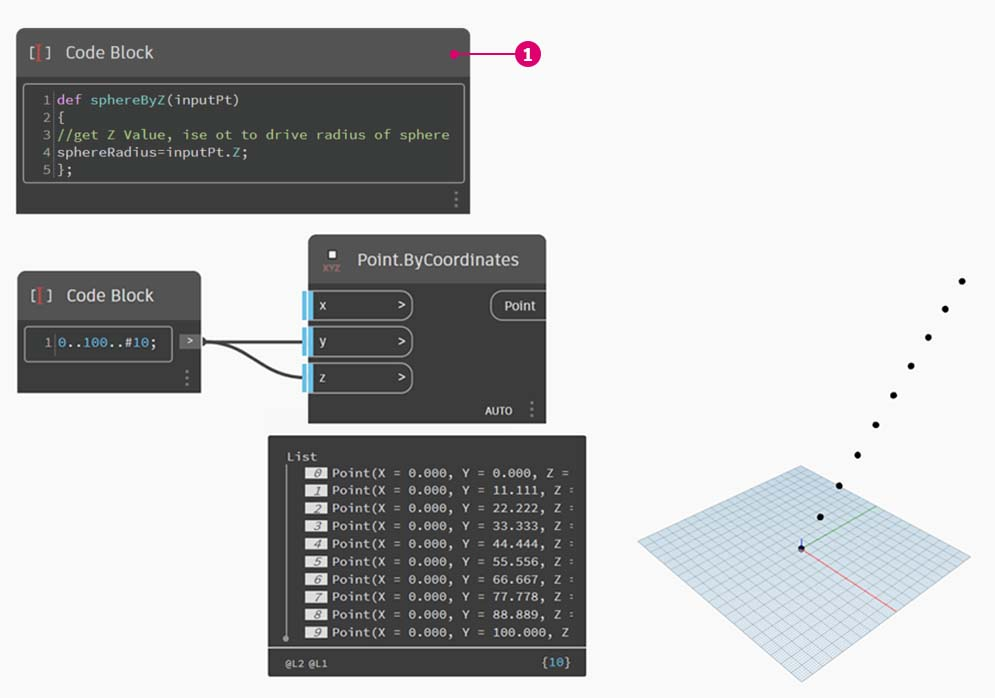
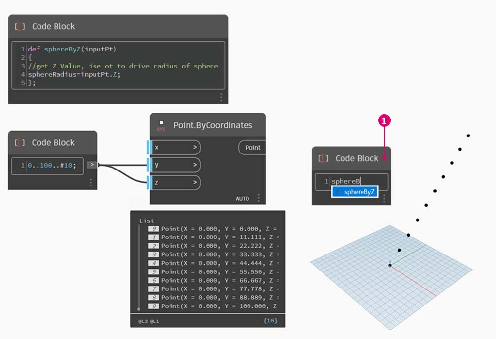
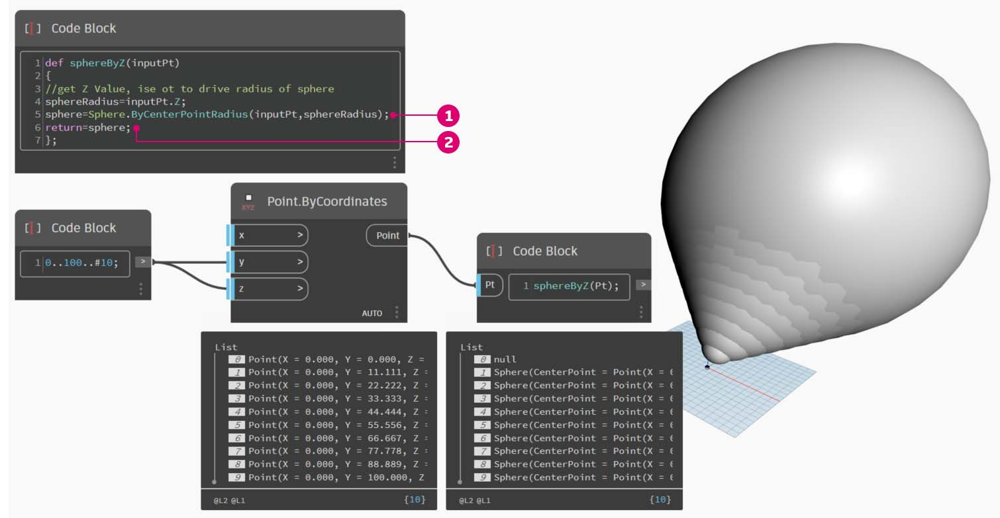
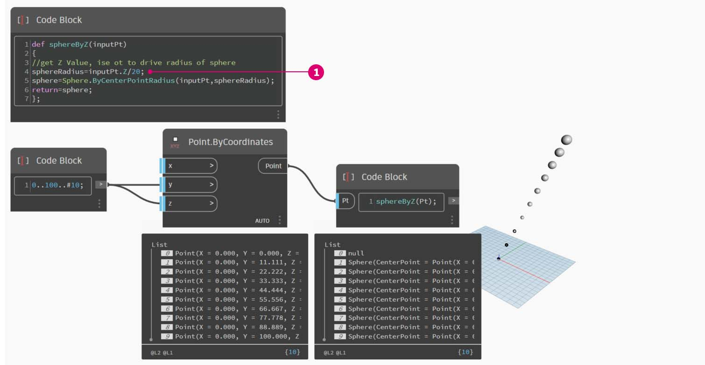
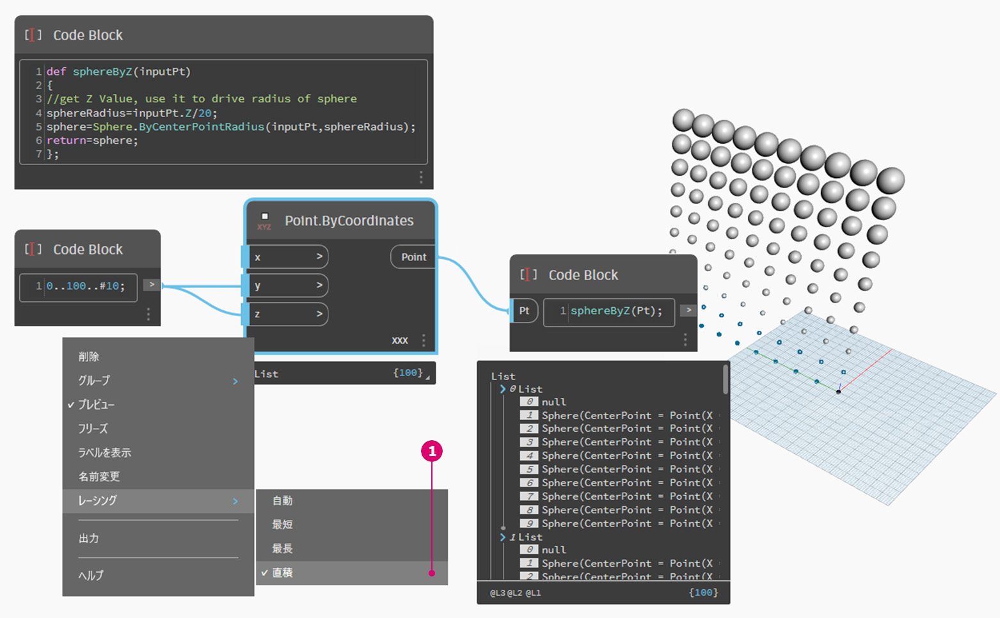
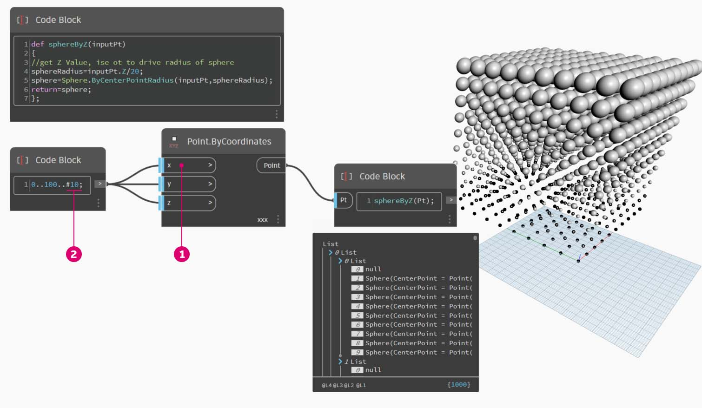
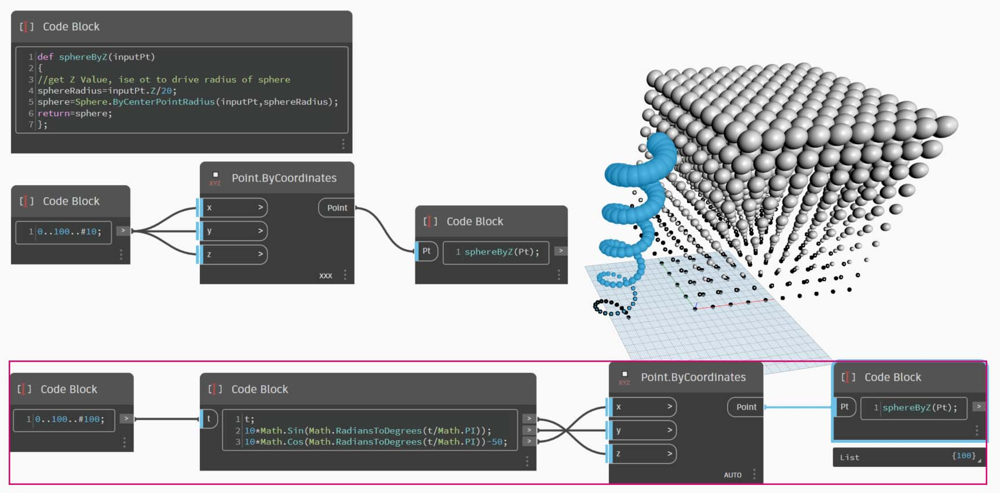
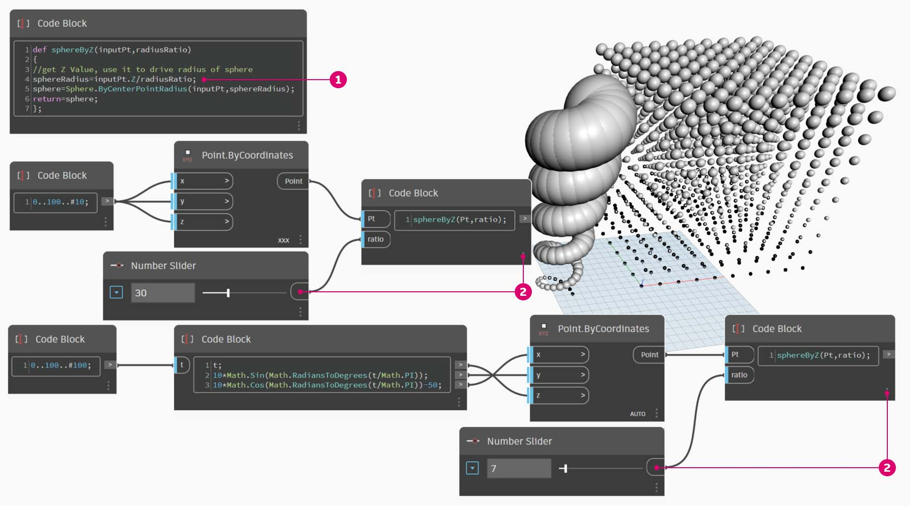

# 関数

関数は Code Block ノード内で作成することができ、Dynamo 定義の任意の場所から呼び出すことができます。これにより、パラメトリック ファイル内に新しいコントロール レイヤーが追加されます。Code Block ノードは、テキストベースのカスタム ノードとしてみなすことができます。この場合、「親」コード ブロックに簡単にアクセスすることができます。親コード ブロックは、グラフ上の任意の場所に配置することができます。ワイヤは必要ありません。

### 親

最初の行に、キーワードの「def」と関数名を続けて入力し、入力データの名前を括弧で囲んで記述します。関数の本文を定義する場合は、波括弧 {} を使用します。値を返す場合は、「return =」を指定します。関数を定義する Code Block ノードは他の Code Block ノードから呼び出されるため、入力ポートと出力ポートはありません。



```
/*This is a multi-line comment,
which continues for
multiple lines*/
def FunctionName(in1,in2)
{
//This is a comment
sum = in1+in2;
return sum;
};
```

### 子

関数を呼び出すには、同じファイル内で別の Code Block ノードを使用して、呼び出す関数の名前と、親 Code Block ノードで定義されているものと同じ数の引数を指定します。これは、ライブラリ内に用意されているノードと同様に動作します。



```
FunctionName(in1,in2);
```

## 演習: Z 座標での球体

> 下のリンクをクリックして、サンプル ファイルをダウンロードします。
>
> すべてのサンプルファイルの一覧については、付録を参照してください。



この演習では、点の入力リストから球体を生成する一般的な定義を作成します。これらの球体の半径は、各点の Z プロパティによってコントロールされます。

最初に、0 から 100 までの範囲内で 10 個の数値を作成しましょう。これらの数値を **Point.ByCoordinates** ノードに接続し、斜線を作成します。


**Code Block** ノードを作成して、定義を追加します。


> 1.  次のコード行を使用します。
>
>     ```
>     def sphereByZ(inputPt)
>     {
>
>     };
>     ```
>
> _inputPt_ は、関数をコントロールする点を表す名前です。この時点では、この関数はまだ機能しませんが、これ以降の手順でこの関数を設定していきます。



> 1. **Code Block** ノードを使用して、この関数にコメントと _sphereRadius_ 変数を入力します。この変数により、各点の _Z_ 位置のクエリーが実行されます。_inputPt.Z_ はメソッドであるため、引数を指定するための括弧は必要ありません。これは既存の要素のプロパティの_クエリー_であるため、入力は必要ありません。
>
> ```
> def sphereByZ(inputPt,radiusRatio)
> {
> //get Z Value, ise ot to drive radius of sphere
> sphereRadius=inputPt.Z;
> };
> ```



> 1. ここで、別の **Code Block** ノードで作成した関数を呼び出してみましょう。キャンバスをダブルクリックして新しい _Code Block_ ノードを作成し、_sphereB_ と入力すると、既に定義されている _sphereByZ_ 関数が候補として表示されます。これにより、前の手順で作成した関数が IntelliSense ライブラリに追加されていることがわかります。


> 1.  関数を呼び出して _Pt_ という変数を作成して、前の手順で作成した点を接続します。
>
>     ```
>     sphereByZ(Pt)
>     ```
> 2. 出力されたリストを確認すると、値がすべて NULL になっていることがわかります。なぜでしょうか。これは、この関数を定義するときに _sphereRadius_ 変数は計算しましたが、この関数が何を_出力_として_返す_のかを定義しなかったためです。これについては、次の手順で修正します。


> 1. _sphereByZ_ 関数に `return = sphereRadius;` というコード行を追加して、関数の出力を定義する必要があります。これは重要な手順です。
> 2. Code Block ノードの出力は、各点の Z 座標です。

_親_関数を編集して、実際に球体を作成してみましょう。



> 1. まず、次のコード行で球体を定義します。`sphere=Sphere.ByCenterPointRadius(inputPt,sphereRadius);`
> 2. 次に、戻り値が _sphereRadius_ から _sphere_ となるように `return = sphere;` と記述します。これにより、Dynamo プレビューで非常に大きな球体が表示されます。



> 1\.これらの球体のサイズを調整するには、`sphereRadius = inputPt.Z/20;` という除数を追加して sphereRadius 値を更新します。これで、各球体が離れて表示され、半径と Z 値との関係がわかるようになります。



> 1. **Point.ByCoordinates** ノードでレーシングを[最短リスト]から[直積]に変更して、点のグリッドを作成します。_sphereByZ_ 関数により、すべての点で Z 値に基づいた半径の円が作成されます。



> 1. 次に、**Point.ByCoordinates** ノードの X 入力に元の数値のリストを接続してみます。この操作により、球体によって構成される立方体が作成されます。
> 2. 注: この処理に時間がかかる場合は、_\#10_ を _\#5_ などの値に変更してください。

ここで作成した _sphereByZ_ 関数は汎用的な関数であるため、前の演習で作成したらせん構造を呼び出して、この関数を適用することができます。



最後に、半径の比をユーザ設定のパラメータでコントロールしてみましょう。これを行うには、関数に対して新しい入力を作成し、除数の _20_ をパラメータで置き換える必要があります。



> 1.  _sphereByZ_ 関数の定義を、次のように更新します。
>
>     ```
>     def sphereByZ(inputPt,radiusRatio)
>     {
>     //get Z Value, use it to drive radius of sphere
>     sphereRadius=inputPt.Z/radiusRatio;
>     //Define Sphere Geometry
>     sphere=Sphere.ByCenterPointRadius(inputPt,sphereRadius);
>     //Define output for function
>     return sphere;
>     };
>     ```
> 2. `sphereByZ(Pt,ratio);` のように、子の **Code Block** ノードの入力に ratio 変数を追加して更新します。次に、新しく作成した **Code Block** ノードの入力に Number Slider ノードを接続し、半径の比に基づいて半径のサイズを変更します。
