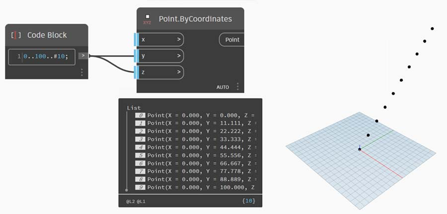
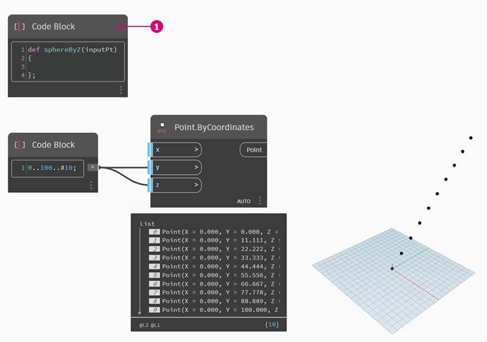
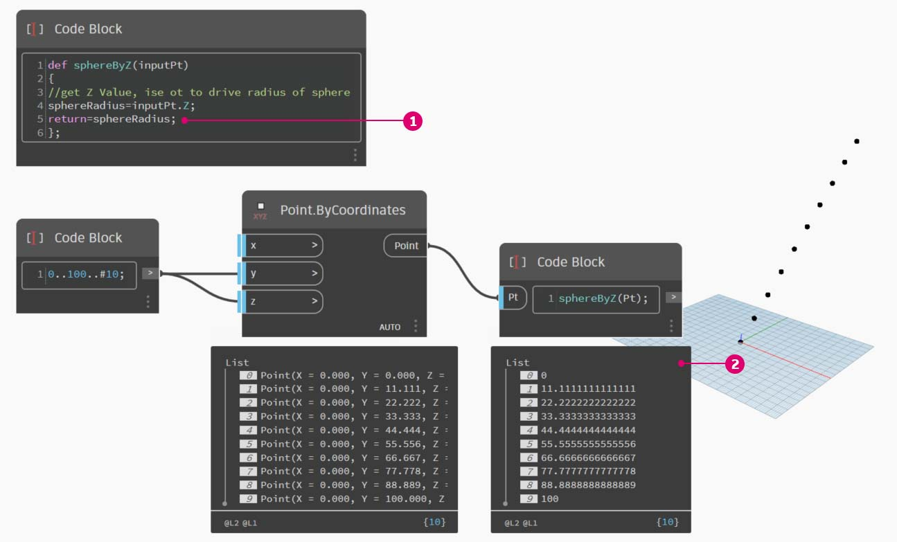

# Функции

Узлы Code Block позволяют вставлять в график функции, к которым смогут обращаться другие компоненты программы Dynamo. При этом в параметрическом файле создается еще один слой управления, который можно рассматривать как текстовую версию пользовательского узла. При этом «родительский» узел Code Block легко доступен и может находиться в любом месте графика. И никаких проводов!

### Родительский узел Code Block

Первая строка содержит ключевое слово «def», затем название функции и наименования входных данных в скобках. Тело функции заключено в фигурные скобки. Значение возвращается с помощью оператора «return =». В узлах Code Block, определяющих функцию, отсутствуют порты ввода и вывода, так как они вызываются из других блоков кода.


```
/*This is a multi-line comment,
which continues for
multiple lines*/
def FunctionName(in1,in2)
{
//This is a comment
sum = in1+in2;
return sum;
};
```

### Дочерние узлы Code Block

Функцию можно вызвать с помощью другого узла Code Block в том же файле, указав имя и такое же число аргументов. Этот процесс аналогичен использованию готовых узлов из библиотеки.


```
FunctionName(in1,in2);
```

## Упражнение «Сфера по оси Z»

> Скачайте файл примера, щелкнув указанную ниже ссылку.
>
> Полный список файлов примеров можно найти в приложении.



В этом упражнении мы создадим типовую программу, которая будет генерировать сферы на основе вводимого списка точек. Радиус сфер определяется свойством Z каждой точки.

Для начала зададим десять числовых значений в диапазоне от 0 до 100. Соединим этот узел с узлом **Point.ByCoordinates** для создания диагональной линии.



Создайте узел **Code Block** и введите определение.



> 1.  Используйте следующие строки кода:
>
>     ```
>     def sphereByZ(inputPt)
>     {
>
>     };
>     ```
>
> _inputPt_ — это имя, заданное для точек, которые будут определять функцию. В настоящее время эта функция не выполняет никаких действий, но она будет дополнена по ходу работы.


> 1. Дополните функцию **Code Block**, разместив комментарий и переменную _sphereRadius_, которая запрашивает положение каждой точки по оси _Z_. Напомним, что метод _inputPt.Z_ не нужно заключать в скобки. Это _запрос_ свойств существующего элемента, поэтому указывать входные данные не требуется.
>
> ```
> def sphereByZ(inputPt,radiusRatio)
> {
> //get Z Value, ise ot to drive radius of sphere
> sphereRadius=inputPt.Z;
> };
> ```


> 1. Вызовите функцию, созданную в другом узле **Code Block**. Если дважды щелкнуть в активном окне для создания нового узла _Code Block_ и ввести _sphereB_, то вы увидите, что Dynamo предложит использовать созданную выше функцию _sphereByZ_. Функция была добавлена в библиотеку IntelliSense! Неплохо.


> 1.  Теперь вызовем функцию и создадим переменную _Pt_, чтобы использовать созданные ранее точки.
>
>     ```
>     sphereByZ(Pt)
>     ```
> 2. Обратите внимание, что на выходе мы получили нулевые значения. Почему? При определении функции был задан расчет переменной _sphereRadius_, но не было указано, что именно функция должна _возвращать_ в качестве _выходных данных_. Наших следующим шагом будет исправление этого упущения.



> 1. Это важный шаг: необходимо задать выходные данные функции, добавив строку `return = sphereRadius;` в функцию _sphereByZ_.
> 2. Теперь Code Block выводит координаты Z каждой точки.

Создадим сферы, отредактировав _родительскую_ функцию.


> 1. Сначала определите сферу с помощью строки кода: `sphere=Sphere.ByCenterPointRadius(inputPt,sphereRadius);`.
> 2. Теперь измените возвращаемое значение на _sphere_ вместо _sphereRadius_: `return = sphere;`. В области предварительного просмотра Dynamo появятся гигантские сферы.


> 1\. Чтобы уменьшить размер этих сфер, обновите значение sphereRadius, добавив разделитель: `sphereRadius = inputPt.Z/20;`. Теперь видно отдельные сферы, что позволяет понять взаимосвязь между радиусом и значением Z.


> 1. В узле **Point.ByCoordinates** измените режим переплетения с «Самый короткий список» на «Векторное произведение», в результате чего будет создана сетка точек. Функция _sphereByZ_ все еще действует, поэтому все точки создают сферы с радиусами, основанными на значениях Z.


> 1. Для проверки соединим исходный список чисел с входным портом X узла **Point.ByCoordinates**. Мы получили куб из сфер.
> 2. Примечание. Если для расчета компьютеру требуется много времени, попробуйте уменьшить значение _\#10_ и задать вместо него, например, _\#5_.

Поскольку созданная нами функция _sphereByZ_ является типовой, можно вызвать спираль из предыдущего урока и применить эту функцию к ней.


И последний шаг: настройка коэффициента радиуса с помощью пользовательских параметров. Для этого необходимо создать новый входной порт для функции и заменить делитель _20_ параметром.


> 1.  Изменим определение _sphereByZ_ на следующее:
>
>     ```
>     def sphereByZ(inputPt,radiusRatio)
>     {
>     //get Z Value, use it to drive radius of sphere
>     sphereRadius=inputPt.Z/radiusRatio;
>     //Define Sphere Geometry
>     sphere=Sphere.ByCenterPointRadius(inputPt,sphereRadius);
>     //Define output for function
>     return sphere;
>     };
>     ```
> 2. Обновите дочерние узлы **Code Block**, добавив переменную ratio к входным данным: `sphereByZ(Pt,ratio);`. Добавьте регулятор к только что созданному узлу **Code Block**. Теперь можно изменять размер радиусов на основе коэффициента.
