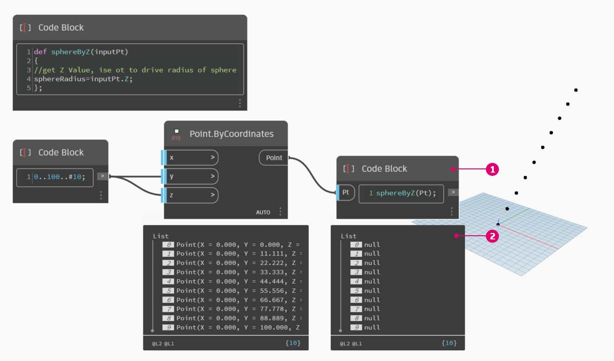

# 函數

可以在程式碼塊中建立函數，然後在 Dynamo 定義中的其他位置重新呼叫函數。此作業會在參數式檔案中建立另一個控制層，可視為自訂節點的文字版本。在此案例中，「父系」程式碼區塊可隨時存取，可在圖表中的任何位置找到。無需使用線路！

### 父系

第一行包含關鍵字「def」，然後依次是函數名稱與輸入的名稱 (在括號中)。大括號定義函數的本體。使用「return =」傳回值。定義函數的程式碼區塊沒有輸入或輸出埠，因為會從其他程式碼區塊呼叫。


```
/*This is a multi-line comment,
which continues for
multiple lines*/
def FunctionName(in1,in2)
{
//This is a comment
sum = in1+in2;
return sum;
};
```

### 子系

使用同一檔案中的其他程式碼區塊，只需提供名稱與相同數量的引數即可呼叫函數。其工作方式類似於資源庫中的現成節點。


```
FunctionName(in1,in2);
```

## 練習：透過 Z 建立圓球

> 按一下下方的連結下載範例檔案。
>
> 附錄中提供範例檔案的完整清單。



在本練習中，我們將進行根據輸入點清單建立圓球的一般定義。這些圓球的半徑由每個點的 Z 性質驅動。

接下來先建立介於 0 到 100 之間的一系列十個值。將這些值插入 **Point.ByCoordinates** 節點，以建立對角線。


建立 **Code Block** 並介紹我們的定義。


> 1.  使用以下程式碼行：
>
>     ```
>     def sphereByZ(inputPt)
>     {
>
>     };
>     ```
>
> _inputPt_ 是我們為了表示驅動函數的點而提供的名稱。到現在為止，函數不會執行任何作業，但我們將在後續步驟中建置此函數。


> 1. 加入 **Code Block** 函數後，我們加上註解和 _sphereRadius_ 變數，它會查詢每個點的 _Z_ 位置。請記住，_inputPt.Z_ 是一個方法，不需要括號。這是 _查詢_ 既有元素的性質，因此不需要任何輸入：
>
> ```
> def sphereByZ(inputPt,radiusRatio)
> {
> //get Z Value, ise ot to drive radius of sphere
> sphereRadius=inputPt.Z;
> };
> ```


> 1. 現在，我們呼叫在另一個 **Code Block** 中建立的函數。如果在圖元區上按兩下以建立新的 _Code Block_，然後鍵入 _sphereB_，我們發現 Dynamo 建議使用我們定義的 _sphereByZ_ 函數。您的函數已加入 intellisense 資源庫！太酷了。



> 1.  現在，我們呼叫函數，並建立一個稱為 _Pt_ 的變數以插入先前步驟中建立的點：
>
>     ```
>     sphereByZ(Pt)
>     ```
> 2. 我們看到輸出全部都是空值。為何會發生這種情況？定義函數時，我們會計算 _sphereRadius_ 變數，但沒有定義函數應 _傳回_ 哪些項目做為 _輸出_。我們可以在下一步修正此問題。


> 1. 我們需要在 _sphereByZ_ 函數中加入 `return = sphereRadius;` 行定義函數的輸出，這是重要的步驟。
> 2. 現在，我們可以看到程式碼區塊的輸出提供每個點的 Z 座標。

現在，我們要編輯 _父系_ 函數以建立實際的圓球。


> 1. 我們首先使用以下程式碼行定義圓球：`sphere=Sphere.ByCenterPointRadius(inputPt,sphereRadius);`
> 2. 接下來，我們將傳回值變更為 _sphere_，而不是 _sphereRadius_：`return = sphere;` 這會在 Dynamo 預覽中產生一些巨大的圓球！


> 1\.若要調整這些圓球的大小，我們加入圓規來更新圓球半徑值：`sphereRadius = inputPt.Z/20;` 現在，我們可以看到分開的圓球，並開始了解半徑與 Z 值之間的關係。


> 1. 在 **Point.ByCoordinates** 節點上，透過將交織從「最短清單」變更為「笛卡兒積」，我們建立點的格線。_sphereByZ_ 函數仍完全有效，因此所有點會建立半徑以 Z 值為基礎的圓球。


> 1. 為了進行測試，我們將原始數字清單插入 **Point.ByCoordinates** 的 X 輸入。我們現在有一個立方塊的圓球。
> 2. 注意：如果在您的電腦上需要花很長時間執行此計算，請嘗試將 _\#10_ 變更為諸如 _\#5_ 等數字。

請記住，我們建立的 _sphereByZ_ 函數是一般函數，因此可以回顧先前課程中的螺旋線，並對其套用函數。


最後一步：運用使用者定義的參數驅動半徑比。若要執行，我們需要為函數建立新輸入，並使用參數取代除數 _20_。


> 1.  將 _sphereByZ_ 定義更新為：
>
>     ```
>     def sphereByZ(inputPt,radiusRatio)
>     {
>     //get Z Value, use it to drive radius of sphere
>     sphereRadius=inputPt.Z/radiusRatio;
>     //Define Sphere Geometry
>     sphere=Sphere.ByCenterPointRadius(inputPt,sphereRadius);
>     //Define output for function
>     return sphere;
>     };
>     ```
> 2. 在輸入 `sphereByZ(Pt,ratio);` 中加入 ratio 變數以更新子系 **Code Block**。將滑棒插入新建立的 **Code Block** 輸入，並根據半徑比變更半徑的大小。
