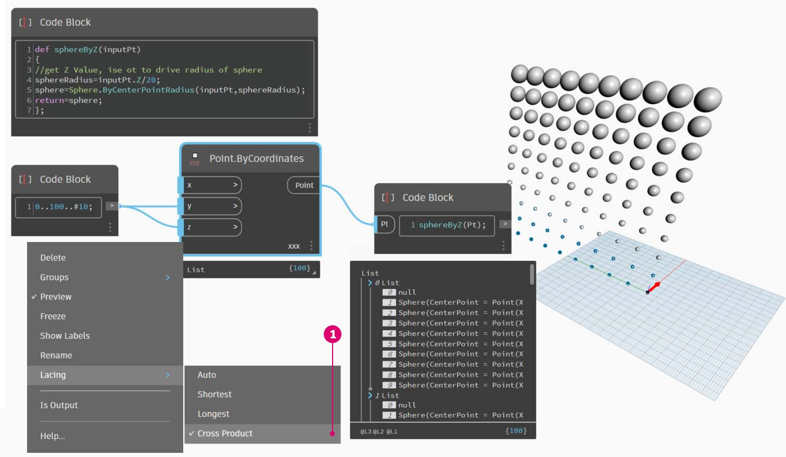

# Functions

函数可以在代码块中创建，并在 Dynamo 定义中的其他位置进行调用。这将在参数化文件中创建另一层控制，并且可以作为基于文本版本的自定义节点进行查看。在这种情况下，“父”代码块可以随时访问，并且可以位于图形上的任意位置。不需要引线！

### 父对象

第一行包含关键字“def”，接着是函数名称，然后是括号中的输入名称。大括号定义函数的主体。使用“return =”返回值。定义函数的代码块没有输入或输出端口，因为它们是从其他代码块调用的。


```
/*This is a multi-line comment,
which continues for
multiple lines*/
def FunctionName(in1,in2)
{
//This is a comment
sum = in1+in2;
return sum;
};
```

### 子项

通过提供名称和相同数量的参数，调用同一文件中具有另一代码块的函数。其工作原理与库中现成的节点一样。


```
FunctionName(in1,in2);
```

## 练习：球体（按 Z）

> 单击下面的链接下载示例文件。
>
> 可以在附录中找到示例文件的完整列表。



在本练习中，我们将创建一个通用定义，该定义将通过输入的点列表创建球体。这些球体的半径由每个点的 Z 特性驱动。

首先从 0 到 100 的十个值范围开始。将这些值插入到**“Point.ByCoordinates”**节点，以创建对角线。


创建**“代码块”**，然后引入我们的定义。


> 1.  使用以下代码行：
>
>     ```
>     def sphereByZ(inputPt)
>     {
>
>     };
>     ```
>
> _“inputPt”_是我们提供的名称，用于表示将驱动函数的点。目前，该函数不会执行任何操作，但我们会在后续步骤中构建此函数。


> 1. 通过添加到**“代码块”**函数，我们放置注释和_“sphereRadius”_变量（该变量会查询每个点的_“Z”_位置）。请记住，_“inputPt.Z”_不需要圆括号以用作方法。这是对现有图元特性的_“查询”_，因此不需要输入：
>
> ```
> def sphereByZ(inputPt,radiusRatio)
> {
> //get Z Value, ise ot to drive radius of sphere
> sphereRadius=inputPt.Z;
> };
> ```


> 1. 现在，我们再次调用在另一个**“代码块”**中创建的函数。如果双击画布以创建新的_“代码块”_，然后键入_“sphereB”_，我们会注意到 Dynamo 建议使用已定义的_“sphereByZ”_函数。您的函数已添加到智能库！非常棒。


> 1.  现在，我们调用相应函数并创建一个名为_“Pt”_的变量，以连接在之前步骤中创建的点：
>
>     ```
>     sphereByZ(Pt)
>     ```
> 2. 在输出中，我们注意到所有值都为空值。这是为什么呢？在定义函数后，我们会计算_“sphereRadius”_变量，但是我们未定义函数应_“返回”_为_“输出”_的内容。可以在下一个步骤中修复该问题。


> 1. 一个重要步骤是，我们需要定义函数的输出，方法是将一行代码 `return = sphereRadius;` 添加到_“sphereByZ”_函数。
> 2. 现在，我们看到“代码块”的输出为我们提供了每个点的 Z 坐标。

现在，让我们通过编辑_“父”_函数，来创建实际球体。


> 1. 首先，我们使用代码行定义一个球体：`sphere=Sphere.ByCenterPointRadius(inputPt,sphereRadius);`
> 2. 接下来，我们将返回值更改为_“sphere”_，而不是_“sphereRadius”_：`return = sphere;`。这会在 Dynamo 预览中为我们提供一些巨大的球体！


> 1\.要调整这些球体的大小，我们通过添加分隔器来更新“sphereRadius”值：`sphereRadius = inputPt.Z/20;`。现在，我们可以看到单独的球体，然后开始了解半径和 Z 值之间的关系。



> 1. 在**“Point.ByCoordinates”**节点上，通过将连缀从“最短列表”更改为“叉积”，我们将创建点栅格。_“sphereByZ”_函数仍然完全有效，因此所有点都会使用基于 Z 值的半径创建球体。


> 1. 仅是为了测试水域，我们将原始数字列表连接到**“Point.ByCoordinates”**的 X 输入。现在，我们得到了一个球体的立方体。
> 2. 注意：如果在计算机上的计算需要较长时间，请尝试将_“#10”_更改为_“#5”_之类的值。

请记住，我们创建的_“sphereByZ”_函数是一个通用函数，因此我们可以调用前一课中的螺旋，然后对其应用该函数。


最后一步：使用用户定义的参数来控制半径比。为此，我们需要为该函数创建新输入，并将_“20”_除数替换为参数。


> 1.  将_“sphereByZ”_定义更新为以下内容：
>
>     ```
>     def sphereByZ(inputPt,radiusRatio)
>     {
>     //get Z Value, use it to drive radius of sphere
>     sphereRadius=inputPt.Z/radiusRatio;
>     //Define Sphere Geometry
>     sphere=Sphere.ByCenterPointRadius(inputPt,sphereRadius);
>     //Define output for function
>     return sphere;
>     };
>     ```
> 2. 通过向输入中添加“ratio”变量来更新子**“代码块”**：`sphereByZ(Pt,ratio);`。将滑块插入到新创建的**“代码块”**输入中，并根据半径比改变半径大小。
