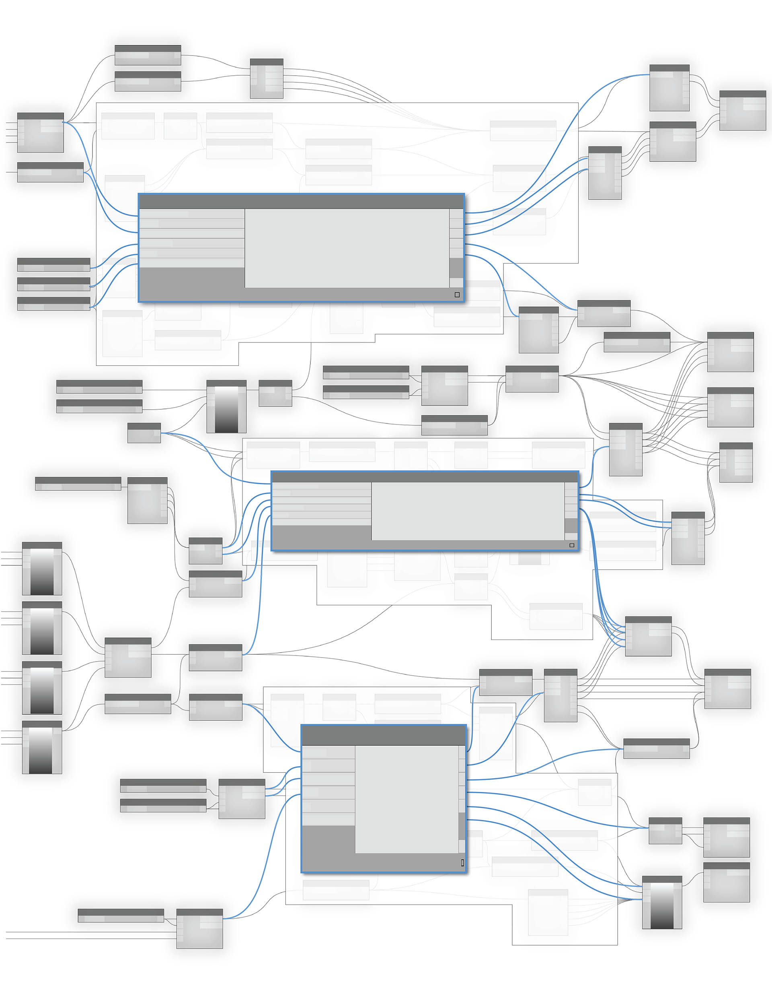

# Bloky kódů a jazyk DesignScript

Blok kódu je jedinečná funkce aplikace Dynamo, která dynamicky propojuje prostředí vizuálního programování s textovým. Blok kódu má přístup ke všem uzlům aplikace Dynamo a umožňuje definovat celý graf v jediném uzlu. Doporučujeme této kapitole věnovat zvýšenou pozornost, protože blok kódu je základním stavebním kamenem aplikace Dynamo.

