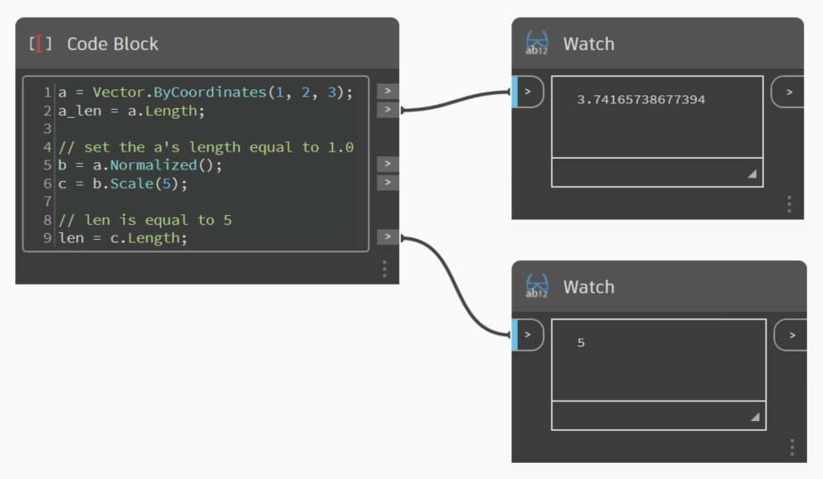
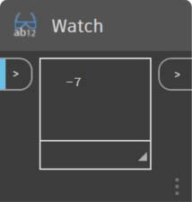

# Matemáticas vectoriales

Los objetos de los diseños computacionales rara vez se crean explícitamente en su posición y forma finales y, con mayor frecuencia, se convierten, se giran y se colocan de cualquier otro modo a partir de la geometría existente. Las matemáticas vectoriales sirven como una especie de andamiaje geométrico para proporcionar dirección y orientación a la geometría, así como para conceptualizar movimientos a través del espacio 3D sin representación visual.

Como elemento más básico, un vector representa una posición en el espacio 3D y a menudo se considera el punto final de una flecha desde la posición (0, 0, 0) hasta esa posición. Los vectores se pueden crear con el constructor _ByCoordinates_ utilizando la posición X, Y y Z del objeto vectorial que se acaba de crear. Observe que los objetos vectoriales no son objetos geométricos y no aparecen en la ventana de Dynamo. Sin embargo, la información sobre un vector recién creado o modificado se puede imprimir en la ventana de la consola:


```js
// construct a Vector object
v = Vector.ByCoordinates(1, 2, 3);

s = v.X + " " + v.Y + " " + v.Z;
```

Un conjunto de operaciones matemáticas se define en objetos vectoriales, lo que permite sumar, restar, multiplicar y, en general, desplazar objetos en un espacio 3D, tal y como desplazaría números reales en un espacio unidimensional en una línea numérica.

### Adición de vectores

La adición de vectores se define como la suma de los componentes de dos vectores y se puede entender como el vector resultante si las dos flechas de vector de componente se colocan "de la punta a la cola". La adición de vectores se realiza con el método _Add_ y se representa con el diagrama de la izquierda.


```js
a = Vector.ByCoordinates(5, 5, 0);
b = Vector.ByCoordinates(4, 1, 0);

// c has value x = 9, y = 6, z = 0
c = a.Add(b);
```

### Sustracción de vectores

Del mismo modo, se pueden restar dos objetos vectoriales entre sí mediante el método _Subtract_. La resta de vectores se puede entender como la dirección que va desde el primer vector hasta el segundo.


```js
a = Vector.ByCoordinates(5, 5, 0);
b = Vector.ByCoordinates(4, 1, 0);

// c has value x = 1, y = 4, z = 0
c = a.Subtract(b);
```

### Multiplicación de vectores

La multiplicación de vectores se puede entender como el desplazamiento del punto final de un vector en su propia dirección mediante un factor de escala especificado.


```js
a = Vector.ByCoordinates(4, 4, 0);

// c has value x = 20, y = 20, z = 0
c = a.Scale(5);
```

### Normalizar longitud de vector

A menudo, al ajustar la escala de un vector, es deseable que su longitud sea exactamente igual a la cantidad de escala ajustada. Esto se puede conseguir fácilmente. Para ello, debe normalizarse primero un vector, en otras palabras, se debe establecer la longitud del vector en un valor exactamente igual a uno.



```js
a = Vector.ByCoordinates(1, 2, 3);
a_len = a.Length;

// set the a's length equal to 1.0
b = a.Normalized();
c = b.Scale(5);

// len is equal to 5
len = c.Length;
```

c sigue apuntando en la misma dirección que a (1, 2, 3), aunque ahora tiene una longitud exactamente igual a 5.

### Producto vectorial

Existen dos métodos adicionales en las matemáticas vectoriales que no tienen equivalentes claros con las matemáticas unidimensionales: el producto vectorial y el producto escalar. El producto vectorial permite generar un vector ortogonal (a 90 grados) a dos vectores existentes. Por ejemplo, el producto vectorial de los ejes X e Y es el eje Z, aunque los dos vectores de entrada no tienen que ser ortogonales entre sí. Un vector de producto vectorial se calcula con el método _Cross_.


```js
a = Vector.ByCoordinates(1, 0, 1);
b = Vector.ByCoordinates(0, 1, 1);

// c has value x = -1, y = -1, z = 1
c = a.Cross(b);
```

### Producto escalar

Una función adicional, aunque algo más avanzada, de matemáticas vectoriales es el producto escalar. El producto escalar entre dos vectores es un número real (no un objeto vectorial) que hace referencia al ángulo entre dos vectores, aunque no exactamente. Una de las propiedades útiles de este tipo de producto es que el producto escalar entre dos vectores será 0 solo si son perpendiculares. El producto escalar se calcula con el método _Dot_.



```js
a = Vector.ByCoordinates(1, 2, 1);
b = Vector.ByCoordinates(5, -8, 4);

// d has value -7
d = a.Dot(b);
```
