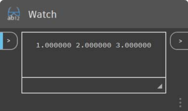

# Matematyka wektorowa

Obiekty w projektach obliczeniowych rzadko są tworzone jawnie w końcowym położeniu i formie. Najczęściej są przekształcane, obracane i umieszczane w oparciu o istniejącą geometrię. Matematyka wektorowa służy jako rodzaj geometrycznego rusztowania pozwalającego nadać geometrii kierunek i orientację, jak również do konceptualizowania ruchów w przestrzeni 3D bez reprezentacji wizualnej.

Podstawowy wektor reprezentuje położenie w przestrzeni 3D i zwykle jest uważany za punkt końcowy strzałki od położenia (0, 0, 0) do położenia grotu. Wektory mogą być tworzone za pomocą konstruktora _ByCoordinates_ po podaniu położenia x, y i z nowo utworzonego obiektu wektora. Należy zauważyć, że obiekty wektorów nie są obiektami geometrycznymi i nie pojawiają się w oknie dodatku Dynamo. Jednak w oknie konsoli można wyświetlić informacje o nowo utworzonym lub zmodyfikowanym wektorze:



```js
// construct a Vector object
v = Vector.ByCoordinates(1, 2, 3);

s = v.X + " " + v.Y + " " + v.Z;
```

Dla obiektów wektorów zdefiniowany jest zestaw operacji matematycznych umożliwiający dodawanie, odejmowanie, mnożenie i w inny sposób przenoszenie obiektów w przestrzeni 3D, podobnie jak w przypadku przesuwania rzeczywistych liczb w przestrzeni jednowymiarowej na oznaczonej liczbami linii.

### Dodawanie wektorów

Dodawanie wektorów jest zdefiniowane jako suma składników dwóch wektorów i może być traktowane jako wektor wynikowy, jeśli dwie składowe strzałki wektorów stykają się „grotem do końcówki”. Dodawanie wektorów odbywa się za pomocą metody _Add_ i jest przedstawione za pomocą wykresu po lewej stronie.


```js
a = Vector.ByCoordinates(5, 5, 0);
b = Vector.ByCoordinates(4, 1, 0);

// c has value x = 9, y = 6, z = 0
c = a.Add(b);
```

### Odejmowanie wektorów

Podobnie dwa obiekty wektorów można od siebie odjąć za pomocą metody _Substract_. Odejmowanie wektorów może być traktowane jako kierunek od pierwszego wektora do drugiego wektora.


```js
a = Vector.ByCoordinates(5, 5, 0);
b = Vector.ByCoordinates(4, 1, 0);

// c has value x = 1, y = 4, z = 0
c = a.Subtract(b);
```

### Mnożenie wektorów

Mnożenie wektorów może być traktowane jako przesuwanie punktu końcowego wektora w jego własnym kierunku z danym współczynnikiem skalowania.


```js
a = Vector.ByCoordinates(4, 4, 0);

// c has value x = 20, y = 20, z = 0
c = a.Scale(5);
```

### Normalizowanie długości wektora

Często podczas skalowania wektora wymagane jest uzyskanie długości wynikowego wektora dokładnie równej wielkości skalowanej. Można to łatwo osiągnąć przez najpierw znormalizowanie wektora, czyli ustawienie długości wektora równej dokładnie jeden.


```js
a = Vector.ByCoordinates(1, 2, 3);
a_len = a.Length;

// set the a's length equal to 1.0
b = a.Normalized();
c = b.Scale(5);

// len is equal to 5
len = c.Length;
```

c nadal wskazuje w tym samym kierunku co a (1, 2, 3), ale teraz ma długość dokładnie równą 5.

### Iloczyn wektorowy

Istnieją dwie dodatkowe metody w matematyce wektorowej, które nie mają wyraźnych odpowiedników w matematyce jednowymiarowej: iloczyn wektorowy i iloczyn skalarny. Iloczyn wektorowy to metoda generowania wektora, który jest prostopadły (jest pod kątem 90 stopni) do dwóch istniejących wektorów. Na przykład wynikiem iloczynu wektorowego osi x i y jest oś z, chociaż dwa wektory wejściowe nie muszą być do siebie prostopadłe. Wektor będący wynikiem iloczynu wektorowego jest obliczany za pomocą metody _Cross_.


```js
a = Vector.ByCoordinates(1, 0, 1);
b = Vector.ByCoordinates(0, 1, 1);

// c has value x = -1, y = -1, z = 1
c = a.Cross(b);
```

### Iloczyn skalarny

Dodatkowa, choć nieco bardziej zaawansowana funkcja matematyki wektorowej, to iloczyn skalarny. Iloczyn skalarny dwóch wektorów jest liczbą rzeczywistą (nie obiektem wektora), która odnosi się do, ale nie jest dokładnie kątem między dwoma wektorami. Jedną z przydatnych właściwości iloczynu skalarnego jest to, że ma on wartość 0 wtedy i tylko wtedy, gdy mnożone wektory są prostopadłe. Iloczyn skalarny jest obliczany za pomocą metody _Dot_.


```js
a = Vector.ByCoordinates(1, 2, 1);
b = Vector.ByCoordinates(5, -8, 4);

// d has value -7
d = a.Dot(b);
```
