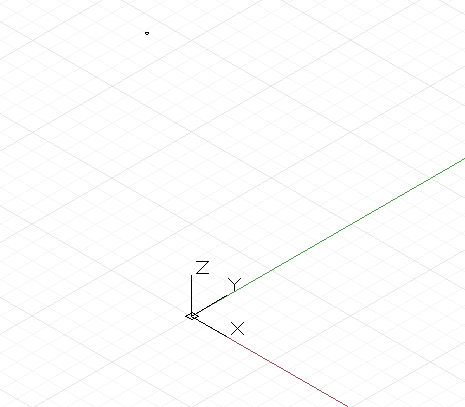
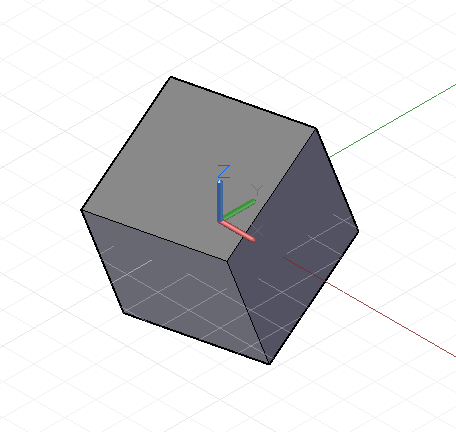
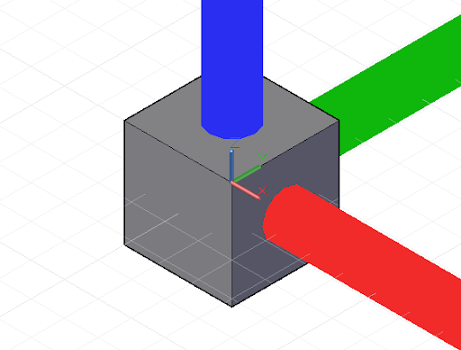
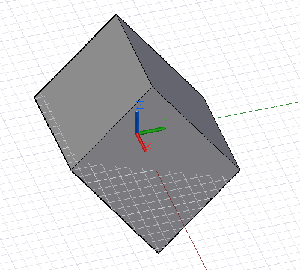

# Transformações de conversão, rotação e outras

Determinados objetos de geometria podem ser criados explicitamente especificando as coordenadas x, y e z no espaço tridimensional. No entanto, mais frequentemente a geometria é movida para sua posição final usando transformações geométricas no próprio objeto ou em seu sistema de coordenadas subjacente.

### Tradução

A transformação geométrica mais simples é uma conversão, que move um objeto um número especificado de unidades nas direções x, y e z.



```js
// create a point at x = 1, y = 2, z = 3
p = Point.ByCoordinates(1, 2, 3);

// translate the point 10 units in the x direction,
// -20 in y, and 50 in z
// p2’s new position is x = 11, y = -18, z = 53
p2 = p.Translate(10, -20, 50);
```

### Rotação

Embora todos os objetos no Dynamo possam ser convertidos anexando o método _.Translate_ ao final do nome do objeto, as transformações mais complexas exigem a transformação do objeto de um sistema de coordenadas subjacente em um novo sistema de coordenadas. Por exemplo, para rotacionar um objeto 45° em torno do eixo x, vamos transformar o objeto de seu sistema de coordenadas existente sem rotação em um sistema de coordenadas que foi rotacionado 45° em torno do eixo x com o método _.Transform_:



```js
cube = Cuboid.ByLengths(CoordinateSystem.Identity(),
    10, 10, 10);

new_cs = CoordinateSystem.Identity();
new_cs2 = new_cs.Rotate(Point.ByCoordinates(0, 0),
    Vector.ByCoordinates(1,0,0.5), 25);

// get the existing coordinate system of the cube
old_cs = CoordinateSystem.Identity();

cube2 = cube.Transform(old_cs, new_cs2);
```

### Escala

Além de serem convertidos e rotacionados, também é possível criar os sistemas de coordenadas com escala ou cisalhamento. É possível dimensionar um sistema de coordenadas com o método _.Scale_:



```js
cube = Cuboid.ByLengths(CoordinateSystem.Identity(),
    10, 10, 10);

new_cs = CoordinateSystem.Identity();
new_cs2 = new_cs.Scale(20);

old_cs = CoordinateSystem.Identity();

cube2 = cube.Transform(old_cs, new_cs2);
```

Os sistemas de coordenadas de cisalhamento são criados inserindo vetores não ortogonais no construtor do sistema de coordenadas.



```js
new_cs = CoordinateSystem.ByOriginVectors(
    Point.ByCoordinates(0, 0, 0),
	Vector.ByCoordinates(-1, -1, 1),
	Vector.ByCoordinates(-0.4, 0, 0));

old_cs = CoordinateSystem.Identity();

cube = Cuboid.ByLengths(CoordinateSystem.Identity(),
    5, 5, 5);

new_curves = cube.Transform(old_cs, new_cs);
```

A escala e o cisalhamento são, comparativamente, transformações geométricas mais complexas do que a rotação e a conversão, de modo que nem todos os objetos do Dynamo podem sofrer essas transformações. A tabela a seguir descreve quais objetos do Dynamo podem ter sistemas de coordenadas com escala não uniforme e sistemas de coordenadas com cisalhamento.

| Classe        | Sistema de coordenadas com escala não uniforme| Sistema de coordenadas com cisalhamento |
| ------------ | ------------------------------------- | ------------------------ |
| Arco          | Não                                    | Não                       |
| NurbsCurve   | Sim                                   | Sim                      |
| NurbsSurface | Não                                    | Não                       |
| Círculo       | Não                                    | Não                       |
| Linha         | Sim                                   | Sim                      |
| Plano        | Não                                    | Não                       |
| Ponto        | Sim                                   | Sim                      |
| Polígono      | Não                                    | Não                       |
| Sólido        | Não                                    | Não                       |
| Superfície      | Não                                    | Não                       |
| Texto         | Não                                    | Não                       |
