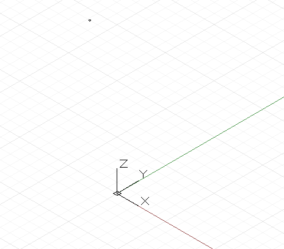
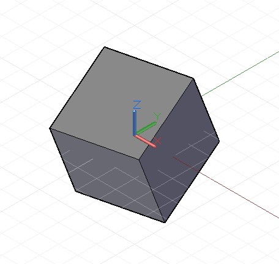
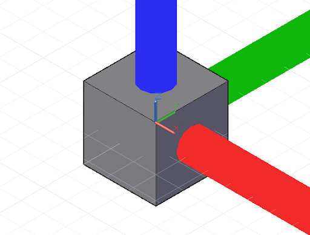
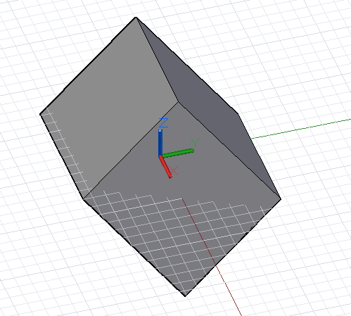

# Conversion, rotation et autres transformations

Certains objets de géométrie peuvent être créés en spécifiant explicitement les coordonnées X, Y et Z dans un espace tridimensionnel. Le plus souvent cependant, la géométrie est amenée à sa position finale au moyen de transformations géométriques appliquées à l’objet lui-même ou au système de coordonnées sous-jacent.

### Translation

La transformation géométrique la plus simple est une conversion qui permet de déplacer un objet d’un nombre donné d’unités dans les directions X, Y et Z.



```js
// create a point at x = 1, y = 2, z = 3
p = Point.ByCoordinates(1, 2, 3);

// translate the point 10 units in the x direction,
// -20 in y, and 50 in z
// p2’s new position is x = 11, y = -18, z = 53
p2 = p.Translate(10, -20, 50);
```

### Rotation

Bien que tous les objets de Dynamo puissent être déplacés en ajoutant la méthode _.Translate_ à la fin du nom de l’objet, les transformations plus complexes exigent de faire passer l’objet d’un système de coordonnées sous-jacent à un nouveau système de coordonnées. Par exemple, pour faire pivoter un objet de 45 degrés autour de l’axe X, vous transformez l’objet depuis son système de coordonnées existant, sans rotation, vers un système de coordonnées ayant subi une rotation de 45 degrés autour de l’axe X, à l’aide de la méthode _.Transform_ :



```js
cube = Cuboid.ByLengths(CoordinateSystem.Identity(),
    10, 10, 10);

new_cs = CoordinateSystem.Identity();
new_cs2 = new_cs.Rotate(Point.ByCoordinates(0, 0),
    Vector.ByCoordinates(1,0,0.5), 25);

// get the existing coordinate system of the cube
old_cs = CoordinateSystem.Identity();

cube2 = cube.Transform(old_cs, new_cs2);
```

### Échelle

Outre la translation et la rotation, les systèmes de coordonnées peuvent également être créés avec une mise à l’échelle ou un cisaillement. Un système de coordonnées peut être mis à l’échelle à l’aide de la méthode _.Scale_ :



```js
cube = Cuboid.ByLengths(CoordinateSystem.Identity(),
    10, 10, 10);

new_cs = CoordinateSystem.Identity();
new_cs2 = new_cs.Scale(20);

old_cs = CoordinateSystem.Identity();

cube2 = cube.Transform(old_cs, new_cs2);
```

Les systèmes de coordonnées cisaillés sont créés en fournissant des vecteurs non orthogonaux au constructeur du système de coordonnées.



```js
new_cs = CoordinateSystem.ByOriginVectors(
    Point.ByCoordinates(0, 0, 0),
	Vector.ByCoordinates(-1, -1, 1),
	Vector.ByCoordinates(-0.4, 0, 0));

old_cs = CoordinateSystem.Identity();

cube = Cuboid.ByLengths(CoordinateSystem.Identity(),
    5, 5, 5);

new_curves = cube.Transform(old_cs, new_cs);
```

Étant donné que la mise à l’échelle et le cisaillement sont des transformations géométriques plus complexes que la rotation et la translation, les objets Dynamo ne peuvent pas tous faire l’objet de ces transformations. Le tableau suivant indique quels objets Dynamo peuvent avoir des systèmes de coordonnées mis à l’échelle de façon non uniforme et des systèmes de coordonnées cisaillés.

| Classe        | Système de coordonnées mis à l’échelle de façon non uniforme| Système de coordonnées cisaillé |
| ------------ | ------------------------------------- | ------------------------ |
| Arc          | Non                                    | Non                       |
| NurbsCurve   | Oui                                   | Oui                      |
| NurbsSurface | Non                                    | Non                       |
| Cercle       | Non                                    | Non                       |
| Ligne         | Oui                                   | Oui                      |
| Plan        | Non                                    | Non                       |
| Point        | Oui                                   | Oui                      |
| Objet Polygon      | Non                                    | Non                       |
| Solide        | Non                                    | Non                       |
| Surface      | Non                                    | Non                       |
| Texte         | Non                                    | Non                       |
