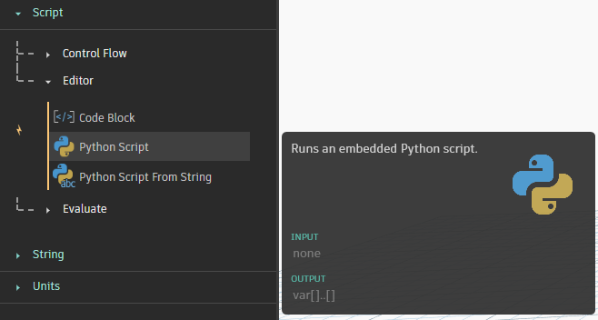
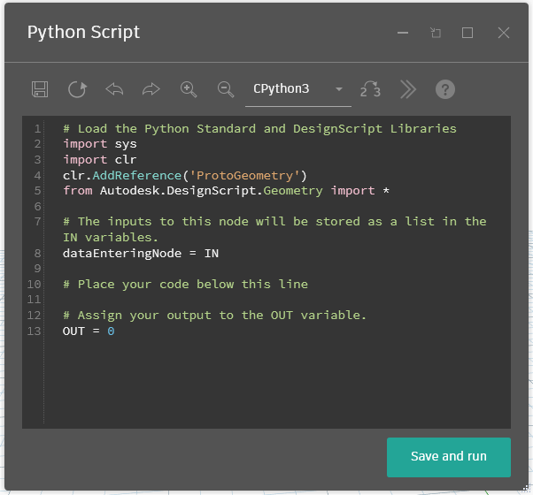
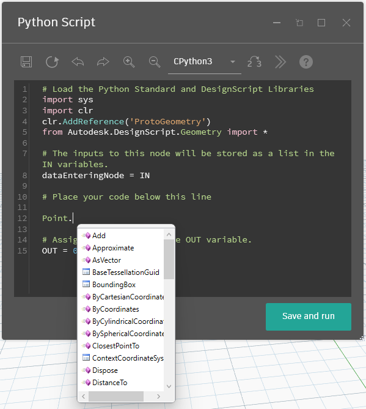
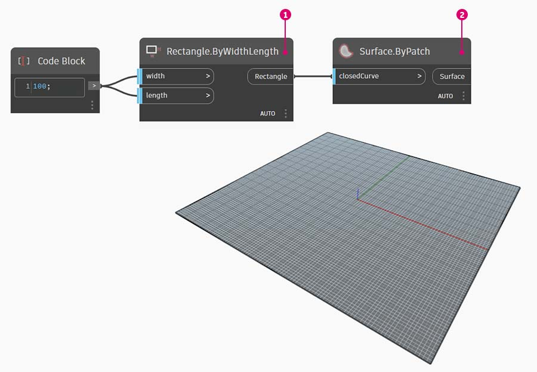
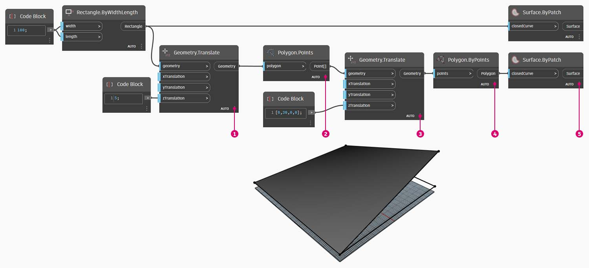
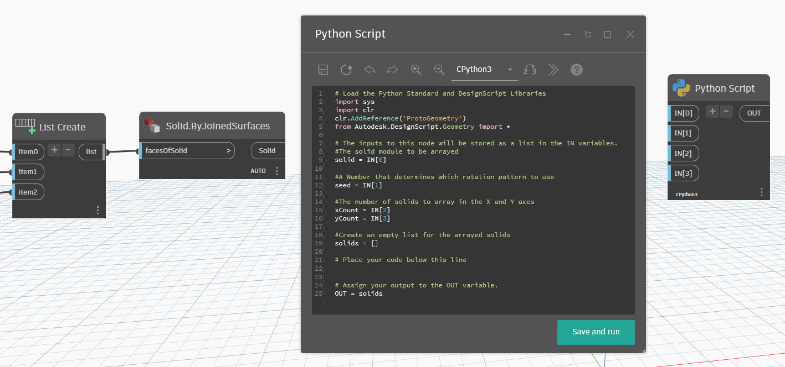
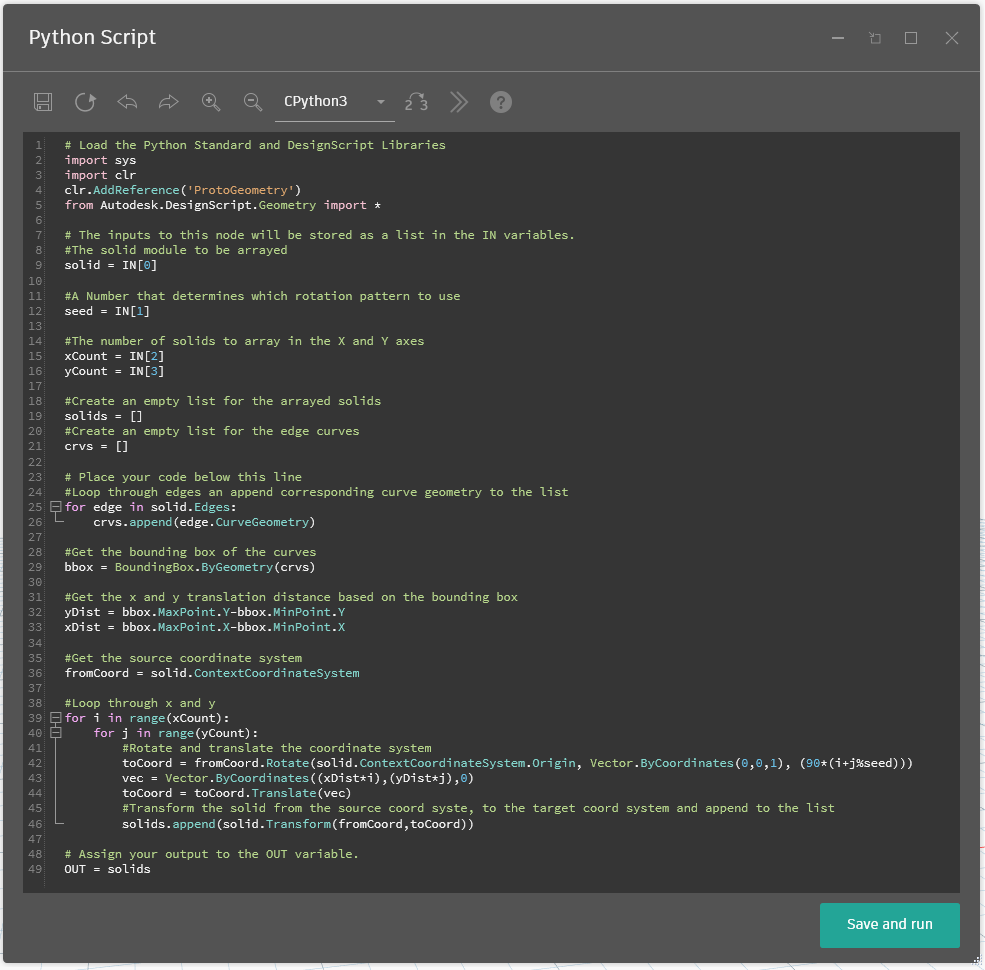
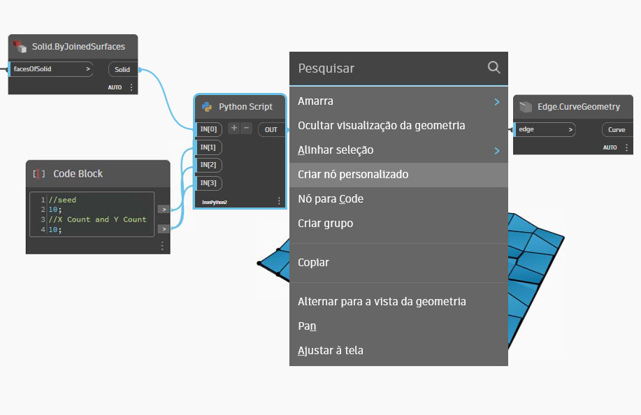
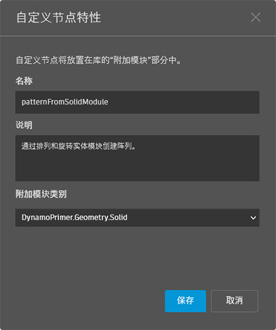
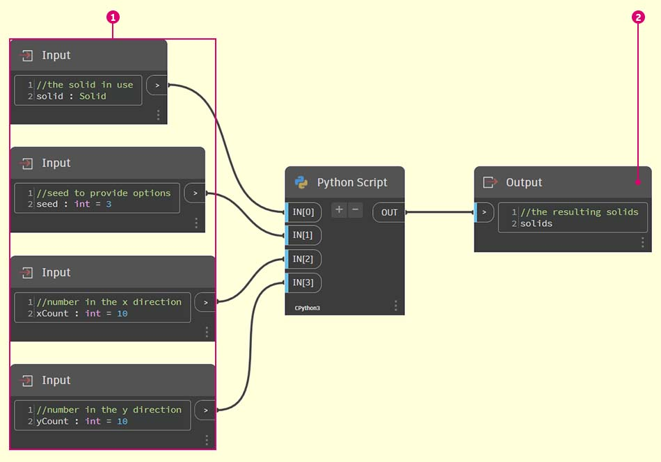

# Nós do Python

Por que você usaria a programação textual no ambiente de programação visual do Dynamo? A [Programação visual](../../a\_appendix/a-1\_visual-programming-and-dynamo.md) tem muitas vantagens. Ela permite que você crie programas sem aprender sintaxe especial em uma interface visual intuitiva. No entanto, um programa visual pode se tornar confuso e, às vezes, pode ter funcionalidade insatisfatória. Por exemplo, o Python oferece métodos muito mais simples de escrever declarações condicionais (if/then) e loops. O Python é uma ferramenta avançada que pode ampliar os recursos do Dynamo e permitir que você substitua muitos nós por algumas linhas concisas de código.

**Programa visual:**


**Programa textual:**

```py
import clr
clr.AddReference('ProtoGeometry')
from Autodesk.DesignScript.Geometry import *

solid = IN[0]
seed = IN[1]
xCount = IN[2]
yCount = IN[3]

solids = []

yDist = solid.BoundingBox.MaxPoint.Y-solid.BoundingBox.MinPoint.Y
xDist = solid.BoundingBox.MaxPoint.X-solid.BoundingBox.MinPoint.X

for i in xRange:
	for j in yRange:
		fromCoord = solid.ContextCoordinateSystem
		toCoord = fromCoord.Rotate(solid.ContextCoordinateSystem.Origin,Vector.ByCoordinates(0,0,1),(90*(i+j%val)))
		vec = Vector.ByCoordinates((xDist*i),(yDist*j),0)
		toCoord = toCoord.Translate(vec)
		solids.append(solid.Transform(fromCoord,toCoord))

OUT = solids
```

### O nó do Python

Como os blocos de código, os nós do Python são uma interface de scripts dentro de um ambiente de programação visual. O nó do Python pode ser encontrado em Script>Editor>Script do Python na biblioteca.



Clicando duas vezes no nó, é aberto o editor de scripts do Python (também é possível clicar com o botão direito do mouse no nó e selecionar _Editar..._). Você observará algum texto padronizado na parte superior, que pretende ajudar você a consultar as bibliotecas necessárias. As entradas estão armazenadas na matriz IN. Os valores são retornados ao Dynamo quando são atribuídos à variável OUT



A biblioteca Autodesk.DesignScript.Geometry permite usar a notação de pontos similar aos blocos de código. Para obter mais informações sobre a sintaxe do Dynamo, consulte [7-2_design-script-syntax.md](../../coding-in-dynamo/7\_code-blocks-and-design-script/7-2\_design-script-syntax.md "mention"), bem como o [Guia do DesignScript](https://dynamobim.org/wp-content/links/DesignScriptGuide.pdf) (Para fazer o download desse documento PDF, clique com o botão direito do mouse no link e escolha “Salvar link como...”). Digitar um tipo de geometria como “Point.” exibirá uma lista de métodos para criar e consultar pontos.



> Os métodos incluem construtores como _ByCoordinates_, ações como _Add_ e consultas como as coordenadas _X_, _Y_ e _Z_.

## Exercício: Nó personalizado com o script do Python para criar padrões com base no módulo sólido

### Parte I: Configurar o script do Python

> Faça o download do arquivo de exemplo clicando no link abaixo.
>
> É possível encontrar uma lista completa de arquivos de exemplo no Apêndice.



Neste exemplo, escreveremos um script Python que cria padrões de um módulo sólido e o transforma em um nó personalizado. Primeiro, vamos criar nosso módulo sólido usando os nós do Dynamo.



> 1. **Rectangle.ByWidthLength:** crie um retângulo que será a base do nosso sólido.
> 2. **Surface.ByPatch:** conecte o retângulo à entrada “_closedCurve_” para criar a superfície inferior.



> 1. **Geometry.Translate:** conecte o retângulo à entrada “_geometry_” para movê-lo para cima, usando um bloco de código para especificar a espessura da base do nosso sólido.
> 2. **Polygon.Points:** consulte o retângulo convertido para extrair os pontos de canto.
> 3. **Geometry.Translate:** use um bloco de código para criar uma lista de quatro valores correspondentes aos quatro pontos, convertendo um canto do sólido para cima.
> 4. **Polygon.ByPoints:** use os pontos convertidos para reconstruir o polígono superior.
> 5. **Surface.ByPatch:** conecte o polígono para criar a superfície superior.

Agora que temos as superfícies superior e inferior, vamos elevar os dois perfis para criar os lados do sólido.


> 1. **List.Create:** conecte o retângulo inferior e o polígono superior às entradas do índice.
> 2. **Surface.ByLoft:** eleve os dois perfis para criar os lados do sólido.
> 3. **List.Create:** conecte as superfícies superior, laterais e inferior às entradas do índice para criar uma lista de superfícies.
> 4. **Solid.ByJoinedSurfaces:** una as superfícies para criar o módulo sólido.

Agora que temos nosso sólido, vamos colocar um nó do script do Python no espaço de trabalho.


> 1. Para adicionar mais entradas ao nó, clique no ícone + no nó. As entradas são nomeadas IN[0], IN[1], etc. para indicar que representam itens em uma lista.

Vamos começar definindo nossas entradas e saídas. Clique duas vezes no nó para abrir o editor do Python. Siga o código abaixo para modificar o código no editor.



```py
# Load the Python Standard and DesignScript Libraries
import sys
import clr
clr.AddReference('ProtoGeometry')
from Autodesk.DesignScript.Geometry import *

# The inputs to this node will be stored as a list in the IN variables.
#The solid module to be arrayed
solid = IN[0]

#A Number that determines which rotation pattern to use
seed = IN[1]

#The number of solids to array in the X and Y axes
xCount = IN[2]
yCount = IN[3]

#Create an empty list for the arrayed solids
solids = []

# Place your code below this line


# Assign your output to the OUT variable.
OUT = solids
```

Esse código fará mais sentido à medida que progredirmos no exercício. Em seguida, precisaremos pensar sobre quais informações são necessárias para organizar o módulo de sólido. Primeiro, precisamos conhecer as dimensões do sólido para determinar a distância de conversão. Devido a uma falha da caixa delimitadora, será necessário usar a geometria de curva de aresta para criar uma caixa delimitadora.


> Veja o nó do Python no Dynamo. Observe que estamos usando a mesma sintaxe que vemos nos títulos dos nós no Dynamo. Confira o código comentado abaixo.

```py
# Load the Python Standard and DesignScript Libraries
import sys
import clr
clr.AddReference('ProtoGeometry')
from Autodesk.DesignScript.Geometry import *

# The inputs to this node will be stored as a list in the IN variables.
#The solid module to be arrayed
solid = IN[0]

#A Number that determines which rotation pattern to use
seed = IN[1]

#The number of solids to array in the X and Y axes
xCount = IN[2]
yCount = IN[3]

#Create an empty list for the arrayed solids
solids = []
#Create an empty list for the edge curves
crvs = []

# Place your code below this line
#Loop through edges an append corresponding curve geometry to the list
for edge in solid.Edges:
    crvs.append(edge.CurveGeometry)

#Get the bounding box of the curves
bbox = BoundingBox.ByGeometry(crvs)

#Get the x and y translation distance based on the bounding box
yDist = bbox.MaxPoint.Y-bbox.MinPoint.Y
xDist = bbox.MaxPoint.X-bbox.MinPoint.X

# Assign your output to the OUT variable.
OUT = solids
```

Como vamos converter e girar os módulos de sólido, usaremos a operação Geometry.Transform. Observando o nó Geometry.Transform, sabemos que precisaremos de um sistema de coordenadas de origem e um sistema de coordenadas de destino para transformar o sólido. A origem é o sistema de coordenadas do contexto do nosso sólido, enquanto o destino será um sistema de coordenadas diferente para cada módulo com matriz. Isso significa que teremos que fazer um loop pelos valores x e y para transformar o sistema de coordenadas de forma diferente a cada vez.



```py
# Load the Python Standard and DesignScript Libraries
import sys
import clr
clr.AddReference('ProtoGeometry')
from Autodesk.DesignScript.Geometry import *

# The inputs to this node will be stored as a list in the IN variables.
#The solid module to be arrayed
solid = IN[0]

#A Number that determines which rotation pattern to use
seed = IN[1]

#The number of solids to array in the X and Y axes
xCount = IN[2]
yCount = IN[3]

#Create an empty list for the arrayed solids
solids = []
#Create an empty list for the edge curves
crvs = []

# Place your code below this line
#Loop through edges an append corresponding curve geometry to the list
for edge in solid.Edges:
    crvs.append(edge.CurveGeometry)

#Get the bounding box of the curves
bbox = BoundingBox.ByGeometry(crvs)

#Get the x and y translation distance based on the bounding box
yDist = bbox.MaxPoint.Y-bbox.MinPoint.Y
xDist = bbox.MaxPoint.X-bbox.MinPoint.X

#Get the source coordinate system
fromCoord = solid.ContextCoordinateSystem

#Loop through x and y
for i in range(xCount):
    for j in range(yCount):
        #Rotate and translate the coordinate system
        toCoord = fromCoord.Rotate(solid.ContextCoordinateSystem.Origin, Vector.ByCoordinates(0,0,1), (90*(i+j%seed)))
        vec = Vector.ByCoordinates((xDist*i),(yDist*j),0)
        toCoord = toCoord.Translate(vec)
        #Transform the solid from the source coord syste, to the target coord system and append to the list
        solids.append(solid.Transform(fromCoord,toCoord))

# Assign your output to the OUT variable.
OUT = solids
```

Clique em Executar e, em seguida, salve o código. Conecte o nó do Python ao nosso script existente da seguinte maneira.


> 1. Conecte a saída de **Solid.ByJoinedSurfaces** como a primeira entrada para o nó do Python e use um bloco de código para definir as outras entradas.
> 2. Crie um nó **Topology.Edges** e use a saída do nó do Python como entrada.
> 3. Por fim, crie um nó **Edge.CurveGeometry** e use a saída de Topology.Edges como entrada.

Tente alterar o valor gerador para criar diferentes padrões. Também é possível alterar os parâmetros do próprio módulo sólido para obter diferentes efeitos.


### Parte II: Transformar o nó do script do Python em nó personalizado

Agora que criamos um script Python útil, vamos salvá-lo como um nó personalizado. Selecione o nó do script do Python, clique com o botão direito do mouse no espaço de trabalho e selecione “Criar nó personalizado”.



Atribua um nome, uma descrição e uma categoria.



Isso abrirá um novo espaço de trabalho no qual o nó personalizado será editado.



> 1. **Entradas:** altere os nomes das entradas para que sejam mais descritivos e adicione tipos de dados e valores padrão.
> 2. **Saída:** altere o nome da saída

Salve o nó como um arquivo .dyf. Em seguida, você deverá ver que o nó personalizado reflete as alterações que acabamos de fazer.


